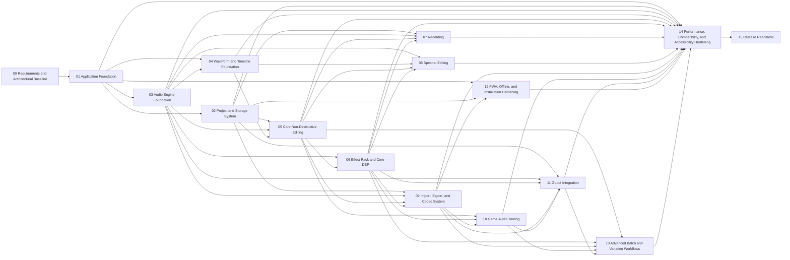

# AudioGubbins — Implementation Specification

> **Generated artefact. Do not edit directly.**
> Canonical source is the modular specification listed in `tools/spec_manifest.json`.

## Reading Rule

Implementation agents must load the bounded Phase Context Pack described in `contracts/specification-execution.md`; this compiled document is primarily for human review, archival, and download.


---

# Part I — Canonical Requirements


<!-- SOURCE: requirements/product.md -->

# Product and Scope Requirements

> **Authority:** Canonical normative requirements. The generated full specification is derived from these files and MUST NOT be edited directly.
>
> **Modality rule:** Within `CURRENT` and `PLANNED` requirement blocks, `must`/`shall` are mandatory. Legacy wording using `should` is interpreted as a mandatory design target unless the block explicitly states `DEFERRED`, `EXCLUDED`, `optional`, `where practical`, or invokes the formal deviation protocol. An implementation agent MUST NOT downgrade a requirement merely because the source prose used `should`.
>
> **Requirement groups:** Each `REQ-*` identifier owns the complete requirement block beneath it. Every bullet and invariant in the block is part of that requirement group unless explicitly marked otherwise.

## Requirement Index

- `REQ-PROD-001` — Purpose — owner Phase 15 — scope `CURRENT`
- `REQ-PROD-003` — Product Positioning — owner Phase 15 — scope `CURRENT`
- `REQ-PROD-006` — Primary Users — owner Phase 01 — scope `CURRENT`
- `REQ-PROD-007` — Primary Workflow Example — owner Phase 15 — scope `CURRENT`
- `REQ-PROD-009` — Audio Duration and Scale — owner Phase 03 — scope `CURRENT`
- `REQ-PROD-038` — Cloud Extensibility — owner Phase 02 — scope `DEFERRED`
- `REQ-PROD-039` — Third-Party Plugins — owner Phase 06 — scope `DEFERRED`
- `REQ-PROD-056` — Product Name — owner Phase 01 — scope `CURRENT`
- `REQ-PROD-147` — Release-Version Philosophy — owner Phase 15 — scope `CURRENT`
- `REQ-PROD-148` — Continuous Feature-Delivery Policy — owner Phase 15 — scope `CURRENT`
- `REQ-PROD-149` — Release Channel and Maturity Labels — owner Phase 15 — scope `CURRENT`
- `REQ-PROD-150` — Real-World Validation Before Stable Releases — owner Phase 15 — scope `CURRENT`
- `REQ-PROD-158` — MIDI Scope Exclusion — owner Phase 00 — scope `EXCLUDED`
- `REQ-PROD-160` — Musical Timeline and Tempo Features — Deferred Possibility — owner Phase 04 — scope `DEFERRED`

---

## REQ-PROD-001 — Purpose

- **Owner:** Phase 15 — Release Readiness
- **Scope:** `CURRENT`
- **Legacy source:** section 1 of the pre-hardening baseline

This document defines the technical and product requirements for a browser-based, installable Progressive Web Application (PWA) audio editor.

AudioGubbins is intended to provide a modern, visually rich, professional audio-editing experience comparable in ambition to applications such as Adobe Audition, while also providing especially strong workflows for game-audio creation and integration with Godot 4+ projects.

The implementation must not be constrained by decisions made purely for speed, ease, or short-term development convenience. Architectural and implementation choices must prioritise:

- Long-term capability
- Flexibility
- Robustness
- Maintainability
- Extensibility
- Professional-quality UX
- Performance
- Portability
- Testability
- Future expansion

Where a design choice clearly improves application capability without introducing a meaningful trade-off, it should be adopted by default rather than deferred for approval.

---

## REQ-PROD-003 — Product Positioning

- **Owner:** Phase 15 — Release Readiness
- **Scope:** `CURRENT`
- **Legacy source:** section 3 of the pre-hardening baseline

The application shall be:

- A full-featured browser-based audio editor.
- Comparable in ambition to a modern Audition-style editing environment.
- Especially strong for processing, cleaning, preparing, and exporting audio for games.
- Suitable for software developers initially.
- Approachable enough for non-technical and creative users.
- Designed so that complexity is available when needed, but not forced onto casual users.
- Capable of evolving beyond its initial game-audio emphasis without being artificially pigeonholed.

The application shall not assume that all users are audio engineers or developers.

Task-oriented workflows, presets, progressive disclosure, contextual help, and strong defaults should be used to keep advanced functionality approachable.

---

## REQ-PROD-006 — Primary Users

- **Owner:** Phase 01 — Application Foundation
- **Scope:** `CURRENT`
- **Legacy source:** section 6 of the pre-hardening baseline

Initial primary users:

- The project author
- Software developers
- Game developers
- Technical creators

The application must also remain approachable to:

- Sound designers
- Content creators
- Hobbyists
- General users
- Users without advanced audio-engineering knowledge

No UI or workflow should be made needlessly technical.

---

## REQ-PROD-007 — Primary Workflow Example

- **Owner:** Phase 15 — Release Readiness
- **Scope:** `CURRENT`
- **Legacy source:** section 7 of the pre-hardening baseline

A representative workflow is:

1. Import an audio file.
2. Inspect waveform and spectral content.
3. Remove noise or unwanted artefacts.
4. Trim unwanted silence.
5. Edit one or more regions.
6. Apply processing.
7. Normalise or loudness-match.
8. Add fades.
9. Preview and A/B compare.
10. Configure loop points if applicable.
11. Export using a Godot-aware preset.
12. Optionally export directly into a selected Godot project.

---

## REQ-PROD-009 — Audio Duration and Scale

- **Owner:** Phase 03 — Audio Engine Foundation
- **Scope:** `CURRENT`
- **Legacy source:** section 9 of the pre-hardening baseline

The application must support audio ranging from:

- Very short game sound effects
- One-shots
- Loops
- Dialogue clips
- Music
- Ambience
- Recordings lasting tens of minutes

The application must not impose arbitrary artificial duration limits.

Architecture should avoid requiring entire large assets to remain duplicated in memory.

---

## REQ-PROD-038 — Cloud Extensibility

- **Owner:** Phase 02 — Project and Storage System
- **Scope:** `DEFERRED`
- **Legacy source:** section 38 of the pre-hardening baseline

> **Execution rule:** Do not implement the deferred user-facing capability in the current roadmap phase. Preserve the architectural extension point only to the extent explicitly required below.

Cloud storage is not part of the initial implementation.

Future support may include user-supplied integrations such as:

- Google Drive
- OneDrive
- Dropbox
- S3-compatible storage
- Other providers

The architecture should expose provider-neutral storage abstractions.

Cloud support must remain optional.

---

## REQ-PROD-039 — Third-Party Plugins

- **Owner:** Phase 06 — Effect Rack and Core DSP
- **Scope:** `DEFERRED`
- **Legacy source:** section 39 of the pre-hardening baseline

> **Execution rule:** Do not implement the deferred user-facing capability in the current roadmap phase. Preserve the architectural extension point only to the extent explicitly required below.

Third-party plugins are a future goal.

The initial implementation will not expose arbitrary third-party plugin loading.

However, internal processor/plugin abstractions should avoid preventing a future plugin ecosystem.

Security boundaries, sandboxing, compatibility, and versioning must be considered before third-party plugins are exposed.

---

## REQ-PROD-056 — Product Name

- **Owner:** Phase 01 — Application Foundation
- **Scope:** `CURRENT`
- **Legacy source:** section 56 of the pre-hardening baseline

The application is named **AudioGubbins**.

The product name should be used consistently in:

- Application chrome
- PWA manifest metadata
- Project documentation
- Repository documentation
- Exported diagnostic information
- About/help surfaces

Internal package, namespace, and identifier naming should remain stable and deliberately chosen so that display-name changes would not require invasive schema changes.

---

## REQ-PROD-147 — Release-Version Philosophy

- **Owner:** Phase 15 — Release Readiness
- **Scope:** `CURRENT`
- **Legacy source:** section 147 of the pre-hardening baseline

AudioGubbins version numbers are project-owner-controlled release labels, not rigid feature-completeness gates.

Version `1.0.0` shall occur when the project owner judges the application ready for that label. The implementation plan must not defer valuable capabilities merely because they are conventionally considered "post-1.0" features, nor must it force an arbitrary feature checklist to be completed solely to justify the `1.0.0` label.

Development shall continue continuously across pre-release and release-labelled versions. Phase planning, architectural quality, test quality, and feature prioritisation must therefore be based on product value, technical dependencies, risk, and implementation readiness rather than semantic-version prestige.

The one explicit version-dependent compatibility contract currently retained is the project/schema migration policy:

- Before `1.0.0`, breaking persisted-schema changes may require backup/export followed by reset, and compatibility shims are not required.
- From `1.0.0` onward, supported migration and backwards-compatibility responsibilities begin as defined elsewhere in this specification.

No other requirement may infer that a feature is excluded merely because AudioGubbins has not yet reached `1.0.0`.

---

## REQ-PROD-148 — Continuous Feature-Delivery Policy

- **Owner:** Phase 15 — Release Readiness
- **Scope:** `CURRENT`
- **Legacy source:** section 148 of the pre-hardening baseline

Capabilities should be implemented when their architectural prerequisites are ready and their implementation can pass the required phase gates.

The specification must not divide features into "real product" versus "future product" solely on the basis of a target marketing version.

In particular:

- Local ML restoration, separation, enhancement, model-pack infrastructure, and related ML workflows are intended implementation scope.
- The Godot editor addon and runtime addon are first-class product subsystems.
- The Godot runtime event system should be made as powerful and flexible as is technically justified by the architecture and phase dependencies.
- Advanced game-audio authoring capabilities should not be artificially postponed to preserve a narrow pre-1.0 feature set.
- Multitrack remains a later implementation area because of dependency/order decisions, not because it is intrinsically "post-1.0".

Feature sequencing must remain dependency-driven and quality-gated.

---

## REQ-PROD-149 — Release Channel and Maturity Labels

- **Owner:** Phase 15 — Release Readiness
- **Scope:** `CURRENT`
- **Legacy source:** section 149 of the pre-hardening baseline

AudioGubbins should use the progression:

1. Alpha
2. Beta
3. Release Candidate
4. Final/stable release

These labels are intentionally conservative and are assigned by the project owner.

The project owner may continue to label a build Alpha or Beta even when its technical maturity, feature completeness, or stability might conventionally lead another project to call the same build a release candidate or final release.

Implementation agents, documentation, automation, and release tooling must not reinterpret or automatically promote maturity labels based on conventional industry expectations.

Release labels should communicate the owner's current confidence and intent, while objective quality evidence remains separately recorded through:

- Automated test results
- Browser/device compatibility results
- Performance benchmarks
- Recovery/data-integrity testing
- DSP regression testing
- Accessibility review
- Security review
- Real-world project usage
- Known issue tracking

A conservative maturity label must not be used as justification for lower engineering quality.

---

## REQ-PROD-150 — Real-World Validation Before Stable Releases

- **Owner:** Phase 15 — Release Readiness
- **Scope:** `CURRENT`
- **Legacy source:** section 150 of the pre-hardening baseline

AudioGubbins should progress through meaningful real-world usage before stable/final releases are declared.

Validation should include substantial use on real audio-editing and Godot projects, including projects maintained by the project owner where practical.

Release readiness should consider evidence from:

- Long-running editing sessions
- Real game-audio production workflows
- Recording sessions
- Large and small source assets
- Crash/reload/recovery scenarios
- Storage pressure scenarios
- Browser upgrades
- PWA updates
- Godot live-export workflows
- Godot editor-addon workflows
- Godot runtime-addon workflows
- Touch, Surface-class, pen, mouse, and keyboard interaction
- Multiple supported browsers and operating systems

Feature completion alone is not sufficient evidence of production quality, but this validation policy does not impose an automatic semantic-version number. The final version label remains a project-owner decision.

---

## REQ-PROD-158 — MIDI Scope Exclusion

- **Owner:** Phase 00 — Requirements and Architectural Baseline
- **Scope:** `EXCLUDED`
- **Legacy source:** section 158 of the pre-hardening baseline

> **Execution rule:** This is an explicit exclusion. Do not implement the excluded capability unless a future approved specification change supersedes this requirement.

MIDI input, MIDI sequencing, MIDI controllers, and MIDI control-surface integration are not current AudioGubbins requirements.

The implementation must not add MIDI infrastructure speculatively.

Generic command, automation, parameter, and input-abstraction systems should remain clean enough that MIDI could be considered in a future specification if requirements change, but no present phase should include MIDI work merely for hypothetical extensibility.

---

## REQ-PROD-160 — Musical Timeline and Tempo Features — Deferred Possibility

- **Owner:** Phase 04 — Waveform and Timeline Foundation
- **Scope:** `DEFERRED`
- **Legacy source:** section 160 of the pre-hardening baseline

> **Execution rule:** Do not implement the deferred user-facing capability in the current roadmap phase. Preserve the architectural extension point only to the extent explicitly required below.

Tempo maps, bars/beats, beat grids, transient-derived tempo analysis, rhythm-aware snapping, and other music-oriented timeline features are not current implementation requirements.

The current authoritative editing coordinate systems remain time- and sample-based.

The architecture should avoid choices that would make later musical-coordinate overlays prohibitively difficult, but implementation phases must not build speculative tempo or MIDI-style infrastructure without a future approved requirement.

Game-music looping and rhythm-game workflows may justify this capability later. If introduced, musical coordinates should be an additional mapping over the sample-accurate timeline rather than replacing sample/time coordinates as the underlying source of truth.

---


<!-- SOURCE: requirements/architecture.md -->

# Architecture and Runtime Requirements

> **Authority:** Canonical normative requirements. The generated full specification is derived from these files and MUST NOT be edited directly.
>
> **Modality rule:** Within `CURRENT` and `PLANNED` requirement blocks, `must`/`shall` are mandatory. Legacy wording using `should` is interpreted as a mandatory design target unless the block explicitly states `DEFERRED`, `EXCLUDED`, `optional`, `where practical`, or invokes the formal deviation protocol. An implementation agent MUST NOT downgrade a requirement merely because the source prose used `should`.
>
> **Requirement groups:** Each `REQ-*` identifier owns the complete requirement block beneath it. Every bullet and invariant in the block is part of that requirement group unless explicitly marked otherwise.

## Requirement Index

- `REQ-ARCH-004` — Core Architectural Principles — owner Phase 01 — scope `CURRENT`
- `REQ-ARCH-011` — Audio Precision — owner Phase 03 — scope `CURRENT`
- `REQ-ARCH-034` — Dependency Philosophy — owner Phase 01 — scope `CURRENT`
- `REQ-ARCH-036` — Processing Architecture Direction — owner Phase 03 — scope `CURRENT`
- `REQ-ARCH-037` — Waveform Rendering Direction — owner Phase 04 — scope `CURRENT`
- `REQ-ARCH-049` — Deterministic Rendering — owner Phase 03 — scope `CURRENT`
- `REQ-ARCH-054` — Export Collision Policy — owner Phase 09 — scope `CURRENT`
- `REQ-ARCH-079` — Adaptive Processing Modes — owner Phase 03 — scope `CURRENT`
- `REQ-ARCH-081` — Canonical Deterministic Processing — owner Phase 03 — scope `CURRENT`
- `REQ-ARCH-083` — Audio Performance Profiles — owner Phase 03 — scope `CURRENT`
- `REQ-ARCH-084` — Foreground and Background Processing Priority — owner Phase 03 — scope `CURRENT`
- `REQ-ARCH-085` — Native Asset Sample Rates and Future Session Rate — owner Phase 03 — scope `CURRENT`
- `REQ-ARCH-087` — Resource-Aware Operation Without Artificial Limits — owner Phase 03 — scope `CURRENT`
- `REQ-ARCH-088` — Fully Local Core Processing — owner Phase 03 — scope `CURRENT`
- `REQ-ARCH-140` — Typed Directed Processing Graph — owner Phase 03 — scope `CURRENT`
- `REQ-ARCH-141` — DSP Implementation Languages — owner Phase 03 — scope `CURRENT`
- `REQ-ARCH-144` — Processor Latency and Automatic Delay Compensation — owner Phase 03 — scope `CURRENT`
- `REQ-ARCH-151` — Initial Front-End and Workspace Technology Selection — owner Phase 01 — scope `CURRENT`
- `REQ-ARCH-153` — State Ownership and Workflow State — owner Phase 01 — scope `CURRENT`
- `REQ-ARCH-157` — Multichannel, Surround, and Ambisonic Audio — owner Phase 03 — scope `CURRENT`

---

## REQ-ARCH-004 — Core Architectural Principles

- **Owner:** Phase 01 — Application Foundation
- **Scope:** `CURRENT`
- **Legacy source:** section 4 of the pre-hardening baseline

#### 4.1 Local-First

The editor must function primarily on the user's local machine.

Core editing functionality must not depend on:

- A user account
- A remote application server
- Cloud storage
- External processing
- Mandatory telemetry
- Uploading audio to third parties

Audio should remain local unless the user explicitly invokes a future online integration.

Future user-configured cloud integrations should be possible through provider-neutral abstractions, but the local project model must never depend on a cloud provider.

---

#### 4.2 Non-Destructive Editing

Non-destructive editing is mandatory.

Original source audio must remain unchanged unless the user explicitly requests a destructive export or replacement workflow.

Edits must be represented as operations and parameters rather than repeatedly rewriting the source audio.

---

#### 4.3 Parametric Editing

The editing architecture shall use a parametric model wherever practical.

Examples include:

- Gain changes
- Normalisation
- Equalisation
- Compression
- Filters
- Fades
- Time ranges
- Noise-reduction parameters
- Pitch processing
- Time stretching
- Spectral operations
- Loop definitions
- Region boundaries

The authoritative project state should be composed of:

- Immutable source assets or source references
- Parametric edit operations
- Effect chains
- Region and marker data
- Project metadata
- User configuration

Rendered intermediates, waveform peaks, spectrogram tiles, preview renders, proxies, and other derived data should be treated as disposable caches.

---

#### 4.4 Future Multitrack Readiness

Initial releases shall focus on high-quality single-file and region-based waveform editing.

True multitrack editing is deferred to a later approved phase/specification, but the architecture SHALL remain multitrack-ready from the first production phase.

The initial internal model must therefore avoid assumptions such as:

> one project = one waveform

The domain model should already support concepts such as:

- Projects
- Assets
- Clips
- Regions
- Tracks
- Processors
- Effect chains
- Buses
- Routing
- Automation-ready parameters

Even if some of those concepts are not exposed in the first UI.

---

## REQ-ARCH-011 — Audio Precision

- **Owner:** Phase 03 — Audio Engine Foundation
- **Scope:** `CURRENT`
- **Legacy source:** section 11 of the pre-hardening baseline

Recommended baseline:

- 32-bit floating-point working PCM for normal editing and real-time processing
- Higher precision for offline calculations where materially beneficial
- Export precision independent of working precision
- No repeated unnecessary quantisation between operations

Where feasible, users should be given meaningful quality/precision controls rather than being locked to one mode.

---

## REQ-ARCH-034 — Dependency Philosophy

- **Owner:** Phase 01 — Application Foundation
- **Scope:** `CURRENT`
- **Legacy source:** section 34 of the pre-hardening baseline

High-quality open-source dependencies may be used where they materially improve quality or capability.

Core architectural ownership should remain within the application for:

- Project model
- Editing model
- Processing graph
- Storage abstractions
- Undo/redo model
- Command model
- Core state architecture

Avoid coupling the core editor to a library that would make future evolution difficult.

---

## REQ-ARCH-036 — Processing Architecture Direction

- **Owner:** Phase 03 — Audio Engine Foundation
- **Scope:** `CURRENT`
- **Legacy source:** section 36 of the pre-hardening baseline

Heavy processing must not block the UI thread.

The architecture should support separation between:

- UI/controller layer
- Project/domain model
- Real-time playback
- AudioWorklet processing
- Worker-based offline computation
- WebAssembly processing where beneficial
- Codec subsystem
- Storage subsystem
- Rendering/cache subsystem

The UI thread must remain responsive during:

- Waveform generation
- Spectrogram generation
- Import
- Export
- Analysis
- DSP
- Batch processing

---

## REQ-ARCH-037 — Waveform Rendering Direction

- **Owner:** Phase 04 — Waveform and Timeline Foundation
- **Scope:** `CURRENT`
- **Legacy source:** section 37 of the pre-hardening baseline

Waveform display should not repeatedly render directly from full-resolution PCM.

The system should use precomputed multi-resolution peak data.

Waveform rendering should support:

- Efficient zoom
- Efficient scroll
- Large files
- Progressive generation
- Background processing
- Cache persistence
- Regeneration

---

## REQ-ARCH-049 — Deterministic Rendering

- **Owner:** Phase 03 — Audio Engine Foundation
- **Scope:** `CURRENT`
- **Legacy source:** section 49 of the pre-hardening baseline

The application shall aim for deterministic rendering wherever technically practical.

Given identical:

- Source audio
- Project state
- Processor settings
- Export settings
- Application version

rendered output should be reproducible across supported browsers and machines where feasible.

This requirement should influence DSP, codec, and resampling architecture.

Where browser-native behaviour is not deterministic enough for a required feature, application-owned or WebAssembly-based processing may be preferred.

Any unavoidable sources of platform-dependent variation must be documented.

---

## REQ-ARCH-054 — Export Collision Policy

- **Owner:** Phase 09 — Import, Export, and Codec System
- **Scope:** `CURRENT`
- **Legacy source:** section 54 of the pre-hardening baseline

Export collision handling shall be user-configurable.

The default should be safe and explicit.

Supported policies should include, where appropriate:

- Prompt
- Overwrite
- Skip
- Auto-version/rename
- Apply to all remaining collisions in the batch

For rapid Godot iteration, the user may configure trusted export destinations to silently overwrite matching generated assets so that switching back to Godot immediately reflects updated audio.

---

## REQ-ARCH-079 — Adaptive Processing Modes

- **Owner:** Phase 03 — Audio Engine Foundation
- **Scope:** `CURRENT`
- **Legacy source:** section 79 of the pre-hardening baseline

Computationally expensive operations may execute using different strategies depending on workload and runtime capability.

Supported execution strategies should include:

- Real-time processing
- Cached/pre-rendered preview processing
- Background offline processing
- High-quality final offline rendering

AudioGubbins should automatically select an appropriate strategy using measured runtime capability and workload characteristics while allowing advanced users to override the strategy where meaningful.

The selected processing mode must remain visible and understandable to the user.

---

## REQ-ARCH-081 — Canonical Deterministic Processing

- **Owner:** Phase 03 — Audio Engine Foundation
- **Scope:** `CURRENT`
- **Legacy source:** section 81 of the pre-hardening baseline

AudioGubbins shall aim for deterministic, reproducible output wherever technically practical.

The long-term canonical processing path should favour application-controlled DSP, resampling, and encoding implementations when that materially improves reproducibility.

Browser-native implementations may be used as accelerators or convenience paths when they meet correctness and reproducibility requirements.

Given identical source data, project state, processing settings, export settings, and AudioGubbins version, the target is bit-identical PCM output across supported machines and browsers wherever feasible.

Where bit-identical behaviour cannot be guaranteed, the cause and expected tolerance must be documented and tested.

---

## REQ-ARCH-083 — Audio Performance Profiles

- **Owner:** Phase 03 — Audio Engine Foundation
- **Scope:** `CURRENT`
- **Legacy source:** section 83 of the pre-hardening baseline

AudioGubbins shall provide configurable audio-performance profiles.

At minimum:

- Low Latency
- Balanced
- Maximum Stability
- Custom

The application should measure relevant runtime behaviour and warn when the selected configuration is producing underruns, drop-outs, or instability.

Where possible, the application should recommend appropriate settings based on observed device/browser performance without preventing expert manual configuration.

---

## REQ-ARCH-084 — Foreground and Background Processing Priority

- **Owner:** Phase 03 — Audio Engine Foundation
- **Scope:** `CURRENT`
- **Legacy source:** section 84 of the pre-hardening baseline

Interactive editing and playback shall receive priority over background processing by default.

Background tasks such as:

- Analysis
- Peak generation
- Spectrogram generation
- Batch rendering
- Batch encoding
- Cache regeneration

may reduce their concurrency or throughput while interactive work is active.

The user shall be able to select alternate priority policies, including a throughput-oriented mode that prioritises batch/background completion when interactive responsiveness is not required.

---

## REQ-ARCH-085 — Native Asset Sample Rates and Future Session Rate

- **Owner:** Phase 03 — Audio Engine Foundation
- **Scope:** `CURRENT`
- **Legacy source:** section 85 of the pre-hardening baseline

During single-asset editing, source assets should retain their native sample rates internally wherever practical.

AudioGubbins must avoid unnecessary resampling merely to conform to a global project rate.

When multitrack sessions are introduced, a session or mix sample rate may be defined while preserving original source assets at their native rates.

Resampling must remain explicit, deterministic, and high quality.

---

## REQ-ARCH-087 — Resource-Aware Operation Without Artificial Limits

- **Owner:** Phase 03 — Audio Engine Foundation
- **Scope:** `CURRENT`
- **Legacy source:** section 87 of the pre-hardening baseline

AudioGubbins must not impose arbitrary fixed limits on:

- Audio duration
- Region count
- Marker count
- Undo/redo depth
- Project asset count
- Batch size
- Analysis duration
- Other scalable project structures

Instead, the application should measure available resources and estimate workload requirements.

When an operation may exhaust memory, storage, compute capacity, or browser limits, the application should:

1. Warn the user clearly.
2. Explain the limiting resource.
3. Offer safer execution strategies where possible.
4. Prefer streaming, chunked, tiled, paged, or incremental processing over outright refusal.
5. Allow knowledgeable users to proceed where doing so is technically safe.

---

## REQ-ARCH-088 — Fully Local Core Processing

- **Owner:** Phase 03 — Audio Engine Foundation
- **Scope:** `CURRENT`
- **Legacy source:** section 88 of the pre-hardening baseline

All core DSP, analysis, rendering, encoding, decoding, waveform generation, and project processing must remain local and offline-capable once required application assets are available.

AudioGubbins must never silently upload work or switch to remote/cloud processing because a local device is slow.

Any future cloud-assisted processing must be:

- Explicitly enabled by the user
- Clearly identified
- Optional
- Provider-aware
- Privacy-transparent
- Non-essential to the core editor

---

## REQ-ARCH-140 — Typed Directed Processing Graph

- **Owner:** Phase 03 — Audio Engine Foundation
- **Scope:** `CURRENT`
- **Legacy source:** section 140 of the pre-hardening baseline

The canonical processing architecture shall be a typed directed graph rather than a permanently linear effect-chain implementation.

The initial user interface may present conventional linear effect racks for approachability, but the engine must support future graph capabilities without architectural replacement.

The graph architecture must be capable of representing:

- Serial processing
- Parallel branches
- Split/mix paths
- Wet/dry paths
- Side-chain inputs
- Mid/side branches
- Analysis-only nodes
- Render/cache nodes
- Future multitrack sends and returns
- Future buses
- Future parameter-controlled routing
- Reusable subgraphs
- Future plugin-host nodes

Graph nodes and edges must use explicit typed contracts.

Invalid graph states must be rejected deterministically with actionable diagnostics.

The graph implementation must avoid a central god-object processor manager. Node lifecycle, scheduling, graph validation, latency propagation, and render planning should be decomposed into cohesive subsystems with explicit ownership and dependency direction.

---

## REQ-ARCH-141 — DSP Implementation Languages

- **Owner:** Phase 03 — Audio Engine Foundation
- **Scope:** `CURRENT`
- **Legacy source:** section 141 of the pre-hardening baseline

TypeScript remains the primary application, domain, orchestration, and UI language.

Performance-critical, numerically sensitive, safety-critical, or deterministic DSP infrastructure should use WebAssembly where it provides material benefits.

For new AudioGubbins-owned WASM/DSP infrastructure, Rust is the preferred default implementation language because of:

- Memory safety
- Strong type system
- Mature WebAssembly support
- Suitability for deterministic numerical code
- Strong tooling
- Good interoperability with generated bindings

This is a default, not an ideological restriction.

Mature C/C++ or other native-code libraries may be used where they provide objectively stronger DSP, codec, numerical, or interoperability capabilities and satisfy licensing, security, maintainability, portability, and deterministic-render requirements.

Language selection must never be made solely because one option is easier or faster for the implementation agent.

Bindings between TypeScript and WASM must use narrow, documented, typed interfaces and avoid leaking implementation-specific memory ownership throughout the application.

---

## REQ-ARCH-144 — Processor Latency and Automatic Delay Compensation

- **Owner:** Phase 03 — Audio Engine Foundation
- **Scope:** `CURRENT`
- **Legacy source:** section 144 of the pre-hardening baseline

Processor latency must be a first-class engine concept from the initial DSP architecture.

Processors that introduce latency must report it accurately or expose sufficient information for the engine to calculate it.

Examples include:

- Look-ahead dynamics
- Linear-phase filtering
- Convolution
- Spectral processing
- ML inference
- Oversampled processors
- Time-domain buffering

The processing graph must propagate latency information and provide automatic delay compensation where required so that:

- Parallel processing paths remain phase/time aligned
- Future multitrack playback remains aligned
- Side chains remain coherent
- Offline renders remain sample-correct
- Monitoring latency can be reported accurately

Latency compensation must not be retrofitted as a future multitrack-only concern.

---

## REQ-ARCH-151 — Initial Front-End and Workspace Technology Selection

- **Owner:** Phase 01 — Application Foundation
- **Scope:** `CURRENT`
- **Legacy source:** section 151 of the pre-hardening baseline

The initial web application technology baseline shall be:

- **React 19.x** for the application shell, docked workspace, inspectors, menus, dialogs, settings, accessibility-oriented UI, and component composition.
- **TypeScript** with the strictest practical compiler settings; application/domain code must not rely on implicit `any`, unchecked boundary data, or broad type assertions as an escape hatch.
- **Vite 8.x** as the development/build foundation, retaining the already-established requirement for local development, static production builds, PWA packaging, and GitHub Pages deployment.
- **Radix Primitives** as the preferred low-level accessible primitive layer for conventional interactive UI such as dialogs, menus, popovers, toolbars, sliders, tabs, and related controls. AudioGubbins shall build its own design system and visual identity on top rather than adopting a generic pre-styled component theme.
- **Dockview** as the initial docking/workspace engine, wrapped behind AudioGubbins-owned workspace contracts so the domain/application architecture is not coupled directly to Dockview APIs.
- **Motion for React** for rich application-shell animation and interaction feedback where it provides a clear UX benefit, while direct audio-editing manipulation and performance-critical canvases remain independent of React animation state.

This stack is selected because it combines a mature component ecosystem, strong accessibility primitives, professional docking capability, sophisticated animation support, and compatibility with custom high-performance rendering layers.

Framework choice must not cause high-frequency audio, meter, playhead, waveform, spectrogram, or pointer-motion state to flow through ordinary React component state on every update. Performance-critical state must use specialised stores, external subscriptions, shared buffers where available, renderer-owned state, or other bounded mechanisms appropriate to the subsystem.

The UI framework is an adapter over the AudioGubbins application/domain core. Core editing logic, project state, commands, DSP graphs, persistence rules, and file formats must remain independently testable without rendering React components.

---

## REQ-ARCH-153 — State Ownership and Workflow State

- **Owner:** Phase 01 — Application Foundation
- **Scope:** `CURRENT`
- **Legacy source:** section 153 of the pre-hardening baseline

AudioGubbins must not create a single global application store containing all project, UI, renderer, audio, and job state.

State shall be partitioned according to ownership and lifetime, including at least:

- Authoritative project/domain state
- Persisted command journal/history state
- User preferences
- Workspace/layout state
- Per-editor-view state
- Ephemeral interaction state
- Audio-engine runtime state
- Renderer runtime state
- Background job state
- Capability/runtime diagnostics

The typed command/domain layer remains authoritative for meaningful project mutations.

React-facing state libraries may be used for UI-oriented state, but they must not become an alternative domain model or bypass command validation, transactions, undo/redo, persistence, or architectural boundaries.

Explicit state machines should be used where workflows have meaningful lifecycle rules, failure/recovery states, or concurrency constraints—for example recording, export jobs, schema reset/backup flows, project ownership transfer, PWA updates, and long-running model installation—rather than representing complex lifecycle behaviour through scattered booleans.

---

## REQ-ARCH-157 — Multichannel, Surround, and Ambisonic Audio

- **Owner:** Phase 03 — Audio Engine Foundation
- **Scope:** `CURRENT`
- **Legacy source:** section 157 of the pre-hardening baseline

AudioGubbins shall support professional multichannel authoring beyond mono and stereo.

The channel model must be layout-aware rather than relying only on channel count. It should be capable of representing, validating, displaying, processing, and exporting layouts such as:

- Mono
- Stereo
- LCR
- Quadraphonic layouts
- 5.1
- 7.1
- Other discrete-channel layouts supported by relevant formats
- Ambisonic channel sets and ordering/normalisation conventions where supported
- Custom labelled channel maps

The architecture shall include explicit channel-layout metadata and channel-role identity. Channel order must not be inferred from array position alone when a format or workflow requires semantic channel identity.

Waveform, metering, selection, processor, routing, analysis, export, and future multitrack contracts must all be designed for N-channel operation.

Where a processor cannot support an input layout, it must declare that limitation explicitly and provide a well-defined adaptation policy where one is acoustically valid. Silent downmixing or accidental channel truncation is prohibited.

AudioGubbins should support professional channel-layout operations, including:

- Remapping
- Reordering
- Extraction
- Duplication
- Downmixing
- Upmix-assist workflows where appropriate
- Per-channel gain/polarity/delay
- Linked and unlinked processing
- Mid/side and other matrix operations
- Surround metering
- Phase/correlation analysis
- Ambisonic encode/decode/rotate/normalisation utilities where supported

Export recipes must preserve or intentionally transform channel-layout metadata according to explicit user configuration.

---


<!-- SOURCE: requirements/editing.md -->

# Editing and Timeline Requirements

> **Authority:** Canonical normative requirements. The generated full specification is derived from these files and MUST NOT be edited directly.
>
> **Modality rule:** Within `CURRENT` and `PLANNED` requirement blocks, `must`/`shall` are mandatory. Legacy wording using `should` is interpreted as a mandatory design target unless the block explicitly states `DEFERRED`, `EXCLUDED`, `optional`, `where practical`, or invokes the formal deviation protocol. An implementation agent MUST NOT downgrade a requirement merely because the source prose used `should`.
>
> **Requirement groups:** Each `REQ-*` identifier owns the complete requirement block beneath it. Every bullet and invariant in the block is part of that requirement group unless explicitly marked otherwise.

## Requirement Index

- `REQ-EDIT-008` — Editing Modes — owner Phase 05 — scope `CURRENT`
- `REQ-EDIT-012` — Timeline and Editing Requirements — owner Phase 04 — scope `CURRENT`
- `REQ-EDIT-013` — Snapping — owner Phase 04 — scope `CURRENT`
- `REQ-EDIT-014` — Regions — owner Phase 05 — scope `CURRENT`
- `REQ-EDIT-015` — Channel Editing — owner Phase 05 — scope `CURRENT`
- `REQ-EDIT-061` — Multiple Views of the Same Asset — owner Phase 04 — scope `CURRENT`
- `REQ-EDIT-062` — Waveform and Spectral Presentation Modes — owner Phase 04 — scope `CURRENT`
- `REQ-EDIT-063` — Explicit Selection Model — owner Phase 04 — scope `CURRENT`
- `REQ-EDIT-064` — Selection Persistence — owner Phase 04 — scope `CURRENT`
- `REQ-EDIT-065` — Hybrid Tool System — owner Phase 04 — scope `CURRENT`
- `REQ-EDIT-072` — Contextual Inspector — owner Phase 01 — scope `CURRENT`
- `REQ-EDIT-073` — Unified Typed Command Architecture — owner Phase 01 — scope `CURRENT`

---

## REQ-EDIT-008 — Editing Modes

- **Owner:** Phase 05 — Core Non-Destructive Editing
- **Scope:** `CURRENT`
- **Legacy source:** section 8 of the pre-hardening baseline

#### 8.1 Project Mode

A full project-oriented workflow with persistent project state.

#### 8.2 Quick Edit Mode

The user may choose a lightweight Quick Edit workflow.

Quick Edit should allow the user to:

- Open a file
- Edit it
- Preview changes
- Export it

without forcing explicit project-management steps.

Internally, Quick Edit may still use the same project model to preserve architectural consistency.

---

## REQ-EDIT-012 — Timeline and Editing Requirements

- **Owner:** Phase 04 — Waveform and Timeline Foundation
- **Scope:** `CURRENT`
- **Legacy source:** section 12 of the pre-hardening baseline

The editor shall support:

- Sample-accurate editing
- Movement down to individual samples
- Time display
- Millisecond display
- Sample display
- Future-ready musical time display
- Playhead
- Selection ranges
- Markers
- Named regions
- Loop boundaries
- Zoom
- Pan/scroll
- Channel-separated waveform display

Processing behaviour:

- If a selection exists, processing applies to the selection.
- If no selection exists, processing applies to the entire target asset or region.

---

## REQ-EDIT-013 — Snapping

- **Owner:** Phase 04 — Waveform and Timeline Foundation
- **Scope:** `CURRENT`
- **Legacy source:** section 13 of the pre-hardening baseline

Configurable snapping should support, where relevant:

- Zero crossings
- Samples
- Markers
- Region boundaries
- Loop boundaries
- Playhead
- Selection edges
- Grid divisions
- Future beat or musical-time divisions

Zero-crossing snapping is particularly important for game-audio workflows.

---

## REQ-EDIT-014 — Regions

- **Owner:** Phase 05 — Core Non-Destructive Editing
- **Scope:** `CURRENT`
- **Legacy source:** section 14 of the pre-hardening baseline

A single source asset may contain multiple independently editable regions.

Regions may support:

- Independent names
- Independent boundaries
- Independent processing
- Shared processing chains
- Per-region export
- Batch export
- Loop settings
- Metadata

Example:

- `footstep_grass_01`
- `footstep_grass_02`
- `footstep_grass_03`

A long source recording should be capable of producing many separately exported game-audio assets.

---

## REQ-EDIT-015 — Channel Editing

- **Owner:** Phase 05 — Core Non-Destructive Editing
- **Scope:** `CURRENT`
- **Legacy source:** section 15 of the pre-hardening baseline

The editor shall support:

- Separate left/right waveform rendering
- Per-channel selection
- Per-channel editing
- Stereo to mono conversion
- Mono to stereo conversion
- Channel swapping
- Copying one channel to another
- Channel balancing
- Additional channel operations where useful

AudioGubbins shall support channel layouts beyond mono/stereo as a real authoring capability, not merely as a future-compatible data model.

The channel architecture must support arbitrary labelled channel layouts where the container/codec and browser/runtime capabilities permit them, including surround and ambisonic workflows. Stereo remains a common default, but no core editing, metering, processor, project, renderer, or export contract may assume that an asset contains at most two channels.

---

## REQ-EDIT-061 — Multiple Views of the Same Asset

- **Owner:** Phase 04 — Waveform and Timeline Foundation
- **Scope:** `CURRENT`
- **Legacy source:** section 61 of the pre-hardening baseline

The same source asset, clip, or region may be opened in multiple simultaneous editor views.

Each view may independently retain:

- Zoom
- Scroll position
- Display mode
- Active tool
- Selection visualisation
- Channel visibility
- Spectral/waveform configuration
- Overlay state

The authoritative asset and edit graph remain shared.

A change to project content must propagate consistently to all views without forcing those views to share presentation state.

---

## REQ-EDIT-062 — Waveform and Spectral Presentation Modes

- **Owner:** Phase 04 — Waveform and Timeline Foundation
- **Scope:** `CURRENT`
- **Legacy source:** section 62 of the pre-hardening baseline

The editor shall support user-selectable combinations of waveform and spectral presentation.

Supported modes should include:

- Waveform-only
- Spectrogram-only
- Vertically stacked waveform + spectrogram
- Overlay/composite presentation where useful

The architecture should permit future additional analysis layers and overlays without reworking the editor model.

---

## REQ-EDIT-063 — Explicit Selection Model

- **Owner:** Phase 04 — Waveform and Timeline Foundation
- **Scope:** `CURRENT`
- **Legacy source:** section 63 of the pre-hardening baseline

Selection types must be modelled explicitly rather than collapsed into one ambiguous selection concept.

Selection categories should include:

- Time selection
- Spectral time-frequency selection
- Region/clip selection
- Channel selection
- Marker/object selection

Commands must operate using a documented and testable selection precedence model.

The application must avoid silently guessing between materially different editing targets.

Contextual UI should clearly communicate the active selection scope.

---

## REQ-EDIT-064 — Selection Persistence

- **Owner:** Phase 04 — Waveform and Timeline Foundation
- **Scope:** `CURRENT`
- **Legacy source:** section 64 of the pre-hardening baseline

Selections should generally persist across non-destructive navigation operations unless explicitly cleared or made invalid by a project change.

Examples include:

- Tool changes
- Zooming
- Scrolling
- Temporary navigation
- View switching where the selection remains meaningful

The UI must make persistent selections sufficiently visible to minimise accidental processing.

Where a command could cause a surprising destructive/export consequence because of a stale selection, contextual confirmation or target indication should be used rather than globally disabling selection persistence.

---

## REQ-EDIT-065 — Hybrid Tool System

- **Owner:** Phase 04 — Waveform and Timeline Foundation
- **Scope:** `CURRENT`
- **Legacy source:** section 65 of the pre-hardening baseline

AudioGubbins shall use a hybrid professional tool model.

Explicit precision tools should include, as appropriate:

- Selection
- Time selection
- Spectral marquee
- Spectral lasso
- Razor/split
- Hand/pan
- Zoom
- Brush/repair tools
- Marker/region tools

Contextual pointer behaviour, modifier keys, temporary tools, and gestures should reduce unnecessary tool switching.

Explicit tools and contextual behaviour must invoke the same underlying command/domain systems.

---

## REQ-EDIT-072 — Contextual Inspector

- **Owner:** Phase 01 — Application Foundation
- **Scope:** `CURRENT`
- **Legacy source:** section 72 of the pre-hardening baseline

A contextual Inspector shall be a core workspace concept.

Depending on selection, it may expose properties for:

- Assets
- Regions
- Clips
- Markers
- Loop definitions
- Channels
- Processors
- Effect racks
- Recording configuration
- Export jobs
- Future tracks/buses/automation objects

Direct manipulation in the editor and property editing in the Inspector must update the same underlying domain state.

---

## REQ-EDIT-073 — Unified Typed Command Architecture

- **Owner:** Phase 01 — Application Foundation
- **Scope:** `CURRENT`
- **Legacy source:** section 73 of the pre-hardening baseline

Every meaningful application action should invoke a shared typed command system.

This includes actions initiated from:

- Menus
- Context menus
- Toolbars
- Keyboard shortcuts
- Command palette
- Touch UI
- Gestures
- Inspector controls
- Guided workflows
- Future macros
- Future scripting/plugin APIs

The command architecture should support:

- Validation
- Target resolution
- Undo/redo integration
- Transaction grouping
- Telemetry-free diagnostics
- Testing
- Accessibility
- Command discovery
- Future automation

UI components must not bypass the command/domain layer for convenience.

---


<!-- SOURCE: requirements/audio.md -->

# Audio Formats, DSP, ML, and Media Requirements

> **Authority:** Canonical normative requirements. The generated full specification is derived from these files and MUST NOT be edited directly.
>
> **Modality rule:** Within `CURRENT` and `PLANNED` requirement blocks, `must`/`shall` are mandatory. Legacy wording using `should` is interpreted as a mandatory design target unless the block explicitly states `DEFERRED`, `EXCLUDED`, `optional`, `where practical`, or invokes the formal deviation protocol. An implementation agent MUST NOT downgrade a requirement merely because the source prose used `should`.
>
> **Requirement groups:** Each `REQ-*` identifier owns the complete requirement block beneath it. Every bullet and invariant in the block is part of that requirement group unless explicitly marked otherwise.

## Requirement Index

- `REQ-AUDIO-010` — Format Support — owner Phase 09 — scope `CURRENT`
- `REQ-AUDIO-016` — Spectral Editing — owner Phase 08 — scope `CURRENT`
- `REQ-AUDIO-017` — Effect Rack — owner Phase 06 — scope `CURRENT`
- `REQ-AUDIO-018` — DSP Scope — owner Phase 06 — scope `CURRENT`
- `REQ-AUDIO-019` — Preview and Comparison — owner Phase 06 — scope `CURRENT`
- `REQ-AUDIO-050` — Presets and Advanced Codec Controls — owner Phase 09 — scope `CURRENT`
- `REQ-AUDIO-080` — Preview Quality and Final Render Quality — owner Phase 06 — scope `CURRENT`
- `REQ-AUDIO-082` — GPU Acceleration Strategy — owner Phase 04 — scope `CURRENT`
- `REQ-AUDIO-086` — Quality Presets and Expert Controls — owner Phase 06 — scope `CURRENT`
- `REQ-AUDIO-138` — Local Machine-Learning Processing — owner Phase 06 — scope `CURRENT`
- `REQ-AUDIO-139` — ML Model Packs and Storage — owner Phase 06 — scope `CURRENT`
- `REQ-AUDIO-143` — Render Quality Policy — owner Phase 06 — scope `CURRENT`
- `REQ-AUDIO-145` — Processor Versioning and Reproducibility — owner Phase 06 — scope `CURRENT`
- `REQ-AUDIO-146` — DSP Architecture Review Requirements — owner Phase 06 — scope `CURRENT`
- `REQ-AUDIO-152` — High-Performance Editor Rendering Layer — owner Phase 04 — scope `CURRENT`
- `REQ-AUDIO-156` — Video Reference and Sound-to-Picture Workflows — owner Phase 04 — scope `CURRENT`
- `REQ-AUDIO-220` — Native-Rate Reading of Uncompressed Audio — owner Phase 05 — scope `CURRENT`

---

## REQ-AUDIO-010 — Format Support

- **Owner:** Phase 09 — Import, Export, and Codec System
- **Scope:** `CURRENT`
- **Legacy source:** section 10 of the pre-hardening baseline

The codec layer must be abstracted so that format support can evolve independently from the editor core.

Target common formats include:

#### Import

- WAV
- AIFF
- FLAC
- MP3
- Ogg Vorbis
- Opus
- AAC / M4A
- Additional common or game-relevant formats where technically and legally practical

#### Export

Broad export support should be provided where technically, legally, and browser-wise practical.

WAV support should be especially comprehensive.

Target WAV capabilities include:

- Integer PCM
- Floating-point PCM
- Common bit depths
- Broad sample-rate support
- Mono
- Stereo
- Multichannel layouts where supported by the format
- Channel conversion
- Metadata
- Loop metadata where applicable

Codec support must use capability detection and must not assume that all browsers expose identical native codecs.

Fallback implementations may use WebAssembly or other portable mechanisms where beneficial.

Reading WAV and AIFF files that hold uncompressed PCM at their native rate is `REQ-AUDIO-220`, Phase 05's (split from this group by `ADR-0050`). This group keeps every other import format, the compressed encodings WAV and AIFF-C can carry, all export, metadata and loop metadata, and capability detection and fallbacks, and its readers extend the read contract that requirement introduces.

---

## REQ-AUDIO-016 — Spectral Editing

- **Owner:** Phase 08 — Spectral Editing
- **Scope:** `CURRENT`
- **Legacy source:** section 16 of the pre-hardening baseline

Interactive spectral editing is a required long-term feature.

Capabilities should include:

- Spectrogram display
- Time-frequency selection
- Attenuation
- Removal
- Repair/healing
- Noise isolation
- Spectral cleanup
- Selection-sensitive processing

This may be implemented in a later phase than the core waveform editor.

---

## REQ-AUDIO-017 — Effect Rack

- **Owner:** Phase 06 — Effect Rack and Core DSP
- **Scope:** `CURRENT`
- **Legacy source:** section 17 of the pre-hardening baseline

The editor shall provide Audition-style effect-rack functionality.

Processors should support:

- Stacking
- Reordering
- Bypass
- Enable/disable
- Parameter editing
- Presets
- Real-time preview where practical
- A/B comparison
- Copy/paste
- Saving chains
- Batch reuse

Initial architecture should support future:

- Per-clip racks
- Per-track racks
- Bus racks
- Master racks

---

## REQ-AUDIO-018 — DSP Scope

- **Owner:** Phase 06 — Effect Rack and Core DSP
- **Scope:** `CURRENT`
- **Legacy source:** section 18 of the pre-hardening baseline

The application should ultimately support a comprehensive processing toolset, including:

- Gain / amplify
- Peak normalisation
- Loudness normalisation
- Fades
- Invert
- Reverse
- Silence generation
- Silence trimming
- DC-offset removal
- Resampling
- Sample-rate conversion
- Channel conversion
- Equalisation
- Filtering
- Compression
- Limiting
- Expansion
- Gating
- De-essing
- Noise reduction
- De-hum
- De-click
- De-pop
- Pitch shifting
- Time stretching
- Reverb
- Delay
- Spectral processing

Additional processors that materially improve capability should be included without requiring separate approval.

---

## REQ-AUDIO-019 — Preview and Comparison

- **Owner:** Phase 06 — Effect Rack and Core DSP
- **Scope:** `CURRENT`
- **Legacy source:** section 19 of the pre-hardening baseline

Where computationally practical, processors should support:

- Real-time preview
- Bypass
- A/B comparison
- Processed/original comparison
- Safe parameter adjustment during playback

Expensive operations may use cached intermediate renders where appropriate.

---

## REQ-AUDIO-050 — Presets and Advanced Codec Controls

- **Owner:** Phase 09 — Import, Export, and Codec System
- **Scope:** `CURRENT`
- **Legacy source:** section 50 of the pre-hardening baseline

Export workflows shall use progressive disclosure.

Users should be offered high-quality presets for common tasks while retaining access to advanced codec and format controls.

The user must not be forced to choose between simplicity and power.

Presets are convenience layers over fully configurable settings, not separate restricted modes.

---

## REQ-AUDIO-080 — Preview Quality and Final Render Quality

- **Owner:** Phase 06 — Effect Rack and Core DSP
- **Scope:** `CURRENT`
- **Legacy source:** section 80 of the pre-hardening baseline

Processors may expose different quality modes for interactive preview and final output where the underlying algorithm materially benefits from this distinction.

Requirements:

- Preview quality may favour low latency and responsiveness.
- Final render quality may use more expensive algorithms or settings.
- The application must not silently produce materially different results without making the distinction clear.
- Users should be able to inspect and configure quality behaviour where relevant.
- Presets may simplify the normal workflow while advanced settings expose the underlying parameters.

---

## REQ-AUDIO-082 — GPU Acceleration Strategy

- **Owner:** Phase 04 — Waveform and Timeline Foundation
- **Scope:** `CURRENT`
- **Legacy source:** section 82 of the pre-hardening baseline

WebGPU should be used opportunistically where it provides meaningful benefit.

Candidate workloads include:

- Spectrogram generation
- Spectrogram rendering
- FFT-heavy analysis
- Visualisation
- Selected parallel DSP workloads where appropriate

AudioGubbins must provide graceful fallbacks, including WebGL2 and CPU/worker implementations where required.

WebGPU must not become a prerequisite for core editing functionality.

---

## REQ-AUDIO-086 — Quality Presets and Expert Controls

- **Owner:** Phase 06 — Effect Rack and Core DSP
- **Scope:** `CURRENT`
- **Legacy source:** section 86 of the pre-hardening baseline

Technical quality controls shall use progressive disclosure.

Where appropriate, AudioGubbins should expose approachable named presets such as:

- Draft
- High
- Maximum

Advanced users must also be able to inspect and configure the underlying parameters when doing so is meaningful and safe.

Named presets must map to explicit parameter values and must not create opaque hidden processing modes.

---

## REQ-AUDIO-138 — Local Machine-Learning Processing

- **Owner:** Phase 06 — Effect Rack and Core DSP
- **Scope:** `CURRENT`
- **Legacy source:** section 138 of the pre-hardening baseline

AudioGubbins shall support machine-learning-assisted audio processing where it materially improves restoration, cleanup, separation, analysis, or creative workflows. ML model packs may be optional for users to install because of their size, but ML infrastructure and the identified ML-assisted processor families are part of the planned AudioGubbins feature scope rather than being deferred solely by release-version labels.

ML functionality must remain local-first. Core ML processors shall not require audio to be uploaded to a remote service.

Candidate ML-assisted capabilities include:

- Advanced broadband noise removal
- Speech/dialogue enhancement
- Dereverberation
- Source separation
- Stem isolation
- Transient/noise classification
- Click/pop/artefact detection
- Intelligent restoration assistance
- Content-aware repair suggestions
- Optional analysis assistants that recommend processing without silently applying it

ML-derived results must remain non-destructive and must integrate with the same parametric edit graph, command architecture, undo/redo model, preview system, and final-render pipeline as conventional DSP.

Where an ML operation cannot be represented entirely by compact parameters, its authoritative inputs, model identity, model version, operation settings, masks/regions, and reproducibility metadata must be retained. Generated previews or intermediate inference outputs may be cached but must not become the sole authoritative project state.

No ML feature may silently transmit audio, project metadata, or derived content off-device.

---

## REQ-AUDIO-139 — ML Model Packs and Storage

- **Owner:** Phase 06 — Effect Rack and Core DSP
- **Scope:** `CURRENT`
- **Legacy source:** section 139 of the pre-hardening baseline

Large ML models shall be distributed and managed as optional capability packs rather than forcing the base PWA bundle to include every model.

Model-pack management must support:

- Explicit model name and purpose
- Model version
- Download size
- Installed size
- Integrity/hash verification
- Licence information
- Compatibility information
- Quality/performance tier where applicable
- Download progress
- Pause/cancel/retry
- Storage-location abstraction where practical
- Removal and cleanup
- Update availability
- Rollback or retention of required historic versions where post-1.0 project reproducibility requires it

Models must not be downloaded merely because a project is opened unless they are required and the user has enabled an appropriate automatic-download policy.

The application shall clearly distinguish:

- Required model unavailable
- Optional enhancement unavailable
- Model update available
- Model incompatible with current runtime
- Model unavailable because of browser/device capability

Resource-heavy models may expose quality tiers such as Draft, High, and Maximum, with advanced users able to inspect the underlying model and inference settings where meaningful.

---

## REQ-AUDIO-143 — Render Quality Policy

- **Owner:** Phase 06 — Effect Rack and Core DSP
- **Scope:** `CURRENT`
- **Legacy source:** section 143 of the pre-hardening baseline

Final rendering and export shall default to the highest-quality practical processing path appropriate to the selected output format and operation.

The final-render path should prioritise:

1. Signal quality
2. Determinism/reproducibility
3. Numerical correctness
4. Preservation of source fidelity
5. Robustness
6. Performance

Performance must not be prioritised over final quality merely to reduce render time.

Users must retain control over quality/performance trade-offs.

Where meaningful, rendering should expose presets such as:

- Draft
- Standard
- High
- Maximum
- Custom

The normal default for final export should favour High or Maximum quality according to the processor/format, while preview workflows may use lower-latency paths.

Advanced settings should expose the actual underlying parameters rather than presenting opaque quality labels only.

Any non-deterministic or platform-native fast-render path must be explicitly identified and must not silently replace the canonical deterministic render path.

---

## REQ-AUDIO-145 — Processor Versioning and Reproducibility

- **Owner:** Phase 06 — Effect Rack and Core DSP
- **Scope:** `CURRENT`
- **Legacy source:** section 145 of the pre-hardening baseline

Processor identity and implementation version shall be persisted as part of authoritative project state where the processor's behaviour can affect rendered output.

At minimum, reproducibility metadata should be capable of identifying:

- Processor type
- Processor implementation version
- Parameter schema version
- Relevant model version for ML processors
- Relevant codec/resampler implementation version where necessary
- Render-engine version or compatibility level where necessary

Before version 1.0.0, the existing pre-1.0 breaking-change policy applies: legacy processor compatibility layers are not required, and incompatible stored data may require backup/export followed by reset.

From version 1.0.0 onward, AudioGubbins must deliberately manage processor evolution so that opening an older project does not silently alter its sound.

Post-1.0 strategies may include:

- Retaining compatible legacy implementations
- Explicit processor migration
- Version-pinned rendering
- User-visible upgrade comparison
- Render-freezing/archive workflows

Silent sonic changes caused solely by an application upgrade are not acceptable after 1.0.0.

---

## REQ-AUDIO-146 — DSP Architecture Review Requirements

- **Owner:** Phase 06 — Effect Rack and Core DSP
- **Scope:** `CURRENT`
- **Legacy source:** section 146 of the pre-hardening baseline

Every implementation phase that introduces or materially changes DSP infrastructure must include review of:

- Deterministic behaviour
- Numerical stability
- Denormal handling where relevant
- Clipping and headroom
- Channel-count correctness
- Sample-rate correctness
- Latency reporting
- Delay compensation
- Parameter smoothing
- Thread/worker safety
- Real-time safety for AudioWorklet code
- Allocation behaviour on real-time paths
- WASM boundary overhead
- Cache invalidation correctness
- Processor versioning
- Offline versus real-time equivalence
- Golden audio regression coverage

Real-time processing code must not perform unbounded allocation, filesystem access, network access, blocking waits, or other operations unsuitable for an audio rendering thread/worklet.

Golden/regression audio tests should compare outputs using both exact checks where determinism permits and perceptually/numerically appropriate tolerances where exact bit identity is not guaranteed.

---

## REQ-AUDIO-152 — High-Performance Editor Rendering Layer

- **Owner:** Phase 04 — Waveform and Timeline Foundation
- **Scope:** `CURRENT`
- **Legacy source:** section 152 of the pre-hardening baseline

Waveform, spectrogram, timeline, meter, selection-overlay, and other high-frequency visualisation systems shall use a dedicated renderer abstraction rather than DOM-heavy rendering or React reconciliation for every visual element.

The initial implementation may use **PixiJS 8.x** as a retained-mode GPU-accelerated rendering foundation where it materially accelerates implementation without constraining AudioGubbins' rendering requirements.

AudioGubbins must own the renderer-facing contracts so that rendering backends can evolve independently.

The renderer architecture shall support:

- WebGPU where available, validated, and sufficiently stable for the required feature path
- WebGL2 as a robust production fallback
- Canvas 2D or reduced renderer paths where necessary for graceful degradation
- High-DPI rendering
- Touch/stylus hit testing
- Large timeline coordinate spaces
- Virtualised/offscreen content
- Layered waveform/spectrogram/selection overlays
- GPU resource lifecycle management
- Context/device loss recovery
- Renderer capability diagnostics

No authoritative editor/domain state may be stored only inside the graphics scene graph.

The renderer must be reconstructible from domain/view state after renderer reset, GPU device loss, tab restoration, or capability-path changes.

---

## REQ-AUDIO-156 — Video Reference and Sound-to-Picture Workflows

- **Owner:** Phase 04 — Waveform and Timeline Foundation
- **Scope:** `CURRENT`
- **Legacy source:** section 156 of the pre-hardening baseline

AudioGubbins shall support opening video and gameplay-reference media alongside audio for sound-design-to-picture workflows without attempting to become a general-purpose video editor.

The video-reference subsystem should support, where technically available:

- Synchronised audio/video transport
- Frame-accurate or best-available frame-aware scrubbing
- Timecode and frame display
- Configurable frame-rate interpretation
- Timeline markers and regions aligned to picture
- Waveform/spectrogram editing while picture remains synchronised
- Video thumbnails or filmstrip views where useful
- Detachable/dockable video preview panel
- Full-screen or enlarged picture preview
- Offset/calibration controls for externally prepared reference media
- Import of common browser-decodable video formats with capability-based fallback handling
- Extraction or reference of embedded audio tracks where legally and technically practical
- Export of edited audio independently from the reference video

The authoritative AudioGubbins project must treat video as reference media unless a later specification explicitly introduces video-editing capabilities. Video-reference support must not cause the project architecture to become coupled to a non-existent video-editing model.

The transport and timeline abstractions must therefore support a shared media clock suitable for future multitrack, picture sync, recording, and external-reference use.

---

## REQ-AUDIO-220 — Native-Rate Reading of Uncompressed Audio

- **Owner:** Phase 05 — Core Non-Destructive Editing
- **Scope:** `CURRENT`
- **Legacy source:** none; split from `REQ-AUDIO-010` by `ADR-0050`

AudioGubbins must import a WAV or AIFF file that holds uncompressed PCM into the open project as an asset of that project, read by its own readers at the sample rate the file was recorded at. The browser's audio decoder must not read these files, because it resamples to its own rate and does not report the file's.

Reading must cover:

- WAV: integer PCM of 8 to 32 bits and IEEE floating-point PCM of 32 and 64 bits, in the plain and `WAVE_FORMAT_EXTENSIBLE` forms, and RF64 and BW64 for files larger than 4 GiB
- AIFF: integer PCM of 8 to 32 bits
- AIFF-C without compression: integer PCM of 8 to 32 bits in either byte order, and floating-point PCM of 32 and 64 bits
- Any sample rate and any channel count the file declares, with the channel layout its header states, or no stated layout where it states none

The format must be recognised from the file's contents, never from its name alone.

Reading must not resample. Each sample is converted to the engine's representation by one stated rule that gives the same result on every machine.

A file must be read in chunks, on demand and off the UI thread, and never held whole in memory to be imported, played or drawn. Every read must be cancellable.

The asset must record the file's sample rate, bit depth, sample encoding, channel layout and duration in its provenance.

A file in a format this requirement does not cover must be refused before anything is stored, with a message naming its format and the formats that can be read. A malformed file must fail without changing the project. A file whose audio data ends before the length it declares, as a recording cut off by a crash does, must be read to its last whole frame, and the shortfall reported.

The source file's bytes must not change, whether it is copied into the project or linked where it lies.

---


<!-- SOURCE: requirements/recording.md -->

# Recording and Audio I/O Requirements

> **Authority:** Canonical normative requirements. The generated full specification is derived from these files and MUST NOT be edited directly.
>
> **Modality rule:** Within `CURRENT` and `PLANNED` requirement blocks, `must`/`shall` are mandatory. Legacy wording using `should` is interpreted as a mandatory design target unless the block explicitly states `DEFERRED`, `EXCLUDED`, `optional`, `where practical`, or invokes the formal deviation protocol. An implementation agent MUST NOT downgrade a requirement merely because the source prose used `should`.
>
> **Requirement groups:** Each `REQ-*` identifier owns the complete requirement block beneath it. Every bullet and invariant in the block is part of that requirement group unless explicitly marked otherwise.

## Requirement Index

- `REQ-REC-020` — Recording — owner Phase 07 — scope `CURRENT`
- `REQ-REC-089` — Recording Take Management — owner Phase 07 — scope `CURRENT`
- `REQ-REC-090` — Retrospective Recording — owner Phase 07 — scope `CURRENT`
- `REQ-REC-091` — Input Monitoring Safety — owner Phase 07 — scope `CURRENT`
- `REQ-REC-092` — Capture Processing Profiles — owner Phase 07 — scope `CURRENT`
- `REQ-REC-093` — Non-Destructive Punch Recording — owner Phase 07 — scope `CURRENT`
- `REQ-REC-094` — Device Latency, Bluetooth, and Recording Diagnostics — owner Phase 07 — scope `CURRENT`
- `REQ-REC-095` — Recording Latency Calibration — owner Phase 07 — scope `CURRENT`
- `REQ-REC-096` — Recording Resilience — owner Phase 07 — scope `CURRENT`
- `REQ-REC-097` — Recording Capability Transparency — owner Phase 07 — scope `CURRENT`

---

## REQ-REC-020 — Recording

- **Owner:** Phase 07 — Recording
- **Scope:** `CURRENT`
- **Legacy source:** section 20 of the pre-hardening baseline

Recording is a first-class requirement.

The v1 recording system should aim beyond minimal microphone capture.

Target features include:

- Input-device selection
- Input level metering
- Gain monitoring
- Mono/stereo recording
- Input monitoring
- Monitoring through effects where feasible
- Pre-roll
- Punch-in
- Scheduled or controlled recording where beneficial
- Recording into a new project asset
- Safe recovery of interrupted recordings

Dry input should remain authoritative.

Monitoring effects should not destructively alter the original recording.

---

## REQ-REC-089 — Recording Take Management

- **Owner:** Phase 07 — Recording
- **Scope:** `CURRENT`
- **Legacy source:** section 89 of the pre-hardening baseline

AudioGubbins v1 shall support structured recording take stacks.

Take stacks shall allow multiple recordings of the same intended material to be grouped and managed without overwriting previous takes.

The user should be able to:

- Record successive takes into a logical take group
- Name and annotate takes
- Audition takes quickly
- Promote or select a preferred take
- Retain rejected takes non-destructively
- Duplicate or branch from a take where useful
- Remove takes from the active stack without immediately destroying recoverable history
- Integrate take changes with undo/redo and project recovery

Full comping, where arbitrary ranges from multiple takes are combined into a single composite performance, is deferred until later and should align with the future multitrack/clip architecture rather than being implemented as an isolated v1 special case.

---

## REQ-REC-090 — Retrospective Recording

- **Owner:** Phase 07 — Recording
- **Scope:** `CURRENT`
- **Legacy source:** section 90 of the pre-hardening baseline

AudioGubbins shall support optional retrospective recording through a rolling pre-record buffer while an input is armed.

The user should be able to recover audio captured immediately before the explicit record command, with a configurable retrospective duration subject to available memory/storage and browser capabilities.

Target configuration should support useful ranges such as several seconds through at least tens of seconds where practical.

Because retrospective recording means input is continuously captured into a transient buffer while armed, the application must provide unambiguous privacy and state indicators, including:

- Microphone/input armed state
- Active retrospective-buffer state
- Input device identity
- Buffer duration/status where useful
- Clear distinction between transient buffering and committed project recording

Retrospective data must remain local and must be discarded securely when no longer required.

---

## REQ-REC-091 — Input Monitoring Safety

- **Owner:** Phase 07 — Recording
- **Scope:** `CURRENT`
- **Legacy source:** section 91 of the pre-hardening baseline

Software input monitoring shall be disabled by default.

This default minimises accidental acoustic feedback when users record through speakers.

AudioGubbins shall provide:

- One-action monitoring enable/disable
- Persistent, highly visible monitoring state
- Feedback-risk warnings where appropriate
- Device/profile-specific remembered monitoring preferences
- Optional automatic monitoring for trusted headphone-oriented profiles
- Clear separation between input monitoring and recording state

The application must not silently enable software monitoring merely because an input device is armed.

---

## REQ-REC-092 — Capture Processing Profiles

- **Owner:** Phase 07 — Recording
- **Scope:** `CURRENT`
- **Legacy source:** section 92 of the pre-hardening baseline

The default recording profile shall prioritise source fidelity rather than browser convenience processing.

The default profile shall be **Raw/Studio**.

Where the browser/device permits control, Raw/Studio should request capture with processing such as the following disabled:

- Automatic gain control
- Echo cancellation
- Noise suppression
- Other voice-oriented signal processing that materially alters the captured source

AudioGubbins shall also provide user-selectable profiles, including at minimum:

- Raw/Studio
- Voice
- Custom

Profiles must use progressive disclosure. Users should be able to inspect and override individual supported media-capture constraints where the platform exposes them.

The application must detect the actually granted/effective capture capabilities where possible rather than assuming requested constraints were honoured.

Any unavoidable platform processing or unavailable controls should be surfaced in the recording/device diagnostics UI.

---

## REQ-REC-093 — Non-Destructive Punch Recording

- **Owner:** Phase 07 — Recording
- **Scope:** `CURRENT`
- **Legacy source:** section 93 of the pre-hardening baseline

Punch-in and replacement recording shall be non-destructive by default.

A punch operation must create new underlying recorded material for the target range rather than destructively overwriting the prior source.

Previous material shall remain recoverable through:

- Take management
- Undo/redo history
- Project recovery/history mechanisms

Punch workflows should support pre-roll and post-roll where useful for performance context.

Later consolidation/render operations may create flattened media when explicitly requested, but consolidation must not silently destroy the recoverable project history.

---

## REQ-REC-094 — Device Latency, Bluetooth, and Recording Diagnostics

- **Owner:** Phase 07 — Recording
- **Scope:** `CURRENT`
- **Legacy source:** section 94 of the pre-hardening baseline

AudioGubbins shall treat device latency and capture-path quality as observable characteristics rather than reasons to block recording.

The application should detect or estimate, where browser APIs permit:

- Input latency
- Output latency
- Round-trip latency
- Sample-rate mismatch
- Device changes
- Bluetooth or similarly high-latency paths
- Capture-channel limitations
- Browser/device processing constraints

When the active configuration is unsuitable for precise monitoring, punch-in, overdub, or latency-sensitive work, AudioGubbins should provide a clear warning and explanation.

Recording must remain available unless a genuine technical failure prevents it.

The user retains final control over whether to continue with a suboptimal device configuration.

---

## REQ-REC-095 — Recording Latency Calibration

- **Owner:** Phase 07 — Recording
- **Scope:** `CURRENT`
- **Legacy source:** section 95 of the pre-hardening baseline

AudioGubbins should support recording-latency calibration so that newly recorded material can be aligned accurately against the project timeline.

Calibration should support, where technically practical:

- Automatic or guided loopback calibration
- Manual offset entry
- Per-device/profile calibration values
- Recalibration prompts after meaningful device/path changes
- Separation of input, output, and round-trip measurements where useful

Applied compensation must be explicit in diagnostics and must not irreversibly alter the original recorded PCM.

---

## REQ-REC-096 — Recording Resilience

- **Owner:** Phase 07 — Recording
- **Scope:** `CURRENT`
- **Legacy source:** section 96 of the pre-hardening baseline

Recording shall use a crash-resilient, incremental persistence model rather than holding an entire long recording only in volatile memory until stop is pressed.

Where platform capabilities permit, capture data should be committed progressively in recoverable chunks while recording continues.

The design should minimise data loss from:

- Tab crashes
- Browser process termination
- Application reloads
- Device disconnects
- Storage pressure
- Unexpected exceptions

On restart, AudioGubbins should detect recoverable interrupted recording sessions and offer recovery before normal cleanup occurs.

Recovered recordings must clearly indicate that capture ended unexpectedly and may require user review.

---

## REQ-REC-097 — Recording Capability Transparency

- **Owner:** Phase 07 — Recording
- **Scope:** `CURRENT`
- **Legacy source:** section 97 of the pre-hardening baseline

AudioGubbins shall provide a recording/audio-I/O diagnostics surface that explains the effective capabilities of the current browser and hardware combination.

Where functionality is degraded, unavailable, emulated, or operating through a fallback, the user should be able to discover:

- What capability is affected
- Why it is affected
- The practical impact
- Whether changing browser, device, permission, deployment runtime, or settings can improve it

Capability transparency must be informative rather than alarmist and should not obstruct normal workflows unless user action is genuinely required.

---


<!-- SOURCE: requirements/storage.md -->

# Project, Storage, History, and Recovery Requirements

> **Authority:** Canonical normative requirements. The generated full specification is derived from these files and MUST NOT be edited directly.
>
> **Modality rule:** Within `CURRENT` and `PLANNED` requirement blocks, `must`/`shall` are mandatory. Legacy wording using `should` is interpreted as a mandatory design target unless the block explicitly states `DEFERRED`, `EXCLUDED`, `optional`, `where practical`, or invokes the formal deviation protocol. An implementation agent MUST NOT downgrade a requirement merely because the source prose used `should`.
>
> **Requirement groups:** Each `REQ-*` identifier owns the complete requirement block beneath it. Every bullet and invariant in the block is part of that requirement group unless explicitly marked otherwise.

## Requirement Index

- `REQ-STOR-021` — Undo, Redo, Autosave, and Recovery — owner Phase 02 — scope `CURRENT`
- `REQ-STOR-025` — Storage Model — owner Phase 02 — scope `CURRENT`
- `REQ-STOR-026` — Project Format — owner Phase 02 — scope `CURRENT`
- `REQ-STOR-027` — Cache Model — owner Phase 02 — scope `CURRENT`
- `REQ-STOR-052` — Project Schema Compatibility Policy — owner Phase 02 — scope `CURRENT`
- `REQ-STOR-053` — External Source Change Policy — owner Phase 02 — scope `CURRENT`
- `REQ-STOR-055` — Undo/Redo Retention Policy — owner Phase 02 — scope `CURRENT`
- `REQ-STOR-098` — Concurrent Project Access and Single-Writer Ownership — owner Phase 02 — scope `CURRENT`
- `REQ-STOR-099` — Content-Addressed Media Storage and Deduplication — owner Phase 02 — scope `CURRENT`
- `REQ-STOR-100` — Project Encryption Scope — owner Phase 02 — scope `EXCLUDED`
- `REQ-STOR-101` — Command Journal and Immutable Snapshot Persistence — owner Phase 02 — scope `CURRENT`
- `REQ-STOR-102` — Deleted Media Retention and Explicit Purge — owner Phase 02 — scope `CURRENT`
- `REQ-STOR-103` — Git-Friendly Unpacked Project Format — owner Phase 02 — scope `CURRENT`
- `REQ-STOR-104` — External Source Identity and Integrity Tracking — owner Phase 02 — scope `CURRENT`
- `REQ-STOR-105` — Automatic Backup Generations — owner Phase 02 — scope `CURRENT`
- `REQ-STOR-106` — Storage Cleanup Priority — owner Phase 02 — scope `CURRENT`
- `REQ-STOR-166` — Asset Provenance and Traceability — owner Phase 02 — scope `CURRENT`
- `REQ-STOR-193` — Branching Project History — owner Phase 02 — scope `CURRENT`
- `REQ-STOR-194` — Named Project Snapshots — owner Phase 02 — scope `CURRENT`
- `REQ-STOR-195` — Whole-Project A/B State Comparison — owner Phase 02 — scope `CURRENT`
- `REQ-STOR-196` — History Workspace Panel — owner Phase 02 — scope `CURRENT`
- `REQ-STOR-197` — Export Provenance in Project History — owner Phase 02 — scope `CURRENT`
- `REQ-STOR-198` — External Side Effects and Undo Semantics — owner Phase 02 — scope `CURRENT`
- `REQ-STOR-199` — Project Forks from Historical State — owner Phase 02 — scope `CURRENT`
- `REQ-STOR-200` — History Storage Inspection and Compaction — owner Phase 02 — scope `CURRENT`

---

## REQ-STOR-021 — Undo, Redo, Autosave, and Recovery

- **Owner:** Phase 02 — Project and Storage System
- **Scope:** `CURRENT`
- **Legacy source:** section 21 of the pre-hardening baseline

Undo/redo should be effectively unlimited subject to available storage and practical performance.

Avoid arbitrary small undo limits.

Project history should be persisted where practical.

The application shall support:

- Continuous autosave
- Crash recovery
- Tab/process termination recovery
- Restoration of recent working state
- Transaction-safe project updates where practical

---

## REQ-STOR-025 — Storage Model

- **Owner:** Phase 02 — Project and Storage System
- **Scope:** `CURRENT`
- **Legacy source:** section 25 of the pre-hardening baseline

The application should use a hybrid storage model.

Working project data should primarily use browser-managed persistent storage such as OPFS where available.

The system should support:

- Internal project storage
- External file references
- Imported copies
- Portable project bundles
- User-configurable source handling
- Capability-based directory access

The user should be able to choose whether imported source assets are:

- Copied into managed project storage
- Referenced externally

The application should clearly explain trade-offs.

---

## REQ-STOR-026 — Project Format

- **Owner:** Phase 02 — Project and Storage System
- **Scope:** `CURRENT`
- **Legacy source:** section 26 of the pre-hardening baseline

The application must use an application-owned, documented, versioned project format.

The project format should be:

- Structured
- Portable
- Extensible
- Versioned
- Migration-capable
- Documented
- Suitable for external tooling in the future

The format may use:

- JSON or similar structured metadata
- Binary asset data
- Media files
- Optional caches

Portable project bundles should support moving projects between devices or browsers.

---

## REQ-STOR-027 — Cache Model

- **Owner:** Phase 02 — Project and Storage System
- **Scope:** `CURRENT`
- **Legacy source:** section 27 of the pre-hardening baseline

Derived artefacts should be disposable.

Examples:

- Waveform peaks
- Spectrogram tiles
- Preview renders
- Proxy audio
- Temporary renders
- Intermediate processing results

Loss or corruption of cache data must not invalidate the authoritative project.

Caches should be regenerable.

---

## REQ-STOR-052 — Project Schema Compatibility Policy

- **Owner:** Phase 02 — Project and Storage System
- **Scope:** `CURRENT`
- **Legacy source:** section 52 of the pre-hardening baseline

#### Pre-1.0.0

Before version 1.0.0, the project and storage schemas are explicitly allowed to break.

The application must not accumulate backwards-compatibility shims or migration code during this period.

When a breaking schema change is detected, the application shall present a blocking compatibility screen that clearly explains that the current stored data is incompatible with the new schema.

The user must be able to choose, where technically possible, to:

- Back up/export current data before proceeding
- Cancel and remain on the current state
- Proceed and wipe incompatible local application data

After wipe, the application shall initialise storage using the current schema.

#### Version 1.0.0 and Later

From 1.0.0 onward, backwards-compatible project/schema migration becomes a supported product responsibility.

Migration infrastructure should then include:

- Versioned schemas
- Explicit migration steps
- Validation
- Recovery/failure handling
- Migration tests
- Preservation of user project data wherever technically possible

---

## REQ-STOR-053 — External Source Change Policy

- **Owner:** Phase 02 — Project and Storage System
- **Scope:** `CURRENT`
- **Legacy source:** section 53 of the pre-hardening baseline

When a project references an external source file and that source changes outside the application, the default behaviour shall be to detect the mismatch and ask the user how to proceed.

The application should support configurable policies, including:

- Prompt on change
- Adopt the new external version
- Preserve/freeze the prior known version where possible
- Re-link to another file

Silent adoption must not be the default because external changes can invalidate non-destructive edit assumptions.

---

## REQ-STOR-055 — Undo/Redo Retention Policy

- **Owner:** Phase 02 — Project and Storage System
- **Scope:** `CURRENT`
- **Legacy source:** section 55 of the pre-hardening baseline

Undo/redo history should be effectively unlimited subject to available storage and application stability.

Retention must be user-configurable.

Supported policies should include:

- Unlimited until manually compacted/pruned
- User-defined storage budget
- Automatic compaction rules
- Protected recovery snapshots

The default should favour strong reversibility while clearly surfacing storage impact.

---

## REQ-STOR-098 — Concurrent Project Access and Single-Writer Ownership

- **Owner:** Phase 02 — Project and Storage System
- **Scope:** `CURRENT`
- **Legacy source:** section 98 of the pre-hardening baseline

AudioGubbins shall use a single-writer ownership model for any one project within a browser/profile storage context.

At most one application instance may hold authoritative write ownership for a project at a time.

Other tabs or windows attempting to open the same project should be able to:

- Open the project read-only where safe
- See which instance currently owns write access where identifiable
- Request ownership transfer
- Take ownership after an explicit user decision where the existing owner is unavailable or stale
- Refresh into the latest authoritative state after ownership changes

Write ownership must use robust coordination primitives available to the platform and must fail safely when coordination is unavailable.

The application must not attempt implicit same-project collaborative editing between browser tabs as part of the initial architecture.

Future collaborative or multi-writer editing, if ever implemented, shall be treated as a distinct feature with an explicit conflict/merge model rather than being layered accidentally onto the local persistence mechanism.

---

## REQ-STOR-099 — Content-Addressed Media Storage and Deduplication

- **Owner:** Phase 02 — Project and Storage System
- **Scope:** `CURRENT`
- **Legacy source:** section 99 of the pre-hardening baseline

AudioGubbins should support internal content-addressed media storage so that byte-identical imported source media can be shared across multiple local projects without unnecessary duplication.

The deduplication system should:

- Identify identical media by cryptographic content identity rather than filename
- Preserve logical project ownership/reference metadata independently of physical storage
- Maintain reference counts or equivalent reachability information
- Never remove media that is still reachable from an active project, retained history, backup, recovery state, or protected snapshot
- Support deterministic garbage collection
- Remain transparent to ordinary project editing workflows

Deduplication is an internal storage optimisation and must not prevent projects from being exported as fully self-contained portable bundles.

Users should be able to request project consolidation/materialisation when they want all linked/shared media copied into a self-contained project representation.

---

## REQ-STOR-100 — Project Encryption Scope

- **Owner:** Phase 02 — Project and Storage System
- **Scope:** `EXCLUDED`
- **Legacy source:** section 100 of the pre-hardening baseline

> **Execution rule:** This is an explicit exclusion. Do not implement the excluded capability unless a future approved specification change supersedes this requirement.

Application-level project encryption is not an implementation requirement.

AudioGubbins shall rely on the security guarantees provided by the operating system, browser profile, storage implementation, and user environment for normal local project data.

The architecture does not need to carry encryption-specific complexity, password recovery flows, encrypted-preview handling, or encrypted cache management in the initial or planned product scope.

A future encryption feature may be designed later if a concrete requirement emerges, but no current architecture should be distorted merely to anticipate it.

---

## REQ-STOR-101 — Command Journal and Immutable Snapshot Persistence

- **Owner:** Phase 02 — Project and Storage System
- **Scope:** `CURRENT`
- **Legacy source:** section 101 of the pre-hardening baseline

Project persistence shall use a command-journal plus periodic immutable-snapshot architecture rather than rewriting one monolithic project state on every change.

The persistence model should support:

- Ordered durable command/event records
- Transaction boundaries
- Periodic immutable snapshots of authoritative state
- Fast startup from the latest valid snapshot plus subsequent journal replay
- Validation of journal records before application
- Recovery from partially written or invalid tail records
- Effectively unlimited undo/redo subject to configured retention policy and available storage
- Future deterministic macro/replay functionality
- Auditability for diagnostics without requiring telemetry
- Safe compaction into newer snapshots

The implementation must distinguish clearly between:

- Authoritative project state
- Undo/redo history
- Recovery journal
- User backups
- Disposable caches

A failure in one layer must not unnecessarily invalidate the others.

---

## REQ-STOR-102 — Deleted Media Retention and Explicit Purge

- **Owner:** Phase 02 — Project and Storage System
- **Scope:** `CURRENT`
- **Legacy source:** section 102 of the pre-hardening baseline

Removing an asset or media object from the current project state shall not immediately make the underlying source bytes unrecoverable if they are still referenced by undo history, recovery snapshots, backup generations, or other retained project state.

Deleted media should remain recoverable until it becomes unreachable under the active retention policy.

AudioGubbins shall provide an explicit purge/cleanup workflow allowing the user to reclaim storage intentionally.

The purge workflow should:

- Show the amount of reclaimable storage
- Explain which history, recovery, or backup capabilities would be affected
- Distinguish safe cache deletion from irreversible source/history deletion
- Allow selective or comprehensive cleanup
- Require explicit confirmation before irreversible purge
- Never delete media still required by reachable authoritative state

Automatic storage-pressure cleanup may aggressively remove disposable caches first, but must not silently purge recoverable source media or protected history.

---

## REQ-STOR-103 — Git-Friendly Unpacked Project Format

- **Owner:** Phase 02 — Project and Storage System
- **Scope:** `CURRENT`
- **Legacy source:** section 103 of the pre-hardening baseline

In addition to a normal portable project bundle, AudioGubbins shall support an optional unpacked project representation designed for developer workflows and source control.

The unpacked format should prioritise:

- Stable directory structure
- Deterministic serialisation
- Human-readable structured metadata
- Stable identifiers
- Minimal meaningless diff churn
- Clear separation between metadata and binary media
- Relative paths where practical
- Tool-independent inspectability
- Compatibility with Git-based workflows

Binary audio remains binary and may optionally be managed by Git LFS or another user-selected repository strategy; AudioGubbins must not require a specific source-control provider.

The unpacked format and the portable bundle must represent the same logical project model and should be convertible in both directions without semantic loss, excluding disposable caches unless explicitly requested.

---

## REQ-STOR-104 — External Source Identity and Integrity Tracking

- **Owner:** Phase 02 — Project and Storage System
- **Scope:** `CURRENT`
- **Legacy source:** section 104 of the pre-hardening baseline

Externally linked source media shall not be identified solely by filename or path.

AudioGubbins should track a combination of available identity signals, including where practical:

- Persistent filesystem handle or equivalent capability token
- File size
- Modification timestamp
- Media/container metadata
- Fast fingerprints
- Cryptographic content hashes

For very large media, full cryptographic hashing may be performed progressively in the background when immediate full hashing would harm responsiveness.

The project should retain enough identity information to distinguish:

- The same unchanged file
- A modified version of the same external file
- A moved/relinked copy with identical content
- A different file occupying the previous path

External-change detection must integrate with the configurable external-source change policy defined elsewhere in this specification.

---

## REQ-STOR-105 — Automatic Backup Generations

- **Owner:** Phase 02 — Project and Storage System
- **Scope:** `CURRENT`
- **Legacy source:** section 105 of the pre-hardening baseline

AudioGubbins shall support automatic project backup generations distinct from ordinary undo/redo history and crash-recovery journalling.

Backup policy should be user-configurable and may include:

- Time-based checkpoints
- Save/activity-based checkpoints
- Retention by count
- Retention by age
- Retention by storage budget
- Protected/manual checkpoints that are never automatically pruned

Where filesystem capabilities permit, the user may select an external backup directory for automatic backup generations.

Where direct directory access is unavailable, backups may remain in managed application storage and be exportable on demand.

Backup generations should favour authoritative project data and required media references/content rather than disposable caches.

The application should make the distinction between autosave, crash recovery, undo history, snapshots, and backups understandable to users without requiring them to understand the underlying persistence architecture.

---

## REQ-STOR-106 — Storage Cleanup Priority

- **Owner:** Phase 02 — Project and Storage System
- **Scope:** `CURRENT`
- **Legacy source:** section 106 of the pre-hardening baseline

When storage pressure occurs, AudioGubbins should reclaim data in a safety-first order.

The default cleanup priority should be approximately:

1. Regenerable temporary data
2. Old disposable render/analysis caches
3. Rebuildable waveform/spectrogram caches
4. Unprotected redundant intermediates
5. User-approved expired backup/history data according to retention policy
6. Explicitly purged deleted media

Authoritative project state and live source media must never be silently sacrificed to free storage.

Before any cleanup that reduces recoverability, AudioGubbins must explain the consequence and require the user or an explicitly configured policy to authorise it.

---

## REQ-STOR-166 — Asset Provenance and Traceability

- **Owner:** Phase 02 — Project and Storage System
- **Scope:** `CURRENT`
- **Legacy source:** section 166 of the pre-hardening baseline

AudioGubbins should retain structured provenance for assets and generated outputs so that developers and sound designers can determine how a game-ready audio file was produced.

Provenance may include:

- Original filename
- Original source reference/handle where appropriate
- Import date/time
- Source fingerprint/hash
- Source size and format
- Source sample rate, bit depth, channel layout, and duration
- Originating AudioGubbins project and project identifier
- Asset/region identifiers
- Processing graph and processor-version references
- Relevant render/export recipe identifier
- Export date/time
- Destination information
- Generated Godot resource identifiers
- Variation-set/event membership
- Application version used for render
- Determinism/render-quality mode
- ML model version where applicable

Provenance must be represented as structured project metadata rather than inferred from filenames.

Users must be able to strip or minimise provenance and embedded metadata during export where privacy, distribution, or file-size requirements make that desirable.

Provenance metadata must not require network services and must remain compatible with local-first operation.

For deterministic or Git-friendly project modes, provenance serialisation should use stable ordering and avoid meaningless timestamp churn where the timestamp itself is not semantically required.

---

## REQ-STOR-193 — Branching Project History

- **Owner:** Phase 02 — Project and Storage System
- **Scope:** `CURRENT`
- **Legacy source:** section 193 of the pre-hardening baseline

AudioGubbins shall use a branching history model rather than a traditional destructive linear redo stack.

If the user performs edits `A → B → C`, moves back to `A`, and then creates `D`, the historical `B → C` path must not be silently discarded merely because a new branch now exists.

The history model shall support:

- Branch-preserving command history.
- Navigation between historical branches.
- Stable identifiers for history nodes.
- Branch creation without duplicating immutable source media.
- Branch-aware retained-media/reference accounting.
- Safe restoration of historical project state.
- Integration with named snapshots.
- Integration with project forks.
- Clear distinction between current active history and retained alternative branches.

Branching history must remain an implementation detail of project-state evolution rather than leaking ad hoc branching logic into UI components.

---

## REQ-STOR-194 — Named Project Snapshots

- **Owner:** Phase 02 — Project and Storage System
- **Scope:** `CURRENT`
- **Legacy source:** section 194 of the pre-hardening baseline

Users shall be able to create explicit named project snapshots independently of ordinary undo/redo operations.

Snapshots may include:

- User-defined name.
- Optional notes/description.
- Creation timestamp.
- Author/application identity where relevant.
- Current active history node.
- Project-state fingerprint.
- Relevant export/provenance references.

Example snapshot names include:

- `Before aggressive denoise`
- `Approved game export`
- `Loop candidate B`
- `Client version 2`

Snapshots are immutable restore points unless the user explicitly deletes them.

---

## REQ-STOR-195 — Whole-Project A/B State Comparison

- **Owner:** Phase 02 — Project and Storage System
- **Scope:** `CURRENT`
- **Legacy source:** section 195 of the pre-hardening baseline

AudioGubbins shall support comparison and auditioning of complete historical project states, not only processor-level A/B comparison.

The user should be able to select two compatible snapshots/history states and:

- Switch rapidly between them.
- Audition the resulting audio.
- Compare processor chains and parameters.
- Compare region/marker/loop state.
- Inspect meaningful differences where practical.
- Promote either state to become the current working state without destroying the other.

Comparison state must not mutate either source snapshot merely by auditioning it.

---

## REQ-STOR-196 — History Workspace Panel

- **Owner:** Phase 02 — Project and Storage System
- **Scope:** `CURRENT`
- **Legacy source:** section 196 of the pre-hardening baseline

A dedicated professional History panel shall expose the persistent project-history model.

The panel should support, where appropriate:

- Command timeline/tree visualisation.
- Historical branches.
- Named snapshots.
- Current-state indication.
- Search/filtering.
- Affected asset/region indication.
- Restore/navigation actions.
- Snapshot creation.
- Branch naming where useful.
- Project-fork creation from a historical point.
- Storage impact inspection.
- History compaction/purge tools.

The panel must remain usable without requiring users to understand implementation-level command-journal internals.

---

## REQ-STOR-197 — Export Provenance in Project History

- **Owner:** Phase 02 — Project and Storage System
- **Scope:** `CURRENT`
- **Legacy source:** section 197 of the pre-hardening baseline

Export operations shall be recorded as provenance/history events but shall not be treated as ordinary reversible audio-edit mutations.

Export provenance should record, where applicable:

- Source project-state fingerprint/history node.
- Export recipe identifier/version.
- Render-engine/processor versions.
- Output format/settings.
- Target path or logical destination.
- Output fingerprint/hash where practical.
- Godot target/project linkage.
- Timestamp.
- Result status.

This shall allow a user to answer questions such as:

> Which project state and settings produced this game asset?

Normal Undo must not misleadingly imply that it can reliably remove or reverse arbitrary external filesystem side effects.

---

## REQ-STOR-198 — External Side Effects and Undo Semantics

- **Owner:** Phase 02 — Project and Storage System
- **Scope:** `CURRENT`
- **Legacy source:** section 198 of the pre-hardening baseline

Internal project edits that lead to an external operation remain fully subject to the normal non-destructive history model.

External side effects, such as writing or overwriting files in a Godot project, must use explicit transactional/recovery behaviour where technically possible.

Rules:

- Never claim an external operation is undoable when it is not reliably reversible.
- Preserve pre-write data or recovery metadata where practical and proportionate.
- Clearly distinguish internal undo from external recovery/revert operations.
- Batch external writes should use explicit transaction boundaries where possible.
- Partial external failures must be surfaced and reconciled rather than hidden.
- Provenance must retain enough information to diagnose what was written and from which project state.

---

## REQ-STOR-199 — Project Forks from Historical State

- **Owner:** Phase 02 — Project and Storage System
- **Scope:** `CURRENT`
- **Legacy source:** section 199 of the pre-hardening baseline

Users shall be able to create a new project/fork from a historical state or named snapshot.

Local project forks should share immutable/content-addressed source media where possible rather than duplicating large audio assets unnecessarily.

A fork must receive its own independent:

- Project identity.
- Command journal.
- Active history branch.
- Project metadata.
- Export recipes unless deliberately linked/copied by policy.
- Future modifications.

Forking must never mutate the source project.

Portable/exported projects must remain capable of becoming self-contained regardless of local deduplication.

---

## REQ-STOR-200 — History Storage Inspection and Compaction

- **Owner:** Phase 02 — Project and Storage System
- **Scope:** `CURRENT`
- **Legacy source:** section 200 of the pre-hardening baseline

History storage must be inspectable and selectively manageable.

AudioGubbins shall distinguish storage consumed by categories such as:

- Command journal.
- Named snapshots.
- Alternative branches.
- Retained deleted media.
- Immutable source media.
- Render caches.
- Waveform/spectrogram caches.
- Recovery checkpoints.
- Automatic backups.

Users shall be able to compact or purge eligible categories deliberately rather than being offered only a blunt `Clear History` operation.

Before destructive history/media compaction, AudioGubbins must explain the recovery capability that will be lost.

---


<!-- SOURCE: requirements/game.md -->

# Game-Audio Authoring Requirements

> **Authority:** Canonical normative requirements. The generated full specification is derived from these files and MUST NOT be edited directly.
>
> **Modality rule:** Within `CURRENT` and `PLANNED` requirement blocks, `must`/`shall` are mandatory. Legacy wording using `should` is interpreted as a mandatory design target unless the block explicitly states `DEFERRED`, `EXCLUDED`, `optional`, `where practical`, or invokes the formal deviation protocol. An implementation agent MUST NOT downgrade a requirement merely because the source prose used `should`.
>
> **Requirement groups:** Each `REQ-*` identifier owns the complete requirement block beneath it. Every bullet and invariant in the block is part of that requirement group unless explicitly marked otherwise.

## Requirement Index

- `REQ-GAME-022` — Variation Generation — owner Phase 13 — scope `CURRENT`
- `REQ-GAME-023` — Game-Audio Features — owner Phase 10 — scope `CURRENT`
- `REQ-GAME-074` — Macros and Action Sequences — owner Phase 13 — scope `PLANNED`
- `REQ-GAME-075` — Guided Task Workflows — owner Phase 10 — scope `CURRENT`
- `REQ-GAME-112` — Variation Sets as a First-Class Domain Concept — owner Phase 13 — scope `CURRENT`
- `REQ-GAME-113` — Runtime Variation Selection — owner Phase 13 — scope `CURRENT`
- `REQ-GAME-120` — Asset Groups and Inherited Game-Audio Policy — owner Phase 10 — scope `CURRENT`
- `REQ-GAME-121` — Seamless Loop Analysis and Validation — owner Phase 10 — scope `CURRENT`
- `REQ-GAME-122` — Game-Context Preview Simulator — owner Phase 10 — scope `CURRENT`

---

## REQ-GAME-022 — Variation Generation

- **Owner:** Phase 13 — Advanced Batch and Variation Workflows
- **Scope:** `CURRENT`
- **Legacy source:** section 22 of the pre-hardening baseline

Game-audio workflows should support controlled variation generation.

Potential parameters include:

- Pitch
- Gain
- Start offset
- Effect parameters
- Timing
- Processing-chain variations

Users should be able to:

- Define variation rules
- Generate multiple candidates
- Audition them
- Accept/reject candidates
- Export selected variations as a batch

---

## REQ-GAME-023 — Game-Audio Features

- **Owner:** Phase 10 — Game-Audio Tooling
- **Scope:** `CURRENT`
- **Legacy source:** section 23 of the pre-hardening baseline

Game-specific functionality is a major product priority.

Target features include:

- Seamless-loop creation
- Loop-point editing
- Zero-crossing loop assistance
- Loop auditioning
- One-shot preparation
- Silence trimming
- Batch conversion
- Batch export
- Controlled random variation generation
- Sample-rate conversion
- Bit-depth conversion
- Mono/stereo conversion
- Loudness matching
- Naming templates
- Region naming
- Export presets
- Godot-aware export
- Godot project integration
- Game-oriented processing presets

---

## REQ-GAME-074 — Macros and Action Sequences

- **Owner:** Phase 13 — Advanced Batch and Variation Workflows
- **Scope:** `PLANNED`
- **Legacy source:** section 74 of the pre-hardening baseline

Reusable action sequences are future scope and should be architecturally supported.

Users should eventually be able to compose workflows such as:

`trim silence → high-pass → normalise → fade → export preset`

Macros are broader than DSP effect-chain presets and may include editing and export actions.

Future macro execution must integrate with:

- Undo/redo transactions
- Command validation
- Batch processing
- Presets
- Deterministic execution
- User review where an action affects external files

Macro support is not required in the initial implementation phases unless explicitly scheduled.

---

## REQ-GAME-075 — Guided Task Workflows

- **Owner:** Phase 10 — Game-Audio Tooling
- **Scope:** `CURRENT`
- **Legacy source:** section 75 of the pre-hardening baseline

AudioGubbins shall provide task-oriented guided workflows without creating a separate restricted “beginner mode”.

Examples include:

- Prepare One-Shot
- Clean Dialogue
- Create Seamless Loop
- Normalise Game SFX
- Export for Godot

Guided workflows must produce the same underlying editable operations that an expert could create manually.

After completing a guided workflow, users must be able to inspect and modify the resulting:

- Regions
- Parameters
- Processor chain
- Loop metadata
- Export settings

This preserves approachability without creating a second, incompatible editing model.

---

## REQ-GAME-112 — Variation Sets as a First-Class Domain Concept

- **Owner:** Phase 13 — Advanced Batch and Variation Workflows
- **Scope:** `CURRENT`
- **Legacy source:** section 112 of the pre-hardening baseline

Variation sets shall be expanded into a first-class concept shared between AudioGubbins authoring and the optional Godot runtime integration.

A variation set may contain:

- Explicit hand-authored variants.
- Regions from a common source recording.
- Rendered derivatives generated from one source.
- Procedurally parameterised variants.
- Weighted members.
- Enabled/disabled members.
- Tags and semantic categories.
- Per-variant metadata.
- Shared processing/export settings.
- Per-variant overrides.

Variation-set authoring should support:

- Batch auditioning.
- Rapid repeated triggering.
- Shuffle/random playback.
- Weighted random playback.
- Sequential playback.
- Random-without-immediate-repeat.
- History-aware repetition avoidance.
- Loudness analysis and matching.
- Outlier detection.
- Similarity analysis where useful.
- Automatic indexing/naming.
- Manual ordering.
- Per-variant acceptance/rejection.
- Bulk processing.
- Bulk export.
- Export validation.
- Runtime preview using the same selection rules used by the Godot addon where practical.

Variation sets must retain stable member identifiers so renaming a rendered file does not unnecessarily break logical references.

---

## REQ-GAME-113 — Runtime Variation Selection

- **Owner:** Phase 13 — Advanced Batch and Variation Workflows
- **Scope:** `CURRENT`
- **Legacy source:** section 113 of the pre-hardening baseline

The Godot runtime addon should support configurable variation-selection strategies, including at minimum:

- Uniform random.
- Weighted random.
- Sequential.
- Ping-pong sequence where useful.
- Shuffle bag.
- Random with immediate-repeat prevention.
- Random with configurable recent-history exclusion.
- Deterministic seeded selection.
- User-supplied/custom strategy hooks in future.

Selection algorithms must have deterministic modes so gameplay systems, tests, replay systems, networking, or procedural generation can reproduce choices when supplied the same seed and state.

The default API should make high-quality repetition avoidance easy without requiring developers to write their own bookkeeping.

---

## REQ-GAME-120 — Asset Groups and Inherited Game-Audio Policy

- **Owner:** Phase 10 — Game-Audio Tooling
- **Scope:** `CURRENT`
- **Legacy source:** section 120 of the pre-hardening baseline

Assets, regions, variation sets, and events may be organised into hierarchical logical groups such as:

- `Footsteps/Grass`
- `Footsteps/Metal`
- `Weapons/Pistol`
- `UI/Confirm`
- `Ambience/Forest`

Groups may provide inherited defaults for:

- Processing chains.
- Loudness targets.
- Export recipes.
- Naming templates.
- Destination paths.
- Runtime variation policies.
- Bus assignment.
- Tags.

Inheritance must be explicit and inspectable.

Per-object overrides must be clearly distinguishable from inherited values and must support reset-to-inherited behaviour.

The inheritance system must avoid hidden state that makes it difficult to determine an asset's effective configuration.

---

## REQ-GAME-121 — Seamless Loop Analysis and Validation

- **Owner:** Phase 10 — Game-Audio Tooling
- **Scope:** `CURRENT`
- **Legacy source:** section 121 of the pre-hardening baseline

Loop authoring shall include automatic quality analysis and diagnostics.

Potential checks include:

- Boundary discontinuity.
- DC mismatch.
- Level mismatch.
- Phase mismatch.
- Click/transient risk.
- Zero-crossing proximity.
- Spectral discontinuity.
- Crossfade suitability.
- Repeated-cycle stability.

AudioGubbins should be able to suggest candidate loop boundaries and appropriate micro-crossfades where beneficial while preserving user control.

Loop preview should support repeated cycling and stress-testing of the boundary.

Where target formats or Godot integration support loop metadata, exported configuration should preserve the intended loop semantics.

---

## REQ-GAME-122 — Game-Context Preview Simulator

- **Owner:** Phase 10 — Game-Audio Tooling
- **Scope:** `CURRENT`
- **Legacy source:** section 122 of the pre-hardening baseline

AudioGubbins should include a game-context preview environment so game audio can be evaluated under conditions closer to runtime use.

Preview capabilities may include:

- Rapid one-shot triggering.
- Variation-set selection.
- Pitch/gain randomisation.
- Repetition-avoidance simulation.
- Concurrency limits.
- Voice stealing.
- Cooldowns.
- Layered event playback where later supported.
- 2D/3D attenuation preview.
- Distance simulation.
- Panning/spatial movement preview.
- Bus/routing preview where practical.
- Deterministic seeded simulation.
- Event parameter manipulation.

The preview simulator should reuse the same authored rules and, where feasible, equivalent runtime-selection logic as the Godot runtime addon to minimise authoring/runtime surprises.

---


<!-- SOURCE: requirements/godot.md -->

# Godot Editor and Runtime Integration Requirements

> **Authority:** Canonical normative requirements. The generated full specification is derived from these files and MUST NOT be edited directly.
>
> **Modality rule:** Within `CURRENT` and `PLANNED` requirement blocks, `must`/`shall` are mandatory. Legacy wording using `should` is interpreted as a mandatory design target unless the block explicitly states `DEFERRED`, `EXCLUDED`, `optional`, `where practical`, or invokes the formal deviation protocol. An implementation agent MUST NOT downgrade a requirement merely because the source prose used `should`.
>
> **Requirement groups:** Each `REQ-*` identifier owns the complete requirement block beneath it. Every bullet and invariant in the block is part of that requirement group unless explicitly marked otherwise.

## Requirement Index

- `REQ-GODOT-024` — Godot Integration — owner Phase 11 — scope `CURRENT`
- `REQ-GODOT-046` — Godot Integration Capability Strategy — owner Phase 11 — scope `CURRENT`
- `REQ-GODOT-047` — Godot Synchronisation Direction — owner Phase 11 — scope `DEFERRED`
- `REQ-GODOT-048` — Godot Project Modification Safety — owner Phase 11 — scope `CURRENT`
- `REQ-GODOT-107` — Godot Integration Architecture — owner Phase 11 — scope `CURRENT`
- `REQ-GODOT-108` — AudioGubbins Godot Editor Addon — owner Phase 11 — scope `CURRENT`
- `REQ-GODOT-109` — Godot Runtime Addon — owner Phase 11 — scope `CURRENT`
- `REQ-GODOT-110` — Godot-Native Resource Model — owner Phase 11 — scope `CURRENT`
- `REQ-GODOT-111` — AudioGubbins Event Model for Godot — owner Phase 11 — scope `CURRENT`
- `REQ-GODOT-114` — Runtime Parameterisation — owner Phase 11 — scope `CURRENT`
- `REQ-GODOT-115` — Godot Playback Components and API — owner Phase 11 — scope `CURRENT`
- `REQ-GODOT-116` — Editor-to-Runtime Data Pipeline — owner Phase 11 — scope `CURRENT`
- `REQ-GODOT-117` — Live Godot Export and Synchronisation — owner Phase 11 — scope `CURRENT`
- `REQ-GODOT-118` — Source and Generated Asset Placement — owner Phase 11 — scope `CURRENT`
- `REQ-GODOT-119` — Persistent Export Recipes — owner Phase 11 — scope `CURRENT`
- `REQ-GODOT-123` — Godot-Side Generated Descriptors — owner Phase 11 — scope `CURRENT`
- `REQ-GODOT-124` — Multiple Godot Targets — owner Phase 11 — scope `CURRENT`
- `REQ-GODOT-125` — Godot Addon Packaging and Independence — owner Phase 11 — scope `CURRENT`
- `REQ-GODOT-126` — Godot Integration Safety and Review Requirements — owner Phase 11 — scope `CURRENT`
- `REQ-GODOT-127` — Godot Runtime Integration Direction — owner Phase 11 — scope `CURRENT`
- `REQ-GODOT-128` — Parameter-Driven Runtime Audio Model — owner Phase 11 — scope `CURRENT`
- `REQ-GODOT-129` — Layered and Composite Events — owner Phase 11 — scope `CURRENT`
- `REQ-GODOT-130` — Advanced Event Authoring Direction — owner Phase 11 — scope `CURRENT`
- `REQ-GODOT-131` — Godot Generated Data Location — owner Phase 11 — scope `CURRENT`
- `REQ-GODOT-132` — Git and Source-Control Behaviour for Godot Integration — owner Phase 11 — scope `CURRENT`
- `REQ-GODOT-133` — Runtime Independence and Open Asset Principle — owner Phase 11 — scope `CURRENT`
- `REQ-GODOT-134` — Live Synchronisation Architecture — owner Phase 11 — scope `CURRENT`
- `REQ-GODOT-135` — Godot Runtime Diagnostics and Debugging — owner Phase 11 — scope `CURRENT`

---

## REQ-GODOT-024 — Godot Integration

- **Owner:** Phase 11 — Godot Integration
- **Scope:** `CURRENT`
- **Legacy source:** section 24 of the pre-hardening baseline

Target:

- Godot 4.x and newer
- No requirement to support Godot 3.x

The editor should support deep Godot integration where browser capabilities permit.

Potential functionality includes:

- Selecting a Godot project directory
- Detecting `project.godot`
- Browsing asset directories
- Selecting export destinations
- Exporting directly into a Godot project
- Godot-aware naming
- Godot-aware audio presets
- Loop metadata handling
- Asset preparation workflows
- Future metadata/resource integration where safe and beneficial

The application must never make broad, opaque, or destructive changes to a Godot project.

Any project modification must be:

- Explicit
- Transparent
- Previewable where appropriate
- Recoverable where practical

---

## REQ-GODOT-046 — Godot Integration Capability Strategy

- **Owner:** Phase 11 — Godot Integration
- **Scope:** `CURRENT`
- **Legacy source:** section 46 of the pre-hardening baseline

Deep Godot integration shall use progressive enhancement.

Where browser filesystem capabilities permit, the application may provide direct project-folder access and export/synchronisation workflows.

Where those capabilities are unavailable, the core editor must remain fully usable and provide equivalent export/download workflows without reducing the editor to the lowest common denominator.

Direct filesystem integration is an enhancement, not a prerequisite for core editing.

---

## REQ-GODOT-047 — Godot Synchronisation Direction

- **Owner:** Phase 11 — Godot Integration
- **Scope:** `DEFERRED`
- **Legacy source:** section 47 of the pre-hardening baseline

> **Execution rule:** Do not implement the deferred user-facing capability in the current roadmap phase. Preserve the architectural extension point only to the extent explicitly required below.

Initial Godot integration is primarily editor-to-Godot.

The architecture must not prevent future two-way synchronisation.

Future two-way synchronisation may include:

- Detection of externally modified audio files
- Detection of Git or tool-driven changes
- Conflict detection
- Conflict resolution
- User-controlled reconciliation
- Change provenance

Two-way synchronisation is future scope and must not complicate initial implementation unnecessarily, but architectural dead ends are not acceptable.

---

## REQ-GODOT-048 — Godot Project Modification Safety

- **Owner:** Phase 11 — Godot Integration
- **Scope:** `CURRENT`
- **Legacy source:** section 48 of the pre-hardening baseline

The application may create or update explicitly requested audio assets, app-owned metadata, manifests, or Godot resources.

It must never silently rewrite unrelated Godot project settings or unrelated existing resources.

If an operation requires modification of an existing Godot resource or configuration file, the application should provide a preview or diff and require explicit confirmation unless the user has deliberately configured a trusted automation policy for that operation.

---

## REQ-GODOT-107 — Godot Integration Architecture

- **Owner:** Phase 11 — Godot Integration
- **Scope:** `CURRENT`
- **Legacy source:** section 107 of the pre-hardening baseline

Godot integration is a first-class AudioGubbins subsystem rather than a simple export convenience.

The integration shall be designed as two cooperating but independently usable layers:

1. **AudioGubbins Godot Editor Addon** — an editor-facing Godot 4+ addon that runs inside the Godot editor.
2. **AudioGubbins Godot Runtime Addon** — an optional runtime-facing library that Godot games can use to consume AudioGubbins-authored assets, variation sets, events, metadata, and playback configuration.

Neither layer may become mandatory for using AudioGubbins itself.

The PWA must continue to support ordinary file export when no Godot addon is installed.

The editor and runtime layers must share stable versioned data contracts rather than depending on private implementation details.

---

## REQ-GODOT-108 — AudioGubbins Godot Editor Addon

- **Owner:** Phase 11 — Godot Integration
- **Scope:** `CURRENT`
- **Legacy source:** section 108 of the pre-hardening baseline

The Godot editor integration shall be implemented as a conventional Godot 4+ editor plugin under an `addons/` directory.

The main editor plugin script shall:

- Use the `@tool` annotation.
- Extend `EditorPlugin`.
- Execute only the minimum editor-time logic required for integration.
- Clean up all registered UI, signals, services, filesystem watches, and editor hooks when disabled.
- Avoid opaque or destructive modification of user scenes, project settings, or resources.

The addon may provide:

- An AudioGubbins dock or main-screen surface.
- Connection/status indicators.
- Linked AudioGubbins project information.
- Asset synchronisation state.
- Rebuild/re-export controls.
- Variation-set and event inspection.
- Import/reimport status.
- Diagnostics and degraded-capability explanations.
- Commands to reveal/open corresponding assets in AudioGubbins where browser/platform integration permits.
- User-controlled live-export and live-sync settings.
- Conflict and external-change resolution UI.
- Version compatibility reporting between the PWA project schema, interchange format, editor addon, and runtime addon.

The editor addon should use Godot's supported editor APIs rather than editing internal Godot-generated metadata directly whenever a supported API exists.

---

## REQ-GODOT-109 — Godot Runtime Addon

- **Owner:** Phase 11 — Godot Integration
- **Scope:** `CURRENT`
- **Legacy source:** section 109 of the pre-hardening baseline

AudioGubbins shall define an optional Godot runtime addon for games that want richer integration than plain exported audio files.

The runtime addon should remain lightweight and Godot-native.

Its responsibilities may include:

- Loading AudioGubbins-authored runtime metadata.
- Resolving named audio assets and variation sets.
- Selecting variations according to configurable strategies.
- Applying deterministic or non-deterministic randomisation.
- Managing repetition avoidance.
- Applying pitch, gain, start-offset, and other safe runtime variation parameters.
- Enforcing cooldowns and retrigger policies.
- Enforcing concurrency/polyphony rules.
- Applying priority and voice-stealing policies.
- Selecting AudioServer buses.
- Supporting 2D and 3D playback helpers.
- Exposing typed playback/event APIs to game code.
- Exposing signals for playback lifecycle and diagnostics.
- Supporting debug inspection in development builds.
- Remaining compatible with exported Godot games rather than only editor execution.

The runtime addon must not require the AudioGubbins PWA to be running during normal gameplay.

A shipped game shall consume generated/exported resources and metadata locally.

---

## REQ-GODOT-110 — Godot-Native Resource Model

- **Owner:** Phase 11 — Godot Integration
- **Scope:** `CURRENT`
- **Legacy source:** section 110 of the pre-hardening baseline

Where beneficial, AudioGubbins integration should generate Godot-native `Resource` objects rather than requiring game code to consume opaque JSON directly.

Candidate resource concepts include:

- `AudioGubbinsAsset`
- `AudioGubbinsVariation`
- `AudioGubbinsVariationSet`
- `AudioGubbinsEvent`
- `AudioGubbinsPlaybackProfile`
- `AudioGubbinsBank` or logical asset collection if a bank concept is later justified
- `AudioGubbinsManifest`

Names are provisional until the implementation architecture is finalised.

Godot-native resources should provide:

- Inspector integration.
- Stable identifiers.
- Typed properties.
- Human-readable `.tres` forms where practical.
- Clean source-control diffs for metadata.
- Runtime loading through normal Godot resource APIs.

Portable interchange metadata should remain separable from Godot-native generated resources so that AudioGubbins is not architecturally locked to Godot.

---

## REQ-GODOT-111 — AudioGubbins Event Model for Godot

- **Owner:** Phase 11 — Godot Integration
- **Scope:** `CURRENT`
- **Legacy source:** section 111 of the pre-hardening baseline

The runtime integration should provide an optional event-style abstraction above individual audio files.

An `AudioGubbinsEvent`-style object may define:

- One audio asset.
- One variation set.
- Multiple weighted sources.
- Nested logical groups where complexity remains understandable.
- Pitch range.
- Gain range.
- Start-offset range.
- Loop policy.
- Random seed policy.
- Repetition-avoidance policy.
- Cooldown.
- Maximum simultaneous voices.
- Voice-stealing strategy.
- Priority.
- Bus target.
- 2D/3D playback defaults.
- Distance/attenuation defaults where relevant.
- Runtime parameters.
- Tags/categories.
- Debug name and stable identifier.

This event model must complement rather than replace Godot's native audio system.

It should ultimately compile down to normal Godot audio streams, resources, buses, and playback nodes wherever practical.

---

## REQ-GODOT-114 — Runtime Parameterisation

- **Owner:** Phase 11 — Godot Integration
- **Scope:** `CURRENT`
- **Legacy source:** section 114 of the pre-hardening baseline

AudioGubbins-authored runtime events and variation sets should allow safe, bounded runtime parameterisation.

Potential runtime-controlled parameters include:

- Gain.
- Pitch.
- Playback-rate-related parameters where semantically appropriate.
- Start offset.
- Variation weights.
- Probability.
- Bus selection from an allowed set.
- Spatial attenuation profile.
- Loop behaviour.
- Cooldown.
- Concurrency limits.

Authoring should distinguish between:

- Fixed authoring-time values.
- Randomised-at-trigger values.
- Game-controlled runtime parameters.

All runtime-controllable ranges should be explicitly bounded and serialised.

---

## REQ-GODOT-115 — Godot Playback Components and API

- **Owner:** Phase 11 — Godot Integration
- **Scope:** `CURRENT`
- **Legacy source:** section 115 of the pre-hardening baseline

The runtime addon should expose both component-oriented and service-oriented integration styles.

Potential interfaces include:

- `AudioGubbinsPlayer` for non-spatial playback.
- `AudioGubbinsPlayer2D` for 2D spatial playback.
- `AudioGubbinsPlayer3D` for 3D spatial playback.
- A lightweight runtime service/autoload for event lookup, shared concurrency, diagnostics, pooling, and global policy where appropriate.

These components should compose with or wrap Godot-native `AudioStreamPlayer`, `AudioStreamPlayer2D`, and `AudioStreamPlayer3D` behaviour rather than reimplementing Godot's mixer.

Developers should be able to choose between:

- Adding an AudioGubbins playback node in a scene.
- Calling a typed runtime API from code.
- Using native Godot playback directly with generated audio assets and ignoring the runtime addon entirely.

No integration style should unnecessarily lock the game into AudioGubbins.

---

## REQ-GODOT-116 — Editor-to-Runtime Data Pipeline

- **Owner:** Phase 11 — Godot Integration
- **Scope:** `CURRENT`
- **Legacy source:** section 116 of the pre-hardening baseline

AudioGubbins shall use an explicit authored-to-runtime pipeline for Godot integration.

Conceptually:

`AudioGubbins Project -> Export Recipes -> Rendered Audio + Runtime Metadata -> Godot-Native Generated Resources -> Runtime Addon`

The pipeline must clearly distinguish:

- Authoritative editable source/project data.
- Derived game-ready audio.
- Portable runtime metadata.
- Generated Godot-native resource wrappers.
- Disposable caches.

Generated runtime artefacts must be reproducible from authoritative AudioGubbins project data and export recipes.

A generated resource should not become the only copy of information required to rebuild it.

---

## REQ-GODOT-117 — Live Godot Export and Synchronisation

- **Owner:** Phase 11 — Godot Integration
- **Scope:** `CURRENT`
- **Legacy source:** section 117 of the pre-hardening baseline

Linked Godot targets shall support an optional seamless live-export workflow.

When enabled, relevant AudioGubbins changes may automatically trigger re-render/export after an appropriate debounce or explicit commit point.

Live export must support:

- Per-project enable/disable.
- Per-export-recipe enable/disable.
- Pause/resume.
- Visible pending/rendering/synchronised/error state.
- Safe write behaviour.
- User-configurable collision policy.
- Integration with Godot reimport behaviour where supported.
- Clear reporting when browser filesystem limitations prevent automatic writes.

The default workflow should minimise friction when repeatedly switching between AudioGubbins and Godot during game development.

---

## REQ-GODOT-118 — Source and Generated Asset Placement

- **Owner:** Phase 11 — Godot Integration
- **Scope:** `CURRENT`
- **Legacy source:** section 118 of the pre-hardening baseline

AudioGubbins shall support both primary repository strategies:

#### External Masters

- AudioGubbins projects and high-resolution sources live outside the Godot repository.
- Only game-ready generated outputs are written into `res://`.

#### Repository-Co-Located Masters

- AudioGubbins project metadata and/or source material may live inside the game's repository.
- Generated assets may also live in designated project subdirectories.

The application shall not force either model.

Path configuration must clearly distinguish authoritative source/project paths from generated-output paths so generated files can be cleaned/rebuilt safely.

---

## REQ-GODOT-119 — Persistent Export Recipes

- **Owner:** Phase 11 — Godot Integration
- **Scope:** `CURRENT`
- **Legacy source:** section 119 of the pre-hardening baseline

Export configurations shall be first-class persistent project objects rather than transient dialog state.

An export recipe may define:

- Output format.
- Codec settings.
- Sample rate.
- Bit depth or quality.
- Channel layout.
- Dithering policy where relevant.
- Processing/render-quality overrides.
- Naming template.
- Folder template.
- Target project.
- Target platform/profile.
- Collision behaviour.
- Live-export policy.
- Godot integration metadata.
- Runtime-resource generation policy.
- Inclusion in rebuild-all operations.

One source asset, region, or variation set may reference multiple export recipes.

This shall support one authoritative source producing multiple platform/game outputs without duplicating edit graphs.

---

## REQ-GODOT-123 — Godot-Side Generated Descriptors

- **Owner:** Phase 11 — Godot Integration
- **Scope:** `CURRENT`
- **Legacy source:** section 123 of the pre-hardening baseline

AudioGubbins may generate Godot resources, scripts, manifests, or other descriptors that help a game consume authored audio configuration.

Generation must be template- or integration-driven rather than assuming one game architecture.

The system should support:

- Built-in AudioGubbins runtime-addon descriptors.
- User-configurable templates in future.
- Project-specific templates in future.
- Versioned generated-resource schemas.

Generated code or resources must be clearly marked as generated and reproducible.

AudioGubbins must not silently overwrite hand-authored game logic.

---

## REQ-GODOT-124 — Multiple Godot Targets

- **Owner:** Phase 11 — Godot Integration
- **Scope:** `CURRENT`
- **Legacy source:** section 124 of the pre-hardening baseline

A single AudioGubbins project may target multiple Godot projects and/or multiple configurations of the same Godot project.

Examples include:

- Desktop game target.
- Mobile game target.
- Web game target.
- Demo project.
- Shared reusable Godot addon.
- Separate client/server repositories where audio packaging differs.

Each target may have independent:

- Root path/handle.
- Export recipes.
- Platform defaults.
- Naming/path templates.
- Live-export settings.
- Runtime-addon settings.
- Collision policies.
- Capability/status information.

Project-to-target relationships must use stable logical identifiers rather than assuming one fixed filesystem path.

---

## REQ-GODOT-125 — Godot Addon Packaging and Independence

- **Owner:** Phase 11 — Godot Integration
- **Scope:** `CURRENT`
- **Legacy source:** section 125 of the pre-hardening baseline

The Godot integration should be distributable as an ordinary Godot addon under a stable path such as:

`res://addons/audiogubbins/`

The package should be organised so that editor-only functionality is cleanly separated from runtime functionality.

The runtime portion must not accidentally depend on editor-only classes in exported games.

The editor portion may manage registration/setup for runtime helpers, but games that do not want the runtime layer should be able to use generated audio assets without it.

Version compatibility must be explicit between:

- AudioGubbins PWA version.
- AudioGubbins project/interchange schema.
- Godot editor addon version.
- Godot runtime addon version.
- Minimum supported Godot version.

---

## REQ-GODOT-126 — Godot Integration Safety and Review Requirements

- **Owner:** Phase 11 — Godot Integration
- **Scope:** `CURRENT`
- **Legacy source:** section 126 of the pre-hardening baseline

The Godot integration phases must receive dedicated reviewer coverage in addition to the normal multi-lens gate.

The reviewer must verify at minimum:

- `@tool` code does not perform unsafe scene/resource mutation implicitly.
- Editor addon disable/uninstall clean-up is complete.
- Runtime code contains no unintended editor-only dependencies.
- Generated resources are reproducible.
- Live export does not overwrite unexpected paths.
- Path traversal and malformed metadata are rejected.
- Version mismatches are surfaced clearly.
- Variation/event selection is deterministic when configured to be deterministic.
- Runtime allocation/performance is suitable for frequent game-audio triggering.
- Exported games remain functional without the AudioGubbins PWA.
- Removing the optional addon does not destroy source audio or AudioGubbins projects.

---

## REQ-GODOT-127 — Godot Runtime Integration Direction

- **Owner:** Phase 11 — Godot Integration
- **Scope:** `CURRENT`
- **Legacy source:** section 127 of the pre-hardening baseline

The AudioGubbins Godot integration is not limited to a lightweight variation helper.

It may evolve into a substantial first-party audio-authoring/runtime integration layer where doing so materially improves game-audio capability, iteration speed, determinism, or developer ergonomics.

The runtime layer should remain modular and should build on Godot's native audio facilities rather than replacing them without a concrete technical reason.

The preferred relationship is:

- AudioGubbins authors source audio, processing, events, variation rules, metadata, and export recipes.
- The AudioGubbins Godot editor addon imports, validates, synchronises, previews, and manages generated integration resources.
- The AudioGubbins Godot runtime addon evaluates authored runtime behaviour inside the game.
- Godot's native `AudioServer`, buses, `AudioStreamPlayer`, `AudioStreamPlayer2D`, `AudioStreamPlayer3D`, and other native playback facilities remain the low-level playback foundation where appropriate.

The integration may grow beyond this boundary if a later requirement demonstrably benefits from additional first-party runtime infrastructure.

The architecture must therefore avoid an artificially narrow API that would prevent AudioGubbins from becoming a more complete Godot-native audio middleware layer in future.

---

## REQ-GODOT-128 — Parameter-Driven Runtime Audio Model

- **Owner:** Phase 11 — Godot Integration
- **Scope:** `CURRENT`
- **Legacy source:** section 128 of the pre-hardening baseline

AudioGubbins events shall support typed runtime parameters that game code, editor tooling, animation systems, gameplay systems, or AudioGubbins-authored logic can set at runtime.

Parameter types should include, where useful:

- Float.
- Integer.
- Boolean.
- Enum/string identifier.
- Trigger/pulse.
- Vector-like values where future spatial or multidimensional use cases justify them.

Parameters may represent concepts such as:

- Surface type.
- Movement speed.
- Character weight.
- Weapon state.
- Engine RPM.
- Health.
- Intensity.
- Weather.
- Environment.
- Alert level.
- Material.
- Distance.
- Time of day.
- User-defined gameplay state.

The event system should support parameter use for:

- Variation selection.
- Weighted selection.
- Conditional branches.
- Layer enablement.
- Crossfades.
- Gain curves.
- Pitch curves.
- Filter or effect values where runtime processing is supported.
- Cooldowns.
- Concurrency rules.
- Routing/bus selection where safe.
- Transition rules.
- Sequence advancement.
- Probability modulation.

Parameter evaluation must be deterministic when all relevant event and random-state inputs are deterministic.

Advanced parameter behaviour should be authored visually in AudioGubbins where practical and serialised into explicit, versioned runtime data rather than hidden procedural behaviour.

The architecture should permit future concepts such as:

- Local event parameters.
- Global game parameters.
- Object-scoped parameters.
- Listener-scoped parameters.
- Parameter presets.
- Parameter snapshots.
- Parameter-driven state machines.
- Parameter automation curves.

---

## REQ-GODOT-129 — Layered and Composite Events

- **Owner:** Phase 11 — Godot Integration
- **Scope:** `CURRENT`
- **Legacy source:** section 129 of the pre-hardening baseline

An AudioGubbins event may contain multiple coordinated layers rather than representing only one audio file or one variation set.

A layered event may combine elements such as:

- Mechanical transient.
- Primary impact/blast.
- Environmental tail.
- Debris layer.
- Character vocalisation.
- Foley layer.
- Low-frequency reinforcement.
- Random accent layer.

Each layer may independently define:

- Source or variation set.
- Start delay.
- Gain range.
- Pitch range.
- Probability.
- Enable condition.
- Parameter-driven rules.
- Loop behaviour.
- Concurrency behaviour.
- Spatialisation policy.
- Routing/bus target.
- Random seed scope.
- Priority.

The event engine should support both parallel and ordered/sequence-oriented composition where useful.

The data model must be extensible enough to permit future graph-based event authoring without requiring replacement of the underlying event/resource format.

---

## REQ-GODOT-130 — Advanced Event Authoring Direction

- **Owner:** Phase 11 — Godot Integration
- **Scope:** `CURRENT`
- **Legacy source:** section 130 of the pre-hardening baseline

The runtime/event model should be designed to grow beyond simple randomised one-shots.

Future-capable authoring concepts may include:

- Random containers.
- Shuffle-bag containers.
- Sequential containers.
- Weighted branches.
- Parameter-conditioned branches.
- Switch containers.
- Layer containers.
- Blend/crossfade containers.
- Nested reusable sub-events.
- Event references.
- Delayed actions.
- Start/stop actions.
- Sustained/looping event states.
- Release tails.
- Transition regions.
- State-machine-like event behaviour.
- Stingers.
- Parameter snapshots.
- Bus/routing actions where appropriate.

These concepts must not be implemented as an untyped generic "anything graph" prematurely.

The implementation should introduce well-defined, typed domain nodes and contracts as requirements reach the relevant implementation phases.

The document's future-facing requirements are genuine product requirements and must not be dismissed by an implementation agent using YAGNI as justification for architectural dead ends.

---

## REQ-GODOT-131 — Godot Generated Data Location

- **Owner:** Phase 11 — Godot Integration
- **Scope:** `CURRENT`
- **Legacy source:** section 131 of the pre-hardening baseline

AudioGubbins-generated Godot integration data shall use a configurable project-relative output root.

The default should be explicit and discoverable rather than hidden. A recommended default is:

`res://audiogubbins/`

The user may change this location per Godot target.

The generated-data root may contain clearly separated subdirectories for concepts such as:

- Generated event resources.
- Variation-set resources.
- Manifests.
- Runtime metadata.
- Authoring/export metadata intended for Godot.
- Generated helper resources.

The Godot addon itself should remain independently installed under the conventional addon path:

`res://addons/audiogubbins/`

Disposable caches must not be mixed with source-controlled generated resources.

Generated resources must be clearly identifiable as generated and reproducible from authoritative AudioGubbins project data where technically possible.

---

## REQ-GODOT-132 — Git and Source-Control Behaviour for Godot Integration

- **Owner:** Phase 11 — Godot Integration
- **Scope:** `CURRENT`
- **Legacy source:** section 132 of the pre-hardening baseline

Generated textual Godot resources and manifests should be deterministic and Git-friendly.

Requirements include:

- Stable key ordering where the format permits it.
- Stable identifiers.
- Deterministic generation.
- Avoidance of timestamps or random values that create meaningless diffs unless they are semantically required.
- Human-inspectable metadata where practical.
- Clear generated-file headers/comments where supported.
- Reproducible regeneration.

Rendered binary audio may be committed to normal Git or managed with Git LFS according to repository policy.

AudioGubbins must not require Git LFS.

Disposable caches and machine-specific transient state must be separable from source-controlled project content and suitable for ignore rules.

---

## REQ-GODOT-133 — Runtime Independence and Open Asset Principle

- **Owner:** Phase 11 — Godot Integration
- **Scope:** `CURRENT`
- **Legacy source:** section 133 of the pre-hardening baseline

AudioGubbins-rendered audio must remain ordinary usable audio assets.

The runtime addon must not trap rendered media in a proprietary package that makes the underlying files unusable without AudioGubbins.

If the runtime addon is removed:

- Rendered WAV/Ogg/MP3/etc. assets remain valid ordinary Godot-importable files.
- AudioGubbins source projects remain valid outside Godot.
- Only AudioGubbins-specific event/variation/runtime behaviour is lost.

Generated AudioGubbins runtime resources must be documented and versioned.

The runtime layer should favour Godot-native resources and APIs where that improves interoperability and inspectability.

---

## REQ-GODOT-134 — Live Synchronisation Architecture

- **Owner:** Phase 11 — Godot Integration
- **Scope:** `CURRENT`
- **Legacy source:** section 134 of the pre-hardening baseline

Initial live integration should prefer direct filesystem/project synchronisation using capabilities already available to the PWA and Godot editor addon.

A mandatory native background service or daemon must not be required for ordinary AudioGubbins usage.

Initial live iteration may use mechanisms such as:

- Direct export to watched Godot project paths.
- Manifest/revision files.
- Godot editor filesystem/resource change detection.
- Explicit refresh/reimport actions initiated by the editor addon where supported.

If browser sandbox restrictions later prevent a materially better integration experience, AudioGubbins may introduce an optional local bridge component.

Any such bridge must be:

- Optional.
- Explicitly installed by the user.
- Authenticated/authorised appropriately.
- Narrowly scoped.
- Local-first.
- Independently versioned.
- Unnecessary for standard browser/PWA editing.

The core PWA must never silently depend on a local daemon.

---

## REQ-GODOT-135 — Godot Runtime Diagnostics and Debugging

- **Owner:** Phase 11 — Godot Integration
- **Scope:** `CURRENT`
- **Legacy source:** section 135 of the pre-hardening baseline

The Godot integration shall include rich optional development diagnostics.

Editor and runtime diagnostic surfaces should be able to expose, where relevant:

- Triggered event name/identifier.
- Selected variation.
- Selection reason.
- Random seed/state.
- Parameter values.
- Active event layers.
- Event instance lifetime.
- Active voices.
- Voice priority.
- Concurrency group.
- Rejected triggers.
- Voice-stealing decisions.
- Cooldown state.
- Target bus.
- 2D/3D playback mode.
- Source asset provenance.
- AudioGubbins project/resource origin.
- Runtime resource/schema version.

Diagnostics should support filtering and must avoid creating material runtime overhead when disabled.

Production exports must be able to exclude or disable development-only debug UI and verbose diagnostics cleanly.

---


<!-- SOURCE: requirements/pwa.md -->

# PWA, Browser, Platform, and Deployment Requirements

> **Authority:** Canonical normative requirements. The generated full specification is derived from these files and MUST NOT be edited directly.
>
> **Modality rule:** Within `CURRENT` and `PLANNED` requirement blocks, `must`/`shall` are mandatory. Legacy wording using `should` is interpreted as a mandatory design target unless the block explicitly states `DEFERRED`, `EXCLUDED`, `optional`, `where practical`, or invokes the formal deviation protocol. An implementation agent MUST NOT downgrade a requirement merely because the source prose used `should`.
>
> **Requirement groups:** Each `REQ-*` identifier owns the complete requirement block beneath it. Every bullet and invariant in the block is part of that requirement group unless explicitly marked otherwise.

## Requirement Index

- `REQ-PWA-028` — Platform Support — owner Phase 12 — scope `CURRENT`
- `REQ-PWA-030` — PWA Requirements — owner Phase 12 — scope `CURRENT`
- `REQ-PWA-031` — Local Development — owner Phase 01 — scope `CURRENT`
- `REQ-PWA-032` — Deployment — owner Phase 12 — scope `CURRENT`
- `REQ-PWA-051` — Mobile Orientation Policy — owner Phase 12 — scope `CURRENT`
- `REQ-PWA-076` — Runtime Capability Tiers — owner Phase 12 — scope `CURRENT`
- `REQ-PWA-077` — Capability Degradation Transparency — owner Phase 12 — scope `CURRENT`
- `REQ-PWA-078` — Graceful Performance Degradation — owner Phase 12 — scope `CURRENT`
- `REQ-PWA-159` — Future Native Host or Local Bridge — owner Phase 12 — scope `DEFERRED`

---

## REQ-PWA-028 — Platform Support

- **Owner:** Phase 12 — PWA, Offline, and Installation Hardening
- **Scope:** `CURRENT`
- **Legacy source:** section 28 of the pre-hardening baseline

First-class desktop operating systems:

- Windows
- macOS
- Linux

Browser targets:

- Chrome
- Edge
- Firefox
- Safari

The application should use progressive enhancement.

Core editing functionality should remain portable across modern browsers.

Enhanced browser APIs should be capability-gated rather than assumed.

---

## REQ-PWA-030 — PWA Requirements

- **Owner:** Phase 12 — PWA, Offline, and Installation Hardening
- **Scope:** `CURRENT`
- **Legacy source:** section 30 of the pre-hardening baseline

The application must be usable:

- Directly in a browser
- As an installed PWA
- Offline where supported after required assets are available

PWA functionality should include:

- Installability
- Service-worker-based application shell caching
- Offline startup
- Versioned application updates
- Safe update prompts
- Recovery from stale caches
- Persistent-storage requests where appropriate
- Storage health/status display
- Capability detection

The specification must not assume that installing the PWA automatically guarantees increased storage quotas on every browser/platform.

---

## REQ-PWA-031 — Local Development

- **Owner:** Phase 01 — Application Foundation
- **Scope:** `CURRENT`
- **Legacy source:** section 31 of the pre-hardening baseline

Vite is mandatory for local development and testing.

The project must support:

- Local development server
- Hot reload
- Production builds
- Static deployment
- PWA development/testing
- GitHub Pages deployment

---

## REQ-PWA-032 — Deployment

- **Owner:** Phase 12 — PWA, Offline, and Installation Hardening
- **Scope:** `CURRENT`
- **Legacy source:** section 32 of the pre-hardening baseline

The application must be deployable as a static site to GitHub Pages.

Deployment must support:

- Direct browser use
- PWA installation where supported
- Correct routing/base-path configuration
- Asset versioning
- Cache-busting
- Update-safe service-worker behaviour

No mandatory backend should be required for core functionality.

---

## REQ-PWA-051 — Mobile Orientation Policy

- **Owner:** Phase 12 — PWA, Offline, and Installation Hardening
- **Scope:** `CURRENT`
- **Legacy source:** section 51 of the pre-hardening baseline

Phones should strongly prefer landscape orientation for workstation-heavy editing workflows.

The application should remain robust in portrait where practical, but detailed waveform, spectral, multichannel, and other dense editing modes may recommend or require landscape on very small screens.

Tablets, Surface-class devices, and larger touch devices should retain fully adaptive layouts.

---

## REQ-PWA-076 — Runtime Capability Tiers

- **Owner:** Phase 12 — PWA, Offline, and Installation Hardening
- **Scope:** `CURRENT`
- **Legacy source:** section 76 of the pre-hardening baseline

AudioGubbins shall use a single codebase with capability-based runtime enhancement.

#### Standard Web Runtime

The Standard Web Runtime must remain fully functional on static hosting environments such as GitHub Pages and must not require cross-origin isolation.

It must support all core editing workflows, even when high-performance shared-memory or threaded WebAssembly features are unavailable.

#### Enhanced Web Runtime

Where hosting and browser capabilities permit additional security headers and APIs, AudioGubbins may enable enhanced execution features such as:

- Shared-memory WebAssembly
- Threaded WebAssembly
- SharedArrayBuffer-based pipelines
- Higher parallel processing throughput
- Other capability-gated optimisations

Enhanced runtime capabilities should primarily improve performance, scalability, responsiveness, or throughput rather than create incompatible project formats or separate feature sets.

---

## REQ-PWA-077 — Capability Degradation Transparency

- **Owner:** Phase 12 — PWA, Offline, and Installation Hardening
- **Scope:** `CURRENT`
- **Legacy source:** section 77 of the pre-hardening baseline

Where a browser, device, hosting environment, or permission state causes a capability to be reduced, AudioGubbins must communicate that clearly.

The application shall provide an accessible capability/status surface that can explain:

- Which capabilities are fully available
- Which are degraded
- Which are unavailable
- Why the limitation exists
- Whether the limitation is browser-, device-, permission-, hosting-, or configuration-related
- What practical effect the limitation has
- Whether the user can improve the situation through configuration, installation, alternate hosting, or another supported browser/device

Capability degradation must not be hidden or presented as unexplained poor performance.

---

## REQ-PWA-078 — Graceful Performance Degradation

- **Owner:** Phase 12 — PWA, Offline, and Installation Hardening
- **Scope:** `CURRENT`
- **Legacy source:** section 78 of the pre-hardening baseline

When an optimisation is unavailable, AudioGubbins should preserve functionality wherever technically practical.

Examples include falling back from:

- Threaded WASM to single-threaded WASM
- Shared-memory processing to message-passing workers
- WebGPU to WebGL2 or CPU processing
- Real-time processing to cached preview rendering
- Cached preview rendering to offline processing

Capability differences should normally affect performance rather than feature availability.

---

## REQ-PWA-159 — Future Native Host or Local Bridge

- **Owner:** Phase 12 — PWA, Offline, and Installation Hardening
- **Scope:** `DEFERRED`
- **Legacy source:** section 159 of the pre-hardening baseline

> **Execution rule:** Do not implement the deferred user-facing capability in the current roadmap phase. Preserve the architectural extension point only to the extent explicitly required below.

AudioGubbins remains a browser-first, installable PWA and must not require a native executable, daemon, local server, or companion process for its core functionality.

A future optional native host or local bridge may be considered if it unlocks material capabilities that browsers cannot expose reliably, such as:

- Deeper filesystem integration
- Lower-latency or more controllable audio I/O
- System/loopback audio capture
- Native codec or DSP acceleration
- OS-level file associations
- Native drag/drop or shell integration
- Richer communication with running game/editor processes
- Expanded local-device discovery

A future native host should preferentially reuse the same AudioGubbins web UI, domain contracts, project formats, DSP contracts, and test fixtures rather than creating a divergent second application. Technologies such as Tauri may be evaluated at that time, but no native-host framework is selected by this specification.

Native enhancements must remain optional unless a future requirement explicitly changes the browser-first product model.

---


<!-- SOURCE: requirements/ux.md -->

# UX, Workspace, Touch, Theme, and Accessibility Requirements

> **Authority:** Canonical normative requirements. The generated full specification is derived from these files and MUST NOT be edited directly.
>
> **Modality rule:** Within `CURRENT` and `PLANNED` requirement blocks, `must`/`shall` are mandatory. Legacy wording using `should` is interpreted as a mandatory design target unless the block explicitly states `DEFERRED`, `EXCLUDED`, `optional`, `where practical`, or invokes the formal deviation protocol. An implementation agent MUST NOT downgrade a requirement merely because the source prose used `should`.
>
> **Requirement groups:** Each `REQ-*` identifier owns the complete requirement block beneath it. Every bullet and invariant in the block is part of that requirement group unless explicitly marked otherwise.

## Requirement Index

- `REQ-UX-005` — User Experience Goals — owner Phase 01 — scope `CURRENT`
- `REQ-UX-029` — Mobile and Touch — owner Phase 14 — scope `CURRENT`
- `REQ-UX-057` — Dockable Workspace System — owner Phase 01 — scope `CURRENT`
- `REQ-UX-058` — Workspace Presets — owner Phase 01 — scope `CURRENT`
- `REQ-UX-059` — Workspace State Persistence — owner Phase 01 — scope `CURRENT`
- `REQ-UX-060` — Asset Browser and Editor Tabs — owner Phase 01 — scope `CURRENT`
- `REQ-UX-066` — Shortcut System — owner Phase 01 — scope `CURRENT`
- `REQ-UX-067` — Touch and Gesture Model — owner Phase 01 — scope `CURRENT`
- `REQ-UX-068` — Stylus and Pressure Input — owner Phase 01 — scope `CURRENT`
- `REQ-UX-069` — Motion and Animation — owner Phase 01 — scope `CURRENT`
- `REQ-UX-070` — Theme System — owner Phase 01 — scope `CURRENT`
- `REQ-UX-071` — Information Density and UI Customisation — owner Phase 01 — scope `CURRENT`
- `REQ-UX-155` — Styling and Design-System Architecture — owner Phase 01 — scope `CURRENT`

---

## REQ-UX-005 — User Experience Goals

- **Owner:** Phase 01 — Application Foundation
- **Scope:** `CURRENT`
- **Legacy source:** section 5 of the pre-hardening baseline

The application shall behave as a modern, sleek, visually rich multimedia application rather than a conventional form-based web application.

The UX should support:

- Mouse
- Keyboard
- Touch
- Pen/stylus where available
- Hybrid devices
- Surface-class devices
- Desktop
- Laptop
- Tablet
- Mobile

The interface should support professional desktop-style interaction patterns where appropriate, including:

- Menu systems
- Toolbars
- Context menus
- Dockable or resizable panels
- Drag and drop
- Keyboard shortcuts
- Command palette
- Status and transport controls
- Timeline interactions
- Touch-friendly controls
- Responsive layout adaptation
- Smooth animations and transitions

Accessibility must remain a first-class requirement.

Highly visual editing modes may use specialised interactions, but keyboard-operable and semantic alternatives should be provided wherever realistically possible.

---

## REQ-UX-029 — Mobile and Touch

- **Owner:** Phase 14 — Performance, Compatibility, and Accessibility Hardening
- **Scope:** `CURRENT`
- **Legacy source:** section 29 of the pre-hardening baseline

Mobile, tablet, touch, and hybrid devices are first-class targets.

The application should support:

- Phones where practical
- Tablets
- Touchscreen laptops
- Microsoft Surface-class devices
- Pointer + touch hybrid interaction
- Responsive workspace layouts
- Touch-friendly controls
- Gesture-based editing where beneficial

The application should not simply shrink a desktop interface onto small screens.

Responsive layouts may adapt the workspace while preserving functionality.

---

## REQ-UX-057 — Dockable Workspace System

- **Owner:** Phase 01 — Application Foundation
- **Scope:** `CURRENT`
- **Legacy source:** section 57 of the pre-hardening baseline

On desktop, laptop, tablet, and sufficiently large hybrid-device layouts, AudioGubbins shall provide a full professional docking system.

Panels should support, where appropriate:

- Docking to workspace edges
- Reordering
- Resizing
- Tab grouping
- Collapsing
- Hiding/showing
- Moving between dock regions
- Floating within the application workspace where practical
- Restoring default layouts
- Saving user-defined workspace layouts

Touch layouts may impose adaptive constraints where unrestricted docking would harm usability, but the underlying workspace model must remain consistent.

The docking system must be treated as core application infrastructure rather than implemented independently by individual panels.

#### 57.1 The Width a Docking Layout Needs

"Sufficiently large" shall be a stated number rather than a judgement.

AudioGubbins shall declare the smallest viewport width at which it draws a docking workspace, and that width shall be `640` CSS pixels. Three docked columns at the declared minimum of a panel, with the splitters between them, do not fit in less.

Below that width AudioGubbins shall show, in place of the workspace, a message that names the width it needs and what the reader can do about it. It shall not draw a docking layout that clips its panels or scrolls in two directions.

The menus, the command palette, the settings and the status bar shall keep working below that width, so a reader who arrives there can still reach every command.

A workspace that adapts to a narrow viewport, rather than declining to draw one, is `REQ-UX-029`'s responsive workspace layout and is owned with it. Until that exists, AudioGubbins does not meet WCAG 2.2 success criterion 1.4.10 Reflow below the declared width, and its conformance claim shall say so.

Declaring a width rather than reflowing is the product owner's decision, taken during Phase 01 and recorded here so that a reader of the review record can see whose it was. It is not a review remediation's to take: the alternative is `REQ-UX-029`, which is a phase of work rather than a clause.

---

## REQ-UX-058 — Workspace Presets

- **Owner:** Phase 01 — Application Foundation
- **Scope:** `CURRENT`
- **Legacy source:** section 58 of the pre-hardening baseline

AudioGubbins shall provide built-in workspace presets targeted at common tasks.

Initial or planned presets should include:

- Editing
- Spectral Repair
- Recording
- Game Audio
- Batch Processing
- Future Multitrack

Users shall be able to:

- Create custom workspaces
- Save current layouts
- Duplicate layouts
- Rename layouts
- Reset built-in layouts
- Delete user-created layouts
- Switch rapidly between layouts

Workspace switching must not alter authoritative project audio state.

---

## REQ-UX-059 — Workspace State Persistence

- **Owner:** Phase 01 — Application Foundation
- **Scope:** `CURRENT`
- **Legacy source:** section 59 of the pre-hardening baseline

Workspace and UI state should support both:

- Global user defaults
- Optional per-project overrides

Persistable state may include:

- Dock layout
- Panel visibility
- Panel sizes
- Toolbar configuration
- Favourite commands
- Recent tools
- Zoom/display preferences
- Inspector state
- Workspace preset
- Editor view configuration

Per-project workspace data must be clearly separable from project audio/editing data so that UI preferences cannot corrupt the authoritative project model.

---

## REQ-UX-060 — Asset Browser and Editor Tabs

- **Owner:** Phase 01 — Application Foundation
- **Scope:** `CURRENT`
- **Legacy source:** section 60 of the pre-hardening baseline

AudioGubbins shall support both:

- A project asset browser
- Multiple document-style editor tabs

The user should be able to keep several assets and/or several views open simultaneously.

Tab management should support professional workflows, including:

- Reordering
- Closing
- Reopening recently closed views where practical
- Pinning where beneficial
- Clear indication of the asset/view represented
- Preservation of independent view state

---

## REQ-UX-066 — Shortcut System

- **Owner:** Phase 01 — Application Foundation
- **Scope:** `CURRENT`
- **Legacy source:** section 66 of the pre-hardening baseline

AudioGubbins shall ship with a strong, coherent default keyboard shortcut profile.

Users must be able to fully remap shortcuts.

The shortcut architecture should support:

- Single-key shortcuts where appropriate
- Modifier combinations
- Multi-key chords
- Named shortcut profiles
- Import/export of profiles
- Reset to defaults
- Conflict detection
- Search
- Platform-specific representation
- Display of active shortcuts in menus and command search

Browser or operating-system-reserved shortcuts must be handled deliberately.

Where familiar professional desktop-editor conventions can be used safely, prefer them over inventing arbitrary mappings.

Alternative mappings must be provided when browser/OS interception makes a preferred shortcut unavailable.

---

## REQ-UX-067 — Touch and Gesture Model

- **Owner:** Phase 01 — Application Foundation
- **Scope:** `CURRENT`
- **Legacy source:** section 67 of the pre-hardening baseline

Within editing canvases, the preferred default gesture model is:

- One finger: active primary editing tool
- Two fingers: pan/navigation
- Pinch: zoom
- Stylus/pen: precision primary input
- Long press: context action

Gesture behaviour should be configurable where beneficial.

Normal non-editor UI areas should retain conventional touch scrolling and controls.

The application must distinguish editing gestures from page/browser gestures carefully to avoid accidental browser navigation, zoom, or scrolling during editing.

---

## REQ-UX-068 — Stylus and Pressure Input

- **Owner:** Phase 01 — Application Foundation
- **Scope:** `CURRENT`
- **Legacy source:** section 68 of the pre-hardening baseline

Stylus input should be first-class where browser/hardware capabilities permit.

Pressure-sensitive behaviour may be used for appropriate tools such as spectral painting/repair.

Pressure must be optional.

Users must be able to use deterministic fixed-strength behaviour regardless of pressure-capable hardware.

Hardware-specific expressive controls must never become a requirement for accessing an editing capability.

---

## REQ-UX-069 — Motion and Animation

- **Owner:** Phase 01 — Application Foundation
- **Scope:** `CURRENT`
- **Legacy source:** section 69 of the pre-hardening baseline

The default visual experience should use the full intended animation richness.

Animation must remain functional, polished, and responsive rather than decorative at the expense of editing latency.

Appropriate animation may include:

- Dock/panel transitions
- Menu/context transitions
- Zoom transitions
- Drag/drop targets
- Meter movement
- Selection feedback
- Processor state changes
- Loading/progress transitions
- Workspace transitions

Direct manipulation of audio-editing controls must feel immediate.

Users shall be able to choose an animation/motion level.

At minimum the system should support:

- Full
- Reduced/subtle
- Minimal/off where practical

The application must also respect the operating system/browser `prefers-reduced-motion` preference, while allowing an explicit user override where accessibility guidance permits.

---

## REQ-UX-070 — Theme System

- **Owner:** Phase 01 — Application Foundation
- **Scope:** `CURRENT`
- **Legacy source:** section 70 of the pre-hardening baseline

Dark mode shall be the default visual theme.

AudioGubbins shall also support:

- Light mode
- System/automatic mode
- Accent-colour selection
- User-adjustable theme brightness/intensity
- Independent semantic palettes for waveform, spectrogram, selections, meters, markers, and analysis overlays

Theme brightness must not be implemented as a simple visual filter over the whole application.

Instead, the design system should expose semantic colour and luminance tokens so that contrast, accessibility, readability, and component hierarchy remain correct across the user-selectable brightness range.

The theme engine should be designed to permit future custom themes without requiring component-specific hard-coded colour overrides.

---

## REQ-UX-071 — Information Density and UI Customisation

- **Owner:** Phase 01 — Application Foundation
- **Scope:** `CURRENT`
- **Legacy source:** section 71 of the pre-hardening baseline

The application must support multiple information-density preferences rather than forcing one compromise layout.

Users should be able to configure, where appropriate:

- Comfortable/approachable density
- Compact/high-density workspace
- Toolbar visibility
- Toolbar composition
- Panel layout
- Control sizing
- Inspector density
- Timeline ruler detail
- Meter detail
- Status information

Advanced controls should use progressive disclosure rather than being removed from approachable layouts.

---

## REQ-UX-155 — Styling and Design-System Architecture

- **Owner:** Phase 01 — Application Foundation
- **Scope:** `CURRENT`
- **Legacy source:** section 155 of the pre-hardening baseline

AudioGubbins shall own a semantic design-token system rather than scattering literal colours, spacing values, radii, typography, motion settings, or density assumptions throughout components.

The styling architecture shall support:

- Dark/light/system themes
- User-selected accent colours
- Continuous or stepped theme-brightness controls
- Semantic contrast constraints
- Waveform/spectrogram palettes independent from chrome theme
- Comfortable and compact density modes
- Touch-target scaling
- Reduced-motion modes
- High-contrast/accessibility overrides
- Future custom themes

CSS custom properties should form the runtime theme contract. Build-time type-safe styling may be used where it improves correctness, but runtime theme changes must not require rebuilding stylesheets.

Tailwind-style utility usage must not become a substitute for semantic design tokens or component ownership. Any styling tool introduced must preserve the ability to reason about themes, accessibility, density, and component states at the design-system level.

---


<!-- SOURCE: requirements/privacy.md -->

# Privacy, Diagnostics, and Provenance Requirements

> **Authority:** Canonical normative requirements. The generated full specification is derived from these files and MUST NOT be edited directly.
>
> **Modality rule:** Within `CURRENT` and `PLANNED` requirement blocks, `must`/`shall` are mandatory. Legacy wording using `should` is interpreted as a mandatory design target unless the block explicitly states `DEFERRED`, `EXCLUDED`, `optional`, `where practical`, or invokes the formal deviation protocol. An implementation agent MUST NOT downgrade a requirement merely because the source prose used `should`.
>
> **Requirement groups:** Each `REQ-*` identifier owns the complete requirement block beneath it. Every bullet and invariant in the block is part of that requirement group unless explicitly marked otherwise.

## Requirement Index

- `REQ-PRIV-161` — Diagnostic Submission and Consent Policy — owner Phase 01 — scope `CURRENT`
- `REQ-PRIV-162` — Usage Analytics Policy — owner Phase 01 — scope `CURRENT`
- `REQ-PRIV-163` — Collaboration Scope Exclusion — owner Phase 00 — scope `EXCLUDED`
- `REQ-PRIV-164` — Language and Localisation Policy — owner Phase 01 — scope `CURRENT`
- `REQ-PRIV-165` — Structured Diagnostic Logging — owner Phase 01 — scope `CURRENT`

---

## REQ-PRIV-161 — Diagnostic Submission and Consent Policy

- **Owner:** Phase 01 — Application Foundation
- **Scope:** `CURRENT`
- **Legacy source:** section 161 of the pre-hardening baseline

AudioGubbins must never transmit diagnostic information, crash data, logs, capability information, project metadata, file metadata, source media, rendered audio, or any other user/project information without the user's express permission.

There must be no silent crash reporting, background error reporting, or automatic diagnostic upload.

The application may provide an explicit diagnostic-sharing workflow that allows the user to review and submit a sanitised diagnostic bundle. The bundle may include, where useful and non-sensitive:

- AudioGubbins version/build identifier
- Browser and operating-system information
- Runtime capability matrix
- Relevant feature flags and degraded-capability state
- Sanitised stack traces
- Structured application logs
- Performance timings and resource statistics
- Processor/plugin/model version identifiers
- Project/schema version numbers without project content
- Reproduction metadata explicitly selected by the user

By default, diagnostic bundles must exclude:

- Raw or rendered audio
- Project files or project contents
- Source filenames where they may reveal sensitive information
- Full local filesystem paths
- Credentials, access tokens, API keys, cookies, or authentication data
- User-entered free-form content unless deliberately included
- Cloud-provider data
- Private Godot project contents

The diagnostic-bundle UI must show the user what will be included before submission or export.

A user may explicitly opt into a remembered diagnostic-sharing preference so that AudioGubbins does not repeatedly present the same consent dialogue for equivalent diagnostic submissions. This opt-in must be:

- Explicit
- Revocable
- Easy to inspect and change
- Narrowly scoped to diagnostic sharing
- Never interpreted as permission to send analytics, audio, project content, or unrelated data

Even with remembered consent, AudioGubbins must not silently expand the categories of information being transmitted. Materially new data categories require renewed explicit consent.

Where automatic submission is later supported after opt-in, the user must be able to disable it immediately and inspect locally retained submission history where practical.

---

## REQ-PRIV-162 — Usage Analytics Policy

- **Owner:** Phase 01 — Application Foundation
- **Scope:** `CURRENT`
- **Legacy source:** section 162 of the pre-hardening baseline

AudioGubbins shall not implement usage analytics.

This prohibition includes, unless a future specification explicitly reverses it:

- Behavioural analytics
- Feature-usage tracking
- Session analytics
- User profiling
- Engagement metrics
- Advertising identifiers
- Marketing telemetry
- Hidden product instrumentation
- Third-party analytics SDKs

Normal local diagnostic logging is not analytics and remains subject to the privacy and retention requirements defined elsewhere in this specification.

Build tooling and third-party dependencies must be reviewed to ensure that analytics or telemetry are not introduced transitively without deliberate approval.

---

## REQ-PRIV-163 — Collaboration Scope Exclusion

- **Owner:** Phase 00 — Requirements and Architectural Baseline
- **Scope:** `EXCLUDED`
- **Legacy source:** section 163 of the pre-hardening baseline

> **Execution rule:** This is an explicit exclusion. Do not implement the excluded capability unless a future approved specification change supersedes this requirement.

Real-time or asynchronous multi-user collaborative project editing is not a current AudioGubbins requirement.

The implementation must not introduce CRDTs, operational transforms, collaborative presence, shared cursors, remote locking protocols, collaboration servers, or similar infrastructure speculatively.

Team workflows may instead use normal project files, portable/unpacked project representations, Git, shared repositories, external storage, and future cloud-provider integrations.

The single-writer local-project ownership model remains authoritative for concurrent AudioGubbins instances unless a future collaboration specification deliberately replaces it.

---

## REQ-PRIV-164 — Language and Localisation Policy

- **Owner:** Phase 01 — Application Foundation
- **Scope:** `CURRENT`
- **Legacy source:** section 164 of the pre-hardening baseline

AudioGubbins shall use British English for all first-party user-facing text, documentation, comments, examples, diagnostic descriptions, help content, and implementation terminology where natural-language spelling differs.

Examples include:

- colour rather than color in prose and user-facing labels
- normalise rather than normalize
- behaviour rather than behavior
- artefact rather than artifact in prose, except where an external API, package, protocol, schema key, or established technical identifier uses another spelling

Internationalisation and translated UI support are not current requirements.

The implementation must not add a localisation framework solely for hypothetical future translation support unless a later requirement introduces it.

However, domain logic should still avoid depending on presentation strings as identifiers. Stable typed identifiers, enums, commands, schema keys, and machine-readable values must remain independent from visible British-English labels.

External standards, browser APIs, third-party library APIs, file-format field names, CSS properties, and source-code identifiers required by their ecosystems must retain their canonical spellings.

---

## REQ-PRIV-165 — Structured Diagnostic Logging

- **Owner:** Phase 01 — Application Foundation
- **Scope:** `CURRENT`
- **Legacy source:** section 165 of the pre-hardening baseline

AudioGubbins shall provide a configurable structured local logging system suitable for diagnosing complex audio, rendering, storage, browser-capability, PWA, Godot-integration, DSP, and recovery failures.

Supported severity levels should include at least:

- Error
- Warning
- Info
- Debug
- Trace

Logging should support:

- Subsystem/category filtering
- Correlation/operation identifiers
- Typed structured fields where practical
- Time stamps
- Bounded retention
- User-configurable verbosity
- Temporary diagnostic mode
- Export/download of logs
- Redaction/sanitisation before sharing
- Clear indication when diagnostic mode is active
- Performance-event logging without behavioural analytics

Diagnostic mode may collect richer execution metadata for a limited period but must not silently collect prohibited sensitive content.

Logs must not contain by default:

- Raw audio samples
- Encoded audio payloads
- Entire project documents
- Credentials or secrets
- Browser cookies
- Authentication tokens
- User passwords
- Full external file contents
- Sensitive cloud-provider data

Local file paths and filenames should be sanitised or redacted in shareable diagnostic bundles unless the user deliberately chooses to include them.

Log retention must be bounded and storage-aware. Users must be able to clear logs and inspect approximate log-storage usage.

---


<!-- SOURCE: requirements/repository.md -->

# Repository, Tooling, Testing, and Release Engineering Requirements

> **Authority:** Canonical normative requirements. The generated full specification is derived from these files and MUST NOT be edited directly.
>
> **Modality rule:** Within `CURRENT` and `PLANNED` requirement blocks, `must`/`shall` are mandatory. Legacy wording using `should` is interpreted as a mandatory design target unless the block explicitly states `DEFERRED`, `EXCLUDED`, `optional`, `where practical`, or invokes the formal deviation protocol. An implementation agent MUST NOT downgrade a requirement merely because the source prose used `should`.
>
> **Requirement groups:** Each `REQ-*` identifier owns the complete requirement block beneath it. Every bullet and invariant in the block is part of that requirement group unless explicitly marked otherwise.

## Requirement Index

- `REQ-REPO-033` — Source Control and Licensing — owner Phase 01 — scope `CURRENT`
- `REQ-REPO-142` — Open-Source Licence — owner Phase 01 — scope `CURRENT`
- `REQ-REPO-154` — Repository and Package Topology — owner Phase 01 — scope `CURRENT`
- `REQ-REPO-182` — Source-Control Execution Model — owner Phase 00 — scope `CURRENT`
- `REQ-REPO-185` — Repository and Monorepo Structure — owner Phase 01 — scope `CURRENT`
- `REQ-REPO-186` — Package and Workspace Management — owner Phase 01 — scope `CURRENT`
- `REQ-REPO-187` — Product Versioning — owner Phase 01 — scope `CURRENT`
- `REQ-REPO-188` — Tiered Verification and CI Requirements — owner Phase 00 — scope `CURRENT`
- `REQ-REPO-189` — Performance Regression Philosophy — owner Phase 14 — scope `CURRENT`
- `REQ-REPO-190` — Godot Automated Testing with GUT — owner Phase 11 — scope `CURRENT`
- `REQ-REPO-191` — Reference Assets, Fixtures, and Example Projects — owner Phase 01 — scope `CURRENT`
- `REQ-REPO-192` — CI/Repository Setup Handoff Requirement — owner Phase 00 — scope `CURRENT`

---

## REQ-REPO-033 — Source Control and Licensing

- **Owner:** Phase 01 — Application Foundation
- **Scope:** `CURRENT`
- **Legacy source:** section 33 of the pre-hardening baseline

The project will be:

- Open source
- Hosted on GitHub

Dependency selection must therefore consider:

- Licence compatibility
- Redistribution rights
- Codec licensing
- Patent implications where relevant
- Long-term maintainability
- Project health

---

## REQ-REPO-142 — Open-Source Licence

- **Owner:** Phase 01 — Application Foundation
- **Scope:** `CURRENT`
- **Legacy source:** section 142 of the pre-hardening baseline

AudioGubbins shall use the **Apache License 2.0** as the default project licence unless a later explicit project decision changes it.

This choice is intended to preserve permissive commercial and non-commercial reuse while providing an explicit patent licence/grant suitable for a project expected to include DSP, codecs, WebAssembly, and external contributors.

Dependency selection must include explicit licence review.

The project must maintain machine-readable and human-readable third-party attribution/licence information where required.

Dependencies with reciprocal/copyleft obligations must be evaluated deliberately before adoption. No implementation agent may introduce a dependency whose licence materially changes redistribution obligations for AudioGubbins without documenting the implications and passing the relevant architecture/licensing review gate.

Codec patent/licensing status must be considered separately from source-code licence compatibility.

---

## REQ-REPO-154 — Repository and Package Topology

- **Owner:** Phase 01 — Application Foundation
- **Scope:** `CURRENT`
- **Legacy source:** section 154 of the pre-hardening baseline

AudioGubbins should use a single coordinated monorepo while the web application, Rust/WASM DSP, shared schemas, Godot editor addon, and Godot runtime addon are evolving together.

The repository shall use **pnpm workspaces** or an equivalently capable workspace system, with exact dependency versions locked by the repository lockfile.

A representative topology is:

```text
/
├─ apps/
│  └─ web/                    # AudioGubbins PWA
├─ packages/
│  ├─ domain/                 # Framework-agnostic project/domain model
│  ├─ commands/               # Typed command contracts and execution
│  ├─ project-format/         # Schemas, serialisation, validation
│  ├─ storage/                # OPFS/external/project storage adapters
│  ├─ audio-engine/           # TS orchestration for playback/graph engine
│  ├─ renderer/               # Editor renderer contracts/backends
│  ├─ design-system/          # AudioGubbins React UI/design tokens
│  ├─ workspace/              # Docking/workspace integration
│  ├─ codecs/                 # Codec orchestration/contracts
│  ├─ godot-schema/           # Shared generated/runtime integration schemas
│  └─ test-fixtures/          # Reusable deterministic fixtures
├─ crates/
│  ├─ dsp-core/               # Rust DSP primitives
│  ├─ resampling/             # Canonical resampling implementation
│  ├─ analysis/               # FFT/analysis primitives as appropriate
│  └─ wasm-bindings/          # Narrow WASM boundary layer
├─ godot/
│  ├─ addons/audiogubbins/    # @tool editor addon
│  └─ runtime/                # Runtime addon/package sources
├─ tools/                     # Build/codegen/validation tooling
├─ docs/                      # Architecture/ADRs/spec-derived documentation
└─ tests/                     # Cross-package/system/golden fixtures as appropriate
```

The exact topology may evolve through ADR-reviewed changes, but package boundaries must reflect subsystem ownership rather than arbitrary file-count splitting.

Packages must not be introduced merely to make the repository look modular. Each package requires a coherent responsibility, explicit dependency direction, and independently testable contract.

Circular package dependencies are prohibited.

---

## REQ-REPO-182 — Source-Control Execution Model

- **Owner:** Phase 00 — Requirements and Architectural Baseline
- **Scope:** `CURRENT`
- **Legacy source:** section 182 of the pre-hardening baseline

The implementation agent has full repository filesystem access and Git access and is responsible for maintaining a reviewable source-control history while executing this specification.

Repository hosting, branch-protection configuration, GitHub Actions administration, and other GitHub-repository setup are intentionally outside the scope of this implementation specification and will be managed separately by the project owner.

#### 182.1 Worktree-First Concurrent Agent Model

When multiple implementation or review agents operate concurrently, they shall use isolated Git worktrees rather than sharing one mutable working directory.

The worktree model must provide:

- One isolated worktree per concurrent implementation/review stream.
- Explicit ownership of the files/subsystems currently being modified.
- No two agents editing the same files concurrently without deliberate coordination.
- Clean commits produced within the owning worktree.
- Review/remediation work performed against a known commit/state.
- Removal of stale worktrees after their work is integrated.

Agents must not use worktrees as an excuse to fragment architecture ownership or duplicate implementation across branches.

#### 182.2 Direct Integration into `main`

The project intentionally uses rapid direct integration rather than pull-request-driven workflow.

Agents shall not raise pull requests unless the project owner explicitly changes this policy.

After a worktree's implementation has:

- completed its phase/sub-phase contract,
- passed required automated verification,
- passed independent multi-lens/adversarial review,
- remediated verified blocking findings,
- and produced a clean evidence package,

its commits may be merged directly into `main`.

`main` must remain the authoritative integration branch.

The absence of pull requests does not weaken review requirements. Review occurs before direct integration and must be evidence-based.

#### 182.3 Commit Discipline

Git workflow must favour meaningful atomic commits.

Commits should:

- Represent one coherent implementation/refactor/test/documentation unit.
- Leave the repository in a buildable/testable state whenever practical.
- Use clear messages describing intent rather than implementation trivia.
- Keep mechanical/generated changes separate from semantic code changes when this materially improves reviewability.
- Avoid mixing unrelated cleanup with feature work.
- Include tests with the behaviour they validate when practical.
- Avoid drive-by formatting/reordering that obscures the semantic diff.

The agent must not use history rewriting, squashing, or rebasing in a way that obscures important implementation/review evidence unless repository policy explicitly permits it.

For each phase, the agent should maintain a traceable mapping between:

- Phase TODOs
- Relevant commits
- Tests
- ADRs
- Reviewer findings
- Finding-verification evidence
- Remediation commits
- Final gate result

No phase should be integrated/declared complete while its mandatory gate is failing.

---

## REQ-REPO-185 — Repository and Monorepo Structure

- **Owner:** Phase 01 — Application Foundation
- **Scope:** `CURRENT`
- **Legacy source:** section 185 of the pre-hardening baseline

AudioGubbins shall use a single monorepo for the product codebase.

The monorepo should contain, as first-class components:

- The Vite/React/TypeScript PWA.
- Shared TypeScript contracts and schemas.
- Audio/domain/command packages.
- Rust/WASM DSP crates.
- Codec and media-processing packages/adapters.
- Rendering infrastructure.
- Storage/persistence infrastructure.
- Godot `@tool` editor addon.
- Godot runtime addon.
- Godot integration test project.
- GUT test suites for Godot-side behaviour.
- Cross-language/generated bindings where required.
- Test fixtures and deterministic reference assets.
- Documentation and architecture decision records.
- Build and developer tooling.

The repository structure must make dependency direction visible. It must not collapse unrelated concerns into one `src/` hierarchy merely for convenience.

Package boundaries should map to cohesive architectural responsibilities rather than framework conventions alone.

---

## REQ-REPO-186 — Package and Workspace Management

- **Owner:** Phase 01 — Application Foundation
- **Scope:** `CURRENT`
- **Legacy source:** section 186 of the pre-hardening baseline

The TypeScript/JavaScript workspace shall use **pnpm workspaces**.

Rust components shall use Cargo workspaces/crates as appropriate.

The build architecture should support coordinated tasks across both ecosystems without hiding their native toolchains behind opaque wrapper scripts.

Requirements include:

- Strict declaration of package dependencies.
- No accidental reliance on undeclared transitive dependencies.
- Workspace-local package imports through documented public entry points.
- Lockfiles committed to source control.
- Reproducible dependency installation.
- CI validation that lockfiles and generated dependency metadata are current.
- Clear separation between application dependencies, development tooling, and test-only dependencies.

---

## REQ-REPO-187 — Product Versioning

- **Owner:** Phase 01 — Application Foundation
- **Scope:** `CURRENT`
- **Legacy source:** section 187 of the pre-hardening baseline

AudioGubbins shall expose one primary product release version shared across the web application and first-party Godot integration packages.

A release should therefore be understandable to users as, for example:

`AudioGubbins 0.x.y`

rather than requiring users to reason about unrelated public versions for the PWA, editor addon, and runtime addon.

Independent internal compatibility/version identifiers are still required where technically necessary, including:

- Project schema version.
- Persistence schema version.
- Processor implementation version.
- DSP graph contract version.
- Godot generated-resource schema version.
- Runtime event schema/API version.
- Model-pack version.
- Cache-format version.

Internal compatibility identifiers must not be conflated with the product marketing/release version.

Pre-1.0 schema-breaking policy and post-1.0 migration policy remain as defined elsewhere in this specification.

---

## REQ-REPO-188 — Tiered Verification and CI Requirements

- **Owner:** Phase 00 — Requirements and Architectural Baseline
- **Scope:** `CURRENT`
- **Legacy source:** section 188 of the pre-hardening baseline

AudioGubbins shall define verification tiers suitable for later implementation in the project's CI environment.

Repository-hosting/CI-provider administration is outside this document's scope, but the codebase must contain the scripts/configuration/contracts required to execute these tiers.

#### 188.1 Fast Commit Tier

Expected on normal implementation checkpoints:

- Formatting validation.
- Static analysis/linting.
- Type checking.
- Architecture/dependency-rule validation.
- Fast unit tests.
- Rust checks/tests appropriate to changed crates.
- Schema/contract validation.
- Generated-file freshness checks.

#### 188.2 Integration Tier

Expected before direct integration into `main` when relevant:

- Browser integration tests.
- Persistence/storage integration tests.
- PWA/service-worker tests.
- Worker/AudioWorklet integration tests.
- DSP reference tests.
- Import/export tests.
- Godot GUT tests.
- Headless Godot runtime/integration tests.
- Accessibility checks.
- Visual/UI regression checks where applicable.

#### 188.3 Phase-Gate / Heavyweight Tier

Expected at phase gates and major release checkpoints as applicable:

- Full supported-browser matrix.
- Desktop/touch/tablet interaction coverage.
- Offline/PWA lifecycle coverage.
- Storage corruption/interruption/recovery scenarios.
- Large-file/resource-pressure tests.
- Deterministic render/golden tests.
- Cross-browser render verification.
- Performance/benchmark suites.
- Memory/regression profiling.
- Godot editor-addon/runtime integration scenarios.
- End-to-end export-to-Godot scenarios.
- Accessibility/manual-interaction evidence required by the phase.

A required verification failure blocks the corresponding integration/gate unless the specification explicitly permits that failure mode.

---

## REQ-REPO-189 — Performance Regression Philosophy

- **Owner:** Phase 14 — Performance, Compatibility, and Accessibility Hardening
- **Scope:** `CURRENT`
- **Legacy source:** section 189 of the pre-hardening baseline

Performance is a first-class quality attribute, but AudioGubbins must not remove valuable capability merely to satisfy arbitrary timing targets.

Performance tests exist to:

- Detect regressions.
- Expose poor algorithms or accidental complexity.
- Identify memory growth.
- Catch UI-thread blocking.
- Catch audio-thread instability.
- Track render/import/export throughput.
- Track startup and interaction responsiveness.
- Provide engineering evidence for optimisation work.

Performance tests must **not** become simplistic feature-kill switches.

Rules:

- No feature may be dropped solely because it is inherently computationally expensive.
- No quality mode may be reduced solely to meet an arbitrary benchmark number.
- Highest-quality final rendering may legitimately take longer than preview/draft rendering.
- A slower but correct high-quality operation is acceptable when its computational cost is inherent and clearly surfaced to the user.
- Performance regressions caused by poor implementation must still be investigated and corrected.
- Performance thresholds should distinguish interactive-latency requirements from offline-throughput observations.
- Statistical/tolerance-based comparison should be used where CI hardware variability makes exact thresholds unreliable.
- Where an operation is expensive, prefer better scheduling, chunking, workers, GPU/WASM acceleration, progressive results, caching, and user-selectable quality/performance profiles over scope reduction.

Interactive audio stability and UI responsiveness may have hard correctness-style limits where missing them causes drop-outs, data loss, unusable interaction, or other functional failure. These are not arbitrary performance gates; they are behavioural requirements.

---

## REQ-REPO-190 — Godot Automated Testing with GUT

- **Owner:** Phase 11 — Godot Integration
- **Scope:** `CURRENT`
- **Legacy source:** section 190 of the pre-hardening baseline

Godot-side unit/integration tests should use **GUT (Godot Unit Test)** as the preferred GDScript-first testing framework where compatible with the targeted Godot 4.x version.

GUT 9.x supports Godot 4.x and includes CLI execution, making it suitable for headless automated verification. The exact pinned GUT version must match the minimum/current Godot versions supported by AudioGubbins and must be reviewed when Godot support changes.

The repository shall include a dedicated Godot integration/test project containing representative AudioGubbins-generated content and runtime/editor-addon scenarios.

Godot test coverage should include, as applicable:

- Resource serialisation/deserialisation.
- Generated `.tres` resources.
- Event definitions.
- Variation selection.
- Shuffle-bag/repetition-avoidance behaviour.
- Deterministic random seeds.
- Runtime parameters and conditions.
- Layered events.
- Cooldowns.
- Concurrency limits.
- Voice-stealing policies.
- Bus-routing configuration.
- 2D/3D playback helpers.
- Failure behaviour for missing/invalid assets.
- Schema/version compatibility contracts.
- Editor-addon generated-data contracts where testable headlessly.

Headless Godot verification should complement GUT where behaviours require launching Godot rather than isolated GDScript assertions.

---

## REQ-REPO-191 — Reference Assets, Fixtures, and Example Projects

- **Owner:** Phase 01 — Application Foundation
- **Scope:** `CURRENT`
- **Legacy source:** section 191 of the pre-hardening baseline

The public repository shall contain a deliberately small, legally clean set of reference assets and examples sufficient for contributors, agents, and automated tests to exercise AudioGubbins without external setup.

This should include, as appropriate:

- Synthetic deterministic test signals.
- Small openly licensed audio clips.
- Mono and stereo examples.
- Representative multichannel examples.
- Loopable examples.
- Deliberately damaged/noisy reference samples for restoration tests.
- Known transient/click/DC-offset test signals.
- Small reference video clips for sound-to-picture tests where licensing permits.
- Example AudioGubbins projects.
- Example Godot integration project.
- Example event/variation resources.

Rules:

- Licensing/provenance must be documented for non-generated fixtures.
- Test fixtures must remain stable once they are used for golden/reference tests unless a deliberate reviewed change is required.
- Large corpora and heavyweight ML/audio datasets must not bloat normal Git history; they should be generated or fetched on demand with integrity/version metadata.
- Deterministic synthetic signals are preferred wherever they adequately test the required behaviour.

---

## REQ-REPO-192 — CI/Repository Setup Handoff Requirement

- **Owner:** Phase 00 — Requirements and Architectural Baseline
- **Scope:** `CURRENT`
- **Legacy source:** section 192 of the pre-hardening baseline

Although GitHub repository setup is intentionally managed separately, AudioGubbins implementation work must leave behind an explicit machine-readable and human-readable description of required verification commands and CI tiers so that repository automation can be configured without reverse-engineering the codebase.

The implementation shall therefore provide, at minimum:

- Canonical root-level commands for each verification tier.
- Documented environment/toolchain prerequisites.
- Deterministic test entry points.
- Headless Godot/GUT invocation commands.
- Browser-matrix test entry points.
- Benchmark entry points.
- Required artefact/report outputs.
- Clear failure exit codes.
- No interactive prompts in CI-targeted commands.

CI scripts/configuration must call the same underlying commands developers/agents can run locally rather than maintaining a separate hidden validation path.

---


<!-- SOURCE: requirements/execution.md -->

# Agent and Specification Execution Requirements

> **Authority:** Canonical normative requirements. The generated full specification is derived from these files and MUST NOT be edited directly.
>
> **Modality rule:** Within `CURRENT` and `PLANNED` requirement blocks, `must`/`shall` are mandatory. Legacy wording using `should` is interpreted as a mandatory design target unless the block explicitly states `DEFERRED`, `EXCLUDED`, `optional`, `where practical`, or invokes the formal deviation protocol. An implementation agent MUST NOT downgrade a requirement merely because the source prose used `should`.
>
> **Requirement groups:** Each `REQ-*` identifier owns the complete requirement block beneath it. Every bullet and invariant in the block is part of that requirement group unless explicitly marked otherwise.

## Requirement Index

- `REQ-EXEC-002` — Implementation Philosophy — owner Phase 00 — scope `CURRENT`
- `REQ-EXEC-040` — Multi-Lens Review Model — owner Phase 00 — scope `CURRENT`
- `REQ-EXEC-041` — Gate Rule — owner Phase 00 — scope `CURRENT`
- `REQ-EXEC-044` — Standing Decision Rules — owner Phase 00 — scope `CURRENT`
- `REQ-EXEC-136` — AudioGubbins Agent Implementation Guardrails — owner Phase 00 — scope `CURRENT`
- `REQ-EXEC-137` — Specification Clarity Requirements for Agent Execution — owner Phase 00 — scope `CURRENT`
- `REQ-EXEC-167` — Agent Execution Contract — owner Phase 00 — scope `CURRENT`
- `REQ-EXEC-168` — Requirement Conflict and Deviation Protocol — owner Phase 00 — scope `CURRENT`
- `REQ-EXEC-169` — Architectural Autonomy and ADR Policy — owner Phase 00 — scope `CURRENT`
- `REQ-EXEC-170` — Independent Multi-Lens and Adversarial Review — owner Phase 00 — scope `CURRENT`
- `REQ-EXEC-171` — Review Finding Verification and Remediation — owner Phase 00 — scope `CURRENT`
- `REQ-EXEC-172` — Review Severity and Gate Semantics — owner Phase 00 — scope `CURRENT`
- `REQ-EXEC-173` — No Autonomous Scope Reduction — owner Phase 00 — scope `CURRENT`
- `REQ-EXEC-174` — TODO and Acceptance-Criteria Integrity — owner Phase 00 — scope `CURRENT`
- `REQ-EXEC-175` — Dependency Introduction Policy — owner Phase 00 — scope `CURRENT`
- `REQ-EXEC-176` — Cohesion and Complexity Guardrails — owner Phase 00 — scope `CURRENT`
- `REQ-EXEC-177` — Anti-God-Object and Module-Ownership Rules — owner Phase 00 — scope `CURRENT`
- `REQ-EXEC-178` — Design-Principle Anti-Cargo-Cult Rule — owner Phase 00 — scope `CURRENT`
- `REQ-EXEC-179` — Refactoring Expectations During Phase Work — owner Phase 00 — scope `CURRENT`
- `REQ-EXEC-180` — Test Integrity and Anti-Cheating Rules — owner Phase 00 — scope `CURRENT`
- `REQ-EXEC-181` — Placeholder, Stub, and Temporary-Code Gate Rule — owner Phase 00 — scope `CURRENT`
- `REQ-EXEC-183` — Phase Evidence Package — owner Phase 00 — scope `CURRENT`
- `REQ-EXEC-184` — Architecture Enforcement Tests — owner Phase 00 — scope `CURRENT`
- `REQ-EXEC-201` — Specification Execution Architecture — owner Phase 00 — scope `CURRENT`
- `REQ-EXEC-202` — Normative Requirement Identifiers — owner Phase 00 — scope `CURRENT`
- `REQ-EXEC-203` — Phase Packet Contract — owner Phase 00 — scope `CURRENT`
- `REQ-EXEC-204` — Phase Context Loading Protocol — owner Phase 00 — scope `CURRENT`
- `REQ-EXEC-205` — Requirement Traceability Matrix — owner Phase 00 — scope `CURRENT`
- `REQ-EXEC-206` — Phase Dependency Graph and Readiness Gate — owner Phase 00 — scope `CURRENT`
- `REQ-EXEC-207` — Phase Size and Internal Work Breakdown — owner Phase 00 — scope `CURRENT`
- `REQ-EXEC-208` — Parallel-Agent and Worktree Coordination — owner Phase 00 — scope `CURRENT`
- `REQ-EXEC-209` — Implementation Ledger — owner Phase 00 — scope `CURRENT`
- `REQ-EXEC-210` — Phase Handoff Capsule — owner Phase 00 — scope `CURRENT`
- `REQ-EXEC-211` — Decision Authority and Conflict Resolution — owner Phase 00 — scope `CURRENT`
- `REQ-EXEC-212` — Specification Change Control During Implementation — owner Phase 00 — scope `CURRENT`
- `REQ-EXEC-213` — Specification Static Validation — owner Phase 00 — scope `CURRENT`
- `REQ-EXEC-214` — Context-Overload Guardrail — owner Phase 00 — scope `CURRENT`
- `REQ-EXEC-215` — Requirements-to-Tests Rule — owner Phase 00 — scope `CURRENT`
- `REQ-EXEC-216` — No Hidden Implementation Assumptions — owner Phase 00 — scope `CURRENT`
- `REQ-EXEC-217` — Specification Hardening Milestone Before Production Implementation — owner Phase 00 — scope `CURRENT`
- `REQ-EXEC-218` — Adversarial Specification Review — owner Phase 00 — scope `CURRENT`
- `REQ-EXEC-219` — Compiled Specification Generation — owner Phase 00 — scope `CURRENT`

---

## REQ-EXEC-002 — Implementation Philosophy

- **Owner:** Phase 00 — Requirements and Architectural Baseline
- **Scope:** `CURRENT`
- **Legacy source:** section 2 of the pre-hardening baseline

The specification is intended for implementation by an advanced agentic AI system.

Implementation must proceed:

1. One complete phase at a time.
2. With explicit TODO items per phase.
3. With defined prerequisites and invariants.
4. With required tests and acceptance criteria.
5. With mandatory multi-lens review gates before proceeding.
6. With all blocking reviewer findings resolved before the next phase begins.

No later phase may begin until the current phase has passed its review gate.

---

## REQ-EXEC-040 — Multi-Lens Review Model

- **Owner:** Phase 00 — Requirements and Architectural Baseline
- **Scope:** `CURRENT`
- **Legacy source:** section 40 of the pre-hardening baseline

Every implementation phase must conclude with mandatory independent review lenses.

Required lenses should include, at minimum:

#### Architecture Lens

Review:

- Modularity
- Coupling
- Extensibility
- Domain boundaries
- Future multitrack compatibility
- Future plugin compatibility

#### Audio / DSP Correctness Lens

Review:

- Numerical correctness
- Signal integrity
- Clipping
- Precision
- Sample alignment
- Processing order
- Channel handling
- Loop correctness

#### Performance Lens

Review:

- UI thread blocking
- Memory behaviour
- Large-file handling
- Worker usage
- Rendering performance
- Cache efficiency
- Audio latency

#### Security / Privacy Lens

Review:

- Local-first guarantees
- File permissions
- Data leakage
- Browser storage handling
- CSP
- Third-party dependencies
- Unsafe code execution

#### PWA / Browser Compatibility Lens

Review:

- PWA behaviour
- Browser API differences
- Offline behaviour
- Capability detection
- Update safety
- Mobile/touch support

#### UX / Accessibility Lens

Review:

- Discoverability
- Keyboard support
- Touch support
- Screen-reader semantics
- Contrast
- Focus handling
- Responsive behaviour
- Progressive disclosure

#### Code Quality / Maintainability Lens

Review:

- Type safety
- Testability
- Separation of concerns
- Naming
- Documentation
- Duplication
- Architectural consistency

#### Testing / Regression Lens

Review:

- Unit coverage
- Integration coverage
- E2E coverage
- Audio regression tests
- Browser coverage
- Failure-path tests
- Recovery tests

---

## REQ-EXEC-041 — Gate Rule

- **Owner:** Phase 00 — Requirements and Architectural Baseline
- **Scope:** `CURRENT`
- **Legacy source:** section 41 of the pre-hardening baseline

A phase may not advance until:

- All required TODO items are complete.
- All mandatory tests pass.
- Acceptance criteria are satisfied.
- Required reviewers have completed their review.
- All blocking findings are resolved.
- High-severity defects are resolved.
- Any accepted non-blocking findings are documented.

The implementation agent must not silently defer required work to a later phase.

---

## REQ-EXEC-044 — Standing Decision Rules

- **Owner:** Phase 00 — Requirements and Architectural Baseline
- **Scope:** `CURRENT`
- **Legacy source:** section 44 of the pre-hardening baseline

The specification process shall follow these decision rules:

1. Do not optimise for implementation ease or speed.
2. Prefer long-term power, flexibility, robustness, quality, and maintainability.
3. Automatically adopt straightforward improvements where the answer is effectively an unambiguous “yes”.
4. Ask for user input only when there is a genuine trade-off.
5. Genuine trade-offs include:
   - UX complexity
   - Performance
   - Browser compatibility
   - Security
   - Portability
   - Licensing
   - Data integrity
   - Architectural coupling
   - Significant scope expansion
6. Do not artificially restrict capability merely to simplify implementation.
7. Maintain future multitrack, plugin, and cloud extensibility unless doing so introduces a concrete disadvantage.

---

## REQ-EXEC-136 — AudioGubbins Agent Implementation Guardrails

- **Owner:** Phase 00 — Requirements and Architectural Baseline
- **Scope:** `CURRENT`
- **Legacy source:** section 136 of the pre-hardening baseline

This specification is intended to be implemented by an advanced coding agent. The agent must therefore follow explicit architectural guardrails rather than relying on generic coding slogans or default AI-generated project structure.

These guardrails are requirements, not optional style advice.

#### 136.1 Principles Are Heuristics, Not Excuses

The implementation agent must not apply slogans such as YAGNI, DRY, KISS, SOLID, or design-pattern names mechanically.

In particular:

- **YAGNI must not be used to reject future capabilities explicitly required by this specification.** Documented future multitrack, plugin, Godot runtime, cloud, automation, and other extension requirements are real architectural constraints even when their user-facing feature is scheduled later.
- **DRY must not force unrelated concepts into shared abstractions merely because their current code looks similar.** Prefer duplication over incorrect coupling when two concepts do not yet share a stable domain abstraction.
- **KISS must not be interpreted as "choose the least capable architecture".** Simplicity means clear boundaries and comprehensible design, not sacrificing robustness or future requirements.
- **SOLID must not be reduced to excessive interfaces, one-method classes, or dependency-injection ceremony.** Apply the underlying design intent where it improves cohesion and substitutability.
- A named design pattern is not evidence that a design is good. Patterns must solve an actual documented problem.

#### 136.2 No God Objects or Monolithic Modules

The implementation must not centralise unrelated responsibility into objects such as:

- `AppManager`.
- `AudioManager`.
- `ProjectManager`.
- `StateManager`.
- `GodService`-style orchestration classes.
- Giant stores that own unrelated domains.
- Mega-components containing workspace, audio, persistence, transport, and editing behaviour together.

Names such as `Manager`, `Service`, `Controller`, `Engine`, or `System` are permitted only when the implementation has a narrow, explicit, cohesive ownership boundary.

Modules should be organised around stable domain responsibilities and dependency direction.

#### 136.3 Cohesive Module Boundaries

Each module/package must have:

- A clearly stated responsibility.
- Explicit public contracts.
- Explicit dependencies.
- A reason for ownership of its state.
- Tests at the appropriate boundary.

Likely bounded areas include, subject to architecture refinement:

- Project domain.
- Asset/media domain.
- Timeline/edit domain.
- Command system.
- Undo/history.
- Persistence.
- Codec/import/export.
- DSP graph.
- Realtime playback.
- Recording.
- Analysis/waveform/spectral rendering.
- Workspace/UI shell.
- Godot interchange.
- Runtime event authoring.
- Capability detection.

Cross-domain access must occur through typed contracts rather than arbitrary imports into internal implementation details.

#### 136.4 Dependency Direction

Dependency direction must be deliberate and testable.

UI components must not become the authoritative owner of project/audio state.

UI code must not bypass the command/domain layer to mutate project data directly for convenience.

Persistence formats must not leak throughout the domain model.

Browser-specific API adapters must be isolated behind capabilities/contracts so that platform APIs do not become implicit global dependencies.

DSP domain logic should not depend on visual components.

Godot integration should consume stable interchange/domain contracts rather than reaching into unrelated editor internals.

#### 136.5 Avoid Premature Generic Abstractions

The agent must not create vague frameworks such as generic `BaseManager`, `AbstractThingFactory`, universal event buses, universal repositories, generic graph engines, or catch-all plugin systems before concrete domain requirements justify them.

Prefer:

1. A concrete cohesive implementation.
2. A second concrete use case when required.
3. Extraction of the stable shared concept only when the domain relationship is understood.

This rule does not prohibit intentionally designed extension points that are explicitly required by this specification.

#### 136.6 Avoid Hidden Coupling

Do not use implicit global mutable state as a shortcut.

Avoid hidden communication through:

- Global singleton bags.
- Unstructured event emitters.
- Stringly typed message names.
- Mutable module globals.
- DOM events as a substitute for domain contracts.
- Storage side effects as inter-module messaging.

Where event-driven communication is appropriate, events must be typed, scoped, documented, and owned by a clear subsystem.

#### 136.7 File and Function Size Review Thresholds

Source size thresholds are review triggers, not code-golf targets.

As a default:

- A production source file approaching roughly 300–400 logical lines should trigger a cohesion review.
- A function approaching roughly 50–70 logical lines should trigger a decomposition review.
- A class/object with a large number of unrelated methods or dependencies should trigger an ownership review even if its line count is small.

Exceeding a threshold is acceptable when cohesion genuinely warrants it and the reviewer records the justification.

Splitting one coherent concept into meaningless tiny files merely to satisfy a number is prohibited.

#### 136.8 Explicit Complexity Budgets

Each implementation phase must identify likely complexity hotspots.

Reviewers must actively inspect:

- Modules with unusually high dependency fan-in/fan-out.
- Deep inheritance trees.
- Large state stores.
- Highly connected event graphs.
- Repeated conditionals encoding the same domain rule.
- Functions with high branching complexity.
- Classes/modules that keep gaining unrelated responsibilities across phases.

Complexity must be reduced structurally rather than hidden behind comments or helper functions.

#### 136.9 No Phase Leakage

An implementation agent must not partially implement later phases opportunistically unless required to establish a stable current-phase contract.

If future capability requires an extension point now, implement the minimal robust contract needed now and document the deferred implementation.

Do not add half-working future features, dead UI, speculative configuration, or placeholder production APIs that will be mistaken for supported behaviour.

#### 136.10 No Permanent Temporary Hacks

Temporary compromises are allowed only when all of the following are true:

- They are necessary to unblock the current phase.
- They do not compromise data integrity or security.
- They are clearly marked in code and the phase record.
- They have an explicit removal task.
- The removal task is scheduled before the phase gate can pass unless the reviewer explicitly accepts the debt as non-blocking.

Comments such as `TODO later`, `temporary`, `quick fix`, or `hack` without a tracked remediation item are not acceptable.

#### 136.11 Domain Rules Must Have One Authoritative Home

Business/domain rules must not be independently reimplemented in UI, storage, worker, and Godot-integration layers.

Examples include:

- Selection precedence.
- Export collision policy.
- Event variation selection.
- Loop rules.
- Project-version compatibility rules.
- Command validation.

Presentation layers may adapt the result, but authoritative rules must have a single clear owner with direct tests.

This is the appropriate use of DRY: avoid duplicated **domain truth**, not superficial duplicated syntax.

#### 136.12 Typed Contracts and Runtime Validation

TypeScript compile-time typing is necessary but not sufficient at trust boundaries.

Use explicit schemas/runtime validation for:

- Project files.
- Portable bundles.
- Godot interchange manifests.
- Worker messages.
- Plugin/interchange data.
- Imported external metadata.
- Future network/cloud boundaries.

Internal contracts should avoid `any`, unbounded dictionaries, and stringly typed state when a domain type can express the invariant.

#### 136.13 Architecture Tests

Architecture constraints should be executable where practical.

The project should include automated tests/lint rules capable of detecting violations such as:

- Forbidden dependency directions.
- UI packages importing persistence internals.
- Runtime Godot code depending on editor-only APIs.
- Domain packages importing browser-specific adapters directly.
- Circular dependencies.
- Cross-package use of non-public internals.

Architecture tests are part of CI and phase review.

#### 136.14 Comments and Documentation

Comments should explain intent, invariants, non-obvious trade-offs, and reasons.

Do not generate commentary that merely restates code.

Public/domain contracts should be documented well enough for another agent or developer to use them without reading implementation internals.

Important architectural decisions should be captured as ADRs or equivalent decision records, especially where multiple valid designs were considered.

#### 136.15 Error Handling Must Be Designed

The agent must not use blanket `try/catch` blocks, silent fallbacks, or logging-and-continuing as substitutes for defined failure behaviour.

Each boundary should define:

- Recoverable errors.
- Fatal errors.
- User-actionable errors.
- Retryable errors.
- Data-integrity failures.
- Capability degradation.

Errors should preserve causal information and be presented to users at the correct abstraction level.

#### 136.16 Performance Must Not Destroy Architecture

Optimisation may introduce specialised paths, caches, worker pipelines, WASM, pooled resources, and GPU acceleration.

These optimisations must remain behind stable contracts so that performance code does not become the domain model.

Measure before and after optimisation.

Do not micro-optimise ordinary code while leaving architectural bottlenecks such as main-thread DSP, full-buffer copies, or excessive cross-thread serialisation unresolved.

#### 136.17 Reviewer Enforcement

Every phase's Architecture and Code Quality reviewers must explicitly answer:

- Did this phase introduce or enlarge a god object?
- Did any module gain unrelated responsibilities?
- Did the implementation introduce speculative abstractions without a concrete requirement?
- Did DRY/YAGNI/KISS/SOLID reasoning cause loss of required capability or incorrect coupling?
- Are dependency directions still valid?
- Is domain logic duplicated across layers?
- Are files/functions exceeding review thresholds still cohesive?
- Did UI code bypass typed command/domain APIs?
- Did temporary debt escape the phase without explicit acceptance?
- Can the next phase extend this work without invasive rewrites?

A blocking finding in these areas prevents the phase gate from passing.

---

## REQ-EXEC-137 — Specification Clarity Requirements for Agent Execution

- **Owner:** Phase 00 — Requirements and Architectural Baseline
- **Scope:** `CURRENT`
- **Legacy source:** section 137 of the pre-hardening baseline

Before implementation phases are considered ready for execution, the specification itself must be hardened so an implementation agent does not need to infer critical architecture.

Each implementation phase must ultimately include:

- Objective.
- Explicit in-scope work.
- Explicit out-of-scope work.
- Prerequisites.
- Required domain concepts.
- Required public interfaces/contracts.
- Expected package/module ownership.
- Data-flow description.
- Persistence implications.
- Browser capability implications.
- Performance constraints.
- Security/privacy constraints.
- Accessibility implications.
- Failure modes.
- TODO checklist.
- Required unit tests.
- Required integration tests.
- Required end-to-end tests where relevant.
- Required audio golden/regression tests where relevant.
- Acceptance criteria.
- Reviewer lenses.
- Gate conditions.
- Deferred work explicitly linked to future phases.

Ambiguous phrases such as "implement robustly", "support as needed", "use best practices", or "handle edge cases" are insufficient when concrete behaviour can be specified.

The specification should state the invariant, observable behaviour, or review criterion instead.

Implementation agents must not invent product behaviour silently when the specification contains a genuine unresolved decision.

Where the standing decision rules make the answer unambiguous, the agent should apply those rules rather than stopping for unnecessary approval.

---

## REQ-EXEC-167 — Agent Execution Contract

- **Owner:** Phase 00 — Requirements and Architectural Baseline
- **Scope:** `CURRENT`
- **Legacy source:** section 167 of the pre-hardening baseline

The implementation agent is expected to have full access to the AudioGubbins repository filesystem and the associated GitHub repository and to perform the implementation work directly from this specification.

This specification is the controlling implementation contract. The agent must not silently reinterpret, weaken, omit, postpone, stub, fake, or re-scope requirements because they are difficult, time-consuming, unfamiliar, or inconvenient.

The agent shall:

- Implement one gated phase at a time.
- Treat each phase TODO, invariant, required test, acceptance criterion, and review requirement as contractual.
- Preserve the architectural principles and dependency direction defined by this specification.
- Make reasonable autonomous implementation decisions where the specification intentionally leaves mechanism open.
- Record significant architectural decisions as ADRs.
- Prefer robust, explicit, maintainable architecture over expedient shortcuts.
- Refactor touched code when implementation reveals a poor abstraction rather than knowingly extending architectural debt.
- Keep unrelated sweeping rewrites outside the active phase unless they are necessary to satisfy a requirement or remove a blocking architectural defect.
- Leave the repository in a buildable, testable, reviewable state at meaningful checkpoints.

The agent must never use implementation speed or convenience as sufficient justification for reducing capability, correctness, test coverage, architectural quality, accessibility, determinism, portability, or maintainability.

---

## REQ-EXEC-168 — Requirement Conflict and Deviation Protocol

- **Owner:** Phase 00 — Requirements and Architectural Baseline
- **Scope:** `CURRENT`
- **Legacy source:** section 168 of the pre-hardening baseline

If the implementation agent concludes that a requirement is technically impossible, internally contradictory, unsafe, legally problematic, or materially flawed, it must not silently substitute its own interpretation.

The agent must instead create a requirement-conflict record containing:

- The exact requirement or requirements in conflict.
- The observed technical or architectural constraint.
- Reproduction steps or evidence where applicable.
- Relevant browser/platform/library/tool limitations.
- The impact on dependent requirements and later phases.
- Viable alternatives.
- The agent's recommended resolution and rationale.
- Whether a reversible capability-detected fallback is already permitted by this specification.

A fallback may be implemented autonomously only when it is explicitly compatible with the specification's existing capability/fallback strategy and does not alter product semantics beyond those allowed boundaries.

Otherwise, the phase must remain blocked rather than quietly changing the product contract.

No requirement may be reclassified as optional or future work solely by the implementation agent.

---

## REQ-EXEC-169 — Architectural Autonomy and ADR Policy

- **Owner:** Phase 00 — Requirements and Architectural Baseline
- **Scope:** `CURRENT`
- **Legacy source:** section 169 of the pre-hardening baseline

Within an approved phase, the implementation agent may make architectural and implementation decisions that are not explicitly prescribed by this specification, provided that those decisions:

- Satisfy all current requirements.
- Preserve future requirements already described by this specification.
- Follow defined dependency direction and module ownership.
- Do not introduce hidden product constraints.
- Do not trade long-term flexibility or robustness for short-term simplicity.
- Are testable and reviewable.
- Avoid unnecessary coupling to replaceable third-party libraries.

Significant decisions must be documented as Architecture Decision Records (ADRs).

An ADR is required when a decision materially affects one or more of:

- Domain model
- Persistence format
- Processing graph
- DSP implementation
- Runtime determinism
- Worker/WASM boundaries
- Rendering architecture
- Public/internal APIs
- Package/module ownership
- Cross-package dependency direction
- PWA/runtime capability strategy
- Godot integration contracts
- Security/privacy boundaries
- Third-party dependency lock-in
- Performance characteristics
- Long-term extensibility

ADRs should record context, considered options, decision, consequences, and future reversal/migration considerations.

Reviewer approval of a phase includes review of all ADRs introduced or materially modified during that phase.

---

## REQ-EXEC-170 — Independent Multi-Lens and Adversarial Review

- **Owner:** Phase 00 — Requirements and Architectural Baseline
- **Scope:** `CURRENT`
- **Legacy source:** section 170 of the pre-hardening baseline

The implementation agent may not approve its own phase.

Every phase must be reviewed through independent reviewer passes using fresh review instructions/context where practical. Reviews may be performed by separate subagents or by separate isolated reviewer invocations, but they must be operationally independent from the implementation pass.

The review system shall combine:

- Required specialist lenses defined elsewhere in this specification.
- Cross-cutting architecture review.
- Adversarial review intended to find hidden defects rather than validate the implementer's narrative.
- Requirement-compliance review against the actual phase contract.
- Regression review of previously completed phase invariants where affected.

Adversarial reviewers should actively attempt to discover:

- Missing requirements disguised as complete work.
- Incorrect assumptions about browser/platform behaviour.
- Race conditions and lifecycle bugs.
- Data-loss or recovery failures.
- Hidden coupling.
- God objects and overgrown services/managers.
- Incorrect ownership boundaries.
- UI logic bypassing the command/domain layer.
- Unbounded memory/storage behaviour.
- Audio-thread violations.
- Main-thread blocking.
- Non-deterministic final-render paths.
- Incorrect DSP edge cases.
- State corruption under failure/reload.
- Accessibility regressions.
- Mobile/touch regressions.
- Security/privacy leakage.
- Dependency or licence risks.
- Test suites that appear comprehensive but do not exercise real behaviour.
- Phase leakage or unscheduled future-work placeholders.

Reviewers must inspect implementation evidence rather than relying on the implementer's summary or checked TODO boxes.

---

## REQ-EXEC-171 — Review Finding Verification and Remediation

- **Owner:** Phase 00 — Requirements and Architectural Baseline
- **Scope:** `CURRENT`
- **Legacy source:** section 171 of the pre-hardening baseline

Reviewer findings are allegations until verified.

Before altering production code in response to a finding, the implementation workflow should verify the finding using the most appropriate evidence, including where relevant:

- Reproduction
- Targeted test
- Static analysis
- Type analysis
- Instrumentation
- Audio reference comparison
- Browser/platform reproduction
- Performance profiling
- Source/documentation verification
- Architectural dependency inspection

A reviewer finding that cannot be reproduced or substantiated must not be blindly implemented as a fix merely because a reviewer emitted it.

Verified genuine findings must be corrected unless this specification explicitly permits acceptance as tracked non-blocking debt.

Corrections must receive focused re-review, including:

- Confirmation that the original issue is resolved.
- Confirmation that the fix did not create a regression.
- Re-execution of affected tests and architecture checks.
- Re-review by the relevant specialist lens when severity warrants it.

When reviewers disagree, the workflow must reconcile the disagreement using evidence, specification requirements, and architectural principles rather than majority voting.

---

## REQ-EXEC-172 — Review Severity and Gate Semantics

- **Owner:** Phase 00 — Requirements and Architectural Baseline
- **Scope:** `CURRENT`
- **Legacy source:** section 172 of the pre-hardening baseline

All review findings shall use the following common severity taxonomy:

- **BLOCKER** — implementation cannot safely or meaningfully proceed or the phase cannot be considered implemented.
- **CRITICAL** — severe correctness, data-loss, security/privacy, architectural, audio-integrity, or release-quality defect.
- **HIGH** — substantial product, correctness, performance, compatibility, accessibility, maintainability, or architecture defect.
- **MEDIUM** — meaningful defect or debt that should normally be resolved within the phase unless explicitly justified and tracked.
- **LOW** — minor defect, maintainability improvement, polish issue, or low-risk edge case.
- **NOTE** — observation, future consideration, or non-actionable context.

Gate rules:

- BLOCKER, CRITICAL, and HIGH findings always fail the phase gate until resolved and verified.
- MEDIUM findings must be resolved or explicitly accepted with written rationale, ownership, and tracking.
- LOW findings may be deferred when justified and tracked.
- NOTE findings do not block the phase.

Severity must be based on impact and likelihood, not on how difficult the fix is.

The implementation agent may not downgrade severity merely to pass a gate.

---

## REQ-EXEC-173 — No Autonomous Scope Reduction

- **Owner:** Phase 00 — Requirements and Architectural Baseline
- **Scope:** `CURRENT`
- **Legacy source:** section 173 of the pre-hardening baseline

The implementation agent must never remove, downgrade, postpone, stub, fake, simplify away, or relabel required work as future scope because implementation is difficult or the phase is large.

If the work is too large to execute safely in one coding pass, the agent may subdivide the phase internally into ordered implementation slices, provided that:

- The externally defined phase boundary remains unchanged.
- Intermediate slices do not masquerade as a completed phase.
- The phase gate remains closed until every required slice is complete.
- Intermediate architectural decisions still satisfy the final phase contract.

Phrases such as the following are not acceptable substitutes for implementation unless the specification explicitly schedules the work later:

- "Future improvement"
- "Out of scope for now"
- "Can be added later"
- "MVP implementation"
- "Simplified implementation"
- "Temporary implementation"
- "Placeholder"
- "Good enough for this phase"

The specification, not the implementation agent, defines scope.

---

## REQ-EXEC-174 — TODO and Acceptance-Criteria Integrity

- **Owner:** Phase 00 — Requirements and Architectural Baseline
- **Scope:** `CURRENT`
- **Legacy source:** section 174 of the pre-hardening baseline

Phase TODOs are contractual implementation statements.

A TODO may be marked complete only when its stated behaviour exists and all associated tests, invariants, and acceptance criteria are satisfied.

Examples of invalid completion claims include:

- Marking a feature complete because interfaces/types exist but behaviour does not.
- Marking persistence complete because data can be written but recovery/failure cases are absent.
- Marking a DSP processor complete because nominal input works but edge cases/reference validation are missing.
- Marking accessibility complete because controls have ARIA attributes without keyboard/focus testing.
- Marking mobile support complete because a desktop layout technically renders on a phone.
- Marking Godot integration complete because files export but the specified editor/runtime contracts are absent.

Reviewers must independently spot-check TODO completion against actual code, tests, generated artefacts, and runtime behaviour.

TODO checkboxes must never be treated as proof.

---

## REQ-EXEC-175 — Dependency Introduction Policy

- **Owner:** Phase 00 — Requirements and Architectural Baseline
- **Scope:** `CURRENT`
- **Legacy source:** section 175 of the pre-hardening baseline

Every substantive runtime, build-time, DSP, rendering, storage, UI, testing, or tooling dependency must be evaluated before adoption.

The evaluation must consider:

- Functional necessity
- Quality and maturity
- Licence compatibility
- Patent considerations where relevant
- Active maintenance
- Release cadence
- Security history
- Browser/platform support
- Bundle/download impact
- WASM/model size impact where relevant
- Performance characteristics
- Tree-shaking/modularity
- API stability
- Lock-in risk
- Ability to wrap behind an AudioGubbins-owned abstraction
- Availability of robust tests
- Replacement/migration cost

Dependencies must not be introduced merely to avoid implementing a small amount of cohesive project-owned code.

Conversely, the agent must not reimplement complex, mature, well-tested technology solely to reduce dependency count when doing so would materially reduce quality, correctness, capability, or maintainability.

All dependencies should be isolated behind project-owned boundaries when coupling directly to the dependency would leak implementation details into the domain architecture.

---

## REQ-EXEC-176 — Cohesion and Complexity Guardrails

- **Owner:** Phase 00 — Requirements and Architectural Baseline
- **Scope:** `CURRENT`
- **Legacy source:** section 176 of the pre-hardening baseline

AudioGubbins must not use arbitrary hard line-count limits as a substitute for architecture review.

Instead, the repository shall use soft complexity thresholds and mandatory scrutiny for suspicious growth.

Review attention is required when a unit becomes unusually large or complex, including:

- Source files with many unrelated responsibilities
- Functions with extensive branching or deeply nested control flow
- Classes/services/managers coordinating multiple unrelated domains
- Stores containing unrelated state and business logic
- React components containing domain orchestration, persistence, DSP, and rendering logic
- Modules that become universal dependency hubs
- Utility files that become dumping grounds
- Interfaces that continuously grow unrelated methods

A reviewer should ask whether the unit has one cohesive reason to change, whether its dependencies point in the correct direction, and whether responsibilities can be named precisely.

Splitting code only to satisfy a line-count metric is prohibited when it merely creates fragmented files with the same hidden coupling.

The preferred result is cohesive small modules with explicit ownership and typed contracts, not arbitrary file fragmentation.

---

## REQ-EXEC-177 — Anti-God-Object and Module-Ownership Rules

- **Owner:** Phase 00 — Requirements and Architectural Baseline
- **Scope:** `CURRENT`
- **Legacy source:** section 177 of the pre-hardening baseline

God objects, god services, god stores, and monolithic managers are prohibited.

No central object may become the informal owner of unrelated application concerns simply because it is convenient to access globally.

Major subsystems must have explicit ownership boundaries, including at minimum:

- Project/domain model
- Command system
- Persistence
- Undo/history journal
- Audio graph
- DSP processors
- Real-time engine
- Offline renderer
- Recording
- Codec/import/export
- Waveform/spectral analysis
- GPU/editor rendering
- Workspace/UI state
- PWA lifecycle
- Capability detection
- Diagnostics
- Godot authoring integration
- Godot runtime integration

Cross-subsystem interaction must occur through typed contracts/events/commands appropriate to the architecture rather than shared mutable implementation state.

The architecture reviewer must specifically search for newly emerging god objects during every phase.

---

## REQ-EXEC-178 — Design-Principle Anti-Cargo-Cult Rule

- **Owner:** Phase 00 — Requirements and Architectural Baseline
- **Scope:** `CURRENT`
- **Legacy source:** section 178 of the pre-hardening baseline

Engineering principles such as DRY, YAGNI, KISS, SOLID, design patterns, and abstraction heuristics are tools, not overriding goals.

The implementation agent must not cite a principle as a slogan to justify architecture without analysing consequences.

Examples:

- **DRY** must not create an over-generalised abstraction that couples unrelated domain concepts merely because code looks similar.
- **YAGNI** must not be used to ignore future capabilities that this specification explicitly requires the architecture to support.
- **KISS** must not be used to select a weaker architecture whose simplicity exists only because required failure modes or extensibility have been omitted.
- **SOLID** must not produce excessive indirection, interface proliferation, or trivial wrapper classes without meaningful ownership boundaries.
- A named design pattern must not be introduced merely because it is familiar; the concrete forces and trade-offs must justify it.

Prefer domain-specific clarity, cohesive ownership, explicit dependency direction, and evidence-based design.

---

## REQ-EXEC-179 — Refactoring Expectations During Phase Work

- **Owner:** Phase 00 — Requirements and Architectural Baseline
- **Scope:** `CURRENT`
- **Legacy source:** section 179 of the pre-hardening baseline

Refactoring is part of implementation, not a separate optional clean-up activity.

When work within the active phase reveals:

- A wrong abstraction
- Duplicate domain logic
- Hidden coupling
- Poor dependency direction
- An emerging god object
- An ownership violation
- Unsafe state management
- Unmaintainable complexity

then the agent is expected to refactor the affected touched architecture before completing the phase.

However, broad unrelated rewrites are prohibited unless they are necessary to satisfy a requirement or remove a blocking defect.

Refactors must preserve behaviour through tests and must remain reviewable as part of the active phase.

---

## REQ-EXEC-180 — Test Integrity and Anti-Cheating Rules

- **Owner:** Phase 00 — Requirements and Architectural Baseline
- **Scope:** `CURRENT`
- **Legacy source:** section 180 of the pre-hardening baseline

Tests are evidence of behaviour, not obstacles to be weakened until a build turns green.

The implementation agent must not:

- Remove or weaken assertions merely to pass a test.
- Update golden/reference audio output without documented technical justification and reviewer verification.
- Replace integration/E2E coverage with easier unit mocks when the requirement is integration behaviour.
- Mock the subsystem whose integration behaviour is the subject of the test.
- Assert only implementation details while failing to verify user/domain outcomes.
- Swallow exceptions or convert hard failures into warnings to make tests pass.
- Disable flaky tests without root-cause analysis and tracking.
- Add arbitrary retries to hide races.
- Mark tests skipped/todo as a substitute for required coverage.
- Alter test fixtures so that they no longer represent the required scenario.

Audio/DSP tests should use objective reference signals, tolerances, invariants, and golden/reference renders where appropriate.

Critical persistence and recovery tests should exercise process/tab interruption, partial writes, stale caches, storage pressure, and incompatible schema behaviour rather than only happy paths.

Architecture tests should verify dependency direction and prohibited imports where practical.

---

## REQ-EXEC-181 — Placeholder, Stub, and Temporary-Code Gate Rule

- **Owner:** Phase 00 — Requirements and Architectural Baseline
- **Scope:** `CURRENT`
- **Legacy source:** section 181 of the pre-hardening baseline

Unless this specification explicitly schedules an implementation for a later phase, the following are gate failures when present in phase-owned production paths:

- `TODO`
- `FIXME`
- `HACK`
- Placeholder UI representing required behaviour
- Dummy or fabricated production data
- Empty implementations
- Unimplemented branches
- `throw new Error("Not implemented")` or equivalent
- Silent no-op fallbacks
- Temporary mock implementations
- Fake persistence
- Fake processing
- Hard-coded responses standing in for required systems
- Compatibility shims introduced contrary to the pre-1.0 schema policy
- Disabled required behaviour hidden behind an undocumented flag

A future-phase extension point is acceptable only when the current phase's required behaviour is complete and the extension point is an explicit architectural seam rather than a stub.

All temporary code must have an explicit specification-approved purpose and removal boundary.

---

## REQ-EXEC-183 — Phase Evidence Package

- **Owner:** Phase 00 — Requirements and Architectural Baseline
- **Scope:** `CURRENT`
- **Legacy source:** section 183 of the pre-hardening baseline

At the end of every implementation phase, the agent must produce a concise but complete evidence package for reviewers.

The package should include:

- Phase identifier and objective
- Completed TODO checklist
- Files/packages materially changed
- New or changed public/internal contracts
- ADRs created/updated
- Tests added/changed
- Commands used for verification
- Build/type/lint/test results
- Browser/device compatibility results required by the phase
- Performance measurements required by the phase
- Audio/DSP reference results required by the phase
- Storage/recovery results required by the phase
- Accessibility results required by the phase
- Known non-blocking limitations explicitly permitted by the specification
- Dependency additions/removals and their review
- Migration/schema impact
- Screenshots or recordings where visual/touch behaviour is part of acceptance evidence
- Reviewer findings and remediation status

The evidence package is not a substitute for reviewers inspecting the implementation. It is an index to the evidence they must verify.

---

## REQ-EXEC-184 — Architecture Enforcement Tests

- **Owner:** Phase 00 — Requirements and Architectural Baseline
- **Scope:** `CURRENT`
- **Legacy source:** section 184 of the pre-hardening baseline

AudioGubbins shall use executable architecture constraints where practical rather than relying solely on prose discipline.

Architecture tests/static rules should verify, where appropriate:

- Package dependency direction
- Prohibited cross-layer imports
- Domain code independence from React/UI implementation details
- UI inability to mutate authoritative domain state except through approved contracts/commands
- Separation of persistence from presentation
- Separation of DSP/audio-thread code from UI code
- No direct third-party implementation leakage across designated abstraction boundaries
- No circular dependencies
- Godot integration boundaries
- Browser capability access through approved capability adapters
- Diagnostic/telemetry restrictions

These tests should evolve with the architecture and be reviewed whenever package boundaries change.

An agent must not bypass an architecture test by weakening or deleting the rule unless the architectural change is deliberate, documented in an ADR, and approved by the architecture review lens.

---

## REQ-EXEC-201 — Specification Execution Architecture

- **Owner:** Phase 00 — Requirements and Architectural Baseline
- **Scope:** `CURRENT`
- **Legacy source:** section 201 of the pre-hardening baseline

The implementation specification itself shall be treated as an engineered execution system rather than a prose document that an agent is expected to hold entirely in working memory.

The canonical specification shall support two representations:

1. **Modular canonical source** — logically separated specification modules and phase packets used by implementation agents.
2. **Compiled full specification** — a generated single Markdown document containing the complete current specification for human review, archival, and download.

The compiled full specification remains authoritative only to the extent that it is generated from the current canonical modules. During the pre-repository requirements process, this single document may act as the canonical source, but the repository implementation phase shall split it into modular source files before substantial production work begins.

The specification architecture must minimise:

- Context-window overload.
- Requirement loss.
- Repeated interpretation.
- Contradictory local decisions.
- Phase drift.
- Reviewer ambiguity.
- Hidden cross-cutting requirements.

---

## REQ-EXEC-202 — Normative Requirement Identifiers

- **Owner:** Phase 00 — Requirements and Architectural Baseline
- **Scope:** `CURRENT`
- **Legacy source:** section 202 of the pre-hardening baseline

Before autonomous implementation begins, every normative requirement that can affect implementation or acceptance shall receive a stable identifier.

Recommended identifier families include:

- `REQ-PROD-*` — product behaviour.
- `REQ-UX-*` — UX/accessibility/interaction.
- `REQ-AUDIO-*` — audio/DSP behaviour.
- `REQ-DATA-*` — project/storage/history.
- `REQ-PWA-*` — browser/PWA/platform behaviour.
- `REQ-GODOT-*` — Godot integration/runtime.
- `REQ-SEC-*` — security/privacy.
- `REQ-PERF-*` — performance/responsiveness.
- `REQ-ARCH-*` — architecture/invariants.
- `REQ-TEST-*` — verification requirements.
- `REQ-AGENT-*` — agent-execution requirements.

Identifiers must be stable once implementation begins. Renumbering/reordering Markdown headings must not change requirement identity.

Normative terms shall be used deliberately:

- **MUST / SHALL** — mandatory gate requirement.
- **MUST NOT / SHALL NOT** — prohibited behaviour.
- **SHOULD** — expected unless a documented and reviewed reason justifies deviation.
- **MAY** — explicitly optional capability.

Casual prose must not silently override a normative requirement.

---

## REQ-EXEC-203 — Phase Packet Contract

- **Owner:** Phase 00 — Requirements and Architectural Baseline
- **Scope:** `CURRENT`
- **Legacy source:** section 203 of the pre-hardening baseline

No implementation phase may remain merely a title such as `Implement the audio engine`.

Before a phase becomes executable it must be converted into a self-contained **Phase Packet** containing, at minimum:

- Phase identifier and name.
- Objective.
- User-visible outcome.
- Explicit in-scope requirements by stable requirement ID.
- Explicit out-of-scope items.
- Prerequisite phases and capabilities.
- Required architectural contracts/interfaces.
- Owned packages/modules/directories.
- Cross-package dependency rules.
- Domain invariants that must remain true.
- Detailed TODO checklist.
- Expected deliverables.
- Data/schema changes.
- Browser/platform considerations.
- Failure/recovery behaviour.
- Required unit tests.
- Required integration tests.
- Required E2E/browser tests where applicable.
- Required audio golden/reference tests where applicable.
- Performance/responsiveness checks where applicable.
- Accessibility checks where applicable.
- Security/privacy checks where applicable.
- Acceptance criteria.
- Explicit forbidden shortcuts.
- Required reviewer lenses.
- Phase evidence-package contents.
- Handoff information for dependent phases.

A Phase Packet must contain enough information for a fresh implementation agent to execute it without inventing product scope.

---

## REQ-EXEC-204 — Phase Context Loading Protocol

- **Owner:** Phase 00 — Requirements and Architectural Baseline
- **Scope:** `CURRENT`
- **Legacy source:** section 204 of the pre-hardening baseline

Implementation agents must not be expected to repeatedly consume the entire full specification for every coding task.

For a phase, the agent shall load a bounded **Phase Context Pack** consisting of:

1. Global Agent Execution Contract.
2. Global architectural invariants.
3. Current Phase Packet.
4. Normative requirements explicitly referenced by that packet.
5. Public contracts/interfaces from prerequisite phases that the phase depends upon.
6. Previous phase handoff/evidence summary where directly relevant.
7. Current Architecture Decision Records referenced by the phase.
8. Current implementation ledger entries relevant to owned packages.

The agent may consult additional specification sections when necessary, but implementation must not rely on remembering unrelated sections from a previous context window.

Phase packets must reference requirements explicitly rather than saying things such as `follow the audio requirements above`.

---

## REQ-EXEC-205 — Requirement Traceability Matrix

- **Owner:** Phase 00 — Requirements and Architectural Baseline
- **Scope:** `CURRENT`
- **Legacy source:** section 205 of the pre-hardening baseline

Before implementation begins, AudioGubbins shall maintain a traceability matrix mapping each normative requirement to implementation and verification ownership.

At minimum, each requirement must track:

- Requirement ID.
- Requirement summary.
- Owning phase.
- Implementing package/module where known.
- Verification/test identifiers.
- Review lenses responsible for validating it.
- Current status.
- Evidence reference after completion.

No mandatory requirement may remain permanently unassigned to a phase.

No phase may claim completion while mandatory requirements assigned to that phase lack verification/evidence.

The traceability matrix should be machine-readable as well as human-readable.

---

## REQ-EXEC-206 — Phase Dependency Graph and Readiness Gate

- **Owner:** Phase 00 — Requirements and Architectural Baseline
- **Scope:** `CURRENT`
- **Legacy source:** section 206 of the pre-hardening baseline

Implementation order shall be controlled by an explicit dependency graph rather than by Markdown section order.

Every phase shall declare hard dependencies and optional/enhancement dependencies.

A phase is **READY** only when:

- All hard prerequisite phases passed their gates.
- Required contracts/interfaces exist at the expected versions.
- Required fixtures/toolchains are available.
- No unresolved blocker invalidates the phase assumptions.
- Its Phase Packet is complete.
- Its normative requirements are assigned and internally consistent.

Agents must not begin downstream implementation merely because useful-looking work is available.

---

## REQ-EXEC-207 — Phase Size and Internal Work Breakdown

- **Owner:** Phase 00 — Requirements and Architectural Baseline
- **Scope:** `CURRENT`
- **Legacy source:** section 207 of the pre-hardening baseline

A phase must be large enough to produce a coherent independently reviewable capability, but not so broad that one agent context must implement unrelated subsystems simultaneously.

If a Phase Packet is too large for reliable execution, it may be decomposed into internal work units or sub-phases provided that:

- The original phase scope is not reduced.
- The parent phase gate remains closed until every mandatory unit is complete.
- Shared contracts are established deliberately before parallel work.
- Subdivision does not become an excuse to defer difficult requirements.
- Each unit has explicit ownership and acceptance evidence.

Sub-phase decomposition is an execution technique, not scope reduction.

---

## REQ-EXEC-208 — Parallel-Agent and Worktree Coordination

- **Owner:** Phase 00 — Requirements and Architectural Baseline
- **Scope:** `CURRENT`
- **Legacy source:** section 208 of the pre-hardening baseline

When multiple agents work concurrently using Git worktrees, parallelisation must follow module/contract ownership rather than allowing arbitrary overlapping edits.

Before concurrent implementation:

- Shared interfaces/contracts must be agreed and committed first where practical.
- Each work unit must declare owned files/packages.
- Overlapping ownership must be minimised.
- Agents must not independently invent incompatible versions of the same contract.
- Cross-worktree integration points require explicit tests.
- Merge order must respect dependency direction.
- Integration conflicts must be resolved semantically, not by mechanically choosing one side.

A coordinator agent may manage work allocation, but it must not waive phase gates or reviewer independence.

---

## REQ-EXEC-209 — Implementation Ledger

- **Owner:** Phase 00 — Requirements and Architectural Baseline
- **Scope:** `CURRENT`
- **Legacy source:** section 209 of the pre-hardening baseline

The repository shall maintain a machine-readable **Implementation Ledger** that records execution state without requiring an agent to infer progress from Git history or prose.

Each phase/work unit entry should include:

- Status: `NOT_READY`, `READY`, `IN_PROGRESS`, `REVIEW`, `REMEDIATION`, `PASS`, or `BLOCKED`.
- Requirement IDs covered.
- Owning worktree/agent where applicable.
- Commits produced.
- Tests/evidence produced.
- Open verified findings.
- Blocking dependencies.
- ADRs created/changed.
- Handoff summary.

The ledger is execution metadata and must not replace normative requirements in the specification.

---

## REQ-EXEC-210 — Phase Handoff Capsule

- **Owner:** Phase 00 — Requirements and Architectural Baseline
- **Scope:** `CURRENT`
- **Legacy source:** section 210 of the pre-hardening baseline

Every passed phase shall produce a concise Handoff Capsule for future agents.

It must describe:

- What capability now exists.
- Public contracts/interfaces introduced.
- Key architectural decisions.
- Invariants downstream code must preserve.
- Persisted/schema formats introduced.
- Known intentionally deferred items explicitly authorised by the specification.
- Relevant benchmarks/baselines.
- Relevant fixtures/test utilities.
- Exact requirement IDs satisfied.

The capsule must not contain speculative future design decisions that are absent from the specification.

---

## REQ-EXEC-211 — Decision Authority and Conflict Resolution

- **Owner:** Phase 00 — Requirements and Architectural Baseline
- **Scope:** `CURRENT`
- **Legacy source:** section 211 of the pre-hardening baseline

When sources disagree, implementation agents shall resolve authority in this order unless an explicit superseding decision says otherwise:

1. Latest approved normative requirement/change record.
2. Global Agent Execution Contract and architectural invariants.
3. Current approved Phase Packet.
4. Approved ADRs.
5. Public contracts from passed prerequisite phases.
6. Non-normative explanatory prose/examples.
7. Existing implementation behaviour.

Existing code does not overrule the specification merely because it already exists.

Any genuine unresolved contradiction must use the Requirement Conflict and Deviation Protocol rather than being guessed away.

---

## REQ-EXEC-212 — Specification Change Control During Implementation

- **Owner:** Phase 00 — Requirements and Architectural Baseline
- **Scope:** `CURRENT`
- **Legacy source:** section 212 of the pre-hardening baseline

Once autonomous implementation begins, substantive specification changes must be recorded explicitly rather than silently editing old text and expecting agents to notice.

Each material change shall identify:

- Change identifier.
- Affected requirement IDs.
- Rationale.
- Affected phases.
- Whether already-passed phases require remediation.
- Schema/API/project compatibility impact.
- Required test changes.

The implementation ledger and traceability matrix must be updated accordingly.

Pre-1.0 product schemas may still break according to the established policy; specification traceability must nevertheless remain explicit.

---

## REQ-EXEC-213 — Specification Static Validation

- **Owner:** Phase 00 — Requirements and Architectural Baseline
- **Scope:** `CURRENT`
- **Legacy source:** section 213 of the pre-hardening baseline

The modular specification should have automated validation analogous to code linting.

Validation should detect, where practical:

- Duplicate requirement IDs.
- Broken requirement references.
- Mandatory requirements with no owning phase.
- Phase dependency cycles.
- References to missing ADRs/contracts.
- Duplicate/conflicting ownership declarations.
- Phase packets missing mandatory sections.
- Passed phases with unresolved blocking findings.
- TODOs lacking acceptance criteria/tests where required.
- Stale traceability entries.

Specification validation must run before a Phase Packet is declared READY.

---

## REQ-EXEC-214 — Context-Overload Guardrail

- **Owner:** Phase 00 — Requirements and Architectural Baseline
- **Scope:** `CURRENT`
- **Legacy source:** section 214 of the pre-hardening baseline

No implementation or review instruction may rely on an agent retaining the complete AudioGubbins specification in conversational memory.

Agents must retrieve/read authoritative source material when needed.

Reviewers shall evaluate the implementation against explicit requirement IDs and phase evidence rather than a vague instruction to `review against the full spec`.

If a phase requires so many unrelated requirement sections that its Phase Context Pack becomes unwieldy, this is evidence that the phase boundaries or requirement organisation should be refactored before implementation continues.

---

## REQ-EXEC-215 — Requirements-to-Tests Rule

- **Owner:** Phase 00 — Requirements and Architectural Baseline
- **Scope:** `CURRENT`
- **Legacy source:** section 215 of the pre-hardening baseline

Every normative behaviour that can be mechanically verified should have at least one identified verification mechanism before its implementation phase passes.

Verification mechanisms may include:

- Unit tests.
- Property-based tests.
- Integration tests.
- Browser/E2E tests.
- Audio golden/reference tests.
- Deterministic render hashes.
- GUT/Godot tests.
- Architecture tests.
- Accessibility automation plus manual checks.
- Performance/latency measurements.
- Static analysis.
- Manual evidence for behaviours that cannot be meaningfully automated.

A requirement must not be considered satisfied solely because code that appears related to it exists.

---

## REQ-EXEC-216 — No Hidden Implementation Assumptions

- **Owner:** Phase 00 — Requirements and Architectural Baseline
- **Scope:** `CURRENT`
- **Legacy source:** section 216 of the pre-hardening baseline

Phase packets shall explicitly state assumptions that materially affect correctness.

Agents must not silently assume:

- Browser APIs are universally available.
- A file fits in memory.
- Audio is stereo.
- Sample rates match.
- A Godot project is writable.
- A user is online.
- A PWA is installed.
- SharedArrayBuffer/WebGPU is available.
- Touch input implies no keyboard/mouse.
- Export destinations can be overwritten.
- External files remain unchanged.
- Storage quota is sufficient.
- A processor is zero-latency.

Capability-sensitive assumptions require explicit fallback/error behaviour.

---

## REQ-EXEC-217 — Specification Hardening Milestone Before Production Implementation

- **Owner:** Phase 00 — Requirements and Architectural Baseline
- **Scope:** `CURRENT`
- **Legacy source:** section 217 of the pre-hardening baseline

Before the autonomous implementation agent begins production work, the requirements document must undergo a dedicated hardening milestone.

That milestone shall:

1. Remove obsolete/redundant prose without losing normative behaviour.
2. Assign stable requirement IDs.
3. Organise requirements into modular canonical files.
4. Define the dependency graph.
5. Convert every planned implementation phase into a complete Phase Packet.
6. Build the requirement traceability matrix.
7. Create the initial implementation ledger.
8. Identify cross-cutting invariants and package ownership.
9. Resolve contradictory requirements.
10. Define the initial ADR set for architecture choices already made.
11. Define exact verification commands and evidence formats.
12. Run adversarial specification reviews before code implementation begins.

The hardening milestone is itself gated. Production implementation must not begin merely because the requirements prose is extensive.

---

## REQ-EXEC-218 — Adversarial Specification Review

- **Owner:** Phase 00 — Requirements and Architectural Baseline
- **Scope:** `CURRENT`
- **Legacy source:** section 218 of the pre-hardening baseline

Before implementation, independent reviewers shall review the specification itself through multiple lenses, including:

- Missing-requirements lens.
- Contradiction/ambiguity lens.
- Agent-confusion lens.
- Architecture/dependency lens.
- Browser/PWA feasibility lens.
- Audio/DSP correctness lens.
- Data-loss/recovery lens.
- Security/privacy lens.
- Godot integration lens.
- UX/accessibility lens.
- Performance/scalability lens.
- Testing/verifiability lens.
- Scope/phase-boundary lens.

Findings must be verified before changing the specification. Genuine findings must be corrected or explicitly resolved before production implementation.

---

## REQ-EXEC-219 — Compiled Specification Generation

- **Owner:** Phase 00 — Requirements and Architectural Baseline
- **Scope:** `CURRENT`
- **Legacy source:** section 219 of the pre-hardening baseline

The repository should provide a deterministic command that compiles the modular specification into a single complete Markdown document named similarly to:

`AudioGubbins_Implementation_Specification.md`

The generated file shall:

- Preserve stable requirement identifiers.
- Include a generated table of contents/index.
- Include phase summaries and traceability references.
- Be reproducible from repository state.
- Contain generation metadata/version/commit identifier where appropriate.
- Be suitable for human download and archival.

The generated file must not become a separately edited divergent copy of the modular source.

---


---

# Part II — Global Execution Contracts


<!-- SOURCE: contracts/decision-rules.md -->

# Decision Rules

1. Do not choose an approach merely because it is easier, faster, or requires less code.
2. Prefer long-term capability, robustness, flexibility, maintainability, testability, portability, and professional UX.
3. Automatically adopt improvements that add capability without a meaningful trade-off.
4. When desirable outcomes conflict, document the trade-off and use an ADR for significant architecture decisions.
5. Do not use performance budgets to delete required features. Optimise implementation, scheduling, caching, streaming, and quality profiles instead.
6. Do not make the lowest-common-denominator browser the architecture. Use capability detection and graceful degradation.
7. Defaults should be safe and high quality, while advanced users retain explicit control.
8. British English is the product/documentation language unless a future requirement changes it.


<!-- SOURCE: contracts/agent-execution.md -->

# Agent Execution Contract

> **Normative authority:** `requirements/execution.md`, especially `REQ-EXEC-136`, `REQ-EXEC-167` through `REQ-EXEC-184`, and `REQ-EXEC-201` through `REQ-EXEC-219`.
>
> This contract is loaded for every implementation and review context. It is intentionally concise; referenced requirement IDs contain the complete normative detail.

## Non-Negotiable Rules

1. Implement only from a **READY** Phase Packet. Do not infer a phase from the compiled specification.
2. Do not reduce, postpone, stub, fake, or reinterpret scope because it is difficult.
3. If a requirement is impossible, contradictory, or unsafe, use the deviation protocol in `REQ-EXEC-168`; do not silently change it.
4. UI code must not mutate authoritative project state outside the typed command/domain boundary.
5. Do not create god objects, catch-all managers, giant stores, universal event buses, hidden global state, or speculative generic frameworks.
6. Do not use YAGNI, DRY, KISS, SOLID, or named patterns as slogans. Apply them only when they preserve documented capability and cohesion.
7. A production `TODO`, `FIXME`, `HACK`, placeholder, dummy implementation, `Not implemented` branch, or silent fallback is a gate failure unless explicitly authorised by the current Phase Packet.
8. Do not weaken tests, update golden data without evidence, mock away the behaviour under test, or suppress failures.
9. Refactor touched architecture when necessary to preserve boundaries. Do not perform unrelated sweeping rewrites.
10. Significant architectural decisions require an ADR and adversarial review.
11. Work in isolated Git worktrees when agents run concurrently. Integrate using atomic commits and direct merge into `main`; do not assume a PR workflow.
12. The implementing agent cannot approve its own phase. Independent multi-lens and adversarial review is mandatory.
13. Reviewer findings are hypotheses until verified. Verified genuine findings must be remediated according to severity before PASS.
14. Every requirement claimed complete must have evidence and a verification mechanism.
15. Never rely on the full compiled specification being resident in context. Load the Phase Context Pack and retrieve extra requirements by ID as needed.

## Mandatory Context Load Order

1. This contract.
2. `architecture-invariants.md`.
3. Current `phases/phase-XX-*.md`.
4. Requirement blocks named in that Phase Packet.
5. Referenced ADRs.
6. Public contracts and handoff capsules from prerequisite phases.
7. Relevant implementation-ledger entry.

## Stop Conditions

The agent must stop the current implementation path and mark the phase `BLOCKED` when:

- a blocker/critical contradiction cannot be resolved from authoritative sources;
- an upstream public contract is missing or incompatible;
- data integrity would be put at risk;
- a mandatory requirement is technically impossible and no approved fallback exists;
- the Phase Packet itself fails specification linting.

Stopping a path is not permission to abandon the phase. Record the issue, evidence, and recommended resolution.


<!-- SOURCE: contracts/architecture-invariants.md -->

# Global Architecture Invariants

These invariants apply to every phase. Violations are gate failures unless an approved ADR/specification change explicitly supersedes the invariant.

## State and Domain

- `REQ-ARCH-004`: source media is immutable by default; editing is non-destructive and parametric.
- `REQ-EDIT-073`: meaningful project mutations go through the typed command/domain layer.
- `REQ-ARCH-153`: authoritative domain, persisted history, user preferences, workspace/view state, renderer state, audio runtime state, and background-job state have explicit owners and lifetimes.
- Domain truth has one authoritative home. UI, persistence, workers, and Godot integrations may adapt domain results but must not reimplement rules independently.

## Dependency Direction

- UI depends on application/domain contracts, never persistence internals.
- Domain packages do not import browser-specific adapters.
- Persistence schemas do not become the domain model.
- DSP/audio domains do not depend on React or visual renderer internals.
- Godot integration consumes stable interchange contracts and does not reach into unrelated web-editor internals.
- Cross-package access uses public typed APIs; importing private package internals is prohibited.
- Circular package dependencies are prohibited.

## Media and Processing

- `REQ-ARCH-157`: the core channel model is N-channel and layout-aware; stereo assumptions are local adaptations only.
- `REQ-ARCH-049` and `REQ-ARCH-081`: deterministic canonical processing is the target for final render paths.
- `REQ-ARCH-144`: processor latency is explicit and compensable.
- Heavy analysis, DSP, codecs, waveform generation, spectrogram generation, import/export, and batch work must not block the UI thread.
- Derived waveform/spectrogram/render data is disposable cache, never the sole authoritative project state.

## Local-First and Privacy

- Core editing and rendering remain local and offline-capable.
- No diagnostics, logs, project metadata, capability data, audio, or other user data is transmitted without explicit permission.
- No usage analytics.
- Future cloud/native-host/plugin capabilities remain optional and cannot become hidden core dependencies.

## Failure and Recovery

- Errors have explicit recoverability semantics; blanket catches and silent fallback are prohibited.
- Project mutations and persistence operations protect data integrity across crash, tab termination, quota failure, and partial I/O.
- External side effects are never falsely represented as undoable.

## Extensibility Without Speculation

- Preserve explicitly documented future multitrack, plugin, cloud, and native-host extension boundaries.
- Do not implement speculative user-facing future features before their owning phase.
- Extension points must be concrete and narrow, not universal frameworks.

## Cohesion

- REQ-EXEC-136.7: "A **production** source file approaching roughly 300–400 logical lines should trigger a cohesion review", and "A function approaching roughly 50–70 logical lines should trigger a decomposition review". Thresholds are review triggers, not automatic failures or code-golf targets.
- Large fan-in/fan-out, giant stores, deep inheritance, unrelated responsibilities, and repeated domain conditionals trigger architectural review.


<!-- SOURCE: contracts/review-gates.md -->

# Review Gates

## Review Pipeline

Every implementation phase executes this pipeline after implementation tests are green:

1. **Evidence assembly** — implementation agent records commits, tests, benchmark/golden outputs, screenshots where applicable, ADRs, and requirement coverage.
2. **Independent lens reviews** — reviewers receive the Phase Packet, referenced requirements, evidence, and relevant public contracts. They do not receive instructions to preserve the implementation.
3. **Adversarial review** — actively search for hidden shortcuts, unimplemented edge cases, architecture erosion, test cheating, data-loss paths, capability assumptions, and requirement drift.
4. **Finding verification** — reproduce or prove each finding before remediation. False positives are documented and closed.
5. **Remediation** — verified findings are fixed in owned scope. Fixes receive regression tests where mechanically testable.
6. **Re-review** — affected lenses re-run after remediation.
7. **Gate decision** — PASS only when the Phase Packet acceptance criteria and severity rules are satisfied.

## Required Lenses

Every phase:
- Architecture
- Code Quality / Maintainability
- Testing / Regression
- Adversarial Agent-Quality

Conditionally required:
- Audio/DSP Correctness
- Data Integrity / Recovery
- Security / Privacy
- Performance / Scalability
- UX / Accessibility / Input
- Browser / PWA Compatibility
- Godot Editor / Runtime Integration
- Codec / Interchange Correctness

The Phase Packet identifies the applicable set.

## Severity

- `BLOCKER`: implementation cannot safely proceed or phase evidence is invalid.
- `CRITICAL`: severe data-loss/security/correctness/architectural failure.
- `HIGH`: mandatory behaviour incorrect or a serious architecture/test-quality violation.
- `MEDIUM`: genuine defect or debt that must be fixed or explicitly accepted with justification and tracking.
- `LOW`: non-blocking improvement.
- `NOTE`: observation, question, or future consideration.

`BLOCKER`, `CRITICAL`, and `HIGH` prevent PASS. `MEDIUM` requires remediation or an explicit accepted-debt record. `LOW` and `NOTE` may remain if tracked.

## Reviewer Rules

- The implementer cannot be the approving reviewer.
- A reviewer must cite requirement IDs, code/evidence locations, and reproduction/proof.
- Reviewers must distinguish product preference from specification violation.
- A reviewer must not propose scope reduction as a fix.
- Genuine findings are corrected; findings are not dismissed because a fix is inconvenient.


<!-- SOURCE: contracts/specification-execution.md -->

# Specification Execution Protocol

## Canonical Sources

Authority order:

1. Approved requirement/change record in `requirements/`.
2. `contracts/agent-execution.md` and `contracts/architecture-invariants.md`.
3. Current hardened Phase Packet.
4. Approved ADR.
5. Public contract/handoff from a passed prerequisite phase.
6. Explanatory examples and generated compiled specification.
7. Existing implementation behaviour.

`generated/AudioGubbins_Implementation_Specification.md` is a compiled convenience artefact and MUST NOT be edited directly.

## Phase Readiness

A phase is `READY` only when:

- every hard dependency is `PASS`;
- the Phase Packet has no unresolved placeholders;
- all owned requirement IDs exist and have compatible scope;
- required public contracts/tooling/fixtures exist;
- the dependency DAG is acyclic;
- specification lint passes;
- no unresolved verified finding invalidates the phase assumptions.

## Phase Context Pack

A fresh agent receives only:

- Agent Execution Contract;
- Architecture Invariants;
- current Phase Packet;
- owned/referenced requirement blocks;
- referenced ADRs;
- prerequisite public contracts/handoff capsules;
- relevant implementation-ledger entry.

The agent retrieves additional requirements by ID when needed. It is prohibited to assume that omitted requirements do not exist.

## Internal Work Units

A large Phase Packet may be decomposed into work units. Each unit declares owned modules/files and contract boundaries. The parent phase remains open until every mandatory work unit passes integration and review.

## Parallel Work

Concurrent worktrees are permitted after shared contracts are committed. Agents must minimise overlapping ownership and must not independently invent competing forms of the same public contract.

## Specification Changes

Material changes after implementation begins require a change record identifying affected requirement IDs, phases, schemas/APIs, tests, and remediation needs. Silent edits are prohibited.


<!-- SOURCE: contracts/requirement-writing-standard.md -->

# Requirement Writing Standard

- Requirement identifiers are immutable after production implementation begins.
- One requirement group may contain multiple tightly related behaviours when they share one owning phase and verification domain.
- `CURRENT` and `PLANNED` blocks are normative.
- `DEFERRED` blocks constrain architecture but do not authorise user-facing implementation now.
- `EXCLUDED` blocks prohibit implementation until superseded.
- Requirements name observable behaviour and invariants; implementation details belong in Phase Packets or ADRs unless the detail itself is a product/compatibility contract.
- Ambiguous phrases such as “where possible” require an explicit capability/error rule or a deviation record when they affect acceptance.
- Examples illustrate requirements but do not reduce them.
- Requirement text uses British English.


---

# Part III — Architecture Decision Records


<!-- SOURCE: adr/ADR-0001-web-stack.md -->

# ADR-0001 — Web Application Stack

- **Status:** Accepted
- **Decision:** Use React 19.x + TypeScript + Vite 8.x for the web shell, Radix Primitives for accessible low-level controls, Dockview behind an AudioGubbins-owned workspace abstraction, and Motion for React for application-shell animation.
- **Drivers:** rich professional UI, accessibility, mature ecosystem, dockable workspaces, strong animation, static/PWA deployment.
- **Constraints:** React must not own high-frequency audio/render state or authoritative project state. Domain packages remain framework-agnostic.
- **Related requirements:** `REQ-ARCH-151`, `REQ-ARCH-153`, `REQ-UX-057`, `REQ-EDIT-073`.
- **Superseded in part:** the animation clause, by `ADR-0014`. Motion for React is not installed until a component imports it.


<!-- SOURCE: adr/ADR-0002-project-persistence.md -->

# ADR-0002 — Local-First Project Persistence

- **Status:** Accepted
- **Decision:** Use an application-owned versioned project model with browser-managed persistent storage (OPFS where available), content-addressed media storage, external-source adapters, a command journal, immutable snapshots, portable bundles, and deterministic unpacked/Git-friendly projects.
- **Drivers:** local-first operation, recoverability, unlimited/branching history, large media, project portability, developer workflows.
- **Constraints:** caches are disposable; one project has one writer per storage context; external changes are detected; encryption is out of scope.
- **Related requirements:** `REQ-STOR-025`, `REQ-STOR-026`, `REQ-STOR-098` through `REQ-STOR-106`, `REQ-STOR-193` through `REQ-STOR-200`.


<!-- SOURCE: adr/ADR-0003-audio-engine-wasm.md -->

# ADR-0003 — Canonical Audio Engine and WASM Strategy

- **Status:** Accepted
- **Decision:** Use Web Audio/AudioWorklet for real-time browser I/O and a typed processing graph, with Rust as the default language for new performance/safety-critical canonical DSP compiled to WebAssembly. Mature C/C++/other libraries may be used when objectively superior and licence-compatible.
- **Drivers:** deterministic rendering, performance, numerical correctness, local processing, portability.
- **Constraints:** SharedArrayBuffer/threaded WASM is an enhancement, not a GitHub Pages hard dependency. Final render defaults to maximum quality.
- **Related requirements:** `REQ-ARCH-036`, `REQ-ARCH-049`, `REQ-ARCH-081`, `REQ-ARCH-140`, `REQ-ARCH-141`, `REQ-ARCH-144`.


<!-- SOURCE: adr/ADR-0004-renderer.md -->

# ADR-0004 — Editor Rendering Layer

- **Status:** Accepted
- **Decision:** Use an AudioGubbins-owned renderer abstraction for waveform, timeline, spectrogram, meters and overlays. PixiJS 8.x may be the initial implementation foundation. WebGL2 is the robust baseline; WebGPU is capability-tested and used where beneficial; reduced fallbacks remain available.
- **Drivers:** large timelines, high-frequency updates, touch/pen hit testing, GPU acceleration, renderer independence from React.
- **Constraints:** authoritative domain/view state cannot live only in graphics objects; renderer/device loss must be recoverable.
- **Related requirements:** `REQ-ARCH-037`, `REQ-AUDIO-082`, `REQ-AUDIO-152`.


<!-- SOURCE: adr/ADR-0005-godot-integration.md -->

# ADR-0005 — Godot Editor and Runtime Integration

- **Status:** Accepted
- **Decision:** Provide two optional Godot 4+ components: an `@tool` EditorPlugin for authoring/editor integration and a runtime addon for AudioGubbins event/variation playback. Generated content uses Godot-native resources and ordinary audio files.
- **Drivers:** seamless game-audio iteration, rich variation/event support, native Godot workflow, open asset principle.
- **Constraints:** no Godot 3 compatibility; do not replace Godot AudioServer/mixer; no opaque project rewrites; audio remains usable without runtime addon.
- **Related requirements:** `REQ-GODOT-107` through `REQ-GODOT-135`.


<!-- SOURCE: adr/ADR-0006-history-model.md -->

# ADR-0006 — Branching History and Snapshots

- **Status:** Accepted
- **Decision:** Persist project changes as a typed command journal with periodic immutable snapshots, branching history, named snapshots, full-project A/B comparison, and forks from historical state.
- **Drivers:** effectively unlimited undo/redo, crash recovery, experimentation, provenance, deterministic command replay where appropriate.
- **Constraints:** external side effects are recorded as provenance but never falsely represented as undoable; retained media remains reachable until explicit purge/compaction.
- **Related requirements:** `REQ-STOR-101`, `REQ-STOR-193` through `REQ-STOR-200`.


<!-- SOURCE: adr/ADR-0007-runtime-capability-tiers.md -->

# ADR-0007 — Browser Runtime Capability Tiers

- **Status:** Accepted
- **Decision:** Maintain one application codebase with a Standard Web Runtime that works on GitHub Pages and an Enhanced Web Runtime that opportunistically uses capabilities such as cross-origin-isolated shared memory/threaded WASM when hosting/browser support permits.
- **Drivers:** GitHub Pages deployment, broad browser support, maximum capability without lowest-common-denominator architecture.
- **Constraints:** degradation is transparent and should affect performance/integration convenience rather than core feature availability when a viable fallback exists.
- **Related requirements:** `REQ-PWA-076`, `REQ-PWA-077`, `REQ-PWA-078`.


<!-- SOURCE: adr/ADR-0008-monorepo.md -->

# ADR-0008 — Monorepo and Workspace Model

- **Status:** Accepted
- **Decision:** Keep the web app, TypeScript packages, Rust crates, Godot addons, fixtures, tests and specification in one coordinated monorepo using pnpm workspaces and Cargo workspaces.
- **Drivers:** shared schema/versioning, cross-component refactors, agent worktree coordination, unified release version.
- **Constraints:** package boundaries must reflect coherent ownership; no package proliferation for appearances; circular dependencies are prohibited.
- **Related requirements:** `REQ-REPO-154`, `REQ-REPO-185`, `REQ-REPO-186`, `REQ-REPO-187`.


<!-- SOURCE: adr/ADR-0009-design-system-boundary.md -->

# ADR-0009 — Design-System Boundary and Trigger Composition

- **Status:** Accepted
- **Decision:** Every third-party UI primitive is reached only through `@audiogubbins/design-system`, which exposes AudioGubbins-named components narrower than the library beneath them. A control that has to be two things at once, such as a menu bar's trigger or a toolbar button with a hint, is supplied as one composed primitive (`MenuBarMenu`, `ControlBarButton`) rather than assembled at the call site by nesting wrappers.
- **Drivers:** one place to solve focus, naming, roles and inertness; a call site that cannot assemble an inaccessible control; the ability to replace the primitive library without touching features.
- **Constraints:** `asChild` composition only works while every component in the chain passes its props and its ref to a real element, so a wrapper whose root is another component may never be nested inside one. A composed primitive states the reason in its documentation, and a component test proves the composed control is reachable with one Tab.
- **Related requirements:** `REQ-UX-155`, `REQ-UX-005`, `REQ-EXEC-184`.


<!-- SOURCE: adr/ADR-0010-workspace-layout-ownership.md -->

# ADR-0010 — Workspace Layout Ownership

- **Status:** Accepted
- **Decision:** The docking engine is confined to one adapter module, and AudioGubbins stores its own layout shape: which panels are open, which group holds each, which is active and what proportion each group takes. The engine's serialised form is never persisted. A preset names the panel the user starts in, so a layout is complete before anything mounts it.
- **Drivers:** replacing or upgrading the docking engine must not migrate every user's saved workspaces; a layout has to be validated, recovered and reasoned about without a browser.
- **Constraints:** the adapter is the only module that may import the engine, enforced by the architecture rules. Anything the engine does that AudioGubbins cannot express in its own layout is not persisted. A stored layout naming a panel this build does not have falls back to a preset rather than failing to mount.
- **Related requirements:** `REQ-ARCH-151`, `REQ-UX-058`, `REQ-UX-059`, `REQ-EXEC-184`.


<!-- SOURCE: adr/ADR-0011-partitioned-stores.md -->

# ADR-0011 — Partitioned External Stores

- **Status:** Accepted
- **Decision:** Shell state is held in small external stores, one per ownership area (preferences, workspace, interaction), each created once in the composition root, passed to what needs it and read through `useSyncExternalStore`. There is no global store, no application context holding unrelated domains, and no module-level mutable singleton reached by import.
- **Drivers:** state partitioned by ownership; a store testable without React; a composition root that is the only place knowing what the real clock, storage and capability probes are.
- **Constraints:** a store exposes its members as properties rather than methods, so a reader cannot capture an unbound method. Authoritative project and audio state does not live here, and React never owns high-frequency state.
- **Related requirements:** `REQ-ARCH-153`, `REQ-EXEC-136.4`, `REQ-EDIT-073`.


<!-- SOURCE: adr/ADR-0012-perceptual-colour-tokens.md -->

# ADR-0012 — Perceptual Colour Tokens with Computed Contrast

- **Status:** Accepted
- **Decision:** Every chrome colour is derived in OKLCH from one base surface lightness, and the text, border and accent tokens are solved by binary search against a WCAG contrast target rather than chosen by hand. Brightness moves the single base number within a safe band; the derived tokens are recomputed.
- **Drivers:** a theme whose contrast holds across the whole brightness range, both themes, every accent and both contrast levels, rather than at the settings the designer happened to try.
- **Constraints:** a component may not hard-code a colour or bypass the semantic tokens. A uniform lightness offset is not acceptable: it flattens the palette and collapses the surfaces at the ends of the range. The tests assert the computed ratio across the whole matrix of theme, accent, brightness step and contrast level, and an accessibility audit checks the rendered result.
- **Related requirements:** `REQ-UX-070`, `REQ-UX-005`, `REQ-UX-071`.


<!-- SOURCE: adr/ADR-0013-command-first-shell.md -->

# ADR-0013 — Command-First Shell Surfaces

- **Status:** Accepted
- **Decision:** Every meaningful shell action is a registered command with a label, a category, an availability answer and a reason when it is unavailable. Menus, the command palette and the keyboard bindings are views onto the same registry, and a surface that cannot offer an action as a command does not offer it at all. Closing a panel is a command rather than a control on the docking tab.
- **Drivers:** one definition per action; a palette and a menu that cannot disagree; an action reachable by pointer, keyboard and touch alike; rebindable shortcuts; an unavailable action that says why instead of vanishing.
- **Constraints:** the engine's own tab close control nests an interactive element inside the element carrying `role="tab"` and is not reachable from the keyboard, so the tab renders its title only. A refused command announces its reason, because a shortcut that appears to do nothing reads as an unreliable application.
- **Related requirements:** `REQ-EDIT-073`, `REQ-UX-005`, `REQ-UX-066`, `REQ-UX-067`.


<!-- SOURCE: adr/ADR-0014-shell-animation-deferred.md -->

# ADR-0014 — Shell Animation Deferred Until a Consumer Exists

- **Status:** Accepted
- **Supersedes:** the animation clause of `ADR-0001`, which names Motion for React for application-shell animation. Everything else in `ADR-0001` stands.
- **Decision:** AudioGubbins does not declare or install an animation library until a component imports one. The motion levels `REQ-UX-069` requires are carried by CSS transitions over the design system's motion tokens, which is sufficient for the shell's transitions and reaches the docking engine's own animation through the minimal-motion guard. Motion for React remains the chosen library for the first requirement that CSS cannot meet.
- **Drivers:** a dependency nothing imports is an install cost, a supply-chain surface and a licence obligation for no return; the reduced-motion policy must apply to third-party animation as well as to AudioGubbins' own, which a stylesheet rule does and a library call does not.
- **Constraints:** the decision is recorded rather than left implicit, because `ADR-0001` is the architecture record a later agent reads, and a library named there and absent from the manifests reads as an oversight. When an animation requirement arrives, it arrives with this ADR superseded rather than with a library added quietly.
- **Related requirements:** `REQ-UX-069`, `REQ-ARCH-034`, `REQ-ARCH-151`, `REQ-EXEC-169`.


<!-- SOURCE: adr/ADR-0015-phase-01-owns-domain-value-model.md -->

# ADR-0015 — Phase 01 Owns the Non-Authoritative Domain Value Model

- **Status:** Accepted. Approved by the project owner on 2026-09-18, as the disposition of Phase 01 review finding F-24.
- **Supersedes:** the `packages/domain/project` entry in Phase 02's owned modules. Phase 02 keeps everything else it owns, including the authoritative project schema.
- **Decision:** Phase 01 owns the domain value model in `packages/domain`: the result and failure model, branded identifiers and their generator, sample time, channel layout, and the project, asset, timeline, routing, processing-parameter, effect-chain and selection value types. These are in-memory values that nothing persists. Phase 02 owns the authoritative, versioned, persisted project format built on them, in `packages/project-format` and the storage packages, and extends these types where the format needs it rather than owning a second copy of them. Phase 01's statement that it owns no authoritative audio-project schema stands, because this model is not one: it has no schema version, no serialisation and no storage path.
- **Drivers:** `REQ-REPO-191` makes Phase 01 own deterministic fixtures and example projects, and a fixture project needs a project type to be built from; `REQ-ARCH-151` requires core editing logic and project state to be testable without rendering a component, which is what the package's dependency-free compilation provides; the review found the model present in Phase 01's tree against the packet's wording, and the two ways to reconcile them were to move the code or to state the ownership. The owner chose to state it.
- **Constraints:** no Phase 01 module persists these types or treats them as a format. A later phase that needs a persisted shape defines it in its own format package and converts, so a change to an in-memory value type is never silently a change to users' stored projects (`REQ-STOR-052`). Two phases do not claim one module: the Phase 02 packet no longer lists `packages/domain/project`.
- **Change record:** affected requirements `REQ-REPO-191`, `REQ-ARCH-151`, `REQ-REPO-154`; affected phases 01 and 02; compatibility impact none, because nothing has been persisted in this format and Phase 02 has not started; already-passed phase remediation none; verification unchanged, because the package's existing tests and the architecture rule that it depends on no other package already cover it.
- **Related requirements:** `REQ-REPO-191`, `REQ-ARCH-151`, `REQ-REPO-154`, `REQ-STOR-026`, `REQ-STOR-052`.
- **Amended by:** `ADR-0051` (2026-10-02), in the timeline values: the project-timeline `Region` and `Marker`, which no phase had built on and nothing stored, are restated as values of one asset, anchored to its content, and the editor draws them as `PlacedRegion` and `PlacedMarker`. Every other clause stands.


<!-- SOURCE: adr/ADR-0016-version-registry-package.md -->

# ADR-0016 — The Version Registry Is Its Own Leaf Package

- **Status:** Accepted
- **Decision:** The product version and the version of every persisted format are generated from `version.json` into `packages/version` (`@audiogubbins/version`), a package with no dependencies whose whole source is the generated module. It is the TypeScript counterpart of `crates/audiogubbins-version`. A package that writes or reads a versioned format depends on it directly; the diagnostics package depends on it to stamp a bundle and to report the format versions in it.
- **Drivers:** the registry was generated into `packages/diagnostics`, so the design system and the workspace package each depended on the logging package for one constant, and any later package that persisted anything would have done the same. That made the logging package a dependency of everything for a reason unrelated to logging, and put a version question behind a package whose job is diagnostics (review finding F-27). `REQ-REPO-187` keeps product and format versions in one source, and `REQ-REPO-154` requires dependency direction to reflect ownership.
- **Constraints:** the package holds generated constants and nothing else; `pnpm version:check` fails if it differs from `version.json`, and the architecture rules keep it a leaf. It is a package rather than a module in `packages/domain` because the design system must not depend on the domain, and the formats it versions (preferences, workspace layouts, shortcut profiles, diagnostic bundles) are not domain concepts. It does not introduce a package for appearance's sake: it removes a dependency edge from two packages and replaces a false one on a third.
- **Change record:** affected requirements `REQ-REPO-154`, `REQ-REPO-187`; affected phase 01, whose owned modules gain `packages/version`; compatibility impact none, because every constant keeps its name and value; already-passed phase remediation none; verification by the version freshness gate and the architecture layering rules, which now name the package.
- **Related requirements:** `REQ-REPO-154`, `REQ-REPO-185`, `REQ-REPO-186`, `REQ-REPO-187`, `REQ-EXEC-184`.


<!-- SOURCE: adr/ADR-0017-input-model-package.md -->

# ADR-0017 — The Input Model Is One Package, With Nothing of the Browser

- **Status:** Accepted
- **Decision:** Mouse, touch, pen and keyboard input are modelled as values in `packages/input` (`@audiogubbins/input`): the pointer sample, the gesture and its recogniser, tool strength with pressure optional, the key press, and the translation of a pointer event or a key event into those values. A browser event is read through a structural type naming only the fields a value is built from, so the package is compiled without the browser's type definitions and depends on no other AudioGubbins package (amended by `ADR-0018`: it depends on `packages/text`, and on nothing else). The command layer depends on it, because a shortcut is a sequence of key presses bound to a command; the application reads key events through it; an editing canvas will read pointer events through it.
- **Drivers:** WU-01.D asks for one input abstraction over mouse, touch, pen and keyboard, and `REQ-UX-005` makes each first-class. The pointer half lived in the design system, which owns presentation (`REQ-UX-155`), and the keyboard half in the command layer and the application's shortcut hook, so one model had three homes and none of them was about input (review finding F-29). `REQ-REPO-154` requires package boundaries to follow ownership.
- **Constraints:** nothing here knows the browser, a component, a command or a theme; the architecture rules keep it a leaf and forbid a browser global in it, as in the domain and the command layer. Whether a device offers pressure is a capability question and stays with the capability package; this package only carries what a device reported. What a gesture does in an editing canvas is the canvas's decision. `GestureSettings` is a value with a default and no owner in the preference contract: `REQ-UX-068` requires a user to be able to choose fixed strength over pressure, and Phase 01 has no tool whose strength could vary, so nothing persists the choice and no control offers it. The phase that adds the first pressure-sensitive tool adds both, and until then the default stands. Recorded as a known limitation of the Phase 01 evidence rather than left to be noticed later (review finding F-65).
- **Change record:** affected requirements `REQ-UX-005`, `REQ-UX-067`, `REQ-UX-068`, `REQ-REPO-154`; affected phase 01, whose owned modules gain `packages/input`; compatibility impact none, because no persisted format holds these values in a new shape and the key press keeps its fields; already-passed phase remediation none; verification by the moved pointer tests, new key-press tests and the architecture layering rules, which name the package.
- **Amended by:** `ADR-0018`, in the clause above that this package depends on no other AudioGubbins package. It depends on `packages/text` for the characters a reader sees, which the rule for a key's label needs, and on nothing else. Every other clause stands.
- **Related requirements:** `REQ-UX-005`, `REQ-UX-066`, `REQ-UX-067`, `REQ-UX-068`, `REQ-REPO-154`, `REQ-EXEC-184`.


<!-- SOURCE: adr/ADR-0018-reader-facing-text-package.md -->

# ADR-0018 — The Rules For Text A Reader Is Shown Are One Leaf Package

- **Status:** Accepted
- **Decision:** The rules a sentence shown to a reader, or read to one, is held to live in `packages/text` (`@audiogubbins/text`): the characters a reader sees and how many a text holds, how many bytes a text takes in UTF-8, the quoting of a stored or imported value a refusal names, the cut at the last word that fits in code units and in characters, the cut at a whole sentence, a reader's own text kept to a size on a whole character, the shape of a name a reader gives, held without the space around it, when two names are one, the first name free of those in use and what a copy is called, the identifier derived from a name, which storage keys and a message or a file name quotes, and the shape an identifier read from storage is held to, each within the bound in bytes its caller gives, which entry of a list holds a name, the names a list holds, asked of many times as numbering asks, and whether this runtime compares names by the rule, and the identifier each entry is held under beside the others (the count and the size amended in the fourteenth round, F-813; the cut in characters, the shape of a name, the comparison of two, the first free name and the identifier in the eighteenth, F-970, F-982, F-978 and F-971; the holder of a name and the identifiers a list holds in the nineteenth, F-1012 and F-1023; the shape and bound of a stored identifier in the twentieth, F-1038, and the names a list holds and whether names can be compared in the same round, F-1061 and F-1041; the bound given by each caller, and the bytes a text takes, in the twenty-first, F-1074). It is a leaf with no dependencies (narrowed by `ADR-0019`: its tests may take the fixtures package, and nothing it ships does), compiled without the browser's type definitions, and it knows nothing of the domain, a command or a theme. `packages/input` depends on it, and on nothing else, for the characters a reader sees; `packages/commands` depends on it to quote a value a refusal names, to hold a profile's name to the shape of a name, to find the profile that holds a name, to name a copy nobody named and number a profile imported under a name another profile has, and to hold each profile under an identifier derived from its name, and a stored profile's identifier to the shape one is derived in, within a bound of its own that it derives from the ending it writes after a profile's identifier, counted in UTF-8 bytes by this package (amended in the eighteenth round, F-970, F-978, F-971 and F-982, where it counted the name's characters itself and derived the identifier itself, and in the nineteenth, F-1012, where it compared the names held and numbered the identifiers itself, and the stored identifier's shape in the twentieth, F-1038, and the bound in the twenty-first, F-1074, where this package set it); `packages/workspace` depends on it to quote a value a refusal names, to hold a workspace's name to the shape of a name, to find the workspace that holds a name as a reader hears it, to name a copy nobody named, and a workspace saved with no name, by the first free name, cut at a word in the characters the name's bound counts, and to hold each workspace under an identifier derived from its name, and a stored workspace's identifier to the shape one is derived in, within 227 bytes, the bound storage holds a layout's identifier to, which no file name sets (the count amended in the fifteenth round, F-864, the cut in the seventeenth, F-936, the shape, the comparison, the first free name and the identifier in the eighteenth, F-970, F-978, F-971 and F-982, and the holder and the identifiers in the nineteenth, F-1012, and the stored identifier's shape in the twentieth, F-1038, and the bound in the twenty-first, F-1074, where this package set it from a file's name); `packages/diagnostics` depends on it to keep a reproduction note to its size (amended in the fourteenth round, F-813); `packages/capabilities` depends on it to probe whether names can be compared here, by the check every comparison reads (since the twentieth round, F-1041); `apps/web` depends on it for the cut of a reason at a word and the cut of a notice at a sentence (amended in the twenty-first round, F-1069 and F-1078, where it also quoted a file's name through `asQuoted`, which cut it, and asked whether names can be compared where the built-in shortcuts cannot be copied, which it reads from the command layer's refusal). This amends the clause of `ADR-0017` that the input package depends on no other AudioGubbins package: it depends on this one, which sits below it, and on nothing else.
- **Drivers:** one rule for the characters a reader sees was written in the input package, because a key's label needed it first, and the rule for quoting a value was written in the diagnostics package, because the two packages that quoted one shared that package and nothing below it. Neither could reach the other, so the quoting bound counted code units and moved its cut back from half a surrogate pair alone: a letter was still cut from the combining mark a reader sees on it, and that was written down as an accepted cost rather than fixed (review findings F-738, F-721). The diagnostics package's description then needed "and" to cover a responsibility that is neither logging nor a bundle, in four places at once, and a module that needs "and" to describe it is two modules. Three different cuts of text a reader is shown had by then been written in three packages, only one of them guarded against cutting a character in half, and they meet in one sentence that reaches an assertive live region. `REQ-REPO-154` requires package boundaries to follow ownership.
- **Constraints:** the package holds text rules and nothing else, and the architecture rules keep it a leaf. Its entry point offers the fourteen rules its consumers use (four until the fourteenth round, F-813, six until the eighteenth, F-970, F-971, F-978 and F-982, eleven until the twentieth, F-1038, which added `isIdentifier`, and twelve until F-1061 and F-1041 in the same round added `namesHeldBy` and `namesCanBeCompared`; `holderOf` and `identifiersHeldBy` stand where `sameName` and `freeIdentifier` stood until the nineteenth, F-1012, and `identifierRule` and `utf8Bytes` where `identifiersHeldBy` and `isIdentifier` stood until the twenty-first, F-1074) and not the pieces they are built from, the segmenter, the count of the characters a reader sees, the comparison of two names and the cut to a bound that adds an ellipsis, so a caller that wants another cut or another count reads one of these rather than assembling another. `wholeCharactersWithin` is offered as a rule, not as one of those pieces: it keeps a reader's own text, such as a reproduction note, to a size and adds nothing to say it was cut, because the reader wrote it and sees it whole where they wrote it; that the ellipsis cut and the cut at a word are built on it inside the package is the package's business. The dependency `ADR-0017` forbade is permitted for this package alone, and the cruiser rule that keeps the input package a leaf names it: the input model still sits below the command layer, still knows nothing of the browser, and gains no second edge. A text rule that belongs to one reader of it — what a key is called on a layout, how a log record is redacted — stays with that reader, because it is about what the text means there; this package holds the rules about the shape of text a reader is shown or read, how it is measured, cut, quoted and compared, whichever package shows it, and the identifier derived from a name, because that identifier is readable text that storage keys and a message or a file name quotes, so a rule for it is a rule for text a reader is shown; nine of the fourteen are built on its one reading of the characters a reader sees (eight until the twentieth round, F-1038, when an identifier came to be cut at a whole character to its bound, which `isIdentifier` and `identifiersHeldBy` read, and ten until the twenty-first, F-1074, when the two became the one rule `identifierRule` and `utf8Bytes`, which reads no character a reader sees, came to the entry point). How many packages read a rule is not the test: most of the fourteen have one reader today (restated in the fifteenth round, F-855, where this clause said the package holds only what more than one reader needs). The package has one responsibility, the rules for text a reader is shown: its measure, its cut, its quoting, its comparison, and the identifiers named from it. Each of the fourteen rules is one of those: the holder of a name is the comparison read over a list, the names a list holds are that comparison read over a list sorted by it, whether names can be compared is the comparison's own condition, the identifier rule within its caller's bound answers the identifiers a list holds, the rule read over a list, and the shape a stored identifier is held to, the rule's result stated as a test, and the bytes a text takes are its size in the unit that bound is written in, so none is a second responsibility, and the package's description names the one (reviewed against the description test of `CLAUDE.md` G1 in the nineteenth round, F-1006, when the name rules, the comparison and the identifiers had made the description false).
- **Change record:** affected requirements `REQ-REPO-154`, `REQ-UX-005`, `REQ-UX-066`; affected phase 01, whose owned modules gain `packages/text`; affected `ADR-0017`, whose leaf clause is amended here and nowhere else; compatibility impact: names cut by these rules, a copy's and that of a workspace saved with no name, and identifiers derived by them are stored in `audiogubbins.workspaces` and `audiogubbins.shortcuts`, so a change to the cut or the derivation changes what a later save writes, and, where a stored identifier or the name of the workspace on screen clashes with one held, what it is read under, while a stored name and a stored identifier that clash with none are read as they are stored (corrected in the nineteenth round, F-1006, where this clause said no persisted format holds text cut by these rules), and a stored identifier out of the shape an identifier is derived in, or past its bound, is read as text that cannot be read: the shortcut profile or the workspace stored under it is left out, with a notice, its collection's text set aside as for any other entry that cannot be read, never kept under it nor renamed without a word (since the twentieth round, F-1038, where such an identifier was kept as stored and became the name of an exported profile's file and the words of the announcement); every quoted value keeps its bound, and a rule of this package decides whether a stored name is read. A stored workspace whose name is longer than 120 characters is left out of the saved workspaces, with a notice and its text set aside, and a stored shortcut profile whose name is longer than 120 characters is left out, with a notice, the stored text it came in set aside under `audiogubbins.shortcuts.unreadable` before anything is written over it, and the profiles' write withheld and tried again with every write where there is no room to set it aside (amended in the eighteenth round, F-973, where this clause said the profile was left out with a log record). No build has shipped, so no stored data is affected (corrected in the sixteenth round, F-902, where this clause said the impact was none; the bound on a stored workspace's name came in the fifteenth round, F-864, and a stored profile's name, bounded since the tenth, is counted so since the fifteenth, F-850); already-passed phase remediation none; verification by the moved quoting tests, new tests for each cut and for the browser without a segmenter, and the architecture layering rules, which name the package.
- **Amended:** in the fourteenth review round, in two clauses (review finding F-813). Two more surfaces had text a reader writes or is told about measured in code units: a reproduction note cut at its bound wherever the bound fell, and a profile name refused as "longer than 120 characters" by its code units, so a name of sixty emoji was refused. The entry point offers two more rules for them: `wholeCharactersWithin`, which keeps a reader's own text to a size on a whole character and adds nothing to say it was cut, and `longerThan`, which counts the characters a reader sees and reads no further than the one past the bound. Since the fifteenth round (F-850), a character longer than any real one counts once for each allowance it fills, so a bound in characters is also a bound in size, and the checks on a profile's name and a workspace's name rely on it for that (stated here in the sixteenth round, F-902). `packages/diagnostics` depends on this package for the first, which cannot close a cycle because this package depends on nothing; `packages/commands` read the second (superseded in the eighteenth round, F-970, when `longerThan` left the entry point and the command layer came to read the bound through `asName` and `asWrittenName`). The clause that the entry point offers four rules now reads six, and the list of consumers gains diagnostics; until the fifteenth round (F-855) this row said so and the two clauses did not, and the Decision and Constraints clauses now read so where they stand. The architecture rules keep the package a leaf and framework-free by name, which the verification clause above claimed and the rules did not do until this round. Since the seventeenth round (F-936), the ellipsis a cut adds is counted inside the cut's bound, so a caller passes the room it has rather than allowing for a character added past it, and the cut at a word keeps a word the cut ends exactly at, which is the bound less the ellipsis (corrected in the eighteenth round, F-984, where this row said the bound). Since the eighteenth round (F-970, F-978, F-982, F-971), the entry point offers `asName`, the shape of a name, which answers `blank` for a value that is not text as for one of nothing but space and `too-long` for one past its bound, so each package words each part of the rule once; a name given, whether typed, carried in a file or made for a copy, is held without the space around it, trimmed before the rule reads it and before it is numbered, and `asWrittenName` holds a name in stored text to the same rule and keeps it as it is written, so a stored name is read as it was stored; `sameName`, which holds two names to be one where they differ only in case, in how a letter is encoded, or in space, trimmed and each run inside one space, as a screen reader says them alike, and by which the workspace refuses a name another workspace has, and the command layer a name typed for a profile that another has; `firstFreeName`, the first of a name, then of the name with a number after it, that no name in use has, the name cut at a word in the characters `longerThan` counts to leave room for what follows it, by which each package names a workspace or a profile nobody named and the command layer numbers a profile imported under a name another profile has, where a cut in code units kept half the characters its bound allows of a name outside the basic plane; `firstFreeCopyName`, the first free of the name with the word a copy adds after it (" copy" in the eighteenth round, the word the caller gives since the nineteenth, F-1004), then with a number after that, cut the same way, by which each package names a copy nobody named, and by which a copy of a name that is itself a copy's, "<stem> copy" or "<stem> copy <number>", takes the stem's next free number, so a copy of "Editing copy" is "Editing copy 2" rather than "Editing copy copy"; and `freeIdentifier`, the identifier derived from a name, in lower case, each run of anything but a letter or a digit one hyphen and the caller's word where nothing is left, then numbered until no identifier in use has it, which the workspace and the command layer each derived for themselves, and which belongs here because the identifier is readable text that storage keys and a message or a file name quotes. `longerThan` and the cut at a word in characters are not on the entry point: the two name rules read the first through `asName` and `asWrittenName`, and `firstFreeName` and `firstFreeCopyName` read the second inside the package. The clause that the entry point offers six rules now reads eleven. Since the nineteenth round (F-999, F-1001, F-1004, F-1012 and F-1023), two names are compared by English collation with every option that decides whether two names are one stated, punctuation not ignored and digits compared as they are written, on every machine, because a name travels in an exported file and is refused or numbered on the machine it is imported on, where the reader's language made Turkish hold "MIXING" and "mixing" to be two names, Danish "Gaard" and "Gård" to be one, and Thai ignore punctuation, and the rule refuses to load where the runtime resolves another collation, ignores punctuation or reads digits as numbers; the identifier derived from a name keeps the letters, marks and digits of every script, taken from the name's compatibility form (NFKC) in a lower case without a locale, where it kept the letters a to z alone, so "Écoute" gave `coute` and a name in Cyrillic the caller's word; `firstFreeCopyName` takes the word a copy adds from the package that names the copy, which words it for its reader, reads a copy's series by that word as `sameName` compares a name, so a copy of "Editing Copy" is "Editing copy 2", and counts the word in the characters the bound counts; and `holderOf`, the entry of a list other than the one a name is being given to whose name is that name as a reader hears it, and `identifiersHeldBy`, the identifiers a list of entries holds, from which each entry added is given the one derived from its name or, for an entry read from storage, its own where it is free, numbered from two where the one it would take is held, take the place of `sameName` and `freeIdentifier` on the entry point, so the workspace and the command layer each keep their list and word their refusal and neither writes the rule. The identifiers a list holds are read as a set, and each count resumes where the last under the same identifier stopped, which is the first free number because nothing held is let go while the set lives, so an allocation costs about the same however many entries share its identifier, where counting from two for each entry over every entry held made a list read from storage take time that grew with the cube of its length. Since the twentieth round (F-1038), `isIdentifier` holds exactly the identifiers the package gives, one that is not empty and is its own identifier, so letters, marks and digits of any script in their compatibility form and lower case, in runs joined by single hyphens, with no hyphen at either end, where a stored `Mine` would sit beside the `mine` its name derives, and within its bound, in UTF-8 bytes (one bound for every caller until the twenty-first round, F-1074, set here from the name of a file a caller writes, when each caller came to give its own); a name's identifier is cut at a whole character to the bound, and cut again before it is numbered, so every identifier derived, numbered or not, is one it accepts, where 120 letters in Cyrillic derived 240 bytes; and `identifiersHeldBy` holds an identifier read from storage only where it accepts it, answering none, and holding none, for one it refuses, which the workspace's reading and the command layer's restore of a stored list each read as an entry that cannot be read. Since the twentieth round (F-1041), the collation is resolved once and held to the rule at the capability probe at start or at the first comparison, whichever comes first, never where the package loads (corrected in the twenty-first round, F-1091, where this clause placed it at the first comparison alone), where the refusal to load stopped every package that reads this one, the logger and the keyboard among them, and the page started blank with nothing said: `namesCanBeCompared` is the one statement of the check, which every comparison reads, and a comparison asked where it does not hold throws, a caller's fault, since each caller asks first. A runtime that fails it stops naming alone, and says so through the unsupported-capability path: the capabilities package probes the check at start as the name-comparison capability, which the status bar counts among the missing and the Capabilities panel explains under "Naming workspaces and shortcut profiles", and saving a workspace as a new one, copying or renaming a workspace, importing a profile and changing the built-in shortcuts, which are changed in a copy that is named, are unavailable with a sentence that names that feature and the panel; the layout store and the command layer refuse the same operations in words of their own for any caller that does not ask first. It does not stop the rest of this package, nor the start: the stored workspaces and profiles are read, each name as it is stored, and the workspace on screen is placed among them under the name it has, since whether another has that name cannot be decided, so it may be listed beside a workspace of its name, as two stored ones of one name are. Since the same round (F-1061), `namesHeldBy` holds the names of a list, other than the entry a name is being given to, sorted by the collator names are compared by, and answers which entry holds a name, and whether one is taken, by a binary search with the same collator, so numbering a name beside a list that holds it with every number to thousands costs comparisons that grow as n log n, where asking `holderOf` of every entry for each number made the start, which numbers the workspace on screen, grow with the square of the stored collection; sorted by the collator rather than keyed by a folding of the text, because the collator holds two names one that differ in a code point it ignores, a soft hyphen or a joiner, which no folding sees. `holderOf` stays for one question of a list. Since the twenty-first round (F-1074, F-1089 and F-1091), the identifier rule takes its bound from its caller: `identifierRule(longestBytes)` answers `isIdentifier` and `identifiersHeldBy`, and derives and numbers within that bound, and `utf8Bytes` counts a text's bytes in the unit a bound is written in, so this package knows no name a caller gives a file; the command layer derives its bound from the ending it writes after a profile's identifier, and the workspace holds a layout's identifier to 227 bytes, the bound storage holds it to, which no file name sets, so no stored layout changes verdict. An identifier keeps no code point a reader does not see, `\p{Default_Ignorable_Code_Point}`, and derives each as it looks: one that is not a letter, a variation selector, U+034F, a Mongolian free variation selector, a joiner or non-joiner, a soft hyphen, a zero-width space, a tag, or one not yet assigned, which a runtime that does not know it shows as nothing, is left out of the name before anything else reads it and adds nothing, so "Mix", a zero-width joiner and "ing" give `mixing`, and a mark after one reaches its letter; the four that are letters, the Hangul fillers U+115F, U+1160, U+3164 and U+FFA0, which show as a blank gap, separate as a space does, so `a`, U+3164 and `b` give `a-b`. A name of nothing but such code points and space is refused as blank, given or written, since a list would show it as nothing. The names Windows reserves for a device, `con`, `prn`, `aux`, `nul`, `com0` to `com9` and `lpt0` to `lpt9`, compared after the derivation, are never an identifier, because Windows reserves the name of a file before its first dot whatever follows it, and a browser renames a download so named: a name that derives one is numbered from two as a clash is, "Con" as `con-2`, and `isIdentifier` refuses one, so a profile or a workspace stored under one, or under an identifier holding a code point a reader does not see, is set aside with a notice. A runtime whose collator cannot be made fails the check as one that resolves another collation does, answered once and held, so the probe and every comparison read one answer, and a comparison asked there throws the package's refusal. Every other clause stands.
- **Related requirements:** `REQ-REPO-154`, `REQ-REPO-185`, `REQ-REPO-186`, `REQ-UX-005`, `REQ-UX-066`, `REQ-EXEC-184`.


<!-- SOURCE: adr/ADR-0019-tests-take-the-fixtures-package.md -->

# ADR-0019 — The Text And Diagnostics Packages' Tests May Take The Test Fixtures Package

- **Status:** Accepted
- **Decision:** The tests of `packages/text` and `packages/diagnostics` may import `@audiogubbins/test-fixtures`, and so may the tests of every package that no rule of its own in the cruise governs. The tests of `packages/input` and `packages/version` may not, and those of `packages/domain` cannot, since the fixtures package depends on it. A package whose tests take it declares it as a development dependency, through the `devDeps` of its entry in the graph's declaration in `tools/sync-workspace-graph.mjs`, which writes it into the package's manifest and its compiler project's references, and which refuses any other package there. The cruise's rules `text-owns-nothing-else` and `diagnostics-owns-nothing-else` leave the fixtures package out of what they refuse (`to.pathNot`), and refuse every other package as before; `domain-owns-nothing-else`, `input-owns-nothing-else` and `version-owns-nothing-else` leave nothing out. Beside its generated fixtures, the fixtures package holds two measures: `relativeCost`, the processor time one workload takes against another, the two read in turn in blocks, which the cost tests of the text, diagnostics and application packages share; and `comparisonsIn`, the number of comparisons of names a piece of work makes, counted at the collator, which the cost tests of the commands and workspace packages share. Every test that reads `relativeCost`, itself or through a helper of its file, is allowed `LONGEST_COST_TEST_MS`, 520 seconds by the clock, as its timeout, which an architecture rule holds each to. The figure is derived in the package from the measure's own cap: the two first readings, `LONGEST_US` (32 seconds of processor time) of pairs of blocks, and one pair more whose blocks each take up to a reading more than the longer first reading, where the longest one reading the measure allows (`LONGEST_READING_US`) is 12 seconds, which comes to 104 seconds of processor time, taken five times (`CLOCK_OVER_PROCESSOR`) for the clock with forty busy processes beside the tests. That longest reading is about twice the longest reading any proven defect makes on a quiet machine, about 5.8 seconds, so a defect's reading under load stays within it and the defect fails on its ratio. The measure enforces that longest reading: a reading of either side that costs more ends it with a failure naming the side, the reading's cost and the 12 seconds, so the bound holds of every measure it answers, and a slower defect fails on its first such reading rather than at the timeout. `comparisonsIn` takes a ceiling, past which the comparison it counts throws a failure naming it: a count test takes the count at a thousand names and holds the count at four thousand to `N_LOG_N_FOURFOLD`, 5.5, times it, above the 4.8 of work that grows as n log n and under the 5.8 of n log² n, with that as the ceiling, so a quadratic defect is stopped in its first moments and each count test keeps Vitest's default timeout. Five packages declare it as a development dependency: the text and diagnostics packages, and the commands and workspace packages and the application, which no rule of their own governs.
- **Drivers:** the cost tests of three packages at three layers need one measure. The redaction tests held a text against prose of the same length with a helper of their own, which read one side whole and then the other, so a change in the machine's speed between the two fell on one side alone (review finding F-1036). The identifier cost tests counted the reads of one kind of collection, so a quadratic search through any other passed them (F-1054). The owner decided that both move to one fixed helper that reads the two sides alternately in blocks. The cost tests of numbering in the commands and workspace packages counted the comparisons of names with a copy of one function in each package's tests (F-1061), which the twentieth round's reading of its whole change found; a count is a measure of cost too, so it lives once, beside the other. The text package sits at the bottom of the graph, and the diagnostics package just above it, so the only package all three can reach is one their tests may take. The fixtures package is that package by its purpose (`REQ-REPO-191`), and its leaf rules were the only thing that refused it. A copy in each package would be three measures that drift apart, and a home in the text package would put a measure of processor time among the rules for text a reader is shown.
- **Constraints:** only test code gains the edge. `fixtures-are-test-only` still refuses the fixtures package from every production file (`REQ-EXEC-181`), and no manifest declares it as a runtime dependency, which the architecture rules check. No test of the input or version package needs the fixtures package, and an edge nobody uses is one the layering would allow for no reason, so their rules still refuse it, in their tests as in their production code. The domain package's tests cannot take it: the fixtures package depends on the domain package, so the edge would close a cycle between the two packages, and `domain-owns-nothing-else` refuses it as well. Every other package those rules refuse stays refused, in a package's tests as in its production code. The fixtures package depends on `packages/domain` alone, so the text and diagnostics packages' tests reach the domain through it, and nothing either package ships does. Neither measure generates anything, and `PROVENANCE.md` says so beside the generated set. `relativeCost` reads the machine it runs on and answers a ratio; it reads Node's processor time through a structural type naming the one call it makes, because each package's entry point is compiled without Node's types, as the input package reads a browser event (`ADR-0017`). `comparisonsIn` reads no machine time: it counts the comparisons a collator makes while the work runs, through the collator's own `compare`, and leaves the collator as it was whether the work returns or throws, so a limit held to its count holds on any machine and under any load. The leaf clause of `ADR-0018` stands for everything the text package ships.
- **Change record:** affected requirements `REQ-REPO-154`, `REQ-REPO-186`, `REQ-REPO-191`, `REQ-EXEC-181`, `REQ-EXEC-184`. Affected phase 01, whose text, diagnostics, commands and workspace packages and application gain a development dependency on the fixtures package. Affected `ADR-0018`, whose leaf clause this narrows for test code alone. Compatibility impact none, because nothing is persisted and nothing shipped changes. Already-passed phase remediation none. Verification by the dependency cruise (`pnpm test:dependencies`), the architecture rules on manifests and on the fixtures package, the generated graph (`pnpm graph:check`), and the fixtures package's own tests of the two measures; the count reads no machine time, so its tests and those it serves read the same on a quiet machine and a busy one. Three standing rules hold the edge to what this decision allows: the rule over each package's own rule in the cruise requires its `to.pathNot` to be `^packages/test-fixtures/` on the text and diagnostics packages' rules and absent on every other; a rule over every manifest requires each AudioGubbins development dependency of a package or the application to be the fixtures package, taken by some test of that package; and the graph's declaration refuses a `devDeps` entry that names any other package, before it writes or checks anything.
- **Related requirements:** `REQ-REPO-154`, `REQ-REPO-186`, `REQ-REPO-191`, `REQ-EXEC-181`, `REQ-EXEC-184`.


<!-- SOURCE: adr/ADR-0020-project-storage-packages.md -->

# ADR-0020 — Project Storage Is Six Packages Over Ports, With A Protocol That Needs No Atomic Rename

- **Status:** Accepted
- **Decision:** Phase 02 is built as six packages, each with one responsibility, layered so that nothing above the browser adapters reaches a browser API.
  - `packages/project-format` holds the authoritative, versioned project: the aggregate `ProjectState` (the domain `Project` of `ADR-0015`, each asset's media source and its import provenance), `ContentId`, the external source identity record, the source change policy, export provenance, canonical JSON, the runtime-validated project document, the one rule of pre-1.0 schema compatibility, the chunked content digest, the ZIP container, the portable bundle manifest and the unpacked tree. It is pure: bytes and digests reach it through ports.
  - `packages/project-commands` holds the commands that change a project, each with its inverse. The packet names this module `packages/commands/project`. A package nested inside `packages/commands` would be read as the command machinery by every per-package architecture rule, which captures the package from the first path segment, so it is a package of its own beside it.
  - `packages/history` holds the branching history as values: nodes, the cursor, the path between two nodes, branch names, named snapshots, A/B comparison with the difference of two states, and retention and compaction planning.
  - `packages/media-store` holds source media by content: the shared object store over a backend port, import by copy or by reference, the progressive fingerprint, the classification of an external source, and reachability with deterministic collection.
  - `packages/storage` holds the keeping of projects over a backend port: the storage root and its compatibility, `ProjectRepository`, `CommandJournal`, `SnapshotStore`, the project session, the `ProjectWriteLease` contract, autosave and recovery, `BackupPolicy` and generations, usage by category, cleanup priority and purge, forks, and the export and import of bundles and unpacked trees.
  - `packages/browser-storage` implements the ports in the browser: the origin-private file system through a dedicated worker with synchronous access handles, Web Locks and a broadcast channel for the write lease, IndexedDB for kept file handles, and the file and directory pickers. It receives the platform objects from new files of `packages/capabilities`, the one package that reads the browser's globals.
- **Persistence protocol:** no rename and no atomic replace is assumed, because Safari at the floor (16.4) offers the origin-private file system only through synchronous access handles, which write in place. Every file except the two heads is written once, under a name no other content takes, and carries a checksum, so a torn write fails its check and is never read as data. A project's commit point is one of two head files, each with a generation number and a checksum; the valid head with the higher generation is current, and the next checkpoint writes the other. A checkpoint holds the project's history graph without its nodes, which are written once in segments of their own that the checkpoint names, so what a checkpoint writes grows with what changed since the last and never with the whole history. Between checkpoints, every change is a journal record numbered in sequence; recovery replays records after the head's position and stops at the first record that is missing or fails its check, keeping the rest aside and reporting it. The write lease is fenced by an epoch: an owner that takes a project raises the epoch and seals the old one at its last record, and records of an older epoch after the seal are ignored.
- **Content identity:** a `ContentId` is the SHA-256 of the byte length and of the SHA-256 of each 1 MiB chunk. A file is hashed as it streams, in the platform's native digest through an injected port, and never whole in memory; the fixed chunk size is part of the format.
- **Drivers:** `REQ-STOR-101` requires a command journal with periodic immutable snapshots and recovery from a torn tail; `REQ-STOR-098` requires one writer per project in a storage context, with transfer and a safe failure where coordination is absent; `REQ-STOR-099` requires cryptographic content identity; `REQ-EXEC-136.4` and the packet keep the project domain off the origin-private file system and the File System Access API; `REQ-EXEC-216` forbids assuming a file fits in memory; `CLAUDE.md` G1 requires one responsibility per module and I/O through injected ports.
- **Constraints:** only `packages/browser-storage` and the application touch a browser storage API. The five other packages compile without the DOM library and are framework-free under the architecture rules. Nothing in them persists the domain's in-memory values directly: the document is converted field by field and validated when read (`REQ-EXEC-136.12`). Before 1.0 a stored document of another schema version is refused and reported, never migrated (`REQ-STOR-052`).
- **Change record:** affected requirements are the Phase 02 owned set; affected phase 02 only; the packet's owned module `packages/commands/project` is realised as `packages/project-commands`, and `packages/browser-storage` is added beneath the ports; compatibility impact none, because nothing is yet persisted in these formats; already-passed phase remediation none; verification by the architecture rules, which name each package, and the packages' own suites.
- **Related requirements:** `REQ-STOR-021`, `REQ-STOR-025`, `REQ-STOR-026`, `REQ-STOR-052`, `REQ-STOR-098` through `REQ-STOR-106`, `REQ-STOR-193` through `REQ-STOR-200`, `REQ-EXEC-136`, `REQ-EXEC-184`.


<!-- SOURCE: adr/ADR-0021-annotations-move-with-native-rate-import.md -->

# ADR-0021 — The Editor's Markers Move Into The Project When Audio Is Imported At Its Own Rate

- **Status:** Accepted
- **Decision:** `ADR-0047` gave its in-memory holder of each asset's markers and regions a removal boundary: when Phase 02's project session is on the branch, the markers and regions move into the project and the marker commands become project commands. The boundary is moved. The markers and regions move into the project when the editor opens the open project's assets, and that needs audio imported into the project at the rate the file was recorded at. Until then the editor's assets are the test assets and the sound of a reference picture, none of them an asset of the project, and their markers stay the session's, as `ADR-0047` describes, with the interface saying they are not kept.
- **Drivers:** `REQ-ARCH-085` keeps each asset at its native sample rate. A marker is stored at its asset's own frames, so an asset stored at another rate would put every stored marker in the wrong place once the file is read at its own rate. The browser's decoder (`decodeAudioData`, which Phase 04 uses for a picture's sound) resamples to its context's rate and reports no rate of its own, and nothing on the branch reads a file's rate: reading formats is `REQ-AUDIO-010`, Phase 09's, whose packet says the browser's codecs are not assumed. Phase 02's packet puts audio decoding and the waveform editor out of its scope.
- **Constraints:** the move keeps what `ADR-0047` asked of it: the markers and regions become project state, the marker commands become project commands with the same inverses, and the in-memory holder (`apps/web/src/state/session-content.ts`) is removed, with no persisted format for the session's markers before then. The project's history already reaches every asset (`REQ-STOR-021`), so a marker becomes undoable with the project's own undo; today the marker commands return inverses that no history keeps. Phase 09 owns importing at the native rate, and the move with it. Phase 05's packet persists regions and edit operations in the project, which meets the same need first, because Phase 09 depends on Phase 05: Phase 05's readiness review settles, by a change record, whether native-rate reading is brought forward into Phase 05 or its region editing stays the session's until Phase 09.
- **Change record:** affected requirements `REQ-EDIT-012`, `REQ-EDIT-014`, `REQ-EDIT-061`, `REQ-ARCH-085`, `REQ-AUDIO-010`; affected phases 02, 05 and 09 (Phase 04, already passed, needs no remediation: its session holder stands as its ADR describes, and only the interface sentence that named the project system as the arrival is corrected); Phase 09's packet gains the import at the native rate and the move, and Phase 05's packet names the question its readiness review settles; compatibility impact none, because nothing persists the session's markers; verification by the editor panel test of the sentence that says markers are not kept, and in Phase 09 by the move's own tests.
- **Amended by:** `ADR-0050` (2026-10-02), in the Constraints clause that Phase 09 owns importing at the native rate and the move with it. Phase 05's readiness review settled the question this record left to it: native-rate reading of uncompressed PCM is brought forward into Phase 05, which imports audio into the project at its own rate, opens the project's assets in the editor, moves the markers and regions into the project and removes the in-memory holder. Phase 09 keeps export, the compressed formats and batch import. Every other clause stands.
- **Related requirements:** `REQ-EDIT-012`, `REQ-EDIT-014`, `REQ-EDIT-061`, `REQ-ARCH-085`, `REQ-AUDIO-010`, `REQ-STOR-021`, `REQ-EXEC-181`.


<!-- SOURCE: adr/ADR-0022-storage-core-in-a-worker.md -->

# ADR-0022 — The Storage Core Runs In A Worker Behind A Typed Port

- **Status:** Accepted
- **Decision:** Project storage runs in one dedicated worker, and the page holds no storage core. A package `packages/storage-runtime`, shaped as `packages/audio-runtime` is, is the browser host of project storage: the worker's composition root, which builds the tree, the digest, identifiers, the clock, the write leases, the project command bus, the media store, the caches and the repository there; the typed messages between the worker and the page; and the page's client, a typed facade for each kind of thing the application's stores use. An open project is a handle in the worker: the page's copy of its snapshot is brought up to date by the save status, the access, the state when it changed and a history delta (`historyDelta` and `applyHistoryDelta` in `@audiogubbins/history`), so the page keeps persistent maps and pays for a change, not for the history. The ports only the page can serve (byte sinks the person chose, a file the person picked, a folder to read or write, the search for a linked file that may need a permission prompt) cross as handles the worker calls back, with their bytes transferred. The worker reads the origin-private file system directly through sync access handles, so the file-only messages between the page and a file worker are removed. Every long path takes an `AbortSignal`, which the page's cancel reaches through the port, and yields to the worker's host, so a cancel or another call is heard mid-path.
- **Drivers:** the architecture invariants keep heavy work, import, export and batch work off the UI thread. Before this decision the page built every storage service and only file reads and writes crossed to the worker, so canonical text, parsing, fingerprints, usage and roots scans, backups and ZIP checksums ran on the page: a project of 16,000 changes took 331 ms to write and 483 ms to read one checkpoint there. `REQ-STOR-021` asks for effectively unlimited undo, so a history long enough to make the page stall is a supported project, not an edge case.
- **Constraints:** the storage core's packages stay framework-free and take every platform object through their ports, so the worker is only a new composition root; no rule moves. One operation table names each operation with its argument and answer types, and both ends compile from it, so no payload is described twice; the envelopes are read field by field, as the tree's messages were. A failure crosses as the `DomainResult` it is, and a refused tree operation as its kind. The page's mirror of an open project publishes a new snapshot value only when the worker publishes, so identity still marks a change for `useSyncExternalStore`. Tests run the worker's real composition over an in-process pair that structured-clones every message, and a dependency rule keeps the page to the storage package's types.
- **Change record:** affected requirements `REQ-STOR-021`, `REQ-STOR-098`, `REQ-STOR-193`, `REQ-EXEC-216`; affected phase 02, whose review found the page doing the storage work, and whose owner ruled that it is fixed in Phase 02 rather than Phase 14; compatibility impact none, because nothing persisted changes; verification by the history delta's tests, the port's tests over a structured clone, the application's tests through the client, the dependency rule, cancellation and yield tests for each long path, and a measurement of the page's time for a change and an open at 16,000 changes.
- **Related requirements:** `REQ-STOR-021`, `REQ-STOR-098`, `REQ-STOR-193`, `REQ-EXEC-216`, `REQ-EXEC-136`.


<!-- SOURCE: adr/ADR-0030-audio-engine-package-topology.md -->

# ADR-0030 — The Audio Engine Is Three Packages: The Graph, The Engine And The Browser Runtime

- **Status:** Accepted
- **Decision:** Phase 03's TypeScript is three packages, each with one responsibility and one direction between them.
  - `packages/audio-graph` (`@audiogubbins/audio-graph`) is the typed directed processing graph as a value, and everything that can be decided from it without running it: nodes, ports and edges, the versioned graph descriptor, reusable subgraphs, validation with its diagnostics, processor latency and its propagation, delay compensation, and the execution plan. It depends on `packages/domain` alone and knows no thread, browser or buffer. The `ProcessorLatency` value it propagates is the domain's, in `packages/domain/src/processing/processor-latency.ts`, the one type a processor's descriptor declares and a chain's latency is found in, so the project model and the graph cannot hold two models of latency.
  - `packages/audio-engine` (`@audiogubbins/audio-engine`) is the audio core that runs on any thread: the frame block and stream contracts, node kernels and the executor that runs a plan block by block, parameter smoothing, the canonical DSP port and its two implementations, the media clock and transport, the chunked offline renderer, performance and quality profiles, processing-mode selection and the priority scheduler. It depends on `packages/domain` and `packages/audio-graph`, and is compiled without the browser's type definitions, so the same code runs in an AudioWorklet, a worker and a Node test.
  - `packages/audio-runtime` (`@audiogubbins/audio-runtime`) is the browser host: the audio context and its lifecycle, the AudioWorklet processor and its typed message protocol, the offline-render worker and its protocol, the feed of source frames into the worklet, and the observation of underruns. It depends on the two above, `packages/domain`, `packages/diagnostics` and `packages/capabilities`, and is the only one of the three compiled with the browser's type definitions.
  - A module that runs in another global scope, the worklet processor and the render worker, sits under `src/threads/` and is exported as `./threads/*`, so the application can give the bundler its URL without reaching past the package's entry points.
- **Drivers:** `REQ-ARCH-140` forbids a central processor manager and asks for node lifecycle, scheduling, validation, latency propagation and render planning as cohesive subsystems with explicit ownership. `REQ-ARCH-036` separates real-time playback, AudioWorklet processing and worker-based offline computation. The packet names the three packages. Validation and planning are decisions over a value, execution is work over buffers, and hosting is the browser, and each has a different set of things it may know.
- **Constraints:** a node type is one object that states its contract and makes its kernel (`NodeImplementation` in the engine extends `NodeContract` in the graph), so a type cannot be validated by one table and run by another. Browser probes stay in `packages/capabilities`: the runtime is given what exists, never asks. The engine takes the WASM instance from its host, so it never touches a browser global. No package here imports React.
- **Change record:** affected requirements `REQ-ARCH-036`, `REQ-ARCH-140`, `REQ-REPO-154`, `REQ-EXEC-184`; affected phase 03, whose owned modules these are; compatibility impact none; verification by the dependency cruise, the layering rules in `tests/architecture/dependency-rules.test.ts` and the generated graph.
- **Related requirements:** `REQ-ARCH-036`, `REQ-ARCH-140`, `REQ-REPO-154`, `REQ-EXEC-136`, `REQ-EXEC-184`.


<!-- SOURCE: adr/ADR-0031-narrow-wasm-boundary.md -->

# ADR-0031 — The WASM Boundary Is A Hand-Written C ABI Over Handles, With A Reference Path Beside It

- **Status:** Accepted
- **Decision:** `crates/wasm-bindings` exports a small C ABI from a `cdylib` built for `wasm32-unknown-unknown`: an ABI version, allocation and release of sample buffers, and create, run, query and free functions for each canonical DSP object, each object named by an integer handle into a table the crate owns. No pointer to a Rust object crosses the boundary; only the offset of a buffer the TypeScript side filled or will read. `packages/audio-engine` holds the one TypeScript module that knows the ABI: it checks the exports and the ABI version when the module is instantiated, owns every view of the module's memory, and offers the engine the same `CanonicalDsp` port as the reference TypeScript implementation. The `.wasm` file is built by `tools/build-wasm.mjs` into `target/wasm/`, which is ignored, and is never committed.
- **Drivers:** `REQ-ARCH-141` asks for narrow, documented, typed bindings that do not leak memory ownership through the application. Generated bindings (`wasm-bindgen`) emit JavaScript glue that reads `TextDecoder`, which an AudioWorkletGlobalScope does not have, and pin a command-line tool to the crate's exact version on every contributor's machine. A hand-written ABI of a dozen functions is narrower than generated glue and runs in every scope the engine runs in. The failure path the packet requires ("WASM/accelerator failure must fall back to a documented supported path") is the reference implementation, which `ADR-0032` makes bit-identical.
- **Constraints:** `unsafe` is allowed in `crates/wasm-bindings` alone, by a crate-level `allow` naming this ADR, and each `unsafe` block states the invariant it relies on. `dsp-core` and `resampling` keep the workspace's `deny`. A module whose ABI version differs, or which lacks an export, is refused with a failure that names what is missing, and the engine runs on the reference path with that reason reported. The build of the module is part of the test setup, so a test never runs against a stale binary.
- **Change record:** affected requirements `REQ-ARCH-141`, `REQ-ARCH-081`, `REQ-REPO-186`; affected phase 03; compatibility impact none; verification by `cargo test --workspace`, the ABI conformance tests in the engine, and the golden tests that run both paths.
- **Related requirements:** `REQ-ARCH-141`, `REQ-ARCH-081`, `REQ-ARCH-049`, `REQ-EXEC-216`.


<!-- SOURCE: adr/ADR-0032-canonical-arithmetic.md -->

# ADR-0032 — Canonical Processing Uses Only Basic IEEE-754 Arithmetic, In A Stated Order

- **Status:** Accepted
- **Decision:** Every canonical DSP primitive is written with the operations IEEE-754 defines exactly, addition, subtraction, multiplication, division, square root, floor and conversion between `f64` and `f32`, evaluated in one stated order, and never with a platform's transcendental functions. A sine is AudioGubbins' own: its argument is reduced by a split constant and evaluated by a fixed polynomial. The Kaiser window's Bessel function is a fixed series. Accumulation is in `f64` in a fixed order and rounded once to `f32`. Rust never contracts `a * b + c` into a fused operation and JavaScript cannot, so the Rust module and the reference TypeScript implementation produce the same bits on every machine, and a golden render is one hash for both.
- **Drivers:** `REQ-ARCH-081` targets bit-identical PCM across machines and browsers wherever feasible. `Math.sin` and the C library's `sin` are approximations whose last bit differs between engines and platforms, so an oscillator or a filter designed with them cannot be bit-identical, while the basic operations are required to be correctly rounded everywhere.
- **Documented platform variation:** the canonical path ends at the frames the engine produces. What the browser does after that is outside it: the audio context's own output resampling when the device rate differs from the context rate, its channel up- or down-mixing to the device, and its output latency. Real-time playback is therefore not canonical and is not held to a hash. Offline renders are. The tolerance for the canonical path is zero, and the tests hold it to zero.
- **Constraints:** a new canonical primitive states its operation order in both implementations and gains a golden test that runs both. Performance work may not change the order of operations without new golden values, which `REQ-EXEC-180` requires to be justified and reviewed.
- **Change record:** affected requirements `REQ-ARCH-049`, `REQ-ARCH-081`, `REQ-ARCH-011`; affected phase 03; compatibility impact none; verification by the golden tests (`pnpm test:audio-golden`) and the Rust vectors in `cargo test --workspace`.
- **Related requirements:** `REQ-ARCH-049`, `REQ-ARCH-081`, `REQ-ARCH-011`, `REQ-ARCH-085`.


<!-- SOURCE: adr/ADR-0033-channel-layouts-in-the-domain.md -->

# ADR-0033 — Phase 03 Extends The Domain's Channel Layout Rather Than Owning A Second One

- **Status:** Accepted
- **Decision:** `ChannelLayout` stays in `packages/domain`, where `ADR-0015` placed it, and Phase 03 extends it there to meet `REQ-ARCH-157`: the speaker positions of the WAVEFORMATEXTENSIBLE set, an ambisonic set with its order, channel ordering (ACN or FuMa) and normalisation (SN3D, N3D or FuMa), and a label on each channel of a custom map. Layout equality compares the roles, the labels and the ambisonic convention. The channel operations the graph runs (remapping, reordering, extraction, duplication and matrix mixing, of which downmixing and mid/side are instances) are graph node types in `packages/audio-graph` and `packages/audio-engine`, not functions of the domain value.
- **Drivers:** `ADR-0015` gives Phase 01 the value model and asks a later phase to extend its types rather than keep a copy. The packet names `ChannelLayout` among Phase 03's required contracts and owns `REQ-ARCH-157`. Two layout types would let a graph accept a layout the project model cannot state.
- **Constraints:** nothing here is persisted, so no format changes (`REQ-STOR-052`); Phase 02's format converts from this value. An ambisonic set cannot be mixed with positional roles in one layout, because no format carries that and a processor could not tell which channels form the sphere. A layout whose roles do not say what a processor needs is not guessed at: the processor declares what it supports, and the graph refuses an edge that would need a silent downmix.
- **Change record:** affected requirements `REQ-ARCH-157`; affected phases 01 (whose module this extends) and 03; compatibility impact none, because nothing stores a layout yet; verification by the domain's channel-layout tests and the engine's N-channel tests.
- **Related requirements:** `REQ-ARCH-157`, `REQ-EXEC-216`, `REQ-STOR-052`.


<!-- SOURCE: adr/ADR-0040-editor-package-topology.md -->

# ADR-0040 — The Editor Foundation Is Five Packages, With The Selection Model Moved Into The Timeline

- **Status:** Accepted
- **Decision:** Phase 04's TypeScript is five packages, each with one responsibility and one direction between them.
  - `packages/timeline` (`@audiogubbins/timeline`) is the time axis as values: zoom, the viewport and its exact conversions between CSS pixels and sample boundaries, time formats and timecode, ruler and grid ticks, the selection set with its command-target precedence, and snapping. It depends on `packages/domain` alone, knows no thread or browser, and is portable (`ADR-0030`).
  - `packages/waveform` (`@audiogubbins/waveform`) is the multi-resolution peak pyramid: its generation over a `PcmSource`, its progressive assembly, its query per display column, its disposable cache format, the zero-crossing search, the peak worker's protocol and thread entry, and the main-thread host that shares one pyramid per source among every view. It depends on `packages/domain` and `packages/audio-engine`, and its worker compiles in the dedicated-worker scope.
  - `packages/renderer` (`@audiogubbins/renderer`) is the renderer contract and its backends: the render frame as a value, WebGPU, WebGL2 and Canvas 2D backends, the choice between them, device and context loss recovery, and the renderer's capability report. It depends on `packages/domain` for its results, with the WebGPU type definitions (`@webgpu/types`, BSD-3-Clause, published by the W3C GPU for the Web group) beside the DOM's, and is compiled with the browser's type definitions.
  - `packages/editor-view` (`@audiogubbins/editor-view`) is one editor view as values: its presentation state, lane layout, tools and their pointer interpretation, hit testing, snap candidates, and the composition of a render frame from view state, content and peaks. It depends on `packages/domain`, `packages/input`, `packages/timeline`, `packages/waveform` and `packages/renderer`, imports no UI framework and reads no browser global.
  - `packages/video-reference` (`@audiogubbins/video-reference`) is picture as reference media: the binding of a picture's time to the shared media clock, frame arithmetic at a chosen frame-rate interpretation, offset calibration, and the synchronisation policy. It depends on `packages/domain` and `packages/timeline`, and is portable. The video element, the file and the panel belong to the application.
- **Selection:** `packages/domain/src/selection` held a single-kind selection that no consumer used. `REQ-EDIT-063` requires time, spectral, channel and object selections to be modelled apart, with a documented precedence, so the selection model moves to `packages/timeline` as a selection set (`ADR-0042`) and the domain's copy is removed, keeping one authoritative home (`REQ-EXEC-136.11`).
- **Renderer:** AudioGubbins draws with its own three backends rather than PixiJS, which `ADR-0004` permits but does not require. The editor draws rectangles, segments, text and images in clipped layers, a set small enough to own; PixiJS 8 would have to be wrapped rather than used to keep the contract AudioGubbins's, and its loss recovery and Canvas 2D path would not be ours to hold to the recovery rule (`ADR-0044`).
- **Drivers:** `REQ-EXEC-136.3` cohesive boundaries; the packet's owned modules; `REQ-AUDIO-152`'s renderer contract owned by AudioGubbins; `REQ-ARCH-037`'s off-thread peak generation; the working agreement's rule of one responsibility per module.
- **Constraints:** the renderer holds no authoritative state: the view composes a whole frame from state each time, so a lost device is recovered by drawing the next frame (`REQ-AUDIO-152`). Only `packages/capabilities` reads browser globals; the renderer and the video adapter are handed the objects they use. Video never enters the audio edit domain (`REQ-AUDIO-156`).
- **Change record:** affected requirements `REQ-EDIT-063`, `REQ-EXEC-136.11`, `REQ-AUDIO-152`; affected phases 01 (whose selection value moves) and 04; compatibility impact none, because nothing persisted or consumed the domain selection; verification by the dependency rules, the dependency cruise, the scope projects and each package's suite.
- **Related requirements:** `REQ-EDIT-012`, `REQ-EDIT-013`, `REQ-EDIT-061` to `REQ-EDIT-065`, `REQ-ARCH-037`, `REQ-AUDIO-082`, `REQ-AUDIO-152`, `REQ-AUDIO-156`, `REQ-EXEC-136`, `REQ-EXEC-184`.


<!-- SOURCE: adr/ADR-0041-timeline-coordinates.md -->

# ADR-0041 — Timeline Coordinates Are Integer Sample Boundaries Under An Integer Zoom

- **Status:** Accepted
- **Decision:** A position on the editor's timeline is a sample boundary, a `SampleCount`, never a pixel or a second; the domain's `SampleCount` is the packet's `TimelineCoordinate`/`SamplePosition`, so no second type names the same value. Zoom is one of two integers: whole samples per CSS pixel (one or more), or whole CSS pixels per sample (two or more), so every conversion is exact integer arithmetic. A viewport is the boundary at its left edge, a whole number of pixels into that sample when a sample is wider than a pixel, the zoom and the width. Scrolling moves the left edge by a count computed afresh from the pixel distance, rounded half away from zero, so a scroll and its reverse cancel exactly; zooming keeps the boundary under the anchor pixel exactly where it was, and at a zoom of samples per pixel a zoom and its reverse return the same left edge. A pointer position is converted once, to the nearest boundary or to the sample under it, and nothing converts back and forth.
- **Drivers:** the packet requires sample coordinates that are integer-safe and not derived from lossy pixel floats, and no drift over huge zoom and scroll ranges; `REQ-EDIT-012` requires movement down to individual samples; `REQ-PROD-160` keeps sample and time coordinates as the source of truth under any later musical mapping.
- **Constraints:** positions stay below 2^53, the domain's bound, and the largest zoom keeps every product of pixels and samples per pixel exact. Device pixels are a drawing concern: the frame composer divides CSS pixels by the pixel ratio when it chooses columns, and no coordinate depends on it. Seconds, milliseconds and timecode are formats of a boundary, computed with integer division at an explicit rate.
- **Change record:** affected requirements `REQ-EDIT-012`, `REQ-EDIT-013`, `REQ-PROD-160`; affected phase 04; compatibility impact none; verification by the timeline's round-trip and far-position tests.
- **Related requirements:** `REQ-EDIT-012`, `REQ-EDIT-013`, `REQ-PROD-160`, `REQ-EXEC-216`.


<!-- SOURCE: adr/ADR-0042-selection-set.md -->

# ADR-0042 — The Selection Is A Set Of Explicit Facets, And The Active Facet Decides A Command's Target

- **Status:** Accepted
- **Decision:** A selection set holds, each optional and each kept until it is cleared or made invalid: a time range, a spectral selection (a time range, a frequency band and a rectangle or lasso shape), an object selection (markers, regions, clips, tracks, assets or processors, one kind at a time), and a channel scope. The set records the order the facets were made in, and the one made last is active; when it is cleared, the one made before it becomes active, which is the person's own earlier choice rather than a guess. A command states the target kinds it accepts and what it does when nothing is selected, and resolution is deterministic: the active facet is the target when the command accepts it; when it does not, the command is refused with the reason, and never falls back to another facet; with nothing active, the command either takes the whole asset or refuses, as it declared. The channel scope narrows a time, spectral or whole-asset target and never an object one. A selection is kept per asset, shared by every view of the asset, changed only through the selection commands, and reconciled when content changes: a range is clipped to the asset, channels beyond its layout are dropped, and objects that no longer exist are removed.
- **Drivers:** `REQ-EDIT-063` forbids collapsing selection into one ambiguous concept and silently guessing between targets; `REQ-EDIT-064` keeps a selection across tools, zoom, scroll and views; `REQ-EDIT-012` applies processing to the whole asset or region when nothing is selected; `REQ-EDIT-065` requires tools and contextual input to act through the same commands.
- **Constraints:** the resolved target carries a description the interface shows as the active selection scope, and a view can tell whether the target lies outside what it shows, so a command with a surprising consequence can indicate or confirm it (`REQ-EDIT-064`). Spectral rendering and spectral tools belong to Phase 08; the facet exists so that their commands have a target. Nothing here is persisted.
- **Change record:** affected requirements `REQ-EDIT-012`, `REQ-EDIT-063`, `REQ-EDIT-064`, `REQ-EDIT-065`; affected phases 01 (whose domain selection this replaces, `ADR-0040`) and 04; compatibility impact none; verification by the timeline's selection and precedence tests.
- **Related requirements:** `REQ-EDIT-012`, `REQ-EDIT-063`, `REQ-EDIT-064`, `REQ-EDIT-065`, `REQ-EXEC-136.11`.


<!-- SOURCE: adr/ADR-0043-peak-pyramid.md -->

# ADR-0043 — Waveform Peaks Are A Quantised Pyramid Made Off The UI Thread And Kept As A Disposable Cache

- **Status:** Accepted
- **Decision:** A source's peaks are a pyramid of levels per channel. Level zero summarises 256 frames per bucket and each level above it four buckets of the one below. A bucket holds its minimum and maximum, rounded outward to a 16-bit step over ±4 full scale so the envelope never shrinks, its root mean square to the same step, and whether any sample in it reached full scale or was not finite. A worker makes the pyramid by reading the source in chunks of 65,536 frames, nearest first to the range a view shows, and sends the runs of buckets it finishes to the page in batches at most once a display frame, merged where they touch, so a view draws what is known and marks what is not. A view below 256 frames per device pixel asks the worker for a window of detail buckets of 16 frames each, summarised by the same rule, and below 16 frames per device pixel for the samples themselves, so no column reads more than sixteen values a frame. A window spans the view and one view's width either side, asked for before the view reaches its edge, and is bounded by the widest view it is sized for; a view never asks again for a window it holds, and one it no longer needs is cancelled in the worker, which answers requests one at a time and reads no more of a cancelled one. When the pyramid is whole the worker encodes it (a header naming the format version, the source identity and revision, the rate, length, channel count and bucket geometry, then the levels, then a checksum) and the page keeps the bytes in a cache store keyed by the source's identity and revision. The worker checks a cache before it is used, and one that is missing, stale, torn or of another format is made again, which changes nothing in the project.
- **Drivers:** `REQ-ARCH-037` (precomputed multi-resolution peaks, progressive and background generation, cache persistence and regeneration); the packet's forbidden shortcut of waveform generation on the main thread and its acceptance criterion that large assets scroll and zoom without rebuilding peaks from raw PCM per frame; `REQ-ARCH-157` N channels; `REQ-EXEC-216`, a source that does not fit in memory.
- **Constraints:** one pyramid per source identity and revision is shared by every view, and lives as long as a view in the view store shows its source, not as long as a component, so a view mounted again keeps a pyramid half made. The cache is derived data (`REQ-STOR-106`) and never the sole copy of anything. The cache store is a port: the application keeps the bytes in IndexedDB under its own database until Phase 02's cache store is on the branch, whose waveform category then implements it.
- **Change record:** affected requirements `REQ-ARCH-037`, `REQ-ARCH-157`; affected phase 04; compatibility impact none, because the format is new and disposable; verification by the pyramid, codec and host tests and the timeline browser suite.
- **Related requirements:** `REQ-ARCH-037`, `REQ-AUDIO-152`, `REQ-ARCH-157`, `REQ-EXEC-216`.


<!-- SOURCE: adr/ADR-0044-renderer-backends.md -->

# ADR-0044 — The Renderer Draws A Frame Value Through One Of Three Backends, And Recovers By Drawing It Again

- **Status:** Accepted
- **Decision:** A render frame is a value: its size and pixel ratio, a clear colour, and ordered layers, each clipped to a rectangle and holding batches of rectangles, line segments, text labels or images. A backend draws a frame; it keeps GPU resources but no content between frames. The renderer tries the backends in order (WebGPU where a device is given and passes a validation draw, then WebGL2, then Canvas 2D) and reports what it tried and why each was or was not taken. On a lost WebGL2 context it waits for restoration and rebuilds its resources; on a lost WebGPU device it asks for another; either failing, it steps down to the next backend; a lost Canvas 2D context is redrawn when restored. Every recovery ends by drawing the latest frame, which the view recomposes from state. The canvas's backing store follows the CSS size times the pixel ratio, which the application reports as it changes.
- **Drivers:** `REQ-AUDIO-152` (a renderer contract AudioGubbins owns, WebGPU where validated, WebGL2 as the production fallback, Canvas 2D for degradation, high-DPI, context loss recovery and diagnostics); `REQ-AUDIO-082` (WebGPU is never a prerequisite for core editing); `ADR-0004`.
- **Constraints:** no DOM element per sample or peak; no state kept only in the scene. Text and images are drawn on a Canvas 2D surface above a GPU backend's canvas, so the GPU backends draw geometry alone. The GPU object and the canvases are handed to the renderer; it reads no global.
- **Change record:** affected requirements `REQ-AUDIO-082`, `REQ-AUDIO-152`; affected phase 04; compatibility impact none; verification by the renderer's unit tests and the `test:renderer-loss` browser suite.
- **Related requirements:** `REQ-AUDIO-082`, `REQ-AUDIO-152`, `REQ-ARCH-037`.


<!-- SOURCE: adr/ADR-0045-signal-recipes.md -->

# ADR-0045 — Generated Audio Crosses A Thread As A Signal Recipe, Which Replaces The Tone Description

- **Status:** Accepted
- **Decision:** `packages/audio-engine` gains the signal recipe: per channel, an ordered list of segments, each silence, an impulse or a tone from the canonical oscillator at a frequency and a peak, over a stated length. A recipe is validated by one function, where it is made and where it is read from a message. A recipe source makes any frame on demand, at a cost that does not grow with its position, so an asset of hours is described in a few hundred bytes and never held. `packages/audio-runtime`'s source description replaces its tone kind with a signal kind that carries a recipe; the test signal is a recipe of one tone on each channel and renders to the same bits, and the engine's tone source, which the signal source supersedes, is removed. The application's deterministic test assets are recipes, played by the feeder worker, rendered by the render worker and summarised by the peak worker, each making the same frames.
- **Drivers:** the packet's user-visible outcome of opening deterministic test assets, and its acceptance criterion on large assets; `REQ-EXEC-216`, which forbids assuming a file fits in memory; `ADR-0030`, which keeps sources in the engine; one description of generated audio rather than two.
- **Constraints:** a tone segment's oscillator starts at phase zero at the segment's first frame, so a frame's bits do not depend on how it was reached. Recipes are bounded in segments and channels when read, so a message cannot ask a worker for unbounded work.
- **Change record:** affected requirements `REQ-ARCH-157`, `REQ-EXEC-216`; affected phases 03 (whose tone description this generalises) and 04; compatibility impact none, because a description is never persisted, and the test signal's golden render is unchanged; verification by the recipe source's tests, the unchanged golden render and the runtime's protocol tests.
- **Related requirements:** `REQ-ARCH-157`, `REQ-EXEC-216`, `REQ-ARCH-081`.


<!-- SOURCE: adr/ADR-0046-video-reference-binding.md -->

# ADR-0046 — Picture Follows The Media Clock Through A Binding, Within One Frame While Playing And Exactly While Parked

- **Status:** Accepted
- **Decision:** Reference picture is bound to the transport's media clock, never the reverse. A binding holds the timeline's sample rate, the frame-rate interpretation as a ratio of integers with drop-frame where it applies, and an offset in samples (the timeline boundary at which the picture's first frame shows), which the person calibrates. From a timeline boundary it gives the picture time to show and the frame number; from a frame it gives the boundary where that frame starts, which is where a picture-aligned marker is placed and what frame snapping offers. While the transport plays, the picture is corrected with a seek when it drifts from the audible position by more than one frame period. While parked or scrubbed, the picture shows the frame containing the position. A browser that cannot decode the file, or has no frame callback, is reported with what it costs, and the audio project is untouched.
- **Drivers:** `REQ-AUDIO-156` (synchronised transport, frame-aware scrubbing, timecode and frame display, configurable frame-rate interpretation, picture-aligned markers, offset calibration, capability-based fallback) and the packet's acceptance criterion of a defined synchronisation tolerance.
- **Constraints:** video is reference media: the project holds no video model. The binding's arithmetic is exact in integers, so a frame's boundary does not drift over hours. The tolerance is one frame period because a browser's video element offers no finer control of presentation than a seek.
- **Change record:** affected requirements `REQ-AUDIO-156`; affected phase 04; compatibility impact none; verification by the binding's tests and the `test:video-reference` browser suite.
- **Related requirements:** `REQ-AUDIO-156`, `REQ-EDIT-013`.


<!-- SOURCE: adr/ADR-0047-session-annotations.md -->

# ADR-0047 — Phase 04's Markers Are Held Per Asset For The Session Until A Project Holds Them

- **Status:** Accepted
- **Decision:** An asset opened in an editor view carries its own markers and regions for the session, as the domain's `Marker` and `Region` values at the asset's own frames. Markers are added, moved and removed only by typed commands that each give their inverse, and every view of the asset shows the change. Regions are shown and snapped to, and are made only by a test asset that defines them, because making and editing regions is Phase 05's (`REQ-EDIT-014`). The session holds this content in memory and the interface says so, because persisting a project is Phase 02's.
- **Drivers:** `REQ-EDIT-012` (markers, named regions and loop boundaries in the editor), `REQ-EDIT-061` (a change to content propagates to every view), `REQ-AUDIO-156` (picture-aligned markers), and the absence of a persisted project on the branch Phase 04 starts from.
- **Constraints:** this is temporary by `REQ-EXEC-181`'s rule, with a stated removal boundary: when Phase 02's project session is on the branch, the markers and regions move into the project, these commands become project commands with the same inverses, and the in-memory holder is removed. No persisted format is introduced for them.
- **Change record:** affected requirements `REQ-EDIT-012`, `REQ-EDIT-061`; affected phases 02, 04 and 05; compatibility impact none; verification by the marker command tests and the multi-view browser test.
- **Amended by:** `ADR-0021`, in the removal boundary of the Constraints clause. The markers and regions move into the project when the editor opens the project's own assets, which needs audio imported at its own rate (Phase 09), not when Phase 02's project session is on the branch. Every other clause stands.
- **Amended by:** `ADR-0050` (2026-10-02), in the phase `ADR-0021` gave the removal boundary: audio imported at its own rate arrives in Phase 05, not Phase 09, so the markers and regions move into the project and the in-memory holder is removed there. Every other clause stands.
- **Related requirements:** `REQ-EDIT-012`, `REQ-EDIT-014`, `REQ-EDIT-061`, `REQ-AUDIO-156`, `REQ-EXEC-181`.


<!-- SOURCE: adr/ADR-0050-native-rate-reading-in-phase-05.md -->

# ADR-0050 — Phase 05 Reads Uncompressed Audio At Its Own Rate, And The Markers Move Into The Project There

- **Status:** Accepted
- **Decision:** Phase 05's readiness review brings native-rate reading forward from Phase 09, settling the question `ADR-0021` left to it. From Phase 05 on, audio a person imports becomes an asset of the open project, read by AudioGubbins' own readers at the rate the file was recorded at, and the editor opens the project's assets. What moves is the reading of the formats that hold uncompressed PCM, split from `REQ-AUDIO-010` as `REQ-AUDIO-220`: WAV (integer PCM of 8 to 32 bits and IEEE floating-point PCM of 32 and 64 bits, plain and `WAVE_FORMAT_EXTENSIBLE`, with RF64 and BW64 for files past 4 GiB) and AIFF and uncompressed AIFF-C (integer PCM of 8 to 32 bits, either byte order, and floating-point PCM of 32 and 64 bits), at any rate and channel count the file declares, with the channel layout its header states. Phase 05 also takes what was waiting on that import: running Phase 02's import pipeline from the interface with the person's copy-or-link setting, recording each source's rate, bit depth, channel layout and duration in its provenance (`REQ-STOR-166`), playing and drawing a project asset through the feeder, render and peak workers, auditioning the two states of an A/B comparison (`REQ-STOR-195`), and the move of the markers and regions into the project that `ADR-0047` and `ADR-0021` describe. Regions, edit operations and markers are kept in the project and undone with its history from Phase 05 on. Phase 09 keeps export and every writer, the compressed formats and their decoders (FLAC, MP3, Ogg Vorbis, Opus, AAC/M4A, and the compressed codes WAV and AIFF-C can carry, ADPCM, µ-law and A-law among them), the metadata and loop metadata a file carries, codec capability detection and fallbacks, import analysis for those codecs, and batch import.
- **Drivers:** `REQ-EDIT-014` is Phase 05's, and a region is only worth editing if it is kept: under `ADR-0021` as it stood, Phase 05 would have built regions and edit operations, persisted them nowhere the editor could reach, and left Phase 09 to move them, so the phase's central acceptance criterion, that every core edit survives save and reload, could not have been met on real audio. `REQ-ARCH-085` keeps each asset at its native rate, and a marker, a region boundary and an edit operation are all stored at their asset's own frames, so they can be persisted only against audio read at the rate it was recorded at; the browser's decoder (`decodeAudioData`) resamples to its context's rate and reports no rate of its own, so it cannot be the reader. Uncompressed PCM is the set that meets that need without a codec: reading it is parsing a container, whose every sample is checked bit for bit against its fixture, while each compressed format needs a decoder whose licence, build and capability rules are Phase 09's codec work (`REQ-AUDIO-010`, Phase 09's packet). WAV is the working format of game audio and AIFF its counterpart on macOS, and the two share one verification domain, so a project can be started from the files a sound designer records and exchanges, and nothing else in the import path is left for later.
- **Constraints:** the readers are the first implementations of the read contract in `packages/codecs`: the format recognised from the file's bytes, never its name alone; an `AudioFormatDescriptor` of its rate, bit depth, sample encoding, channel count, layout and length in frames; and frames read on demand, in chunks, at the native rate, off the UI thread, with every read taking an `AbortSignal`. A file is never read whole into memory to import, play or draw it. Phase 09 extends this contract with its registry, capability descriptors, decoders and writers, and does not introduce a second one. Samples are converted to the engine's representation by one stated rule, giving the same bits on every machine (`ADR-0032`), and nothing is resampled. A file in a format Phase 05 does not read is refused before anything is stored, with a sentence naming the format and the formats that can be read. A malformed or hostile file fails without changing the project. A file whose data runs short of its declared length, as a recording cut off by a crash does, is read to its last whole frame and the shortfall said, never refused whole. The source bytes stay unchanged, copied into the media store or linked as the person chose (`REQ-STOR-025`, `REQ-STOR-104`). The markers and regions become project state through project commands with the same inverses, a region carries its edit operations, and the project's history undoes and redoes all of them (`REQ-STOR-021`); persisting them raises the project's schema version, with no migration before 1.0 (`REQ-STOR-052`). The in-memory holder (`apps/web/src/state/session-content.ts`) is removed, with the interface's sentence that markers are not kept. Audio that is not an asset of the project, the deterministic test assets and the sound of a reference picture, carries no markers or regions, and the marker and region tools say why on it. The picture's sound is still decoded by the browser, so the bound on its channels that Phase 04 left stays Phase 09's. Of the Phase 02 review's tracked findings, F-42 (the peak cache's readiness wiring) and the reserved-key half of F-53 pass to Phase 05, the first phase to open the project's own assets in the editor and to bring linked files in from the interface; F-51 stays Phase 09's.
- **Change record:** affected requirements `REQ-AUDIO-010` (its uncompressed PCM reading split out), `REQ-AUDIO-220` (new, owner Phase 05), `REQ-ARCH-085`, `REQ-EDIT-012`, `REQ-EDIT-014`, `REQ-EDIT-061`, `REQ-STOR-021`, `REQ-STOR-025`, `REQ-STOR-166` and `REQ-STOR-195`; affected phases 05, which becomes `READY` with this scope, and 09, which loses the import at the native rate of uncompressed PCM and the move of the markers and keeps the rest; Phases 02, 03 and 04, already passed, need no remediation, since what they deferred to the import is now Phase 05's and their handoffs stand as records. Compatibility impact: the project's format gains regions, edit operations and markers, raising its schema version; no build has shipped, so no stored project is affected. Public API: `packages/codecs` is created by Phase 05, with the read contract and `AudioFormatDescriptor`. Godot interchange and runtime: none. PWA and browser: none, since no browser codec is used for these formats. Verification: codec fixtures for every encoding, depth, byte order and form named above, checked sample for sample; malformed and truncated files; a project round trip of imported assets with their markers, regions and edit operations through save, reload and undo, redo and branch traversal; source hashes unchanged after import and editing; and the browser test that imports a file and finds its markers after a reload.
- **Amends:** `ADR-0021`, in its clause that Phase 09 owns importing at the native rate and the move with it. Its other clauses stand.
- **Related requirements:** `REQ-AUDIO-010`, `REQ-AUDIO-220`, `REQ-ARCH-085`, `REQ-EDIT-012`, `REQ-EDIT-014`, `REQ-EDIT-061`, `REQ-STOR-021`, `REQ-STOR-025`, `REQ-STOR-052`, `REQ-STOR-104`, `REQ-STOR-166`, `REQ-STOR-195`, `REQ-EXEC-181`.


<!-- SOURCE: adr/ADR-0051-edit-model.md -->

# ADR-0051 — An Asset's Edits Are A Chain Over Its Source, And Everything Placed On It Is Anchored To Content

- **Status:** Accepted
- **Decision:** The non-destructive edit model of `REQ-EDIT-014` and `REQ-EDIT-015` is a set of domain values in `packages/domain/src/editing`, persisted in the project and changed only by project commands.
  - **The asset chain.** An asset keeps its imported source unchanged and carries an ordered chain of edit operations (`EditOperation`). Each operation's positions are sample boundaries in the asset's timeline as the operations before it left it, so the chain is read in order: a deletion, a trim to a range, an insertion of a clipboard payload and a reversal change where content lies; a processing operation (gain, fade, silence, polarity inversion, per-channel gains, channel swap and channel copy, each over a range and, where it is a level change, a set of channels) changes its level or its channels; a layout conversion (downmix, upmix and remapping, by an explicit matrix from the old roles to the new) changes the whole asset's channels. An operation that changes time acts on every channel, because time taken from some channels would put the others out of step; a narrower channel scope is refused with that reason.
  - **Anchors.** Markers, region boundaries and the ranges a region's processing covers are stated at a *basis*, the number of the asset's operations that existed when they were placed, and are resolved by carrying their positions through the operations after it. Each operation states how it carries a position: a deletion closes over what it removed, an insertion pushes later positions on (a marker and a region's start move with the content after them, a region's end stays with the content before it, so pasting at a region's edge never widens it or makes two regions overlap), a reversal reflects the boundaries inside its range, and processing carries every position unchanged. An undo removes the last operation, so every position placed after it was removed first by the same history, and every other position is resolved again exactly: nothing placed on the asset is rewritten by an edit, and nothing is lost by one.
  - **Regions.** A region (`Region`) belongs to one asset: a name, its anchored boundaries, an optional anchored loop with a crossfade length, sorted tags, and its own chain of processing operations, each over an anchored range. A region's audio is the asset's edited audio between its boundaries, processed by its own chain, so two regions over the same recording are processed independently, and an edit that changes time on the asset reaches every region over it. Splitting a region makes two regions at the split, each keeping the processing that covers its part; splitting where no region is makes two regions over the whole asset, which is how a long recording is cut into many sounds. Changing a region's boundaries (`RegionBoundary`) is how a region is trimmed.
  - **Markers.** A marker (`Marker`) belongs to one asset at an anchored position.
  - **Targets.** An edit command's target (`EditTarget`) is an asset or a region, with the range and channels the selection set resolves (`ADR-0042`). In a region's view an operation that changes time or the layout is made on the asset, and says so; processing is made on the region.
  - **The plan.** One pure function folds an asset's chain, and a region's processing over it, into an edit plan: a list of streams, each a sample rate, a layout and an ordered list of segments, where a segment reads a frame range of an asset's source, or of another stream converted to this one's rate, forwards or backwards, through an ordered list of stages. A stage is a gain, constant or a ramp of a stated shape, on some channels over a range of the segment's content frames, or a channel matrix. Stages are stated in content frames, so slicing, moving or reversing a segment never rewrites one. The plan is the only description of an edited sound: playback, the render worker, the peak worker and the clipboard read it, and nothing else decides what an edit sounds like.
  - **Placed values.** The editor draws `PlacedMarker` and `PlacedRegion`, a marker's and a region's positions resolved on the target shown. They replace the timeline's former `Marker` and `Region`, which were stated on a project timeline no phase had built and which nothing stored; the persisted `Marker` and `Region` are the anchored values above, and the project's maps of markers and regions hold them.
- **Drivers:** `REQ-ARCH-004` (immutable source, parametric edits), `REQ-EDIT-014` (independently editable regions, loops and metadata from one recording), `REQ-EDIT-015` (per-channel editing and channel conversion on any layout), `REQ-EDIT-012` (selection or whole target), `REQ-EDIT-061` (one authoritative edit graph shared by every view), `REQ-STOR-021` (every change undoable through the project's history), `REQ-EXEC-136.11` (one home for what an edit means), `ADR-0006` (commands with inverses).
- **Constraints:** arithmetic follows `ADR-0032`: a ramp's shape uses only addition, multiplication, division and square root in a stated order (linear, equal-power as the square root, an S-curve and a square law), and a gain is stored as a linear factor, so a stage gives the same bits on every machine. A sample rate is never changed implicitly: a payload pasted into an asset of another rate is converted by the canonical resampler only when the command says so, and the conversion is part of the plan (`REQ-ARCH-085`). Every operation is validated against the chain it joins by the same domain function, when a command makes it and when the project document is read, so a replayed or imported journal cannot hold an operation that reaches outside its asset. An asset that a region, a marker or a payload names cannot be removed until they are. A layout conversion keeps the new layout's roles, and every per-channel operation keeps the roles it found (`REQ-EDIT-015`).
- **Change record:** affected requirements `REQ-EDIT-012`, `REQ-EDIT-014`, `REQ-EDIT-015`, `REQ-EDIT-061`, `REQ-STOR-021`, `REQ-ARCH-004`; affected phases 01 (whose project-timeline `Region` and `Marker` are restated as asset values, amending `ADR-0015`), 04 (whose editor view draws placed values) and 05; compatibility impact: the project document's schema version is raised, with no migration before 1.0 (`REQ-STOR-052`); verification by the domain's property tests of the chain, the anchors and the plan, the project round trip, and the commands' selection tests.
- **Related requirements:** `REQ-EDIT-008`, `REQ-EDIT-012`, `REQ-EDIT-014`, `REQ-EDIT-015`, `REQ-EDIT-061`, `REQ-EDIT-063`, `REQ-STOR-021`, `REQ-STOR-052`, `REQ-ARCH-004`, `REQ-ARCH-085`, `REQ-EXEC-136`.


<!-- SOURCE: adr/ADR-0052-read-contract-and-media-threads.md -->

# ADR-0052 — The Read Contract Is `packages/codecs`, The Storage Worker Imports, And Each Audio Thread Reads The Media Itself

- **Status:** Accepted
- **Decision:** `packages/codecs` (`@audiogubbins/codecs`) is the read contract `ADR-0050` names, portable and depending on `packages/domain` alone.
  - **The port.** A reader takes its bytes through `AudioBytes`, a size and a ranged, cancellable read, which the media store's `ByteSource`, a browser file and a test's memory all satisfy without an adapter.
  - **Recognition.** `recogniseAudio` reads the first bytes of a file and names its format from its contents: WAV, RF64, BW64, AIFF and AIFF-C, and, so a refusal can name them, FLAC, MP3, Ogg, MP4 and the WAV and AIFF-C compression codes. A file's name is never consulted.
  - **The descriptor.** `AudioFormatDescriptor` is what a reader found: the container, the sample rate, the sample encoding (integer or floating point, its bits, its container bytes and its byte order), the channel count, the layout the header states or none, the frames whose bytes are present, the frames the header declared, and where the sample data lies.
  - **The reader.** `openAudio` parses a file's header in bounded, chunked reads and answers an `AudioReader`: its descriptor, and `read(start, frames, into, signal)`, which reads only the bytes of those frames and converts each sample by one rule: an integer of `n` bits is divided by `2^(n-1)` (an unsigned 8-bit WAV sample is first offset by 128), a 32-bit float is taken as it is, and a 64-bit float is rounded to the nearest 32-bit value, each exact or correctly rounded IEEE-754 arithmetic, so every machine gives the same bits. Nothing is resampled.
  - **Refusal.** A file in a format the contract does not read, or a malformed one, is refused with a `DomainFailure` whose sentence names what the file is and the formats that can be read. A file whose sample data ends before its declared length is read to its last whole frame, and the descriptor says by how many frames it fell short.
  - **Import in the storage worker.** Importing runs in the storage worker as one operation: it opens the file with the contract, refuses before anything is stored, imports by copy or link through Phase 02's pipeline with the person's setting, builds the asset from the descriptor and its provenance from the file's audio shape, and adds both with `project.add-asset`. A cancelled import keeps nothing.
  - **Media to the audio threads.** The page asks the storage worker for a stored object's file, which it answers with the file the origin-private file system holds, and takes a linked file from its kept handle after Phase 02's source-change check. The audio engine's source description gains an edited kind: an edit plan (`ADR-0051`) with a file for each asset it reads. The feeder worker, the render worker and the peak worker each open their own readers on those files and read ranges as they play, render or summarise, so a file is never held whole and the storage worker's work never starves playback. `packages/audio-engine` builds the edited source from the plan, the codecs and the canonical resampler, and reads each file through the two members of a browser file it needs, its size and a ranged slice, so it stays free of the browser's types.
- **Drivers:** `REQ-AUDIO-220` (recognition by content, native rate, chunked and cancellable reading off the UI thread, refusal before storing, the shortfall reported), `REQ-STOR-025` and `REQ-STOR-104` (copy or link, the change policy), `REQ-STOR-166` (the audio shape in provenance), `ADR-0022` (the page reaches storage only through `StorageClient`), `ADR-0030` (sources belong to the engine), `REQ-EXEC-216`.
- **Constraints:** every read takes an `AbortSignal`, and the header walk is bounded in chunks and in bytes, so a hostile file cannot make a reader read without end or allocate past its chunk. RF64 and BW64 sizes are read as 64-bit values and must fit a safe integer. A file the storage worker answers is a snapshot of a written-once object, never a handle that can write. Phase 09 adds its decoders and writers to this package and introduces no second contract.
- **Change record:** affected requirements `REQ-AUDIO-220`, `REQ-AUDIO-010`, `REQ-STOR-025`, `REQ-STOR-104`, `REQ-STOR-166`; affected phases 03 (whose source description gains a kind), 04 (whose peak worker reads it) and 09 (which extends this package); compatibility impact none beyond `ADR-0051`'s schema change; verification by the codec fixtures, written by a test writer for every encoding, depth, byte order and form and compared sample for sample, the malformed-media suite, and the import's tests.
- **Related requirements:** `REQ-AUDIO-220`, `REQ-AUDIO-010`, `REQ-ARCH-085`, `REQ-STOR-025`, `REQ-STOR-104`, `REQ-STOR-166`, `REQ-EXEC-216`.


<!-- SOURCE: adr/ADR-0053-clipboard-and-quick-edit.md -->

# ADR-0053 — The Clipboard Holds A Payload Of Plan Segments, And Quick Edit Is A Project The Shell Makes

- **Status:** Accepted
- **Decision:** `packages/clipboard` (`@audiogubbins/clipboard`) owns what copying and pasting mean.
  - **The payload.** `ClipboardPayload` is a slice of an edit plan (`ADR-0051`): its streams, rate and layout, and the asset records of the media its segments read. It names immutable sources only, never an operation, so what was copied sounds the same whatever later happens to the asset it came from.
  - **Copy and cut.** Copying takes the resolved target's range and channels from the plan of the asset or region shown; a cut is a copy and a deletion, recorded as one change.
  - **Paste.** Pasting inserts the payload at the target's position, or replaces the target's range. A payload whose layout differs is mapped by the conversion matrix the domain states for the two layouts, and refused with the reason when it states none. A payload at another rate is pasted only when the person asks for it to be converted. A payload copied from another project brings the asset records it reads, which the storage worker adds only after it has checked that the stored or linked media is there, so a missing or changed source refuses the paste and leaves the destination unchanged. A payload too large for one recorded change is inserted as consecutive insertions in one change.
  - **The holder.** The clipboard is held by the page for its session, replaced by each copy, and never persisted or sent anywhere.
  - **Quick Edit.** `REQ-EDIT-008`'s Quick Edit is a facade over the project model: choosing a file makes a project named after it, imports the file with the person's copy-or-link setting and opens it in the editor, with no project dialogue. The `QuickEditSession` the shell holds names that project and asset, and every edit is the same project command Project Mode runs, so the two make the same structures. Exporting is Phase 09's.
- **Drivers:** `REQ-EDIT-008`, `REQ-EDIT-014`, `REQ-EDIT-015`, the packet's failure rule that clipboard data from missing or relinked media must not corrupt the destination, `REQ-ARCH-085`.
- **Constraints:** a paste is a project command and undoes with the project's history; the clipboard itself is not project state and is not undone.
- **Change record:** affected requirements `REQ-EDIT-008`, `REQ-EDIT-014`, `REQ-EDIT-015`; affected phase 05; compatibility impact none beyond `ADR-0051`; verification by the clipboard's tests, the commands' tests and the browser test of the core edits.
- **Related requirements:** `REQ-EDIT-008`, `REQ-EDIT-014`, `REQ-EDIT-015`, `REQ-ARCH-085`.


---

# Part IV — Hardened Phase Packets


<!-- SOURCE: phases/phase-00-requirements-and-architectural-baseline.md -->

# Phase 00 — Requirements and Architectural Baseline

## Status

`PASS` — completed by this hardening milestone; see `reviews/hardening-review.md` and `reviews/verification-report.md`.

## Objective

Freeze a coherent, agent-executable requirements and architecture baseline with stable requirement IDs, explicit phase ownership, an acyclic dependency graph, review gates, ADRs, traceability, and automated specification validation.

## User-Visible Outcome

No production feature is implemented. The repository/specification pack is safe to hand to a fresh implementation agent without requiring it to infer scope from the historical monolithic document.

## Hard Dependencies

- None.

## Owned Requirements

- `REQ-EXEC-002` — Implementation Philosophy (`CURRENT`)
- `REQ-EXEC-040` — Multi-Lens Review Model (`CURRENT`)
- `REQ-EXEC-041` — Gate Rule (`CURRENT`)
- `REQ-EXEC-044` — Standing Decision Rules (`CURRENT`)
- `REQ-EXEC-136` — AudioGubbins Agent Implementation Guardrails (`CURRENT`)
- `REQ-EXEC-137` — Specification Clarity Requirements for Agent Execution (`CURRENT`)
- `REQ-EXEC-167` — Agent Execution Contract (`CURRENT`)
- `REQ-EXEC-168` — Requirement Conflict and Deviation Protocol (`CURRENT`)
- `REQ-EXEC-169` — Architectural Autonomy and ADR Policy (`CURRENT`)
- `REQ-EXEC-170` — Independent Multi-Lens and Adversarial Review (`CURRENT`)
- `REQ-EXEC-171` — Review Finding Verification and Remediation (`CURRENT`)
- `REQ-EXEC-172` — Review Severity and Gate Semantics (`CURRENT`)
- `REQ-EXEC-173` — No Autonomous Scope Reduction (`CURRENT`)
- `REQ-EXEC-174` — TODO and Acceptance-Criteria Integrity (`CURRENT`)
- `REQ-EXEC-175` — Dependency Introduction Policy (`CURRENT`)
- `REQ-EXEC-176` — Cohesion and Complexity Guardrails (`CURRENT`)
- `REQ-EXEC-177` — Anti-God-Object and Module-Ownership Rules (`CURRENT`)
- `REQ-EXEC-178` — Design-Principle Anti-Cargo-Cult Rule (`CURRENT`)
- `REQ-EXEC-179` — Refactoring Expectations During Phase Work (`CURRENT`)
- `REQ-EXEC-180` — Test Integrity and Anti-Cheating Rules (`CURRENT`)
- `REQ-EXEC-181` — Placeholder, Stub, and Temporary-Code Gate Rule (`CURRENT`)
- `REQ-REPO-182` — Source-Control Execution Model (`CURRENT`)
- `REQ-EXEC-183` — Phase Evidence Package (`CURRENT`)
- `REQ-EXEC-184` — Architecture Enforcement Tests (`CURRENT`)
- `REQ-REPO-188` — Tiered Verification and CI Requirements (`CURRENT`)
- `REQ-REPO-192` — CI/Repository Setup Handoff Requirement (`CURRENT`)
- `REQ-EXEC-201` — Specification Execution Architecture (`CURRENT`)
- `REQ-EXEC-202` — Normative Requirement Identifiers (`CURRENT`)
- `REQ-EXEC-203` — Phase Packet Contract (`CURRENT`)
- `REQ-EXEC-204` — Phase Context Loading Protocol (`CURRENT`)
- `REQ-EXEC-205` — Requirement Traceability Matrix (`CURRENT`)
- `REQ-EXEC-206` — Phase Dependency Graph and Readiness Gate (`CURRENT`)
- `REQ-EXEC-207` — Phase Size and Internal Work Breakdown (`CURRENT`)
- `REQ-EXEC-208` — Parallel-Agent and Worktree Coordination (`CURRENT`)
- `REQ-EXEC-209` — Implementation Ledger (`CURRENT`)
- `REQ-EXEC-210` — Phase Handoff Capsule (`CURRENT`)
- `REQ-EXEC-211` — Decision Authority and Conflict Resolution (`CURRENT`)
- `REQ-EXEC-212` — Specification Change Control During Implementation (`CURRENT`)
- `REQ-EXEC-213` — Specification Static Validation (`CURRENT`)
- `REQ-EXEC-214` — Context-Overload Guardrail (`CURRENT`)
- `REQ-EXEC-215` — Requirements-to-Tests Rule (`CURRENT`)
- `REQ-EXEC-216` — No Hidden Implementation Assumptions (`CURRENT`)
- `REQ-EXEC-217` — Specification Hardening Milestone Before Production Implementation (`CURRENT`)
- `REQ-EXEC-218` — Adversarial Specification Review (`CURRENT`)
- `REQ-EXEC-219` — Compiled Specification Generation (`CURRENT`)

### Deferred / Exclusion Constraints Owned by This Phase

- `REQ-PROD-158` — MIDI Scope Exclusion (`EXCLUDED`)
- `REQ-PRIV-163` — Collaboration Scope Exclusion (`EXCLUDED`)

## Referenced Global Execution Requirements

- `REQ-EXEC-136`
- `REQ-EXEC-167`
- `REQ-EXEC-170`
- `REQ-EXEC-171`
- `REQ-EXEC-172`
- `REQ-EXEC-173`
- `REQ-EXEC-174`
- `REQ-EXEC-180`
- `REQ-EXEC-181`
- `REQ-EXEC-183`
- `REQ-EXEC-184`
- `REQ-EXEC-204`
- `REQ-EXEC-215`
- `REQ-EXEC-216`

## In Scope

- [x] Canonical modular requirement files with immutable IDs
- [x] Hardened Phase Packets for Phases 01–15
- [x] Global agent-execution and architecture contracts
- [x] Initial ADR set for decisions already made
- [x] Requirement traceability and implementation ledger
- [x] Specification linter and deterministic compiled-spec builder
- [x] Adversarial hardening review with verified remediation

## Explicitly Out of Scope

- Application production code
- User-facing AudioGubbins features
- GitHub repository administration

## Owned Modules / Packages

- `docs/spec/**` — canonical specification source
- `tools/spec_lint.py` — static specification validation
- `tools/build_spec.py` — deterministic compiled-spec generation

## Cross-Package Dependency Rules

- Canonical requirements must not depend on generated artefacts.
- Generated documents/context packs depend one-way on canonical modules and traceability data.

## Required Public Contracts

- Stable `REQ-*` identifier scheme
- Phase Packet schema
- Implementation Ledger schema
- Review finding/severity schema

## Data / Schema Changes

- No production project/application schema is created. Specification metadata schemas introduced: requirement register, implementation ledger, dependency graph.

## Browser / Platform Considerations

- Platform feasibility is reviewed at requirement level; no runtime code is produced.

## Architectural Invariants

- There are no unresolved BLOCKER/CRITICAL/HIGH specification findings.
- Every non-superseded requirement has one owner phase.
- Every Phase Packet is complete and contains no execution placeholders.
- The dependency graph is acyclic.

## Internal Work Units

### WU-00.A — Normalise requirements

- [x] Remove stale/superseded process-history sections from canonical sources
- [x] Assign stable requirement IDs and scope states
- [x] Resolve known contradictory wording, including N-channel support and selected front-end stack

### WU-00.B — Harden execution

- [x] Complete every Phase Packet
- [x] Define global authority/context-loading rules
- [x] Create traceability and ledger artefacts

### WU-00.C — Verify specification

- [x] Run structural/specification lint
- [x] Run deterministic build check
- [x] Perform adversarial multi-lens hardening review
- [x] Fix every verified blocking/high finding and re-run validation

## Failure and Recovery Behaviour

- If a contradiction cannot be resolved from recorded user decisions, record it as BLOCKED rather than guessing.
- Generated artefacts must never overwrite canonical modules in a way that loses source data.

## Required Verification Commands / Suites

- `python tools/spec_lint.py`
- `python tools/build_spec.py --check`
- `python tools/verify_hardening.py`

## Acceptance Criteria

- [x] Specification lint reports zero errors.
- [x] Compiled specification is byte-for-byte reproducible from canonical modules.
- [x] Every canonical requirement appears exactly once in the requirement register.
- [x] Every current/planned requirement has a valid owner phase.
- [x] Phase dependency graph has no cycles.
- [x] Phase 01 is eligible for READY and all later phases have explicit blockers/dependencies.
- [x] Hardening review has no unresolved BLOCKER/CRITICAL/HIGH finding.

## Forbidden Shortcuts

- No stubs, placeholder behaviour, fake success paths, or silent scope deferral.
- No weakening or deleting tests/golden evidence to make the phase pass.
- No god object, catch-all manager/service, giant global store, or hidden mutable singleton.
- No UI bypass of typed command/domain ownership.
- No undocumented dependency or public-contract change.
- Do not declare hardening complete while phase files are shells.
- Do not keep the legacy 5,600-line document as an independently editable authority.
- Do not hide contradictory requirements by duplicating both versions.

## Required Review Lenses

- Architecture
- Agent Execution / Context Safety
- Requirement Traceability
- Testing / Verifiability
- Adversarial Specification Review

## Evidence Package

- Atomic commit list and final integration commit.
- Requirement-to-test/evidence mapping for every owned `CURRENT`/`PLANNED` requirement.
- Test, static-analysis, architecture, golden, benchmark, browser, or GUT reports applicable to this phase.
- ADRs created/changed and evidence that public contracts match them.
- Verified review findings, remediation commits, and re-review disposition.
- Screenshots/video/interaction evidence only where automated evidence cannot sufficiently demonstrate the UX behaviour.

## Handoff Capsule

Phase 00 established the canonical modular requirement system, Phase Packets, dependency DAG, initial ADRs, traceability register, implementation ledger, linter, compiled-spec builder, and adversarial hardening evidence.

Downstream agents must preserve stable requirement IDs and must not edit the generated compiled specification directly.

**Newly ready phase:** Phase 01 — Application Foundation.


<!-- SOURCE: phases/phase-01-application-foundation.md -->

# Phase 01 — Application Foundation

## Status

`PASS` — completed on 2026-09-28; see `reviews/phase-01-evidence.md`, `reviews/phase-01-review.md` and `traceability/handoffs/phase-01.md`.

## Objective

Create the production monorepo foundation, web application shell, design system, workspace infrastructure, typed command boundary, state-ownership model, settings/diagnostics foundations, and development/build tooling required by all later phases.

## User-Visible Outcome

AudioGubbins launches locally as a polished responsive shell with docking, themes, settings, command discovery, shortcuts, capability/status surfaces, and strict architecture boundaries, but does not yet edit real audio.

## Hard Dependencies

- Phase 00 — Requirements and Architectural Baseline

## Owned Requirements

- `REQ-ARCH-004` — Core Architectural Principles (`CURRENT`)
- `REQ-UX-005` — User Experience Goals (`CURRENT`)
- `REQ-PROD-006` — Primary Users (`CURRENT`)
- `REQ-PWA-031` — Local Development (`CURRENT`)
- `REQ-REPO-033` — Source Control and Licensing (`CURRENT`)
- `REQ-ARCH-034` — Dependency Philosophy (`CURRENT`)
- `REQ-PROD-056` — Product Name (`CURRENT`)
- `REQ-UX-057` — Dockable Workspace System (`CURRENT`)
- `REQ-UX-058` — Workspace Presets (`CURRENT`)
- `REQ-UX-059` — Workspace State Persistence (`CURRENT`)
- `REQ-UX-060` — Asset Browser and Editor Tabs (`CURRENT`)
- `REQ-UX-066` — Shortcut System (`CURRENT`)
- `REQ-UX-067` — Touch and Gesture Model (`CURRENT`)
- `REQ-UX-068` — Stylus and Pressure Input (`CURRENT`)
- `REQ-UX-069` — Motion and Animation (`CURRENT`)
- `REQ-UX-070` — Theme System (`CURRENT`)
- `REQ-UX-071` — Information Density and UI Customisation (`CURRENT`)
- `REQ-EDIT-072` — Contextual Inspector (`CURRENT`)
- `REQ-EDIT-073` — Unified Typed Command Architecture (`CURRENT`)
- `REQ-REPO-142` — Open-Source Licence (`CURRENT`)
- `REQ-ARCH-151` — Initial Front-End and Workspace Technology Selection (`CURRENT`)
- `REQ-ARCH-153` — State Ownership and Workflow State (`CURRENT`)
- `REQ-REPO-154` — Repository and Package Topology (`CURRENT`)
- `REQ-UX-155` — Styling and Design-System Architecture (`CURRENT`)
- `REQ-PRIV-161` — Diagnostic Submission and Consent Policy (`CURRENT`)
- `REQ-PRIV-162` — Usage Analytics Policy (`CURRENT`)
- `REQ-PRIV-164` — Language and Localisation Policy (`CURRENT`)
- `REQ-PRIV-165` — Structured Diagnostic Logging (`CURRENT`)
- `REQ-REPO-185` — Repository and Monorepo Structure (`CURRENT`)
- `REQ-REPO-186` — Package and Workspace Management (`CURRENT`)
- `REQ-REPO-187` — Product Versioning (`CURRENT`)
- `REQ-REPO-191` — Reference Assets, Fixtures, and Example Projects (`CURRENT`)

## Referenced Global Execution Requirements

- `REQ-EXEC-136`
- `REQ-EXEC-167`
- `REQ-EXEC-170`
- `REQ-EXEC-171`
- `REQ-EXEC-172`
- `REQ-EXEC-173`
- `REQ-EXEC-174`
- `REQ-EXEC-180`
- `REQ-EXEC-181`
- `REQ-EXEC-183`
- `REQ-EXEC-184`
- `REQ-EXEC-204`
- `REQ-EXEC-215`
- `REQ-EXEC-216`

## In Scope

- [ ] pnpm/Cargo monorepo skeleton
- [ ] React/TypeScript/Vite application shell
- [ ] AudioGubbins design-token/theme system
- [ ] Dockview-based workspace abstraction
- [ ] Typed command bus/application boundary
- [ ] Partitioned state model and lifecycle state machines
- [ ] Shortcut/command palette infrastructure
- [ ] Local structured diagnostics with zero telemetry
- [ ] Input abstraction for mouse/touch/pen/keyboard
- [ ] Initial architecture tests and deterministic test fixtures

## Explicitly Out of Scope

- Project persistence implementation
- Audio playback/DSP
- Waveform editing
- Godot integration
- PWA offline hardening beyond basic dev manifest scaffolding

## Owned Modules / Packages

- `apps/web`
- `packages/domain`
- `packages/commands`
- `packages/design-system`
- `packages/workspace`
- `packages/capabilities`
- `packages/diagnostics`
- `packages/test-fixtures`
- `packages/version` (`ADR-0016`)
- `packages/input` (`ADR-0017`)
- `packages/text` (`ADR-0018`)
- `crates/ (workspace skeleton only)`

## Cross-Package Dependency Rules

- `apps/web` may depend on public domain/commands/design/workspace contracts.
- Framework/UI packages must not be imported by domain packages.
- Dockview/Radix/Motion types are contained behind UI/workspace adapters.

## Required Public Contracts

- Command descriptor/execution/result types
- Capability registry and degradation descriptor
- Theme/density/motion preference schema
- Workspace panel/layout API
- Diagnostics event schema and redaction contract
- Public package dependency graph

## Data / Schema Changes

- Persisted user-preference/workspace-layout/shortcut-profile formats may be introduced; version them independently from project data.
- No authoritative audio-project schema is owned by this phase.
- The non-authoritative domain value model in `packages/domain` is owned by this phase (`ADR-0015`): in-memory value types with no schema version, serialisation or storage path, which the deterministic fixtures (`REQ-REPO-191`) are built from.

## Browser / Platform Considerations

- Support modern Chrome/Edge/Firefox/Safari-class browsers; input architecture must handle mouse, keyboard, touch and pen.
- Basic static build must remain compatible with GitHub Pages pathing; full offline/install hardening is Phase 12.

## Architectural Invariants

- React state is not authoritative project/domain state.
- No global catch-all store.
- No UI component imports persistence or future audio-engine internals.
- No network telemetry/analytics path exists.
- Touch and pointer abstractions coexist; touch does not disable mouse/keyboard.

## Internal Work Units

### WU-01.A — Repository and boundaries

- [ ] Create pnpm and Cargo workspaces
- [ ] Define package public APIs and dependency rules
- [ ] Install architecture linting/cycle checks
- [ ] Configure strict TypeScript, formatting, linting, and test runners

### WU-01.B — Application shell and design system

- [ ] Implement semantic design tokens, dark/light/system themes, accent colour and brightness controls
- [ ] Implement density and motion settings with reduced-motion handling
- [ ] Implement accessible menu/dialog/popover/toolbar primitives

### WU-01.C — Workspace and commands

- [ ] Wrap Dockview behind AudioGubbins workspace contracts
- [ ] Implement built-in/custom workspace persistence model
- [ ] Implement typed command registry, command palette, shortcut profiles and conflict detection

### WU-01.D — Input, capabilities and diagnostics

- [ ] Create mouse/touch/pen/keyboard input abstraction
- [ ] Create capability registry and degraded-feature explanation surface
- [ ] Implement structured local logging, diagnostic mode and explicit-consent export path

### WU-01.E — Verification harness

- [ ] Create reusable deterministic fixtures
- [ ] Add architecture tests for forbidden dependency directions
- [ ] Add baseline visual/accessibility/browser smoke tests

## Failure and Recovery Behaviour

- Unsupported browser capabilities must be represented explicitly, not silently ignored.
- Workspace corruption must fall back to a known default without touching project/domain data.
- Diagnostic export failures must remain local and actionable.

## Required Verification Commands / Suites

- `pnpm lint`
- `pnpm typecheck`
- `pnpm test`
- `pnpm test:architecture`
- `pnpm test:e2e:smoke`
- `cargo test --workspace`

## Acceptance Criteria

- [ ] Application starts through Vite and production build succeeds with no backend dependency.
- [ ] Dark/light/system themes, accent colour, brightness, density and motion settings work and meet contrast/reduced-motion requirements.
- [ ] Dock layouts can be saved/restored without storing authoritative project state in the docking engine.
- [ ] Every meaningful shell action goes through the typed command registry.
- [ ] Architecture tests reject forbidden cross-package imports and circular dependencies.
- [ ] No usage analytics or implicit diagnostic transmission exists.
- [ ] Mouse, keyboard, touch and pen-capability smoke tests pass on representative inputs.

## Forbidden Shortcuts

- No stubs, placeholder behaviour, fake success paths, or silent scope deferral.
- No weakening or deleting tests/golden evidence to make the phase pass.
- No god object, catch-all manager/service, giant global store, or hidden mutable singleton.
- No UI bypass of typed command/domain ownership.
- No undocumented dependency or public-contract change.
- No `AppManager`/global service bag.
- No React Context/store containing unrelated application domains.
- No direct Dockview types in domain packages.
- No hard-coded component colour system bypassing semantic tokens.

## Required Review Lenses

- Architecture
- Code Quality / Maintainability
- Testing / Regression
- UX / Accessibility / Input
- Security / Privacy
- Browser Compatibility
- Adversarial Agent-Quality

## Evidence Package

- Atomic commit list and final integration commit.
- Requirement-to-test/evidence mapping for every owned `CURRENT`/`PLANNED` requirement.
- Test, static-analysis, architecture, golden, benchmark, browser, or GUT reports applicable to this phase.
- ADRs created/changed and evidence that public contracts match them.
- Verified review findings, remediation commits, and re-review disposition.
- Screenshots/video/interaction evidence only where automated evidence cannot sufficiently demonstrate the UX behaviour.

## Handoff Capsule

Create `traceability/handoffs/phase-01.md` from `contracts/handoff-capsule-template.md` only after this phase reaches `PASS`.


<!-- SOURCE: phases/phase-02-project-and-storage-system.md -->

# Phase 02 — Project and Storage System

## Status

`PASS` — completed on 2026-10-02; see `reviews/phase-02-evidence.md`, `reviews/phase-02-review.md` and `traceability/handoffs/phase-02.md`.

## Objective

Implement the authoritative project, persistence, history, storage, backup, recovery, external-media identity, and single-writer ownership subsystems without depending on later audio-editing UI.

## User-Visible Outcome

Users can create/open/save/backup/fork portable and unpacked AudioGubbins projects safely, with crash-resistant command history, snapshots, deduplicated media, external links, ownership locking, schema policy, and explicit cleanup.

## Hard Dependencies

- Phase 01 — Application Foundation

## Owned Requirements

- `REQ-STOR-021` — Undo, Redo, Autosave, and Recovery (`CURRENT`)
- `REQ-STOR-025` — Storage Model (`CURRENT`)
- `REQ-STOR-026` — Project Format (`CURRENT`)
- `REQ-STOR-027` — Cache Model (`CURRENT`)
- `REQ-STOR-052` — Project Schema Compatibility Policy (`CURRENT`)
- `REQ-STOR-053` — External Source Change Policy (`CURRENT`)
- `REQ-STOR-055` — Undo/Redo Retention Policy (`CURRENT`)
- `REQ-STOR-098` — Concurrent Project Access and Single-Writer Ownership (`CURRENT`)
- `REQ-STOR-099` — Content-Addressed Media Storage and Deduplication (`CURRENT`)
- `REQ-STOR-101` — Command Journal and Immutable Snapshot Persistence (`CURRENT`)
- `REQ-STOR-102` — Deleted Media Retention and Explicit Purge (`CURRENT`)
- `REQ-STOR-103` — Git-Friendly Unpacked Project Format (`CURRENT`)
- `REQ-STOR-104` — External Source Identity and Integrity Tracking (`CURRENT`)
- `REQ-STOR-105` — Automatic Backup Generations (`CURRENT`)
- `REQ-STOR-106` — Storage Cleanup Priority (`CURRENT`)
- `REQ-STOR-166` — Asset Provenance and Traceability (`CURRENT`)
- `REQ-STOR-193` — Branching Project History (`CURRENT`)
- `REQ-STOR-194` — Named Project Snapshots (`CURRENT`)
- `REQ-STOR-195` — Whole-Project A/B State Comparison (`CURRENT`)
- `REQ-STOR-196` — History Workspace Panel (`CURRENT`)
- `REQ-STOR-197` — Export Provenance in Project History (`CURRENT`)
- `REQ-STOR-198` — External Side Effects and Undo Semantics (`CURRENT`)
- `REQ-STOR-199` — Project Forks from Historical State (`CURRENT`)
- `REQ-STOR-200` — History Storage Inspection and Compaction (`CURRENT`)

### Deferred / Exclusion Constraints Owned by This Phase

- `REQ-PROD-038` — Cloud Extensibility (`DEFERRED`)
- `REQ-STOR-100` — Project Encryption Scope (`EXCLUDED`)

## Referenced Global Execution Requirements

- `REQ-EXEC-136`
- `REQ-EXEC-167`
- `REQ-EXEC-170`
- `REQ-EXEC-171`
- `REQ-EXEC-172`
- `REQ-EXEC-173`
- `REQ-EXEC-174`
- `REQ-EXEC-180`
- `REQ-EXEC-181`
- `REQ-EXEC-183`
- `REQ-EXEC-184`
- `REQ-EXEC-204`
- `REQ-EXEC-215`
- `REQ-EXEC-216`

## In Scope

- [ ] Versioned project schema
- [ ] OPFS/internal storage abstraction
- [ ] External source references and integrity tracking
- [ ] Content-addressed media store/deduplication
- [ ] Command journal and immutable snapshots
- [ ] Branching history and named snapshots
- [ ] Single-writer multi-tab ownership
- [ ] Autosave/recovery and backup generations
- [ ] Portable bundle and Git-friendly unpacked project format
- [ ] Pre-1.0 incompatibility backup/wipe flow
- [ ] Deleted-media retention and explicit purge
- [ ] Storage inspection/compaction
- [ ] Project provenance

## Explicitly Out of Scope

- Audio decoding/rendering
- Waveform editor
- Cloud sync
- Encryption
- Live collaboration

## Owned Modules / Packages

- `packages/project-format`
- `packages/storage`
- `packages/history`
- `packages/media-store`
- `packages/commands/project`

## Cross-Package Dependency Rules

- Storage depends on domain/project-format contracts, not UI.
- Project domain does not depend on OPFS/File System Access API directly.
- History may reference command/domain IDs but not renderer/UI internals.

## Required Public Contracts

- Project schema + runtime validator
- ProjectRepository
- MediaObjectStore
- ExternalSourceIdentity
- CommandJournal
- SnapshotStore
- ProjectWriteLease
- PortableBundle manifest
- BackupPolicy

## Data / Schema Changes

- Introduces authoritative project schema, command-journal records, snapshots, media-object metadata, external-source identity, portable bundle manifest, unpacked project representation, backup metadata and write-lease state.
- Before 1.0, breaking schema changes use the explicit backup/reset policy rather than migration shims.

## Browser / Platform Considerations

- OPFS and external filesystem capabilities require adapters/capability checks.
- Storage quota/persistence semantics differ by browser; no fixed quota assumption.
- Project core must work without direct folder APIs.

## Architectural Invariants

- Caches are never authoritative.
- Deleting an asset does not destroy bytes still reachable from history/snapshots/backups.
- One project has at most one writer per storage context.
- External file changes never silently invalidate edits under the default policy.
- Pre-1.0 breaking schemas do not accumulate migration shims.

## Internal Work Units

### WU-02.A — Project model and schema

- [ ] Define stable IDs and runtime-validated project schema
- [ ] Implement pre-1.0 compatibility/reset flow
- [ ] Separate project data from workspace/user preferences

### WU-02.B — Storage and media

- [ ] Implement OPFS/internal adapters and external-reference adapters
- [ ] Implement content-addressed media store and reachability accounting
- [ ] Implement progressive fingerprints and source-change policies

### WU-02.C — Journal, snapshots and branches

- [ ] Persist typed command journal transactionally
- [ ] Implement immutable snapshots, branching history, named snapshots and project forks
- [ ] Implement history inspection and compaction

### WU-02.D — Safety and portability

- [ ] Implement single-writer lease/ownership transfer
- [ ] Implement autosave, crash recovery and backup generations
- [ ] Implement portable bundle and deterministic unpacked Git-friendly project formats

### WU-02.E — Cleanup and provenance

- [ ] Implement soft deletion, retained-media explanation and explicit purge
- [ ] Implement storage usage breakdown and cleanup priority
- [ ] Persist asset/export provenance without coupling to UI

## Failure and Recovery Behaviour

- Quota exhaustion must never corrupt the last valid project state.
- Interrupted writes must recover to a validated prior/new transaction boundary.
- Stale write leases must be detectable and recoverable.
- Broken external links must preserve project metadata and offer relink/adopt/freeze choices.

## Required Verification Commands / Suites

- `pnpm test --filter project-format --filter storage --filter history`
- `pnpm test:recovery`
- `pnpm test:project-roundtrip`
- `pnpm test:storage-quota`
- `pnpm test:architecture`

## Acceptance Criteria

- [ ] Randomised/property project round-trips preserve authoritative state.
- [ ] Crash injection at every persistence transaction boundary never yields a silently corrupt project.
- [ ] Two-tab tests enforce single-writer ownership and safe transfer.
- [ ] Identical media imported into multiple projects deduplicates without breaking self-contained export.
- [ ] Named snapshots, branches, A/B states and forks survive reload.
- [ ] Deleted media remains recoverable until explicit purge/compaction makes it unreachable.
- [ ] Pre-1.0 incompatible schema flow permits backup then explicit wipe; no migration shim is added.

## Forbidden Shortcuts

- No stubs, placeholder behaviour, fake success paths, or silent scope deferral.
- No weakening or deleting tests/golden evidence to make the phase pass.
- No god object, catch-all manager/service, giant global store, or hidden mutable singleton.
- No UI bypass of typed command/domain ownership.
- No undocumented dependency or public-contract change.
- No project state stored only in React/browser UI state.
- No path/filename-only external identity.
- No immediate byte deletion merely because an asset is removed from current state.
- No encryption subsystem.

## Required Review Lenses

- Architecture
- Data Integrity / Recovery
- Security / Privacy
- Testing / Regression
- Performance / Storage
- Code Quality / Maintainability
- Adversarial Agent-Quality

## Evidence Package

- Atomic commit list and final integration commit.
- Requirement-to-test/evidence mapping for every owned `CURRENT`/`PLANNED` requirement.
- Test, static-analysis, architecture, golden, benchmark, browser, or GUT reports applicable to this phase.
- ADRs created/changed and evidence that public contracts match them.
- Verified review findings, remediation commits, and re-review disposition.
- Screenshots/video/interaction evidence only where automated evidence cannot sufficiently demonstrate the UX behaviour.

## Handoff Capsule

Create `traceability/handoffs/phase-02.md` from `contracts/handoff-capsule-template.md` only after this phase reaches `PASS`.


<!-- SOURCE: phases/phase-03-audio-engine-foundation.md -->

# Phase 03 — Audio Engine Foundation

## Status

`PASS` — completed on 2026-09-29; see `reviews/phase-03-evidence.md`, `reviews/phase-03-review.md` and `traceability/handoffs/phase-03.md`.

## Objective

Implement the N-channel, deterministic, local-first audio-engine foundation: transport, media clock, real-time graph execution, offline rendering, Rust/WASM bridge, capability-based acceleration, quality/performance profiles, and latency accounting.

## User-Visible Outcome

AudioGubbins can play deterministic test PCM through a robust transport and processing graph, render it offline at maximum quality, report capabilities/latency, and degrade performance paths without losing core functionality.

## Hard Dependencies

- Phase 01 — Application Foundation

## Owned Requirements

- `REQ-PROD-009` — Audio Duration and Scale (`CURRENT`)
- `REQ-ARCH-011` — Audio Precision (`CURRENT`)
- `REQ-ARCH-036` — Processing Architecture Direction (`CURRENT`)
- `REQ-ARCH-049` — Deterministic Rendering (`CURRENT`)
- `REQ-ARCH-079` — Adaptive Processing Modes (`CURRENT`)
- `REQ-ARCH-081` — Canonical Deterministic Processing (`CURRENT`)
- `REQ-ARCH-083` — Audio Performance Profiles (`CURRENT`)
- `REQ-ARCH-084` — Foreground and Background Processing Priority (`CURRENT`)
- `REQ-ARCH-085` — Native Asset Sample Rates and Future Session Rate (`CURRENT`)
- `REQ-ARCH-087` — Resource-Aware Operation Without Artificial Limits (`CURRENT`)
- `REQ-ARCH-088` — Fully Local Core Processing (`CURRENT`)
- `REQ-ARCH-140` — Typed Directed Processing Graph (`CURRENT`)
- `REQ-ARCH-141` — DSP Implementation Languages (`CURRENT`)
- `REQ-ARCH-144` — Processor Latency and Automatic Delay Compensation (`CURRENT`)
- `REQ-ARCH-157` — Multichannel, Surround, and Ambisonic Audio (`CURRENT`)

## Referenced Global Execution Requirements

- `REQ-EXEC-136`
- `REQ-EXEC-167`
- `REQ-EXEC-170`
- `REQ-EXEC-171`
- `REQ-EXEC-172`
- `REQ-EXEC-173`
- `REQ-EXEC-174`
- `REQ-EXEC-180`
- `REQ-EXEC-181`
- `REQ-EXEC-183`
- `REQ-EXEC-184`
- `REQ-EXEC-204`
- `REQ-EXEC-215`
- `REQ-EXEC-216`

## In Scope

- [ ] N-channel/layout-aware PCM model
- [ ] Web Audio/AudioWorklet real-time engine
- [ ] Typed directed processing graph foundation
- [ ] Rust/WASM DSP core boundary
- [ ] Canonical offline render pipeline
- [ ] Transport/media clock
- [ ] Processor latency reporting and delay-compensation foundation
- [ ] Performance/quality profiles
- [ ] Worker scheduling and foreground priority
- [ ] Capability-aware GPU/shared-memory hooks without hard dependency
- [ ] Resource-aware streaming/chunking primitives

## Explicitly Out of Scope

- Full processor library
- File codecs
- Recording
- Waveform renderer
- Multitrack UI

## Owned Modules / Packages

- `packages/audio-engine`
- `packages/audio-graph`
- `packages/audio-runtime`
- `crates/dsp-core`
- `crates/resampling`
- `crates/wasm-bindings`
- `packages/capabilities`

## Cross-Package Dependency Rules

- Audio engine depends on domain-neutral audio contracts and WASM bindings, never React.
- Rust/WASM boundary stays narrow; TypeScript orchestration must not leak browser/UI types into DSP crates.

## Required Public Contracts

- ChannelLayout
- AudioFrameBlock/stream contract
- Transport
- MediaClock
- ProcessingGraph
- ProcessorLatency
- RenderJob
- RenderQualityProfile
- AudioRuntimeCapabilities

## Data / Schema Changes

- Introduces versioned runtime/interchange types for channel layouts, graph descriptors, render jobs and processor latency; they are not yet user project processor schemas unless explicitly persisted by Phase 6.

## Browser / Platform Considerations

- AudioWorklet/Web Audio availability and lifecycle differ across browsers/devices.
- SharedArrayBuffer/threaded WASM and WebGPU are optional accelerators.
- Audio context autoplay/suspend policies require explicit handling.

## Architectural Invariants

- No stereo-only core arrays/APIs.
- Final render path targets deterministic output for same version/input/settings.
- Real-time/audio threads never depend on React.
- Heavy offline work runs outside UI thread.
- Processor latency is explicit; unknown latency cannot silently enter parallel paths.

## Internal Work Units

### WU-03.A — Audio domain

- [ ] Define channel-layout semantics, PCM/block types and sample-rate rules
- [ ] Implement media clock and transport state machine

### WU-03.B — Real-time graph

- [ ] Implement AudioWorklet-safe graph runtime and message contracts
- [ ] Implement graph lifecycle and parameter smoothing foundations

### WU-03.C — Rust/WASM and offline renderer

- [ ] Create narrow Rust/WASM ABI
- [ ] Implement deterministic DSP primitives/resampling baseline
- [ ] Implement chunked offline renderer with maximum-quality default

### WU-03.D — Latency and scheduling

- [ ] Implement processor latency accounting/compensation primitives
- [ ] Implement foreground/background priorities and resource-aware chunking

### WU-03.E — Capability profiles

- [ ] Implement low-latency/balanced/stability/custom profiles
- [ ] Expose capability/degradation reasons without hiding features

## Failure and Recovery Behaviour

- AudioWorklet underruns must be observable and diagnosable.
- WASM/accelerator failure must fall back to a documented supported path.
- Large media processing must avoid whole-file duplication assumptions.
- Device/context suspension and resume must preserve transport correctness.

## Required Verification Commands / Suites

- `cargo test --workspace`
- `pnpm test --filter audio-engine`
- `pnpm test:audio-golden`
- `pnpm test:audio-latency`
- `pnpm test:worker-responsiveness`

## Acceptance Criteria

- [ ] Golden PCM renders are deterministic on canonical path within documented unavoidable platform limits.
- [ ] N-channel tests cover mono, stereo, 5.1 and a custom layout without truncation/reordering.
- [ ] UI remains responsive during representative offline renders.
- [ ] Latency metadata propagates through serial/parallel graph paths.
- [ ] Performance profiles change scheduling/buffering without changing required feature availability.
- [ ] Audio context suspend/resume and device capability changes recover cleanly.

## Forbidden Shortcuts

- No stubs, placeholder behaviour, fake success paths, or silent scope deferral.
- No weakening or deleting tests/golden evidence to make the phase pass.
- No god object, catch-all manager/service, giant global store, or hidden mutable singleton.
- No UI bypass of typed command/domain ownership.
- No undocumented dependency or public-contract change.
- No browser-native decoder/DSP implementation as sole canonical final-render dependency.
- No WebGPU/SharedArrayBuffer hard requirement.
- No full-file copies as the normal long-file processing model.
- No stringly typed AudioWorklet message protocol.

## Required Review Lenses

- Audio / DSP Correctness
- Architecture
- Performance / Scalability
- Testing / Regression
- Browser Compatibility
- Code Quality / Maintainability
- Adversarial Agent-Quality

## Evidence Package

- Atomic commit list and final integration commit.
- Requirement-to-test/evidence mapping for every owned `CURRENT`/`PLANNED` requirement.
- Test, static-analysis, architecture, golden, benchmark, browser, or GUT reports applicable to this phase.
- ADRs created/changed and evidence that public contracts match them.
- Verified review findings, remediation commits, and re-review disposition.
- Screenshots/video/interaction evidence only where automated evidence cannot sufficiently demonstrate the UX behaviour.

## Handoff Capsule

Create `traceability/handoffs/phase-03.md` from `contracts/handoff-capsule-template.md` only after this phase reaches `PASS`.


<!-- SOURCE: phases/phase-04-waveform-and-timeline-foundation.md -->

# Phase 04 — Waveform and Timeline Foundation

## Status

`READY` — Phases 01 and 03, its hard dependencies, have reached `PASS`; see `traceability/handoffs/phase-01.md` and `traceability/handoffs/phase-03.md`.

## Objective

Implement the high-performance sample-accurate timeline/editor rendering foundation: multi-resolution waveform cache, scalable renderer, explicit selection/snapping model, multi-view state, channel-aware display, shared media clock, and sound-to-picture reference support.

## User-Visible Outcome

Users can open deterministic test assets into one or more editor views, zoom from whole-file to individual samples, navigate/select/snap accurately with mouse/touch/pen, and keep waveform/video-reference presentation synchronised.

## Hard Dependencies

- Phase 01 — Application Foundation
- Phase 03 — Audio Engine Foundation

## Owned Requirements

- `REQ-EDIT-012` — Timeline and Editing Requirements (`CURRENT`)
- `REQ-EDIT-013` — Snapping (`CURRENT`)
- `REQ-ARCH-037` — Waveform Rendering Direction (`CURRENT`)
- `REQ-EDIT-061` — Multiple Views of the Same Asset (`CURRENT`)
- `REQ-EDIT-062` — Waveform and Spectral Presentation Modes (`CURRENT`)
- `REQ-EDIT-063` — Explicit Selection Model (`CURRENT`)
- `REQ-EDIT-064` — Selection Persistence (`CURRENT`)
- `REQ-EDIT-065` — Hybrid Tool System (`CURRENT`)
- `REQ-AUDIO-082` — GPU Acceleration Strategy (`CURRENT`)
- `REQ-AUDIO-152` — High-Performance Editor Rendering Layer (`CURRENT`)
- `REQ-AUDIO-156` — Video Reference and Sound-to-Picture Workflows (`CURRENT`)

### Deferred / Exclusion Constraints Owned by This Phase

- `REQ-PROD-160` — Musical Timeline and Tempo Features — Deferred Possibility (`DEFERRED`)

## Referenced Global Execution Requirements

- `REQ-EXEC-136`
- `REQ-EXEC-167`
- `REQ-EXEC-170`
- `REQ-EXEC-171`
- `REQ-EXEC-172`
- `REQ-EXEC-173`
- `REQ-EXEC-174`
- `REQ-EXEC-180`
- `REQ-EXEC-181`
- `REQ-EXEC-183`
- `REQ-EXEC-184`
- `REQ-EXEC-204`
- `REQ-EXEC-215`
- `REQ-EXEC-216`

## In Scope

- [ ] Multi-resolution peak generation/cache
- [ ] GPU renderer abstraction with WebGL2 fallback and WebGPU optional path
- [ ] Timeline coordinate model
- [ ] Sample-accurate zoom/scroll/playhead
- [ ] Explicit time/channel/object/spectral-selection data model (spectral rendering later)
- [ ] Snapping engine
- [ ] Multiple views per asset
- [ ] Waveform/spectrogram presentation shell
- [ ] Tool/input hit-testing
- [ ] Video reference transport/timecode/markers
- [ ] N-channel waveform layout

## Explicitly Out of Scope

- Actual spectral repair
- Core audio mutation/edit operations
- Full codecs beyond fixtures
- Multitrack

## Owned Modules / Packages

- `packages/renderer`
- `packages/timeline`
- `packages/waveform`
- `packages/editor-view`
- `packages/video-reference`
- `apps/web editor surface`

## Cross-Package Dependency Rules

- Renderer consumes view/domain projections but cannot own authoritative edits.
- Waveform cache depends on media identity/revision, not UI component lifetime.
- Video reference binds to media clock without entering audio edit domain.

## Required Public Contracts

- TimelineCoordinate/SamplePosition
- ViewportState
- SelectionSet
- SnapTarget/SnapResult
- WaveformPeakPyramid
- EditorViewState
- RendererBackend
- ReferenceMediaClockBinding

## Data / Schema Changes

- Introduces disposable waveform-peak/spectrogram-shell cache formats and persisted per-view presentation state where appropriate.
- Selection/timeline domain types that affect commands are versioned public contracts.

## Browser / Platform Considerations

- WebGL2 baseline, optional WebGPU, reduced renderer fallback.
- Touch/stylus Pointer Events and high-DPI handling are capability-sensitive.
- Video decode/frame access varies by browser and is reference-only.

## Architectural Invariants

- Authoritative project state never lives only in graphics scene objects.
- Renderer is reconstructible after context/device loss.
- Sample coordinates are integer-safe and not derived from lossy pixel floats.
- Selection types remain explicit; command target precedence is deterministic.
- Video remains reference media, not an editable video domain.

## Internal Work Units

### WU-04.A — Timeline coordinates and selection

- [ ] Implement sample/time coordinate conversion and huge-timeline precision
- [ ] Implement explicit selection types and precedence
- [ ] Implement snapping targets and zero-crossing integration hook

### WU-04.B — Waveform analysis/cache

- [ ] Generate progressive multi-resolution peaks off UI thread
- [ ] Persist disposable peak caches keyed to source identity/revision
- [ ] Support N-channel peak data

### WU-04.C — Renderer

- [ ] Implement renderer backend abstraction
- [ ] Implement WebGL2 production path, capability-tested WebGPU path and reduced fallback
- [ ] Implement hit testing, overlays, DPI scaling and device/context-loss recovery

### WU-04.D — Multi-view/editor tools

- [ ] Implement independent per-view zoom/scroll/display/tool state
- [ ] Implement pan/zoom/select/razor navigation shell for mouse/touch/pen
- [ ] Preserve selections through non-destructive navigation

### WU-04.E — Video reference

- [ ] Implement reference video panel/transport binding
- [ ] Implement frame/timecode display and picture-aligned markers
- [ ] Handle unsupported decode capabilities explicitly

## Failure and Recovery Behaviour

- Renderer/device loss must reconstruct view from state.
- Missing/stale waveform cache must regenerate without affecting project validity.
- Huge zoom/scroll ranges must not accumulate sample-position drift.
- Unsupported video formats must not break audio projects.

## Required Verification Commands / Suites

- `pnpm test --filter timeline --filter waveform --filter renderer`
- `pnpm test:e2e:timeline`
- `pnpm test:renderer-loss`
- `pnpm test:touch-pen`
- `pnpm test:video-reference`

## Acceptance Criteria

- [ ] Users can zoom to and select individual samples without coordinate drift.
- [ ] Large test assets scroll/zoom without rebuilding peaks from raw PCM per frame.
- [ ] Multiple views of one asset retain independent presentation state while reflecting shared domain changes.
- [ ] Zero-crossing/sample/marker/region/playhead snapping produces deterministic results.
- [ ] Renderer recovers from forced context/device loss.
- [ ] Reference video stays within defined synchronisation tolerance during play/scrub.

## Forbidden Shortcuts

- No stubs, placeholder behaviour, fake success paths, or silent scope deferral.
- No weakening or deleting tests/golden evidence to make the phase pass.
- No god object, catch-all manager/service, giant global store, or hidden mutable singleton.
- No UI bypass of typed command/domain ownership.
- No undocumented dependency or public-contract change.
- No DOM element per sample/peak.
- No waveform generation on main UI thread.
- No selection state hidden only inside canvas objects.
- No implicit stereo assumptions in waveform lanes.

## Required Review Lenses

- Architecture
- Performance / Scalability
- UX / Accessibility / Input
- Testing / Regression
- Audio Correctness
- Browser Compatibility
- Adversarial Agent-Quality

## Evidence Package

- Atomic commit list and final integration commit.
- Requirement-to-test/evidence mapping for every owned `CURRENT`/`PLANNED` requirement.
- Test, static-analysis, architecture, golden, benchmark, browser, or GUT reports applicable to this phase.
- ADRs created/changed and evidence that public contracts match them.
- Verified review findings, remediation commits, and re-review disposition.
- Screenshots/video/interaction evidence only where automated evidence cannot sufficiently demonstrate the UX behaviour.

## Handoff Capsule

Create `traceability/handoffs/phase-04.md` from `contracts/handoff-capsule-template.md` only after this phase reaches `PASS`.


<!-- SOURCE: phases/phase-05-core-non-destructive-editing.md -->

# Phase 05 — Core Non-Destructive Editing

## Status

`READY` — Phases 02, 03 and 04, its hard dependencies, have reached `PASS`; see `traceability/handoffs/phase-02.md`, `traceability/handoffs/phase-03.md` and `traceability/handoffs/phase-04.md`. Its readiness review brought native-rate reading of uncompressed audio forward from Phase 09 (`ADR-0050`).

## Objective

Implement the core non-destructive edit model and user workflows over project assets and regions, using typed commands, explicit selections, immutable source media, and branchable undo/history. Audio enters a project by import, read by AudioGubbins' own readers at the rate it was recorded at, so the regions, edit operations and markers made on it are kept in the project (`ADR-0050`).

## User-Visible Outcome

Users can import WAV and AIFF files into a project, copied or linked as they choose, where each keeps the rate, depth and channels it was recorded with. They can Quick Edit or use projects to create regions, trim/split/copy/paste/move/adjust channel content non-destructively, place markers, undo/redo/branch history, and inspect all resulting operations without modifying source media, and find all of it again after a reload.

## Hard Dependencies

- Phase 02 — Project and Storage System
- Phase 03 — Audio Engine Foundation
- Phase 04 — Waveform and Timeline Foundation

## Owned Requirements

- `REQ-EDIT-008` — Editing Modes (`CURRENT`)
- `REQ-EDIT-014` — Regions (`CURRENT`)
- `REQ-EDIT-015` — Channel Editing (`CURRENT`)
- `REQ-AUDIO-220` — Native-Rate Reading of Uncompressed Audio (`CURRENT`)

### Requirements Consumed From Other Phases

Owned elsewhere; this phase delivers the part named, or keeps what it asks.

- `REQ-AUDIO-010` — Format Support (Phase 09): `REQ-AUDIO-220` was split from it, and Phase 09's codecs extend the read contract this phase introduces.
- `REQ-ARCH-085` — Native Asset Sample Rates and Future Session Rate (Phase 03): every imported asset keeps its native rate.
- `REQ-EDIT-012` — Timeline and Editing Requirements (Phase 04): markers and regions become project state.
- `REQ-EDIT-061` — Multiple Views of the Same Asset (Phase 04): a change to the project reaches every view of the asset.
- `REQ-STOR-021` — Undo, Redo, Autosave, and Recovery (Phase 02): markers, regions and edit operations undo with the project's history.
- `REQ-STOR-025` — Storage Model (Phase 02): import from the interface by copy or link, as the person's setting says.
- `REQ-STOR-052` — Project Schema Compatibility Policy (Phase 02): the project's schema version is raised for the new persisted content, with no migration before 1.0.
- `REQ-STOR-104` — External Source Identity and Integrity Tracking (Phase 02): a linked source is tracked by its identity, with its change policy.
- `REQ-STOR-166` — Asset Provenance and Traceability (Phase 02): the source's rate, bit depth, channel layout and duration, which Phase 02 deferred to the import.
- `REQ-STOR-195` — Whole-Project A/B State Comparison (Phase 02): auditioning the two states, which Phase 02 deferred until a project holds audio.

## Referenced Global Execution Requirements

- `REQ-EXEC-136`
- `REQ-EXEC-167`
- `REQ-EXEC-170`
- `REQ-EXEC-171`
- `REQ-EXEC-172`
- `REQ-EXEC-173`
- `REQ-EXEC-174`
- `REQ-EXEC-180`
- `REQ-EXEC-181`
- `REQ-EXEC-183`
- `REQ-EXEC-184`
- `REQ-EXEC-204`
- `REQ-EXEC-215`
- `REQ-EXEC-216`

## In Scope

- [ ] Quick Edit facade over project model
- [ ] Region/clip domain
- [ ] Selection-first command targeting
- [ ] Core edit operation graph
- [ ] Clipboard semantics
- [ ] Trim/split/cut/copy/paste/delete/silence/fades/gain primitives
- [ ] Per-channel editing and channel conversion commands
- [ ] Inspector integration
- [ ] Undo/redo/history integration
- [ ] Native-rate reading of uncompressed WAV and AIFF (`REQ-AUDIO-220`): the read contract in `packages/codecs`, recognition by content, `AudioFormatDescriptor`, and chunked, cancellable reading off the UI thread (`ADR-0050`)
- [ ] Importing audio into the open project from the interface through Phase 02's import pipeline, copied or linked by the person's setting, with the source's audio shape in its provenance
- [ ] Opening the project's assets in the editor, played by the feeder, rendered by the render worker and drawn from the peak worker at their native rate
- [ ] Markers and regions as project state, changed by project commands with the same inverses, and the session's in-memory holder (`apps/web/src/state/session-content.ts`) removed (`ADR-0047`, `ADR-0021`, `ADR-0050`)
- [ ] Auditioning the two states of an A/B comparison (`REQ-STOR-195`)

## Explicitly Out of Scope

- Full DSP effect rack
- Spectral editing
- Recording
- Batch automation
- Export and every audio writer, the compressed formats and their decoders, a file's metadata and loop metadata, and batch import (Phase 09, `ADR-0050`)

## Owned Modules / Packages

- `packages/domain/editing`
- `packages/commands/editing`
- `packages/clipboard`
- `apps/web editor commands/inspector adapters`
- `packages/codecs` (the read contract and the uncompressed PCM readers; Phase 09 extends it, `ADR-0050`)
- `apps/web import flow and project asset adapters`

## Cross-Package Dependency Rules

- Editing commands depend on project/history/audio contracts, not storage implementations.
- UI/Inspector only invokes public commands; no alternate edit path.
- `packages/codecs` takes its bytes through an injected port and depends on the domain alone; the import flow reaches storage only through `StorageClient` (`ADR-0022`).

## Required Public Contracts

- EditOperation
- Region
- RegionBoundary
- EditTarget
- ClipboardPayload
- ChannelEditOperation
- QuickEditSession
- AudioFormatDescriptor
- AudioReader (format recognition by content and native-rate frame reading)

## Data / Schema Changes

- Introduces persisted edit-operation, region, clipboard/interchange and channel-edit operation representations.
- Introduces persisted markers, and records each imported asset's audio shape (rate, bit depth, sample encoding, channel layout, duration) in its provenance.
- Raises the project's schema version for this content; before 1.0 nothing migrates (`REQ-STOR-052`).
- Settled by this phase's readiness review (`ADR-0050`, amending `ADR-0021`): native-rate reading of uncompressed audio is brought forward from Phase 09, so regions, edit operations and markers are persisted on the project's own assets from this phase on.

## Browser / Platform Considerations

- Editing semantics must be identical across mouse/keyboard/touch/pen; gesture/UI differences cannot change domain outcomes.
- The browser's audio decoder resamples and reports no rate, so it never reads an imported file (`REQ-AUDIO-220`).

## Architectural Invariants

- Original source bytes are unchanged.
- If a valid selection exists, commands apply to that selection; otherwise to the documented whole target.
- Edit graph/history is authoritative, not rendered intermediates.
- Every edit is transactionally undoable unless explicitly external side effect.
- Every asset keeps its native rate; nothing is resampled on import.
- A file is never held whole in memory to be imported, played or drawn.
- Markers and regions exist only in the project; audio that is not a project asset carries none, and the marker and region tools say why on it.

## Internal Work Units

### WU-05.A — Region/edit domain

- [ ] Implement region identity/boundaries/metadata
- [ ] Implement immutable parametric edit-operation representation

### WU-05.B — Editing commands

- [ ] Implement trim/split/delete/copy/cut/paste/silence/fade/gain/invert/reverse primitives as appropriate to this phase
- [ ] Implement explicit selection target resolution

### WU-05.C — Channel operations

- [ ] Implement per-channel selection/edits
- [ ] Implement swap/copy/downmix/upmix/remap commands using layout-aware contracts

### WU-05.D — UX integration

- [ ] Implement Quick Edit flow over normal project internals
- [ ] Connect Inspector/direct manipulation to identical command paths
- [ ] Expose branchable undo/redo/history results

### WU-05.E — Native-rate import

- [ ] Implement the read contract and the WAV (plain, `WAVE_FORMAT_EXTENSIBLE`, RF64, BW64) and AIFF/AIFF-C readers for every encoding `REQ-AUDIO-220` names
- [ ] Run the import pipeline from the interface with the copy-or-link setting, recording the audio shape in provenance
- [ ] Open project assets in the editor, the audio engine and the peak worker
- [ ] Move markers and regions into the project, and remove the session holder and the sentence that says markers are not kept
- [ ] Audition the two states of an A/B comparison through the audio engine

## Failure and Recovery Behaviour

- Invalid selections/region boundaries fail atomically with actionable errors.
- Clipboard data from missing/relinked media must not corrupt destination project.
- Edits referencing changed external media must invoke the source-change policy.
- An unsupported, malformed or hostile file is refused before anything is stored, naming its format and the formats that can be read, and leaves the project unchanged.
- A file whose audio data ends before its declared length is read to its last whole frame, and the shortfall reported.
- A cancelled import keeps nothing.

## Required Verification Commands / Suites

- `pnpm test --filter editing --filter commands`
- `pnpm test:editing-property`
- `pnpm test:e2e:core-editing`
- `pnpm test:project-roundtrip`
- `pnpm test --filter codecs`
- `pnpm test:codec-fixtures`
- `pnpm test:malformed-media`

## Acceptance Criteria

- [ ] All core edits survive save/reload and full undo/redo/branch traversal.
- [ ] Source-content hashes are unchanged after non-destructive editing.
- [ ] Selection-first targeting is covered by direct tests for every edit command.
- [ ] Per-channel edits preserve channel-role metadata.
- [ ] Quick Edit and Project Mode produce the same underlying project/edit structures.
- [ ] Every WAV and AIFF encoding, depth, byte order and form `REQ-AUDIO-220` names reads to the expected samples at its native rate, from fixtures, without resampling.
- [ ] Malformed, truncated and unsupported files fail, or are read, as `REQ-AUDIO-220` says, without changing the project.
- [ ] An imported asset's markers, regions and edit operations survive save/reload and undo/redo/branch traversal, and the session holder no longer exists.
- [ ] An imported asset records its rate, bit depth, channel layout and duration in its provenance, and its source bytes are unchanged, copied or linked.
- [ ] The two states of an A/B comparison can be auditioned without changing either.
- [ ] A browser test imports a file, marks and edits it, reloads, and finds the same project.

## Forbidden Shortcuts

- No stubs, placeholder behaviour, fake success paths, or silent scope deferral.
- No weakening or deleting tests/golden evidence to make the phase pass.
- No god object, catch-all manager/service, giant global store, or hidden mutable singleton.
- No UI bypass of typed command/domain ownership.
- No undocumented dependency or public-contract change.
- No destructive in-place source rewrite.
- No separate Quick Edit domain model.
- No UI-only edit logic.
- No hidden rendered PCM treated as source of truth.
- No browser decoder reading an imported file, and no resampling on import.
- No extension-only format detection.
- No second read contract beside the one in `packages/codecs`.

## Required Review Lenses

- Architecture
- Audio Correctness
- Data Integrity / Recovery
- UX / Accessibility
- Testing / Regression
- Code Quality / Maintainability
- Codec / Interchange Correctness
- Security / Malformed Input
- Adversarial Agent-Quality

## Evidence Package

- Atomic commit list and final integration commit.
- Requirement-to-test/evidence mapping for every owned `CURRENT`/`PLANNED` requirement.
- Test, static-analysis, architecture, golden, benchmark, browser, or GUT reports applicable to this phase.
- ADRs created/changed and evidence that public contracts match them.
- Verified review findings, remediation commits, and re-review disposition.
- Screenshots/video/interaction evidence only where automated evidence cannot sufficiently demonstrate the UX behaviour.

## Inherited Debt

Assigned to this phase by the Phase 02 review (`reviews/phase-02-review.md`) and its handoff, or passed to it by `ADR-0050`:

- F-46: the project session adds unwritten states to its writer's collections directly.
- F-55, the rest: the date formatter, `counted`, the copy of the project listing in the media roots, and CRC-32 in the waveform codec, each written twice.
- F-56: the notable-recovery check and the recovery sentences list the same fields apart, new-project defaults live in two places, and the comparison-close rule lives in storage.
- F-42 (from Phase 09, by `ADR-0050`): the wiring that keeps the stored peak cache to a ready storage root is untested at the project system.
- F-53, the reserved key (from Phase 09, by `ADR-0050`): the kept-handle token rule accepts the backups folder's reserved key, which a linked file brought in from the interface must not take.
- The source's audio shape (`REQ-STOR-166`) and the A/B audition (`REQ-STOR-195`) that Phase 02 deferred to the import, listed under In Scope.

Phase 09 keeps F-51 (a bundle import's caches) and Phase 04's bound on the channels of a reference picture's sound, which the browser still decodes.

## Handoff Capsule

Create `traceability/handoffs/phase-05.md` from `contracts/handoff-capsule-template.md` only after this phase reaches `PASS`.


<!-- SOURCE: phases/phase-06-effect-rack-and-core-dsp.md -->

# Phase 06 — Effect Rack and Core DSP

## Status

`NOT_READY` — blocked by Phase(s) 03, 05 reaching `PASS`.

## Objective

Implement the professional effect-rack and DSP subsystem, canonical processor library, advanced quality modes, local ML model-pack infrastructure, processor versioning, and deterministic render integration.

## User-Visible Outcome

Users can build/reorder/bypass/preset/A-B non-destructive effect chains, preview them interactively, and render at maximum quality using a broad professional processor set and optional local ML restoration/separation packs.

## Hard Dependencies

- Phase 03 — Audio Engine Foundation
- Phase 05 — Core Non-Destructive Editing

## Owned Requirements

- `REQ-AUDIO-017` — Effect Rack (`CURRENT`)
- `REQ-AUDIO-018` — DSP Scope (`CURRENT`)
- `REQ-AUDIO-019` — Preview and Comparison (`CURRENT`)
- `REQ-AUDIO-080` — Preview Quality and Final Render Quality (`CURRENT`)
- `REQ-AUDIO-086` — Quality Presets and Expert Controls (`CURRENT`)
- `REQ-AUDIO-138` — Local Machine-Learning Processing (`CURRENT`)
- `REQ-AUDIO-139` — ML Model Packs and Storage (`CURRENT`)
- `REQ-AUDIO-143` — Render Quality Policy (`CURRENT`)
- `REQ-AUDIO-145` — Processor Versioning and Reproducibility (`CURRENT`)
- `REQ-AUDIO-146` — DSP Architecture Review Requirements (`CURRENT`)

### Deferred / Exclusion Constraints Owned by This Phase

- `REQ-PROD-039` — Third-Party Plugins (`DEFERRED`)

## Referenced Global Execution Requirements

- `REQ-EXEC-136`
- `REQ-EXEC-167`
- `REQ-EXEC-170`
- `REQ-EXEC-171`
- `REQ-EXEC-172`
- `REQ-EXEC-173`
- `REQ-EXEC-174`
- `REQ-EXEC-180`
- `REQ-EXEC-181`
- `REQ-EXEC-183`
- `REQ-EXEC-184`
- `REQ-EXEC-204`
- `REQ-EXEC-215`
- `REQ-EXEC-216`

## In Scope

- [ ] Effect racks and processor descriptors
- [ ] Professional core DSP suite
- [ ] Serial/parallel graph usage, wet/dry, side-chain-ready contracts
- [ ] Preview/final quality modes
- [ ] Processor presets/chains
- [ ] Processor versioning
- [ ] Local ML model-pack manager
- [ ] Local ML restoration/source-separation processors
- [ ] Deterministic canonical render integration
- [ ] Third-party plugin extension boundary only; no third-party loading

## Explicitly Out of Scope

- Spectral painting UI
- Third-party plugin ecosystem
- Cloud ML processing

## Owned Modules / Packages

- `packages/processors`
- `packages/effect-rack`
- `packages/ml-runtime`
- `packages/model-packs`
- `crates/dsp-core`
- `crates/analysis`
- `crates/wasm-bindings`

## Cross-Package Dependency Rules

- Processors implement audio-graph contracts and are independent of React/workspace.
- Model-pack storage uses storage public APIs, not OPFS internals.
- Third-party plugin code loading remains absent.

## Required Public Contracts

- ProcessorDescriptor
- ParameterDescriptor
- ProcessorStateVersion
- EffectRack
- Preset/Chain format
- ModelPackManifest
- MLProcessorCapability
- QualityMode

## Data / Schema Changes

- Introduces versioned processor state, effect-rack/chain preset formats, processor implementation IDs, model-pack manifests and quality-profile data.

## Browser / Platform Considerations

- WASM/SIMD/GPU/inference acceleration is capability-based.
- ML model availability/storage may vary; no remote fallback.
- Real-time preview may use a different disclosed quality path than final render.

## Architectural Invariants

- Processors declare supported channel layouts, latency and determinism characteristics.
- Final render defaults to highest-quality supported mode; user may choose lower/faster modes.
- ML audio never leaves device.
- Changing processor algorithm/version cannot silently change old post-1.0 project sound.

## Internal Work Units

### WU-06.A — Processor framework

- [ ] Implement typed processor descriptors/parameters/state versioning
- [ ] Implement effect racks, bypass, reorder, wet/dry, preset/chain serialisation
- [ ] Integrate graph latency compensation

### WU-06.B — Core DSP

- [ ] Implement gain/normalisation/EQ/filter/compression/limiting/gate/expansion/de-ess/DC/resample/channel/fade/reverse/delay/reverb and cleanup processors
- [ ] Provide deterministic audio golden tests and N-channel behaviour

### WU-06.C — Advanced restoration

- [ ] Implement de-hum/de-click/de-pop/noise-reduction foundations
- [ ] Implement analysis and preview caching where needed

### WU-06.D — Local ML infrastructure

- [ ] Implement model-pack download/import, integrity/version/storage/delete controls
- [ ] Implement local inference abstraction and quality tiers
- [ ] Add agreed restoration/separation/dereverberation capabilities without remote fallback

### WU-06.E — Quality/reproducibility

- [ ] Implement preview vs final quality disclosure
- [ ] Persist processor implementation versions
- [ ] Add A/B and processed/original comparison

## Failure and Recovery Behaviour

- Missing ML models must degrade to an explicit unavailable capability, never cloud fallback.
- Model-pack corruption/incompatibility must not affect project validity.
- Processor failure must not silently output zero/unchanged audio as success.
- Unsupported channel layouts must fail/adapt explicitly.

## Required Verification Commands / Suites

- `cargo test --workspace`
- `pnpm test --filter processors --filter effect-rack --filter model-packs`
- `pnpm test:audio-golden`
- `pnpm test:dsp-property`
- `pnpm test:ml-locality`

## Acceptance Criteria

- [ ] Every required processor has golden/property tests covering silence, impulses, full-scale, denormals/NaN defence, and representative programme material.
- [ ] Effect chains round-trip through project persistence with identical parameter state.
- [ ] Maximum-quality final render is the default and visibly distinct from lower quality when relevant.
- [ ] Model packs can be installed/verified/removed without transmitting audio or breaking projects.
- [ ] Processor latency and channel-layout declarations are enforced.
- [ ] No third-party arbitrary code/plugin loading exists.

## Forbidden Shortcuts

- No stubs, placeholder behaviour, fake success paths, or silent scope deferral.
- No weakening or deleting tests/golden evidence to make the phase pass.
- No god object, catch-all manager/service, giant global store, or hidden mutable singleton.
- No UI bypass of typed command/domain ownership.
- No undocumented dependency or public-contract change.
- No browser-native black-box DSP as sole canonical processor.
- No hidden online ML.
- No processor parameters stored only in UI components.
- No universal plugin framework built for hypothetical third parties.

## Required Review Lenses

- Audio / DSP Correctness
- Architecture
- Performance / Scalability
- Security / Privacy
- Testing / Golden Regression
- Code Quality / Maintainability
- Adversarial Agent-Quality

## Evidence Package

- Atomic commit list and final integration commit.
- Requirement-to-test/evidence mapping for every owned `CURRENT`/`PLANNED` requirement.
- Test, static-analysis, architecture, golden, benchmark, browser, or GUT reports applicable to this phase.
- ADRs created/changed and evidence that public contracts match them.
- Verified review findings, remediation commits, and re-review disposition.
- Screenshots/video/interaction evidence only where automated evidence cannot sufficiently demonstrate the UX behaviour.

## Handoff Capsule

Create `traceability/handoffs/phase-06.md` from `contracts/handoff-capsule-template.md` only after this phase reaches `PASS`.


<!-- SOURCE: phases/phase-07-recording.md -->

# Phase 07 — Recording

## Status

`NOT_READY` — blocked by Phase(s) 02, 03, 05, 06 reaching `PASS`.

## Objective

Implement advanced, resilient recording and audio-I/O workflows using dry authoritative capture, take stacks, non-destructive punch recording, retrospective buffer, monitoring safety, latency calibration, and capability diagnostics.

## User-Visible Outcome

Users can record professionally with device selection/meters/monitoring/effects/pre-roll/punch/take stacks and recover interrupted captures without destructive overwrite.

## Hard Dependencies

- Phase 02 — Project and Storage System
- Phase 03 — Audio Engine Foundation
- Phase 05 — Core Non-Destructive Editing
- Phase 06 — Effect Rack and Core DSP

## Owned Requirements

- `REQ-REC-020` — Recording (`CURRENT`)
- `REQ-REC-089` — Recording Take Management (`CURRENT`)
- `REQ-REC-090` — Retrospective Recording (`CURRENT`)
- `REQ-REC-091` — Input Monitoring Safety (`CURRENT`)
- `REQ-REC-092` — Capture Processing Profiles (`CURRENT`)
- `REQ-REC-093` — Non-Destructive Punch Recording (`CURRENT`)
- `REQ-REC-094` — Device Latency, Bluetooth, and Recording Diagnostics (`CURRENT`)
- `REQ-REC-095` — Recording Latency Calibration (`CURRENT`)
- `REQ-REC-096` — Recording Resilience (`CURRENT`)
- `REQ-REC-097` — Recording Capability Transparency (`CURRENT`)

## Referenced Global Execution Requirements

- `REQ-EXEC-136`
- `REQ-EXEC-167`
- `REQ-EXEC-170`
- `REQ-EXEC-171`
- `REQ-EXEC-172`
- `REQ-EXEC-173`
- `REQ-EXEC-174`
- `REQ-EXEC-180`
- `REQ-EXEC-181`
- `REQ-EXEC-183`
- `REQ-EXEC-184`
- `REQ-EXEC-204`
- `REQ-EXEC-215`
- `REQ-EXEC-216`

## In Scope

- [ ] Device enumeration/selection
- [ ] Raw/Studio default capture profile
- [ ] Input meters
- [ ] Safe software monitoring and effect monitoring
- [ ] Pre-roll/punch-in
- [ ] Take stacks
- [ ] Retrospective recording buffer
- [ ] Latency calibration/compensation metadata
- [ ] Bluetooth/high-latency warnings
- [ ] Incremental crash-resilient capture
- [ ] Scheduled/controlled recording where platform permits

## Explicitly Out of Scope

- Full multitrack comping
- MIDI control
- Native-driver-only features

## Owned Modules / Packages

- `packages/recording`
- `packages/audio-io`
- `packages/domain/takes`
- `apps/web recording workspace`

## Cross-Package Dependency Rules

- Recording uses audio-engine and project/media-store public APIs.
- Device/browser adapters do not become the take/project domain model.

## Required Public Contracts

- RecordingSession
- CaptureProfile
- InputDeviceDescriptor
- TakeStack
- PunchRange
- LatencyCalibration
- RecoveryChunkManifest

## Data / Schema Changes

- Introduces recording-session metadata, take-stack records, punch ranges, latency calibration profiles and incremental recovery-chunk manifests.

## Browser / Platform Considerations

- Microphone permissions, device IDs, browser capture processing controls and Bluetooth behaviour vary by platform.
- Mobile background/screen-lock capture restrictions must be detected and explained.

## Architectural Invariants

- Dry capture remains authoritative.
- Monitoring effects are non-destructive.
- Punch-in creates a new take rather than overwriting prior audio.
- Microphone/retrospective buffering has persistent visible privacy/status indication.

## Internal Work Units

### WU-07.A — Device/capture state machine

- [ ] Implement device enumeration/change handling
- [ ] Implement Raw/Studio, Voice and Custom capture profiles
- [ ] Implement meters and explicit browser-processing controls

### WU-07.B — Monitoring and latency

- [ ] Implement monitoring-off default with feedback warning
- [ ] Implement effects monitoring path
- [ ] Implement latency measurement/calibration and Bluetooth diagnostics

### WU-07.C — Takes and punch

- [ ] Implement take stacks and audition/promote operations
- [ ] Implement pre-roll and non-destructive punch-in

### WU-07.D — Retrospective/resilience

- [ ] Implement configurable armed rolling buffer with privacy indicator
- [ ] Persist recording incrementally so process/tab failure can recover completed chunks

## Failure and Recovery Behaviour

- Device removal mid-recording must finalise/recover valid captured chunks.
- Permission denial/revocation must not corrupt project state.
- Quota pressure during recording must surface early and recover all committed capture.
- Monitoring feedback-risk state must be visible.

## Required Verification Commands / Suites

- `pnpm test --filter recording`
- `pnpm test:recording-state-machine`
- `pnpm test:recording-recovery`
- `pnpm test:e2e:recording`

## Acceptance Criteria

- [ ] Interrupted recording recovery reconstructs valid audio up to the last committed chunk.
- [ ] Punch-in never destroys the previous take.
- [ ] Retrospective capture recovers the configured pre-record interval while armed.
- [ ] Browser AGC/echo/noise processing is disabled in Raw/Studio where the platform permits and any inability is disclosed.
- [ ] Input monitoring starts disabled by default and warnings/preferences work as specified.

## Forbidden Shortcuts

- No stubs, placeholder behaviour, fake success paths, or silent scope deferral.
- No weakening or deleting tests/golden evidence to make the phase pass.
- No god object, catch-all manager/service, giant global store, or hidden mutable singleton.
- No UI bypass of typed command/domain ownership.
- No undocumented dependency or public-contract change.
- No destructive punch overwrite.
- No hidden microphone buffering when not armed.
- No assumption that device IDs remain stable forever.
- No browser speech-processing defaults silently applied in Raw/Studio.

## Required Review Lenses

- Audio / DSP Correctness
- Privacy / Permissions
- Data Integrity / Recovery
- UX / Accessibility
- Browser Compatibility
- Testing / Regression
- Adversarial Agent-Quality

## Evidence Package

- Atomic commit list and final integration commit.
- Requirement-to-test/evidence mapping for every owned `CURRENT`/`PLANNED` requirement.
- Test, static-analysis, architecture, golden, benchmark, browser, or GUT reports applicable to this phase.
- ADRs created/changed and evidence that public contracts match them.
- Verified review findings, remediation commits, and re-review disposition.
- Screenshots/video/interaction evidence only where automated evidence cannot sufficiently demonstrate the UX behaviour.

## Handoff Capsule

Create `traceability/handoffs/phase-07.md` from `contracts/handoff-capsule-template.md` only after this phase reaches `PASS`.


<!-- SOURCE: phases/phase-08-spectral-editing.md -->

# Phase 08 — Spectral Editing

## Status

`NOT_READY` — blocked by Phase(s) 03, 04, 05, 06 reaching `PASS`.

## Objective

Implement interactive spectral analysis and non-destructive spectral editing/repair using scalable spectrogram tiling, explicit time-frequency selections, deterministic operations, and integration with local restoration/ML capabilities.

## User-Visible Outcome

Users can inspect and edit frequency/time regions with marquee/lasso/brush-style tools, attenuation/removal/heal/repair operations, preview/A-B, and recoverable parametric history.

## Hard Dependencies

- Phase 03 — Audio Engine Foundation
- Phase 04 — Waveform and Timeline Foundation
- Phase 05 — Core Non-Destructive Editing
- Phase 06 — Effect Rack and Core DSP

## Owned Requirements

- `REQ-AUDIO-016` — Spectral Editing (`CURRENT`)

## Referenced Global Execution Requirements

- `REQ-EXEC-136`
- `REQ-EXEC-167`
- `REQ-EXEC-170`
- `REQ-EXEC-171`
- `REQ-EXEC-172`
- `REQ-EXEC-173`
- `REQ-EXEC-174`
- `REQ-EXEC-180`
- `REQ-EXEC-181`
- `REQ-EXEC-183`
- `REQ-EXEC-184`
- `REQ-EXEC-204`
- `REQ-EXEC-215`
- `REQ-EXEC-216`

## In Scope

- [ ] Spectrogram analysis/tile cache
- [ ] Frequency/time coordinate system
- [ ] Spectral selections
- [ ] Marquee/lasso/brush tools
- [ ] Attenuate/remove/heal/repair operations
- [ ] Selection-sensitive spectral processing
- [ ] GPU-accelerated display with fallbacks
- [ ] Integration with cleanup/ML processors
- [ ] Spectral cache invalidation

## Explicitly Out of Scope

- General image/video editing
- Cloud spectral processing

## Owned Modules / Packages

- `packages/spectral-analysis`
- `packages/spectral-editing`
- `packages/renderer spectral layers`
- `crates/analysis`

## Cross-Package Dependency Rules

- Spectral domain uses audio/analysis contracts and command/history layers.
- Renderer tiles/caches are not authoritative spectral edit state.

## Required Public Contracts

- SpectralTileKey
- SpectralSelection
- SpectralMask
- SpectralEditOperation
- SpectrogramConfig

## Data / Schema Changes

- Introduces persisted spectral-edit operations/masks where authoritative, plus disposable spectrogram-tile cache formats.

## Browser / Platform Considerations

- GPU compute/render acceleration optional; CPU/worker/WASM fallback required where viable.
- Touch/pen pressure is optional; fixed-strength deterministic tools always exist.

## Architectural Invariants

- Spectrogram tiles/masks derived for preview are caches unless explicitly part of an edit operation.
- Spectral edits are non-destructive and survive reload/history.
- Frequency/time selection maps to sample coordinates deterministically.
- GPU acceleration never changes authoritative spectral edit semantics.

## Internal Work Units

### WU-08.A — Spectral analysis/cache

- [ ] Implement FFT/STFT configuration and multi-resolution tile generation off UI thread
- [ ] Persist/regenerate disposable tiles

### WU-08.B — Spectral interaction

- [ ] Implement coordinate transforms, selections and tools
- [ ] Integrate pressure-optional brush strength and fixed deterministic mode

### WU-08.C — Repair operations

- [ ] Implement attenuation/remove/heal/repair as parametric operations
- [ ] Integrate processor/ML backends with preview/final quality

### WU-08.D — Verification/UX

- [ ] Add A/B comparison, overlays and explicit selection-target feedback
- [ ] Validate large-file and fallback renderer behaviour

## Failure and Recovery Behaviour

- Stale/missing spectral tiles regenerate safely.
- Unsupported GPU/FFT capability falls back without losing core spectral functionality.
- ML/model unavailability is explicit.

## Required Verification Commands / Suites

- `pnpm test --filter spectral`
- `cargo test -p analysis`
- `pnpm test:spectral-golden`
- `pnpm test:e2e:spectral`

## Acceptance Criteria

- [ ] Spectral edits round-trip through project persistence and branch history.
- [ ] Time-frequency selection remains aligned across zoom levels and renderer resets.
- [ ] Reference spectral operations produce stable golden outputs.
- [ ] Large spectrograms stream/tile without whole-file GPU allocation.
- [ ] Fixed-strength stylus/mouse editing remains deterministic regardless of pressure hardware.

## Forbidden Shortcuts

- No stubs, placeholder behaviour, fake success paths, or silent scope deferral.
- No weakening or deleting tests/golden evidence to make the phase pass.
- No god object, catch-all manager/service, giant global store, or hidden mutable singleton.
- No UI bypass of typed command/domain ownership.
- No undocumented dependency or public-contract change.
- No destructive baking as the only representation of spectral repair.
- No main-thread full-file STFT.
- No GPU-only implementation without fallback.

## Required Review Lenses

- Audio / DSP Correctness
- Performance / Scalability
- Architecture
- UX / Accessibility / Input
- Testing / Golden Regression
- Browser Compatibility
- Adversarial Agent-Quality

## Evidence Package

- Atomic commit list and final integration commit.
- Requirement-to-test/evidence mapping for every owned `CURRENT`/`PLANNED` requirement.
- Test, static-analysis, architecture, golden, benchmark, browser, or GUT reports applicable to this phase.
- ADRs created/changed and evidence that public contracts match them.
- Verified review findings, remediation commits, and re-review disposition.
- Screenshots/video/interaction evidence only where automated evidence cannot sufficiently demonstrate the UX behaviour.

## Handoff Capsule

Create `traceability/handoffs/phase-08.md` from `contracts/handoff-capsule-template.md` only after this phase reaches `PASS`.


<!-- SOURCE: phases/phase-09-import-export-and-codec-system.md -->

# Phase 09 — Import, Export, and Codec System

## Status

`NOT_READY` — blocked by Phase(s) 02, 03, 05, 06 reaching `PASS`.

## Objective

Implement the extensible import/export/codec subsystem and deterministic export pipeline for common professional/game formats, broad WAV variants, metadata, multichannel layouts, presets/expert controls, and collision-safe destinations.

## User-Visible Outcome

Users can import common audio formats, render projects/regions through the canonical engine, and export high-quality game/professional files using presets or detailed expert settings.

## Hard Dependencies

- Phase 02 — Project and Storage System
- Phase 03 — Audio Engine Foundation
- Phase 05 — Core Non-Destructive Editing
- Phase 06 — Effect Rack and Core DSP

## Owned Requirements

- `REQ-AUDIO-010` — Format Support (`CURRENT`)
- `REQ-AUDIO-050` — Presets and Advanced Codec Controls (`CURRENT`)
- `REQ-ARCH-054` — Export Collision Policy (`CURRENT`)

Reading uncompressed WAV and AIFF at the native rate was split from `REQ-AUDIO-010` as `REQ-AUDIO-220` and is Phase 05's (`ADR-0050`); this phase's codecs extend the read contract Phase 05 introduces in `packages/codecs`.

## Referenced Global Execution Requirements

- `REQ-EXEC-136`
- `REQ-EXEC-167`
- `REQ-EXEC-170`
- `REQ-EXEC-171`
- `REQ-EXEC-172`
- `REQ-EXEC-173`
- `REQ-EXEC-174`
- `REQ-EXEC-180`
- `REQ-EXEC-181`
- `REQ-EXEC-183`
- `REQ-EXEC-184`
- `REQ-EXEC-204`
- `REQ-EXEC-215`
- `REQ-EXEC-216`

## In Scope

- [ ] Codec registry/abstraction
- [ ] FLAC/MP3/Ogg Vorbis/Opus/AAC-M4A import, the compressed encodings WAV and AIFF-C can carry, and WAV/AIFF/FLAC/MP3/Ogg Vorbis/Opus/AAC-M4A export, where legally/technically viable (uncompressed WAV and AIFF reading is Phase 05's, `ADR-0050`)
- [ ] WAV integer/float bit depths and sample rates for writing
- [ ] Multichannel metadata/layout preservation
- [ ] Metadata/loop metadata
- [ ] Import analysis/progress/cancellation for the formats this phase adds, and batch import
- [ ] Export quality/expert controls
- [ ] Collision policy
- [ ] Deterministic/application-owned codecs where required
- [ ] Streaming/chunked I/O

## Explicitly Out of Scope

- Godot-specific live export semantics
- Batch variation generation
- Cloud encoding
- Importing uncompressed WAV and AIFF at the native rate, opening the project's assets in the editor, and moving the markers and regions into the project, which are Phase 05's (`ADR-0050`, amending `ADR-0021`)

## Owned Modules / Packages

- `packages/codecs` (created by Phase 05 with the read contract and the uncompressed PCM readers; this phase adds its registry, decoders and writers, `ADR-0050`)
- `packages/import-export`
- `packages/export-recipes core`
- `crates/codec-* as selected`
- `packages/storage destination adapters`

## Cross-Package Dependency Rules

- Codec modules consume audio-stream contracts and storage destinations through public interfaces.
- Game/Godot-specific policy layers may depend on generic export contracts, not the reverse.

## Required Public Contracts

- CodecDescriptor
- CodecCapability
- ImportJob
- ExportJob
- AudioFormatDescriptor (introduced by Phase 05, `ADR-0050`; extended here)
- MetadataMap
- ExportSettings
- CollisionPolicy

## Data / Schema Changes

- Introduces codec descriptors/capability metadata, import/export job state, typed export settings, metadata/loop metadata mappings and collision-policy records.

## Browser / Platform Considerations

- Native codec availability differs by browser; local fallback implementations are required where selected support demands them.
- External destination filesystem access is capability/permission-sensitive.

## Architectural Invariants

- Codec availability is capability-detected.
- Lossy/native browser codecs are not assumed universally.
- Final render uses canonical processing before encoding.
- Unsupported formats fail explicitly with alternatives.
- Exports never silently overwrite unless user policy explicitly allows it.

## Internal Work Units

### WU-09.A — Codec contracts and WAV

- [ ] Implement the registry and capability descriptors over Phase 05's read contract, and the streaming write interface
- [ ] Implement comprehensive WAV writing, the compressed encodings WAV can carry, and WAV metadata and loop metadata on read and write

### WU-09.B — Common codecs

- [ ] Integrate legal/open-source codec implementations and browser acceleration where compatible
- [ ] Implement capability/licence documentation and deterministic-path rules

### WU-09.C — Import/export jobs

- [ ] Implement progress/cancellation/worker execution
- [ ] Implement resample/bit-depth/dither/channel conversion hooks and maximum-quality default

### WU-09.D — Presets/expert settings and destinations

- [ ] Implement preset layer over full settings
- [ ] Implement collision policies, trusted overwrite options and metadata controls

## Failure and Recovery Behaviour

- Malformed/untrusted media must be validated and fail without corrupting project state.
- Partial export must not be reported as successful.
- Destination permission loss/collision must preserve source/project and offer retry/new destination.

## Required Verification Commands / Suites

- `pnpm test --filter codecs --filter import-export`
- `cargo test --workspace`
- `pnpm test:codec-fixtures`
- `pnpm test:roundtrip-audio`
- `pnpm test:malformed-media`

## Acceptance Criteria

- [ ] Supported lossless formats round-trip within expected bit/sample semantics.
- [ ] WAV matrix covers required bit depths, float/integer, sample rates, mono/stereo/N-channel and loop metadata.
- [ ] Import/export does not require loading entire long files into duplicated memory.
- [ ] Preset and expert settings resolve to the same typed export settings model.
- [ ] Collision policies are deterministic and safe by default.

## Forbidden Shortcuts

- No stubs, placeholder behaviour, fake success paths, or silent scope deferral.
- No weakening or deleting tests/golden evidence to make the phase pass.
- No god object, catch-all manager/service, giant global store, or hidden mutable singleton.
- No UI bypass of typed command/domain ownership.
- No undocumented dependency or public-contract change.
- No extension-only format detection.
- No silent lossy transcoding.
- No browser codec as the sole path for a format where cross-browser support is required and a local fallback is viable.

## Required Review Lenses

- Codec / Interchange Correctness
- Audio / DSP Correctness
- Security / Malformed Input
- Performance / Scalability
- Testing / Regression
- Architecture
- Adversarial Agent-Quality

## Evidence Package

- Atomic commit list and final integration commit.
- Requirement-to-test/evidence mapping for every owned `CURRENT`/`PLANNED` requirement.
- Test, static-analysis, architecture, golden, benchmark, browser, or GUT reports applicable to this phase.
- ADRs created/changed and evidence that public contracts match them.
- Verified review findings, remediation commits, and re-review disposition.
- Screenshots/video/interaction evidence only where automated evidence cannot sufficiently demonstrate the UX behaviour.

## Handoff Capsule

Create `traceability/handoffs/phase-09.md` from `contracts/handoff-capsule-template.md` only after this phase reaches `PASS`.


<!-- SOURCE: phases/phase-10-game-audio-tooling.md -->

# Phase 10 — Game-Audio Tooling

## Status

`NOT_READY` — blocked by Phase(s) 05, 06, 09 reaching `PASS`.

## Objective

Implement AudioGubbins' distinctive game-audio authoring workflows: loop creation/validation, asset groups, guided preparation, game-context auditioning, persistent export policy, and scalable one-shot/region production.

## User-Visible Outcome

Users can turn long recordings or individual sounds into organised game-ready assets, validate seamless loops, preview game-like triggering/attenuation, and reuse coherent processing/export policy without requiring Godot.

## Hard Dependencies

- Phase 05 — Core Non-Destructive Editing
- Phase 06 — Effect Rack and Core DSP
- Phase 09 — Import, Export, and Codec System

## Owned Requirements

- `REQ-GAME-023` — Game-Audio Features (`CURRENT`)
- `REQ-GAME-075` — Guided Task Workflows (`CURRENT`)
- `REQ-GAME-120` — Asset Groups and Inherited Game-Audio Policy (`CURRENT`)
- `REQ-GAME-121` — Seamless Loop Analysis and Validation (`CURRENT`)
- `REQ-GAME-122` — Game-Context Preview Simulator (`CURRENT`)

## Referenced Global Execution Requirements

- `REQ-EXEC-136`
- `REQ-EXEC-167`
- `REQ-EXEC-170`
- `REQ-EXEC-171`
- `REQ-EXEC-172`
- `REQ-EXEC-173`
- `REQ-EXEC-174`
- `REQ-EXEC-180`
- `REQ-EXEC-181`
- `REQ-EXEC-183`
- `REQ-EXEC-184`
- `REQ-EXEC-204`
- `REQ-EXEC-215`
- `REQ-EXEC-216`

## In Scope

- [ ] Game-audio workspace/guided workflows
- [ ] Asset groups and inherited policy
- [ ] One-shot preparation
- [ ] Named regions and game naming templates
- [ ] Seamless loop editor/analyser/candidate suggestions
- [ ] Game-context preview simulator
- [ ] Game-oriented export policy/recipes
- [ ] Loudness matching and game presets
- [ ] Batch-ready domain hooks

## Explicitly Out of Scope

- Godot editor/runtime addon implementation
- Advanced stochastic variation generation owned by Phase 13
- Full multitrack composition

## Owned Modules / Packages

- `packages/game-audio`
- `packages/loop-analysis`
- `packages/export-recipes game layer`
- `apps/web game-audio workspace`

## Cross-Package Dependency Rules

- Game-audio domain depends on generic editing/DSP/export contracts.
- It must not import Godot-specific runtime/editor types.

## Required Public Contracts

- GameAssetGroup
- InheritedPolicy
- LoopDefinition/LoopAnalysis
- GamePreviewScenario
- NamingTemplate
- GameExportProfile

## Data / Schema Changes

- Introduces game asset-group policy, loop-analysis results, naming templates, game-preview scenarios and game export profiles.

## Browser / Platform Considerations

- All authoring features remain local/browser-based; direct Godot filesystem integration is not required in this phase.

## Architectural Invariants

- Guided workflows create the same inspectable operations an expert could create manually.
- Inheritance is explicit and overridable; no hidden magic settings.
- Loop suggestions never silently replace user loop points.
- Game preview is audition tooling, not the authoritative game runtime.

## Internal Work Units

### WU-10.A — Asset groups/policy

- [ ] Implement hierarchical game asset groups and override resolution
- [ ] Implement naming and export defaults

### WU-10.B — Guided workflows

- [ ] Implement Prepare One-Shot, Create Seamless Loop, Normalise Game SFX and related task flows
- [ ] Ensure generated operations remain fully editable

### WU-10.C — Loop analysis

- [ ] Implement discontinuity/DC/phase/level/zero-crossing analysis
- [ ] Implement candidate loop point suggestions and repeated-cycle audition

### WU-10.D — Game preview

- [ ] Implement rapid triggering, variation hooks, pitch/gain/start-offset simulation, attenuation and concurrency simulation

## Failure and Recovery Behaviour

- Invalid inherited settings must identify the owning group/override.
- Loop analysis failure must not alter saved loop points.
- Batch/guided operations fail atomically or record per-item failure explicitly.

## Required Verification Commands / Suites

- `pnpm test --filter game-audio --filter loop-analysis`
- `pnpm test:loop-golden`
- `pnpm test:e2e:game-workflows`

## Acceptance Criteria

- [ ] Long recordings can be segmented/named/processed/export-configured as many regions without source duplication.
- [ ] Loop analyser identifies known discontinuity fixtures and suggested points are reproducible.
- [ ] Guided workflows produce ordinary edit/effect/export objects visible in Inspector/history.
- [ ] Asset-group inheritance/override resolution is deterministic and directly tested.
- [ ] Game preview can repeatedly trigger representative one-shot/loop scenarios without changing authoritative edits.

## Forbidden Shortcuts

- No stubs, placeholder behaviour, fake success paths, or silent scope deferral.
- No weakening or deleting tests/golden evidence to make the phase pass.
- No god object, catch-all manager/service, giant global store, or hidden mutable singleton.
- No UI bypass of typed command/domain ownership.
- No undocumented dependency or public-contract change.
- No hidden beginner-only data model.
- No Godot-specific types in core game-audio domain.
- No automatic loop-point mutation without explicit user action.

## Required Review Lenses

- Audio / DSP Correctness
- UX / Accessibility
- Architecture
- Testing / Regression
- Performance
- Adversarial Agent-Quality

## Evidence Package

- Atomic commit list and final integration commit.
- Requirement-to-test/evidence mapping for every owned `CURRENT`/`PLANNED` requirement.
- Test, static-analysis, architecture, golden, benchmark, browser, or GUT reports applicable to this phase.
- ADRs created/changed and evidence that public contracts match them.
- Verified review findings, remediation commits, and re-review disposition.
- Screenshots/video/interaction evidence only where automated evidence cannot sufficiently demonstrate the UX behaviour.

## Handoff Capsule

Create `traceability/handoffs/phase-10.md` from `contracts/handoff-capsule-template.md` only after this phase reaches `PASS`.


<!-- SOURCE: phases/phase-11-godot-integration.md -->

# Phase 11 — Godot Integration

## Status

`NOT_READY` — blocked by Phase(s) 02, 03, 06, 09, 10 reaching `PASS`.

## Objective

Implement first-class Godot 4+ integration: a `@tool` EditorPlugin, optional runtime addon, native resources/event model, live/export synchronisation, parameter/layer/variation runtime behaviour, multi-target projects, deterministic generated data, and debugging.

## User-Visible Outcome

A Godot 4 project can install AudioGubbins addons, receive deterministic game-ready audio/resources from AudioGubbins, use runtime events/variations/parameters/layers in games, and iterate seamlessly without trapping audio in proprietary packages.

## Hard Dependencies

- Phase 02 — Project and Storage System
- Phase 03 — Audio Engine Foundation
- Phase 06 — Effect Rack and Core DSP
- Phase 09 — Import, Export, and Codec System
- Phase 10 — Game-Audio Tooling

## Owned Requirements

- `REQ-GODOT-024` — Godot Integration (`CURRENT`)
- `REQ-GODOT-046` — Godot Integration Capability Strategy (`CURRENT`)
- `REQ-GODOT-048` — Godot Project Modification Safety (`CURRENT`)
- `REQ-GODOT-107` — Godot Integration Architecture (`CURRENT`)
- `REQ-GODOT-108` — AudioGubbins Godot Editor Addon (`CURRENT`)
- `REQ-GODOT-109` — Godot Runtime Addon (`CURRENT`)
- `REQ-GODOT-110` — Godot-Native Resource Model (`CURRENT`)
- `REQ-GODOT-111` — AudioGubbins Event Model for Godot (`CURRENT`)
- `REQ-GODOT-114` — Runtime Parameterisation (`CURRENT`)
- `REQ-GODOT-115` — Godot Playback Components and API (`CURRENT`)
- `REQ-GODOT-116` — Editor-to-Runtime Data Pipeline (`CURRENT`)
- `REQ-GODOT-117` — Live Godot Export and Synchronisation (`CURRENT`)
- `REQ-GODOT-118` — Source and Generated Asset Placement (`CURRENT`)
- `REQ-GODOT-119` — Persistent Export Recipes (`CURRENT`)
- `REQ-GODOT-123` — Godot-Side Generated Descriptors (`CURRENT`)
- `REQ-GODOT-124` — Multiple Godot Targets (`CURRENT`)
- `REQ-GODOT-125` — Godot Addon Packaging and Independence (`CURRENT`)
- `REQ-GODOT-126` — Godot Integration Safety and Review Requirements (`CURRENT`)
- `REQ-GODOT-127` — Godot Runtime Integration Direction (`CURRENT`)
- `REQ-GODOT-128` — Parameter-Driven Runtime Audio Model (`CURRENT`)
- `REQ-GODOT-129` — Layered and Composite Events (`CURRENT`)
- `REQ-GODOT-130` — Advanced Event Authoring Direction (`CURRENT`)
- `REQ-GODOT-131` — Godot Generated Data Location (`CURRENT`)
- `REQ-GODOT-132` — Git and Source-Control Behaviour for Godot Integration (`CURRENT`)
- `REQ-GODOT-133` — Runtime Independence and Open Asset Principle (`CURRENT`)
- `REQ-GODOT-134` — Live Synchronisation Architecture (`CURRENT`)
- `REQ-GODOT-135` — Godot Runtime Diagnostics and Debugging (`CURRENT`)
- `REQ-REPO-190` — Godot Automated Testing with GUT (`CURRENT`)

### Deferred / Exclusion Constraints Owned by This Phase

- `REQ-GODOT-047` — Godot Synchronisation Direction (`DEFERRED`)

## Referenced Global Execution Requirements

- `REQ-EXEC-136`
- `REQ-EXEC-167`
- `REQ-EXEC-170`
- `REQ-EXEC-171`
- `REQ-EXEC-172`
- `REQ-EXEC-173`
- `REQ-EXEC-174`
- `REQ-EXEC-180`
- `REQ-EXEC-181`
- `REQ-EXEC-183`
- `REQ-EXEC-184`
- `REQ-EXEC-204`
- `REQ-EXEC-215`
- `REQ-EXEC-216`

## In Scope

- [ ] Godot `@tool` EditorPlugin
- [ ] Godot runtime addon
- [ ] Generated native `.tres`/resource schemas
- [ ] AudioGubbins event resources
- [ ] Variation/random/sequence containers
- [ ] Runtime parameters/conditions
- [ ] Layered/composite events
- [ ] Cooldown/concurrency/voice stealing
- [ ] 2D/3D playback helpers and bus routing
- [ ] Deterministic seeds/debug inspection
- [ ] Live export and trusted overwrite
- [ ] Configurable generated data path
- [ ] Multiple Godot targets
- [ ] Project safety/diffs
- [ ] Future two-way sync extension boundary
- [ ] GUT automated project

## Explicitly Out of Scope

- Godot 3 support
- Mandatory native bridge
- Opaque replacement of Godot AudioServer/mixer
- Automatic mutation of unrelated project settings
- Full two-way sync unless separately activated by future requirement

## Owned Modules / Packages

- `godot/addons/audiogubbins`
- `godot/runtime`
- `packages/godot-schema`
- `packages/godot-integration`
- `tests/godot-fixture-project`

## Cross-Package Dependency Rules

- Godot web-side integration depends on stable game/export schemas.
- Godot runtime addon cannot depend on EditorPlugin/editor-only APIs.
- Generated resources do not reach into private web-editor implementation details.

## Required Public Contracts

- Godot interchange manifest
- GeneratedResourceVersion
- AudioGubbinsEvent resource schema
- VariationSet resource schema
- RuntimeParameter schema
- EditorAddon protocol
- ExportTarget descriptor
- LiveSync status

## Data / Schema Changes

- Introduces versioned AudioGubbins↔Godot manifests, generated Godot resource schemas, event/variation/parameter/layer resources, target configuration and live-sync metadata.

## Browser / Platform Considerations

- Godot 4+ only.
- Direct local-folder integration is progressive enhancement; download/manual import fallback remains.
- Browser PWA cannot assume a native bridge.

## Architectural Invariants

- Rendered audio remains normal Godot-usable audio even without runtime addon.
- Runtime addon uses Godot-native AudioServer/AudioStreamPlayer* infrastructure rather than replacing the mixer.
- Generated text resources are deterministic/Git-friendly.
- No broad/opaque Godot project rewrite.
- Godot editor-only APIs do not leak into runtime addon.

## Internal Work Units

### WU-11.A — Interchange and packaging

- [ ] Define versioned schemas/resource generators
- [ ] Implement deterministic generated folder with configurable default
- [ ] Package editor/runtime addons independently

### WU-11.B — `@tool` editor addon

- [ ] Implement EditorPlugin install/discovery/status UI
- [ ] Detect AudioGubbins manifests/exports and request safe refresh/reimport workflows
- [ ] Provide project-link/debug surfaces

### WU-11.C — Runtime event system

- [ ] Implement event/variation/sequence resources
- [ ] Implement typed parameters/conditions, layers, randomisation, cooldowns, concurrency/voice stealing, deterministic seeds
- [ ] Implement 2D/3D helpers and bus routing

### WU-11.D — Live export and targets

- [ ] Implement one AudioGubbins project targeting multiple Godot projects
- [ ] Implement trusted auto-overwrite/live-export policy and status
- [ ] Support masters inside or outside game repository

### WU-11.E — Diagnostics and tests

- [ ] Implement editor/runtime debug inspection overlay/tools
- [ ] Create GUT headless tests for generated resources, deterministic selections, concurrency and runtime playback contracts

## Failure and Recovery Behaviour

- Missing addon must not make audio files unusable.
- Schema/resource version mismatch must produce explicit actionable errors.
- Running game/runtime must never depend on `@tool`/EditorPlugin APIs.
- Live-export permission/collision failure must not corrupt target files.
- Generated resource update must be atomic where possible.

## Required Verification Commands / Suites

- `pnpm test --filter godot-schema --filter godot-integration`
- `godot --headless --path tests/godot-fixture-project -s addons/gut/gut_cmdln.gd`
- `pnpm test:godot-generation`
- `pnpm test:godot-live-export`

## Acceptance Criteria

- [ ] Godot 4 fixture project loads all generated resources without editor errors.
- [ ] Same manifest/input/version yields deterministic text resources and seeded runtime variation choices.
- [ ] Runtime addon functions in exported/headless runtime without editor classes.
- [ ] Layered/parameterised events, cooldowns and concurrency are covered by GUT tests.
- [ ] Audio files remain directly usable after removing the runtime addon.
- [ ] Live export updates configured assets seamlessly under explicit trusted policy and reports degraded/manual paths where direct filesystem access is unavailable.

## Forbidden Shortcuts

- No stubs, placeholder behaviour, fake success paths, or silent scope deferral.
- No weakening or deleting tests/golden evidence to make the phase pass.
- No god object, catch-all manager/service, giant global store, or hidden mutable singleton.
- No UI bypass of typed command/domain ownership.
- No undocumented dependency or public-contract change.
- No Godot 3 compatibility code.
- No FMod-style proprietary bank lock-in.
- No silent rewrite of unrelated `project.godot` or resources.
- No editor addon singleton becoming the game's audio engine.

## Required Review Lenses

- Godot Editor / Runtime Integration
- Audio Correctness
- Architecture
- Data Integrity / External Files
- Testing / GUT
- Security / Permissions
- Adversarial Agent-Quality

## Evidence Package

- Atomic commit list and final integration commit.
- Requirement-to-test/evidence mapping for every owned `CURRENT`/`PLANNED` requirement.
- Test, static-analysis, architecture, golden, benchmark, browser, or GUT reports applicable to this phase.
- ADRs created/changed and evidence that public contracts match them.
- Verified review findings, remediation commits, and re-review disposition.
- Screenshots/video/interaction evidence only where automated evidence cannot sufficiently demonstrate the UX behaviour.

## Handoff Capsule

Create `traceability/handoffs/phase-11.md` from `contracts/handoff-capsule-template.md` only after this phase reaches `PASS`.


<!-- SOURCE: phases/phase-12-pwa-offline-and-installation-hardening.md -->

# Phase 12 — PWA, Offline, and Installation Hardening

## Status

`NOT_READY` — blocked by Phase(s) 01, 02, 09 reaching `PASS`.

## Objective

Harden AudioGubbins as a browser-hosted and installable offline PWA across supported browsers, with GitHub Pages-compatible standard runtime, enhanced capability tiers, safe updates, persistent-storage UX, and transparent degradation.

## User-Visible Outcome

The complete editor can launch/use existing projects offline, install as a PWA where supported, update safely, explain unavailable/degraded capabilities, and run from GitHub Pages without a mandatory backend.

## Hard Dependencies

- Phase 01 — Application Foundation
- Phase 02 — Project and Storage System
- Phase 09 — Import, Export, and Codec System

## Owned Requirements

- `REQ-PWA-028` — Platform Support (`CURRENT`)
- `REQ-PWA-030` — PWA Requirements (`CURRENT`)
- `REQ-PWA-032` — Deployment (`CURRENT`)
- `REQ-PWA-051` — Mobile Orientation Policy (`CURRENT`)
- `REQ-PWA-076` — Runtime Capability Tiers (`CURRENT`)
- `REQ-PWA-077` — Capability Degradation Transparency (`CURRENT`)
- `REQ-PWA-078` — Graceful Performance Degradation (`CURRENT`)

### Deferred / Exclusion Constraints Owned by This Phase

- `REQ-PWA-159` — Future Native Host or Local Bridge (`DEFERRED`)

## Referenced Global Execution Requirements

- `REQ-EXEC-136`
- `REQ-EXEC-167`
- `REQ-EXEC-170`
- `REQ-EXEC-171`
- `REQ-EXEC-172`
- `REQ-EXEC-173`
- `REQ-EXEC-174`
- `REQ-EXEC-180`
- `REQ-EXEC-181`
- `REQ-EXEC-183`
- `REQ-EXEC-184`
- `REQ-EXEC-204`
- `REQ-EXEC-215`
- `REQ-EXEC-216`

## In Scope

- [ ] PWA manifest/installability
- [ ] Service worker/app-shell caching
- [ ] Offline startup
- [ ] Versioned update flow and stale-cache recovery
- [ ] GitHub Pages base-path/static deployment
- [ ] Storage persistence/quota status
- [ ] Standard vs Enhanced runtime capability tiers
- [ ] Degraded-feature explanations
- [ ] Cross-browser feature fallbacks
- [ ] Future optional native-host boundary only

## Explicitly Out of Scope

- Mandatory backend
- Mandatory native daemon/host
- Cloud sync
- Changing GitHub repository administration

## Owned Modules / Packages

- `apps/web PWA layer`
- `packages/capabilities`
- `packages/pwa-runtime`
- `deployment/static config`

## Cross-Package Dependency Rules

- PWA runtime wraps capabilities and deployment concerns; it does not become a domain-state owner.
- Service worker never directly mutates project/media storage.

## Required Public Contracts

- RuntimeTier
- CapabilityReport
- DegradedFeature
- UpdateState
- StorageHealth
- OfflineAssetPolicy

## Data / Schema Changes

- Introduces service-worker/cache version metadata, PWA update-state records, storage-health/capability-report representations. These are not project schemas.

## Browser / Platform Considerations

- GitHub Pages Standard runtime is mandatory.
- Cross-origin-isolated Enhanced runtime is optional.
- Installability, quota and persistence APIs vary by browser/platform.

## Architectural Invariants

- GitHub Pages/standard runtime cannot require cross-origin isolation.
- Enhanced runtime may use shared memory/threaded WASM only when headers/capabilities permit.
- Degradation normally affects performance or integration convenience, not core editing functionality.
- Install status is not treated as a universal storage-quota guarantee.

## Internal Work Units

### WU-12.A — Install/offline shell

- [ ] Implement manifest/icons/service worker and offline application shell
- [ ] Cache only safe/versioned assets and recover from stale/corrupt caches

### WU-12.B — Updates

- [ ] Implement explicit update state machine with safe save/reload behaviour
- [ ] Prevent service-worker update from invalidating active project transactions

### WU-12.C — Capability tiers

- [ ] Implement Standard/Enhanced runtime detection
- [ ] Expose feature degradation reasons and recommended hosting/browser improvements

### WU-12.D — Storage/deployment

- [ ] Implement persistence request/quota/status UX
- [ ] Validate GitHub Pages production build/base paths and installability

## Failure and Recovery Behaviour

- Offline startup with a valid cached app must not require network.
- Failed update/cache migration must roll back/recover rather than brick the PWA.
- Storage persistence denial must be explained and project export/backup options remain available.

## Required Verification Commands / Suites

- `pnpm build`
- `pnpm test:pwa`
- `pnpm test:offline`
- `pnpm test:update-flow`
- `pnpm test:github-pages-build`
- `pnpm test:browser-matrix:pwa`

## Acceptance Criteria

- [ ] Installed and ordinary browser modes open cached app/projects offline where platform allows.
- [ ] Standard GitHub Pages build never references a required COOP/COEP-only path.
- [ ] Enhanced runtime activates only after actual capability checks.
- [ ] Update tests preserve unsaved/transactional project safety.
- [ ] Capability/status UI names degraded features and their effect.

## Forbidden Shortcuts

- No stubs, placeholder behaviour, fake success paths, or silent scope deferral.
- No weakening or deleting tests/golden evidence to make the phase pass.
- No god object, catch-all manager/service, giant global store, or hidden mutable singleton.
- No UI bypass of typed command/domain ownership.
- No undocumented dependency or public-contract change.
- No assumption that PWA install grants extra quota.
- No network-required bootstrap after valid offline install.
- No hidden feature removal due to missing WebGPU/shared memory.
- No service worker caching user project/media content indiscriminately.

## Required Review Lenses

- PWA / Browser Compatibility
- Data Integrity / Recovery
- Security / Privacy
- UX / Accessibility
- Testing / Regression
- Performance
- Adversarial Agent-Quality

## Evidence Package

- Atomic commit list and final integration commit.
- Requirement-to-test/evidence mapping for every owned `CURRENT`/`PLANNED` requirement.
- Test, static-analysis, architecture, golden, benchmark, browser, or GUT reports applicable to this phase.
- ADRs created/changed and evidence that public contracts match them.
- Verified review findings, remediation commits, and re-review disposition.
- Screenshots/video/interaction evidence only where automated evidence cannot sufficiently demonstrate the UX behaviour.

## Handoff Capsule

Create `traceability/handoffs/phase-12.md` from `contracts/handoff-capsule-template.md` only after this phase reaches `PASS`.


<!-- SOURCE: phases/phase-13-advanced-batch-and-variation-workflows.md -->

# Phase 13 — Advanced Batch and Variation Workflows

## Status

`NOT_READY` — blocked by Phase(s) 05, 06, 09, 10, 11 reaching `PASS`.

## Objective

Implement advanced batch processing, variation-family authoring/generation, reusable action sequences, and scalable game-asset production over the already-stable edit/DSP/export/Godot contracts.

## User-Visible Outcome

Users can define rich variation families and processing/export automation, generate/audition/reject/rebuild large asset sets deterministically, and integrate those sets with Godot runtime resources.

## Hard Dependencies

- Phase 05 — Core Non-Destructive Editing
- Phase 06 — Effect Rack and Core DSP
- Phase 09 — Import, Export, and Codec System
- Phase 10 — Game-Audio Tooling
- Phase 11 — Godot Integration

## Owned Requirements

- `REQ-GAME-022` — Variation Generation (`CURRENT`)
- `REQ-GAME-074` — Macros and Action Sequences (`PLANNED`)
- `REQ-GAME-112` — Variation Sets as a First-Class Domain Concept (`CURRENT`)
- `REQ-GAME-113` — Runtime Variation Selection (`CURRENT`)

## Referenced Global Execution Requirements

- `REQ-EXEC-136`
- `REQ-EXEC-167`
- `REQ-EXEC-170`
- `REQ-EXEC-171`
- `REQ-EXEC-172`
- `REQ-EXEC-173`
- `REQ-EXEC-174`
- `REQ-EXEC-180`
- `REQ-EXEC-181`
- `REQ-EXEC-183`
- `REQ-EXEC-184`
- `REQ-EXEC-204`
- `REQ-EXEC-215`
- `REQ-EXEC-216`

## In Scope

- [ ] First-class variation families
- [ ] Weighted/shuffle/repetition-avoidance generation
- [ ] Controlled pitch/gain/start/processor variation
- [ ] Seeded deterministic generation
- [ ] Batch processing/export jobs
- [ ] Action sequences/macros
- [ ] Audition/accept/reject candidate workflow
- [ ] Variation loudness/naming/indexing
- [ ] Godot variation-set integration

## Explicitly Out of Scope

- Live multi-user collaboration
- MIDI automation
- Full DAW automation lanes

## Owned Modules / Packages

- `packages/variations`
- `packages/batch`
- `packages/action-sequences`
- `packages/game-audio`
- `packages/godot-schema integration`

## Cross-Package Dependency Rules

- Macros invoke public typed commands rather than domain internals.
- Variation generation depends on generic game/DSP/export contracts; Godot adapters consume its public results.

## Required Public Contracts

- VariationFamily
- VariationRule
- GenerationSeed
- BatchJob
- BatchItemResult
- ActionSequence
- ActionTransaction

## Data / Schema Changes

- Introduces variation-family/rule/seed data, batch-job/item results and action-sequence/transaction formats.

## Browser / Platform Considerations

- Batch execution is bounded/resource-aware on all supported runtimes; acceleration is optional.
- External export effects remain permission/policy-sensitive.

## Architectural Invariants

- Generated variants retain provenance to source/rules/seed.
- Same source/rules/seed/version yields reproducible generation where processors are deterministic.
- Batch failures are itemised and never silently skipped.
- Macros use the same typed commands as interactive UI.

## Internal Work Units

### WU-13.A — Variation domain

- [ ] Implement variation families/rules/weights/shuffle/repetition avoidance
- [ ] Implement candidate lifecycle and deterministic seed controls

### WU-13.B — Batch engine

- [ ] Implement bounded-concurrency job scheduler with cancellation/resume/reporting
- [ ] Integrate import/edit/DSP/export without blocking UI

### WU-13.C — Action sequences

- [ ] Implement recorded/composed typed command sequences
- [ ] Group execution into coherent undo transactions and external-side-effect review

### WU-13.D — Godot/game integration

- [ ] Generate variation resources/exports coherently
- [ ] Implement auditioning/loudness matching/naming and rebuild workflows

## Failure and Recovery Behaviour

- One failed item must not falsely mark a batch successful.
- Cancellation must leave completed outputs valid and incomplete outputs clearly identified.
- External overwrites follow explicit destination policy.

## Required Verification Commands / Suites

- `pnpm test --filter variations --filter batch --filter action-sequences`
- `pnpm test:batch-recovery`
- `pnpm test:variation-determinism`
- `pnpm test:e2e:variation-workflow`

## Acceptance Criteria

- [ ] Variation generation is reproducible from recorded source/rule/seed/version.
- [ ] Large batch jobs keep interactive UI/audio responsive under default priority policy.
- [ ] Macros execute through public typed commands and are undo-grouped appropriately.
- [ ] Godot variation resources match the authored family and deterministic selection tests.
- [ ] Per-item error/retry reporting is complete.

## Forbidden Shortcuts

- No stubs, placeholder behaviour, fake success paths, or silent scope deferral.
- No weakening or deleting tests/golden evidence to make the phase pass.
- No god object, catch-all manager/service, giant global store, or hidden mutable singleton.
- No UI bypass of typed command/domain ownership.
- No undocumented dependency or public-contract change.
- No separate macro-only implementation of domain rules.
- No unbounded Promise fan-out for large batches.
- No random generation without recorded seed when reproducibility is requested.

## Required Review Lenses

- Architecture
- Audio Correctness
- Performance / Scalability
- Testing / Regression
- Godot Integration
- UX / Accessibility
- Adversarial Agent-Quality

## Evidence Package

- Atomic commit list and final integration commit.
- Requirement-to-test/evidence mapping for every owned `CURRENT`/`PLANNED` requirement.
- Test, static-analysis, architecture, golden, benchmark, browser, or GUT reports applicable to this phase.
- ADRs created/changed and evidence that public contracts match them.
- Verified review findings, remediation commits, and re-review disposition.
- Screenshots/video/interaction evidence only where automated evidence cannot sufficiently demonstrate the UX behaviour.

## Handoff Capsule

Create `traceability/handoffs/phase-13.md` from `contracts/handoff-capsule-template.md` only after this phase reaches `PASS`.


<!-- SOURCE: phases/phase-14-performance-compatibility-and-accessibility-hardening.md -->

# Phase 14 — Performance, Compatibility, and Accessibility Hardening

## Status

`NOT_READY` — blocked by Phase(s) 01, 02, 03, 04, 05, 06, 07, 08, 09, 10, 11, 12, 13 reaching `PASS`.

## Objective

Perform cross-cutting performance, compatibility, accessibility, input-device, memory/storage, and resilience hardening across every implemented capability without removing features to satisfy arbitrary metrics.

## User-Visible Outcome

AudioGubbins is robust across the supported browser/OS/device matrix, including Surface/touch/pen/mobile-landscape workflows, and has documented performance/degradation behaviour with no known blocking accessibility/data-integrity regressions.

## Hard Dependencies

- Phase 01 — Application Foundation
- Phase 02 — Project and Storage System
- Phase 03 — Audio Engine Foundation
- Phase 04 — Waveform and Timeline Foundation
- Phase 05 — Core Non-Destructive Editing
- Phase 06 — Effect Rack and Core DSP
- Phase 07 — Recording
- Phase 08 — Spectral Editing
- Phase 09 — Import, Export, and Codec System
- Phase 10 — Game-Audio Tooling
- Phase 11 — Godot Integration
- Phase 12 — PWA, Offline, and Installation Hardening
- Phase 13 — Advanced Batch and Variation Workflows

## Owned Requirements

- `REQ-UX-029` — Mobile and Touch (`CURRENT`)
- `REQ-REPO-189` — Performance Regression Philosophy (`CURRENT`)

## Referenced Global Execution Requirements

- `REQ-EXEC-136`
- `REQ-EXEC-167`
- `REQ-EXEC-170`
- `REQ-EXEC-171`
- `REQ-EXEC-172`
- `REQ-EXEC-173`
- `REQ-EXEC-174`
- `REQ-EXEC-180`
- `REQ-EXEC-181`
- `REQ-EXEC-183`
- `REQ-EXEC-184`
- `REQ-EXEC-204`
- `REQ-EXEC-215`
- `REQ-EXEC-216`

## In Scope

- [ ] Cross-browser/OS matrix
- [ ] Mobile/tablet/Surface layouts and landscape preference
- [ ] Keyboard-only and assistive accessibility audits
- [ ] Touch/pen gesture stress tests
- [ ] Memory/storage pressure
- [ ] Long-file/large-project tests
- [ ] Performance benchmark baselines/regression detection
- [ ] GPU/device/audio-context loss
- [ ] Offline/update/recovery stress
- [ ] N-channel/surround/ambisonic end-to-end validation
- [ ] Video-reference synchronisation validation

## Explicitly Out of Scope

- Dropping features solely to hit a benchmark
- Introducing unrelated new product subsystems

## Owned Modules / Packages

- `tests/compatibility`
- `tests/performance`
- `tests/accessibility`
- `tests/stress`
- `all packages as remediation targets`

## Cross-Package Dependency Rules

- Hardening changes stay within existing package ownership unless an ADR justifies a boundary correction.
- Test harnesses may observe packages but must not become production dependencies.

## Required Public Contracts

- PerformanceBaseline report
- CompatibilityMatrix
- AccessibilityEvidence
- DegradationMatrix

## Data / Schema Changes

- No new authoritative product schema is expected; benchmark baselines, compatibility matrices and accessibility evidence are verification artefacts.
- Any schema change required by a verified defect must follow the owning subsystem's change policy.

## Browser / Platform Considerations

- This phase explicitly covers the supported browser/OS/device matrix, including Surface-class touch/pen and phone landscape.
- Fallback and degraded paths receive first-class validation.

## Architectural Invariants

- Performance gates identify regressions; they do not authorise feature removal.
- Fallback paths preserve correctness and explain degradation.
- Hardening fixes must preserve package/domain boundaries.

## Internal Work Units

### WU-14.A — Compatibility matrix

- [ ] Run supported Chromium/Firefox/Safari-class and OS/device coverage
- [ ] Verify fallback/degradation surfaces

### WU-14.B — Accessibility/input

- [ ] Audit keyboard/focus/semantics/contrast/reduced motion
- [ ] Test touch/pen/hybrid layouts including Surface-class and phone landscape

### WU-14.C — Performance/stress

- [ ] Benchmark startup, interaction, waveform, DSP, import/export, batch, memory and bundle size statistically
- [ ] Stress long files, N-channel projects, storage pressure and background jobs

### WU-14.D — Resilience

- [ ] Inject renderer/audio/device loss, quota errors, tab termination and update interruption
- [ ] Remediate every verified blocking/high finding and add regressions

## Failure and Recovery Behaviour

- Any test-induced crash/corruption must produce a reproducible fixture before PASS.
- Browser-specific unsupported capabilities must remain explicit rather than quietly disabled.

## Required Verification Commands / Suites

- `pnpm test:browser-matrix`
- `pnpm test:a11y`
- `pnpm test:performance`
- `pnpm test:stress`
- `pnpm test:recovery`
- `cargo test --workspace`
- GUT suite

## Acceptance Criteria

- [ ] No unresolved BLOCKER/CRITICAL/HIGH cross-matrix finding.
- [ ] All core workflows are keyboard-operable where realistically applicable and specialised visual tools expose accessible alternatives/status.
- [ ] Touch/pen/mouse/keyboard hybrid input does not corrupt gesture/tool state.
- [ ] Performance regressions outside documented statistical tolerances are investigated and fixed/justified without deleting required capability.
- [ ] Long-duration/N-channel/stress projects remain recoverable under memory/storage pressure.
- [ ] Compatibility/degradation matrix is complete and user-facing explanations match actual runtime behaviour.

## Forbidden Shortcuts

- No stubs, placeholder behaviour, fake success paths, or silent scope deferral.
- No weakening or deleting tests/golden evidence to make the phase pass.
- No god object, catch-all manager/service, giant global store, or hidden mutable singleton.
- No UI bypass of typed command/domain ownership.
- No undocumented dependency or public-contract change.
- No arbitrary 'max file length/region count' introduced as a performance fix.
- No disabling required feature on a browser when a viable slower fallback exists.
- No accessibility overlay/plugin used as substitute for semantic implementation.

## Required Review Lenses

- Performance / Scalability
- Browser / PWA Compatibility
- UX / Accessibility / Input
- Data Integrity / Recovery
- Audio / DSP Correctness
- Architecture
- Adversarial Agent-Quality

## Evidence Package

- Atomic commit list and final integration commit.
- Requirement-to-test/evidence mapping for every owned `CURRENT`/`PLANNED` requirement.
- Test, static-analysis, architecture, golden, benchmark, browser, or GUT reports applicable to this phase.
- ADRs created/changed and evidence that public contracts match them.
- Verified review findings, remediation commits, and re-review disposition.
- Screenshots/video/interaction evidence only where automated evidence cannot sufficiently demonstrate the UX behaviour.

## Handoff Capsule

Create `traceability/handoffs/phase-14.md` from `contracts/handoff-capsule-template.md` only after this phase reaches `PASS`.


<!-- SOURCE: phases/phase-15-release-readiness.md -->

# Phase 15 — Release Readiness

## Status

`NOT_READY` — blocked by Phase(s) 14 reaching `PASS`.

## Objective

Establish a release-quality checkpoint for the continuously developed product: complete documentation/evidence, real-project validation, deterministic versioning/artifacts, resolved release-blocking findings, and an explicit project-owner decision on maturity/version label.

## User-Visible Outcome

AudioGubbins can be tagged/released from a known verified state, but the specification does not force the label `1.0.0`; alpha/beta/RC/stable naming remains the project owner's judgement.

## Hard Dependencies

- Phase 14 — Performance, Compatibility, and Accessibility Hardening

## Owned Requirements

- `REQ-PROD-001` — Purpose (`CURRENT`)
- `REQ-PROD-003` — Product Positioning (`CURRENT`)
- `REQ-PROD-007` — Primary Workflow Example (`CURRENT`)
- `REQ-PROD-147` — Release-Version Philosophy (`CURRENT`)
- `REQ-PROD-148` — Continuous Feature-Delivery Policy (`CURRENT`)
- `REQ-PROD-149` — Release Channel and Maturity Labels (`CURRENT`)
- `REQ-PROD-150` — Real-World Validation Before Stable Releases (`CURRENT`)

## Referenced Global Execution Requirements

- `REQ-EXEC-136`
- `REQ-EXEC-167`
- `REQ-EXEC-170`
- `REQ-EXEC-171`
- `REQ-EXEC-172`
- `REQ-EXEC-173`
- `REQ-EXEC-174`
- `REQ-EXEC-180`
- `REQ-EXEC-181`
- `REQ-EXEC-183`
- `REQ-EXEC-184`
- `REQ-EXEC-204`
- `REQ-EXEC-215`
- `REQ-EXEC-216`

## In Scope

- [ ] Release evidence aggregation
- [ ] Single AudioGubbins product version across components
- [ ] Real-world project validation
- [ ] Docs/help/licence/third-party notices
- [ ] Reproducible release build
- [ ] Schema/processor/project version records
- [ ] Known-issues/degraded-capability documentation
- [ ] Release-channel/maturity labelling
- [ ] CI/repository setup handoff requirements

## Explicitly Out of Scope

- Declaring 1.0 automatically
- Stopping feature development because a release checkpoint is reached
- Repository administration not required by product code

## Owned Modules / Packages

- `release metadata/tooling`
- `documentation`
- `generated notices`
- `tests/release`
- `all artefacts as verification inputs`

## Cross-Package Dependency Rules

- Release tooling consumes build/test metadata; production packages do not depend on release tooling.
- One product release version coordinates artefacts while internal schema/API versions remain explicit.

## Required Public Contracts

- ProductVersion
- ReleaseManifest
- Compatibility/known-issues report
- ThirdPartyNotice manifest

## Data / Schema Changes

- Introduces/locks release manifest, product-version metadata, compatibility/known-issues report and third-party notice manifest.
- Does not automatically trigger 1.0 migration semantics unless the project owner selects version 1.0.0.

## Browser / Platform Considerations

- Release evidence covers browser/PWA deployment, Godot addons and supported device/browser matrices.
- No release requires a native host/backend.

## Architectural Invariants

- Version labels do not define feature completeness.
- Pre-1.0 schema reset policy remains in force until the owner actually selects 1.0.0; post-1.0 migration obligations begin thereafter.
- No release hides known blocking data-integrity/security/correctness defects.

## Internal Work Units

### WU-15.A — Release manifest/versioning

- [ ] Produce one product version across web/Godot/DSP artefacts
- [ ] Record schema/processor/interchange versions and dependency notices

### WU-15.B — Real-world validation

- [ ] Exercise actual game-audio/recording/Godot workflows on representative projects/devices
- [ ] Exercise update/recovery/storage-pressure/browser-upgrade scenarios

### WU-15.C — Documentation/evidence

- [ ] Complete user/developer/help/diagnostics documentation
- [ ] Document capability degradation and known limitations

### WU-15.D — Release review

- [ ] Run complete required verification tiers
- [ ] Perform final adversarial review
- [ ] Obtain explicit project-owner maturity/version decision

## Failure and Recovery Behaviour

- Release build/version mismatch across components blocks release.
- Missing licence/notice obligations block distribution.
- Unreproduced data-loss or schema failure blocks release.

## Required Verification Commands / Suites

- `pnpm verify:release`
- `pnpm build`
- `cargo test --workspace`
- `pnpm test:full`
- GUT suite
- `python docs/spec/tools/spec_lint.py` or repository-equivalent

## Acceptance Criteria

- [ ] Complete verification suite is green or only explicitly accepted non-blocking debt remains.
- [ ] Representative real Godot projects complete import/edit/process/export/live-update/runtime-event workflows.
- [ ] Release artefacts identify one coherent AudioGubbins version and compatible schema/processor versions.
- [ ] Licence/third-party notices are complete.
- [ ] Project owner explicitly chooses the release maturity label; no automatic 1.0 promotion occurs.

## Forbidden Shortcuts

- No stubs, placeholder behaviour, fake success paths, or silent scope deferral.
- No weakening or deleting tests/golden evidence to make the phase pass.
- No god object, catch-all manager/service, giant global store, or hidden mutable singleton.
- No UI bypass of typed command/domain ownership.
- No undocumented dependency or public-contract change.
- No hard-coded rule that Phase 15 means 1.0.0.
- No hiding failures by downgrading tests or omitting unsupported/degraded capability documentation.

## Required Review Lenses

- Release / Integration
- Architecture
- Security / Privacy
- Data Integrity / Recovery
- Audio / DSP Correctness
- Godot Integration
- UX / Accessibility
- Adversarial Agent-Quality

## Evidence Package

- Atomic commit list and final integration commit.
- Requirement-to-test/evidence mapping for every owned `CURRENT`/`PLANNED` requirement.
- Test, static-analysis, architecture, golden, benchmark, browser, or GUT reports applicable to this phase.
- ADRs created/changed and evidence that public contracts match them.
- Verified review findings, remediation commits, and re-review disposition.
- Screenshots/video/interaction evidence only where automated evidence cannot sufficiently demonstrate the UX behaviour.

## Handoff Capsule

Create `traceability/handoffs/phase-15.md` from `contracts/handoff-capsule-template.md` only after this phase reaches `PASS`.


---

# Part V — Traceability and Readiness


<!-- SOURCE: traceability/phase-dependency-graph.md -->

# Phase Dependency Graph

The graph below is normative for readiness. Markdown file order is not execution order.



## Hard Dependencies

- Phase 00: none
- Phase 01: Phase 00
- Phase 02: Phase 01
- Phase 03: Phase 01
- Phase 04: Phase 01, Phase 03
- Phase 05: Phase 02, Phase 03, Phase 04
- Phase 06: Phase 03, Phase 05
- Phase 07: Phase 02, Phase 03, Phase 05, Phase 06
- Phase 08: Phase 03, Phase 04, Phase 05, Phase 06
- Phase 09: Phase 02, Phase 03, Phase 05, Phase 06
- Phase 10: Phase 05, Phase 06, Phase 09
- Phase 11: Phase 02, Phase 03, Phase 06, Phase 09, Phase 10
- Phase 12: Phase 01, Phase 02, Phase 09
- Phase 13: Phase 05, Phase 06, Phase 09, Phase 10, Phase 11
- Phase 14: Phase 01, Phase 02, Phase 03, Phase 04, Phase 05, Phase 06, Phase 07, Phase 08, Phase 09, Phase 10, Phase 11, Phase 12, Phase 13
- Phase 15: Phase 14


<!-- SOURCE: traceability/requirements-register.md -->

# Requirements Traceability Register

Canonical requirement groups: **216**.

> Machine-readable source: `requirements-register.json`. This Markdown table is generated for human review.

| Requirement | Scope | Owner | Status | Planned verification |
|---|---|---:|---|---|
| `REQ-PROD-001` — Purpose | `CURRENT` | Phase 15 | `PENDING` | `RELEASE-VERIFY`, `FULL-SUITE`, `REALWORLD-VALIDATION`, `SPEC-LINT` |
| `REQ-EXEC-002` — Implementation Philosophy | `CURRENT` | Phase 00 | `SATISFIED_BASELINE` | `SPEC-LINT`, `SPEC-BUILD`, `SPEC-ADVERSARIAL` |
| `REQ-PROD-003` — Product Positioning | `CURRENT` | Phase 15 | `PENDING` | `RELEASE-VERIFY`, `FULL-SUITE`, `REALWORLD-VALIDATION`, `SPEC-LINT` |
| `REQ-ARCH-004` — Core Architectural Principles | `CURRENT` | Phase 01 | `PENDING` | `APP-LINT`, `APP-TYPE`, `APP-UNIT`, `APP-ARCH`, `APP-E2E-SMOKE` |
| `REQ-UX-005` — User Experience Goals | `CURRENT` | Phase 01 | `PENDING` | `APP-LINT`, `APP-TYPE`, `APP-UNIT`, `APP-ARCH`, `APP-E2E-SMOKE` |
| `REQ-PROD-006` — Primary Users | `CURRENT` | Phase 01 | `PENDING` | `APP-LINT`, `APP-TYPE`, `APP-UNIT`, `APP-ARCH`, `APP-E2E-SMOKE` |
| `REQ-PROD-007` — Primary Workflow Example | `CURRENT` | Phase 15 | `PENDING` | `RELEASE-VERIFY`, `FULL-SUITE`, `REALWORLD-VALIDATION`, `SPEC-LINT` |
| `REQ-EDIT-008` — Editing Modes | `CURRENT` | Phase 05 | `PENDING` | `EDIT-UNIT`, `EDIT-PROPERTY`, `EDIT-E2E`, `DATA-ROUNDTRIP` |
| `REQ-PROD-009` — Audio Duration and Scale | `CURRENT` | Phase 03 | `PENDING` | `AUDIO-UNIT`, `DSP-RUST`, `AUDIO-GOLDEN`, `AUDIO-LATENCY`, `AUDIO-RESPONSIVENESS` |
| `REQ-AUDIO-010` — Format Support | `CURRENT` | Phase 09 | `PENDING` | `CODEC-UNIT`, `CODEC-FIXTURES`, `CODEC-ROUNDTRIP`, `CODEC-MALFORMED`, `DSP-RUST` |
| `REQ-ARCH-011` — Audio Precision | `CURRENT` | Phase 03 | `PENDING` | `AUDIO-UNIT`, `DSP-RUST`, `AUDIO-GOLDEN`, `AUDIO-LATENCY`, `AUDIO-RESPONSIVENESS` |
| `REQ-EDIT-012` — Timeline and Editing Requirements | `CURRENT` | Phase 04 | `PENDING` | `TIMELINE-UNIT`, `WAVEFORM-UNIT`, `RENDERER-E2E`, `INPUT-E2E`, `VIDEO-REF` |
| `REQ-EDIT-013` — Snapping | `CURRENT` | Phase 04 | `PENDING` | `TIMELINE-UNIT`, `WAVEFORM-UNIT`, `RENDERER-E2E`, `INPUT-E2E`, `VIDEO-REF` |
| `REQ-EDIT-014` — Regions | `CURRENT` | Phase 05 | `PENDING` | `EDIT-UNIT`, `EDIT-PROPERTY`, `EDIT-E2E`, `DATA-ROUNDTRIP` |
| `REQ-EDIT-015` — Channel Editing | `CURRENT` | Phase 05 | `PENDING` | `EDIT-UNIT`, `EDIT-PROPERTY`, `EDIT-E2E`, `DATA-ROUNDTRIP` |
| `REQ-AUDIO-016` — Spectral Editing | `CURRENT` | Phase 08 | `PENDING` | `SPEC-UNIT`, `SPEC-GOLDEN`, `SPEC-E2E`, `DSP-RUST` |
| `REQ-AUDIO-017` — Effect Rack | `CURRENT` | Phase 06 | `PENDING` | `DSP-UNIT`, `DSP-RUST`, `AUDIO-GOLDEN`, `DSP-PROPERTY`, `ML-LOCALITY` |
| `REQ-AUDIO-018` — DSP Scope | `CURRENT` | Phase 06 | `PENDING` | `DSP-UNIT`, `DSP-RUST`, `AUDIO-GOLDEN`, `DSP-PROPERTY`, `ML-LOCALITY` |
| `REQ-AUDIO-019` — Preview and Comparison | `CURRENT` | Phase 06 | `PENDING` | `DSP-UNIT`, `DSP-RUST`, `AUDIO-GOLDEN`, `DSP-PROPERTY`, `ML-LOCALITY` |
| `REQ-REC-020` — Recording | `CURRENT` | Phase 07 | `PENDING` | `REC-UNIT`, `REC-STATE`, `REC-RECOVERY`, `REC-E2E` |
| `REQ-STOR-021` — Undo, Redo, Autosave, and Recovery | `CURRENT` | Phase 02 | `PENDING` | `DATA-UNIT`, `DATA-RECOVERY`, `DATA-ROUNDTRIP`, `DATA-QUOTA`, `APP-ARCH` |
| `REQ-GAME-022` — Variation Generation | `CURRENT` | Phase 13 | `PENDING` | `VAR-UNIT`, `VAR-DETERMINISM`, `BATCH-RECOVERY`, `VAR-E2E` |
| `REQ-GAME-023` — Game-Audio Features | `CURRENT` | Phase 10 | `PENDING` | `GAME-UNIT`, `LOOP-GOLDEN`, `GAME-E2E` |
| `REQ-GODOT-024` — Godot Integration | `CURRENT` | Phase 11 | `PENDING` | `GODOT-SCHEMA`, `GODOT-GUT`, `GODOT-GENERATION`, `GODOT-LIVE` |
| `REQ-STOR-025` — Storage Model | `CURRENT` | Phase 02 | `PENDING` | `DATA-UNIT`, `DATA-RECOVERY`, `DATA-ROUNDTRIP`, `DATA-QUOTA`, `APP-ARCH` |
| `REQ-STOR-026` — Project Format | `CURRENT` | Phase 02 | `PENDING` | `DATA-UNIT`, `DATA-RECOVERY`, `DATA-ROUNDTRIP`, `DATA-QUOTA`, `APP-ARCH` |
| `REQ-STOR-027` — Cache Model | `CURRENT` | Phase 02 | `PENDING` | `DATA-UNIT`, `DATA-RECOVERY`, `DATA-ROUNDTRIP`, `DATA-QUOTA`, `APP-ARCH` |
| `REQ-PWA-028` — Platform Support | `CURRENT` | Phase 12 | `PENDING` | `PWA-BUILD`, `PWA-OFFLINE`, `PWA-UPDATE`, `PWA-GHPAGES`, `PWA-BROWSER` |
| `REQ-UX-029` — Mobile and Touch | `CURRENT` | Phase 14 | `PENDING` | `MATRIX-BROWSER`, `MATRIX-A11Y`, `MATRIX-PERF`, `MATRIX-STRESS`, `MATRIX-RECOVERY`, `GODOT-GUT` |
| `REQ-PWA-030` — PWA Requirements | `CURRENT` | Phase 12 | `PENDING` | `PWA-BUILD`, `PWA-OFFLINE`, `PWA-UPDATE`, `PWA-GHPAGES`, `PWA-BROWSER` |
| `REQ-PWA-031` — Local Development | `CURRENT` | Phase 01 | `PENDING` | `APP-LINT`, `APP-TYPE`, `APP-UNIT`, `APP-ARCH`, `APP-E2E-SMOKE` |
| `REQ-PWA-032` — Deployment | `CURRENT` | Phase 12 | `PENDING` | `PWA-BUILD`, `PWA-OFFLINE`, `PWA-UPDATE`, `PWA-GHPAGES`, `PWA-BROWSER` |
| `REQ-REPO-033` — Source Control and Licensing | `CURRENT` | Phase 01 | `PENDING` | `APP-LINT`, `APP-TYPE`, `APP-UNIT`, `APP-ARCH`, `APP-E2E-SMOKE` |
| `REQ-ARCH-034` — Dependency Philosophy | `CURRENT` | Phase 01 | `PENDING` | `APP-LINT`, `APP-TYPE`, `APP-UNIT`, `APP-ARCH`, `APP-E2E-SMOKE` |
| `REQ-ARCH-036` — Processing Architecture Direction | `CURRENT` | Phase 03 | `PENDING` | `AUDIO-UNIT`, `DSP-RUST`, `AUDIO-GOLDEN`, `AUDIO-LATENCY`, `AUDIO-RESPONSIVENESS` |
| `REQ-ARCH-037` — Waveform Rendering Direction | `CURRENT` | Phase 04 | `PENDING` | `TIMELINE-UNIT`, `WAVEFORM-UNIT`, `RENDERER-E2E`, `INPUT-E2E`, `VIDEO-REF` |
| `REQ-PROD-038` — Cloud Extensibility | `DEFERRED` | Phase 02 | `DEFERRED` | `DATA-UNIT`, `DATA-RECOVERY`, `DATA-ROUNDTRIP`, `DATA-QUOTA`, `APP-ARCH` |
| `REQ-PROD-039` — Third-Party Plugins | `DEFERRED` | Phase 06 | `DEFERRED` | `DSP-UNIT`, `DSP-RUST`, `AUDIO-GOLDEN`, `DSP-PROPERTY`, `ML-LOCALITY` |
| `REQ-EXEC-040` — Multi-Lens Review Model | `CURRENT` | Phase 00 | `SATISFIED_BASELINE` | `SPEC-LINT`, `SPEC-BUILD`, `SPEC-ADVERSARIAL` |
| `REQ-EXEC-041` — Gate Rule | `CURRENT` | Phase 00 | `SATISFIED_BASELINE` | `SPEC-LINT`, `SPEC-BUILD`, `SPEC-ADVERSARIAL` |
| `REQ-EXEC-044` — Standing Decision Rules | `CURRENT` | Phase 00 | `SATISFIED_BASELINE` | `SPEC-LINT`, `SPEC-BUILD`, `SPEC-ADVERSARIAL` |
| `REQ-GODOT-046` — Godot Integration Capability Strategy | `CURRENT` | Phase 11 | `PENDING` | `GODOT-SCHEMA`, `GODOT-GUT`, `GODOT-GENERATION`, `GODOT-LIVE` |
| `REQ-GODOT-047` — Godot Synchronisation Direction | `DEFERRED` | Phase 11 | `DEFERRED` | `GODOT-SCHEMA`, `GODOT-GUT`, `GODOT-GENERATION`, `GODOT-LIVE` |
| `REQ-GODOT-048` — Godot Project Modification Safety | `CURRENT` | Phase 11 | `PENDING` | `GODOT-SCHEMA`, `GODOT-GUT`, `GODOT-GENERATION`, `GODOT-LIVE` |
| `REQ-ARCH-049` — Deterministic Rendering | `CURRENT` | Phase 03 | `PENDING` | `AUDIO-UNIT`, `DSP-RUST`, `AUDIO-GOLDEN`, `AUDIO-LATENCY`, `AUDIO-RESPONSIVENESS` |
| `REQ-AUDIO-050` — Presets and Advanced Codec Controls | `CURRENT` | Phase 09 | `PENDING` | `CODEC-UNIT`, `CODEC-FIXTURES`, `CODEC-ROUNDTRIP`, `CODEC-MALFORMED`, `DSP-RUST` |
| `REQ-PWA-051` — Mobile Orientation Policy | `CURRENT` | Phase 12 | `PENDING` | `PWA-BUILD`, `PWA-OFFLINE`, `PWA-UPDATE`, `PWA-GHPAGES`, `PWA-BROWSER` |
| `REQ-STOR-052` — Project Schema Compatibility Policy | `CURRENT` | Phase 02 | `PENDING` | `DATA-UNIT`, `DATA-RECOVERY`, `DATA-ROUNDTRIP`, `DATA-QUOTA`, `APP-ARCH` |
| `REQ-STOR-053` — External Source Change Policy | `CURRENT` | Phase 02 | `PENDING` | `DATA-UNIT`, `DATA-RECOVERY`, `DATA-ROUNDTRIP`, `DATA-QUOTA`, `APP-ARCH` |
| `REQ-ARCH-054` — Export Collision Policy | `CURRENT` | Phase 09 | `PENDING` | `CODEC-UNIT`, `CODEC-FIXTURES`, `CODEC-ROUNDTRIP`, `CODEC-MALFORMED`, `DSP-RUST` |
| `REQ-STOR-055` — Undo/Redo Retention Policy | `CURRENT` | Phase 02 | `PENDING` | `DATA-UNIT`, `DATA-RECOVERY`, `DATA-ROUNDTRIP`, `DATA-QUOTA`, `APP-ARCH` |
| `REQ-PROD-056` — Product Name | `CURRENT` | Phase 01 | `PENDING` | `APP-LINT`, `APP-TYPE`, `APP-UNIT`, `APP-ARCH`, `APP-E2E-SMOKE` |
| `REQ-UX-057` — Dockable Workspace System | `CURRENT` | Phase 01 | `PENDING` | `APP-LINT`, `APP-TYPE`, `APP-UNIT`, `APP-ARCH`, `APP-E2E-SMOKE` |
| `REQ-UX-058` — Workspace Presets | `CURRENT` | Phase 01 | `PENDING` | `APP-LINT`, `APP-TYPE`, `APP-UNIT`, `APP-ARCH`, `APP-E2E-SMOKE` |
| `REQ-UX-059` — Workspace State Persistence | `CURRENT` | Phase 01 | `PENDING` | `APP-LINT`, `APP-TYPE`, `APP-UNIT`, `APP-ARCH`, `APP-E2E-SMOKE` |
| `REQ-UX-060` — Asset Browser and Editor Tabs | `CURRENT` | Phase 01 | `PENDING` | `APP-LINT`, `APP-TYPE`, `APP-UNIT`, `APP-ARCH`, `APP-E2E-SMOKE` |
| `REQ-EDIT-061` — Multiple Views of the Same Asset | `CURRENT` | Phase 04 | `PENDING` | `TIMELINE-UNIT`, `WAVEFORM-UNIT`, `RENDERER-E2E`, `INPUT-E2E`, `VIDEO-REF` |
| `REQ-EDIT-062` — Waveform and Spectral Presentation Modes | `CURRENT` | Phase 04 | `PENDING` | `TIMELINE-UNIT`, `WAVEFORM-UNIT`, `RENDERER-E2E`, `INPUT-E2E`, `VIDEO-REF` |
| `REQ-EDIT-063` — Explicit Selection Model | `CURRENT` | Phase 04 | `PENDING` | `TIMELINE-UNIT`, `WAVEFORM-UNIT`, `RENDERER-E2E`, `INPUT-E2E`, `VIDEO-REF` |
| `REQ-EDIT-064` — Selection Persistence | `CURRENT` | Phase 04 | `PENDING` | `TIMELINE-UNIT`, `WAVEFORM-UNIT`, `RENDERER-E2E`, `INPUT-E2E`, `VIDEO-REF` |
| `REQ-EDIT-065` — Hybrid Tool System | `CURRENT` | Phase 04 | `PENDING` | `TIMELINE-UNIT`, `WAVEFORM-UNIT`, `RENDERER-E2E`, `INPUT-E2E`, `VIDEO-REF` |
| `REQ-UX-066` — Shortcut System | `CURRENT` | Phase 01 | `PENDING` | `APP-LINT`, `APP-TYPE`, `APP-UNIT`, `APP-ARCH`, `APP-E2E-SMOKE` |
| `REQ-UX-067` — Touch and Gesture Model | `CURRENT` | Phase 01 | `PENDING` | `APP-LINT`, `APP-TYPE`, `APP-UNIT`, `APP-ARCH`, `APP-E2E-SMOKE` |
| `REQ-UX-068` — Stylus and Pressure Input | `CURRENT` | Phase 01 | `PENDING` | `APP-LINT`, `APP-TYPE`, `APP-UNIT`, `APP-ARCH`, `APP-E2E-SMOKE` |
| `REQ-UX-069` — Motion and Animation | `CURRENT` | Phase 01 | `PENDING` | `APP-LINT`, `APP-TYPE`, `APP-UNIT`, `APP-ARCH`, `APP-E2E-SMOKE` |
| `REQ-UX-070` — Theme System | `CURRENT` | Phase 01 | `PENDING` | `APP-LINT`, `APP-TYPE`, `APP-UNIT`, `APP-ARCH`, `APP-E2E-SMOKE` |
| `REQ-UX-071` — Information Density and UI Customisation | `CURRENT` | Phase 01 | `PENDING` | `APP-LINT`, `APP-TYPE`, `APP-UNIT`, `APP-ARCH`, `APP-E2E-SMOKE` |
| `REQ-EDIT-072` — Contextual Inspector | `CURRENT` | Phase 01 | `PENDING` | `APP-LINT`, `APP-TYPE`, `APP-UNIT`, `APP-ARCH`, `APP-E2E-SMOKE` |
| `REQ-EDIT-073` — Unified Typed Command Architecture | `CURRENT` | Phase 01 | `PENDING` | `APP-LINT`, `APP-TYPE`, `APP-UNIT`, `APP-ARCH`, `APP-E2E-SMOKE` |
| `REQ-GAME-074` — Macros and Action Sequences | `PLANNED` | Phase 13 | `PENDING` | `VAR-UNIT`, `VAR-DETERMINISM`, `BATCH-RECOVERY`, `VAR-E2E` |
| `REQ-GAME-075` — Guided Task Workflows | `CURRENT` | Phase 10 | `PENDING` | `GAME-UNIT`, `LOOP-GOLDEN`, `GAME-E2E` |
| `REQ-PWA-076` — Runtime Capability Tiers | `CURRENT` | Phase 12 | `PENDING` | `PWA-BUILD`, `PWA-OFFLINE`, `PWA-UPDATE`, `PWA-GHPAGES`, `PWA-BROWSER` |
| `REQ-PWA-077` — Capability Degradation Transparency | `CURRENT` | Phase 12 | `PENDING` | `PWA-BUILD`, `PWA-OFFLINE`, `PWA-UPDATE`, `PWA-GHPAGES`, `PWA-BROWSER` |
| `REQ-PWA-078` — Graceful Performance Degradation | `CURRENT` | Phase 12 | `PENDING` | `PWA-BUILD`, `PWA-OFFLINE`, `PWA-UPDATE`, `PWA-GHPAGES`, `PWA-BROWSER` |
| `REQ-ARCH-079` — Adaptive Processing Modes | `CURRENT` | Phase 03 | `PENDING` | `AUDIO-UNIT`, `DSP-RUST`, `AUDIO-GOLDEN`, `AUDIO-LATENCY`, `AUDIO-RESPONSIVENESS` |
| `REQ-AUDIO-080` — Preview Quality and Final Render Quality | `CURRENT` | Phase 06 | `PENDING` | `DSP-UNIT`, `DSP-RUST`, `AUDIO-GOLDEN`, `DSP-PROPERTY`, `ML-LOCALITY` |
| `REQ-ARCH-081` — Canonical Deterministic Processing | `CURRENT` | Phase 03 | `PENDING` | `AUDIO-UNIT`, `DSP-RUST`, `AUDIO-GOLDEN`, `AUDIO-LATENCY`, `AUDIO-RESPONSIVENESS` |
| `REQ-AUDIO-082` — GPU Acceleration Strategy | `CURRENT` | Phase 04 | `PENDING` | `TIMELINE-UNIT`, `WAVEFORM-UNIT`, `RENDERER-E2E`, `INPUT-E2E`, `VIDEO-REF` |
| `REQ-ARCH-083` — Audio Performance Profiles | `CURRENT` | Phase 03 | `PENDING` | `AUDIO-UNIT`, `DSP-RUST`, `AUDIO-GOLDEN`, `AUDIO-LATENCY`, `AUDIO-RESPONSIVENESS` |
| `REQ-ARCH-084` — Foreground and Background Processing Priority | `CURRENT` | Phase 03 | `PENDING` | `AUDIO-UNIT`, `DSP-RUST`, `AUDIO-GOLDEN`, `AUDIO-LATENCY`, `AUDIO-RESPONSIVENESS` |
| `REQ-ARCH-085` — Native Asset Sample Rates and Future Session Rate | `CURRENT` | Phase 03 | `PENDING` | `AUDIO-UNIT`, `DSP-RUST`, `AUDIO-GOLDEN`, `AUDIO-LATENCY`, `AUDIO-RESPONSIVENESS` |
| `REQ-AUDIO-086` — Quality Presets and Expert Controls | `CURRENT` | Phase 06 | `PENDING` | `DSP-UNIT`, `DSP-RUST`, `AUDIO-GOLDEN`, `DSP-PROPERTY`, `ML-LOCALITY` |
| `REQ-ARCH-087` — Resource-Aware Operation Without Artificial Limits | `CURRENT` | Phase 03 | `PENDING` | `AUDIO-UNIT`, `DSP-RUST`, `AUDIO-GOLDEN`, `AUDIO-LATENCY`, `AUDIO-RESPONSIVENESS` |
| `REQ-ARCH-088` — Fully Local Core Processing | `CURRENT` | Phase 03 | `PENDING` | `AUDIO-UNIT`, `DSP-RUST`, `AUDIO-GOLDEN`, `AUDIO-LATENCY`, `AUDIO-RESPONSIVENESS` |
| `REQ-REC-089` — Recording Take Management | `CURRENT` | Phase 07 | `PENDING` | `REC-UNIT`, `REC-STATE`, `REC-RECOVERY`, `REC-E2E` |
| `REQ-REC-090` — Retrospective Recording | `CURRENT` | Phase 07 | `PENDING` | `REC-UNIT`, `REC-STATE`, `REC-RECOVERY`, `REC-E2E` |
| `REQ-REC-091` — Input Monitoring Safety | `CURRENT` | Phase 07 | `PENDING` | `REC-UNIT`, `REC-STATE`, `REC-RECOVERY`, `REC-E2E` |
| `REQ-REC-092` — Capture Processing Profiles | `CURRENT` | Phase 07 | `PENDING` | `REC-UNIT`, `REC-STATE`, `REC-RECOVERY`, `REC-E2E` |
| `REQ-REC-093` — Non-Destructive Punch Recording | `CURRENT` | Phase 07 | `PENDING` | `REC-UNIT`, `REC-STATE`, `REC-RECOVERY`, `REC-E2E` |
| `REQ-REC-094` — Device Latency, Bluetooth, and Recording Diagnostics | `CURRENT` | Phase 07 | `PENDING` | `REC-UNIT`, `REC-STATE`, `REC-RECOVERY`, `REC-E2E` |
| `REQ-REC-095` — Recording Latency Calibration | `CURRENT` | Phase 07 | `PENDING` | `REC-UNIT`, `REC-STATE`, `REC-RECOVERY`, `REC-E2E` |
| `REQ-REC-096` — Recording Resilience | `CURRENT` | Phase 07 | `PENDING` | `REC-UNIT`, `REC-STATE`, `REC-RECOVERY`, `REC-E2E` |
| `REQ-REC-097` — Recording Capability Transparency | `CURRENT` | Phase 07 | `PENDING` | `REC-UNIT`, `REC-STATE`, `REC-RECOVERY`, `REC-E2E` |
| `REQ-STOR-098` — Concurrent Project Access and Single-Writer Ownership | `CURRENT` | Phase 02 | `PENDING` | `DATA-UNIT`, `DATA-RECOVERY`, `DATA-ROUNDTRIP`, `DATA-QUOTA`, `APP-ARCH` |
| `REQ-STOR-099` — Content-Addressed Media Storage and Deduplication | `CURRENT` | Phase 02 | `PENDING` | `DATA-UNIT`, `DATA-RECOVERY`, `DATA-ROUNDTRIP`, `DATA-QUOTA`, `APP-ARCH` |
| `REQ-STOR-100` — Project Encryption Scope | `EXCLUDED` | Phase 02 | `ACTIVE_EXCLUSION` | `DATA-UNIT`, `DATA-RECOVERY`, `DATA-ROUNDTRIP`, `DATA-QUOTA`, `APP-ARCH` |
| `REQ-STOR-101` — Command Journal and Immutable Snapshot Persistence | `CURRENT` | Phase 02 | `PENDING` | `DATA-UNIT`, `DATA-RECOVERY`, `DATA-ROUNDTRIP`, `DATA-QUOTA`, `APP-ARCH` |
| `REQ-STOR-102` — Deleted Media Retention and Explicit Purge | `CURRENT` | Phase 02 | `PENDING` | `DATA-UNIT`, `DATA-RECOVERY`, `DATA-ROUNDTRIP`, `DATA-QUOTA`, `APP-ARCH` |
| `REQ-STOR-103` — Git-Friendly Unpacked Project Format | `CURRENT` | Phase 02 | `PENDING` | `DATA-UNIT`, `DATA-RECOVERY`, `DATA-ROUNDTRIP`, `DATA-QUOTA`, `APP-ARCH` |
| `REQ-STOR-104` — External Source Identity and Integrity Tracking | `CURRENT` | Phase 02 | `PENDING` | `DATA-UNIT`, `DATA-RECOVERY`, `DATA-ROUNDTRIP`, `DATA-QUOTA`, `APP-ARCH` |
| `REQ-STOR-105` — Automatic Backup Generations | `CURRENT` | Phase 02 | `PENDING` | `DATA-UNIT`, `DATA-RECOVERY`, `DATA-ROUNDTRIP`, `DATA-QUOTA`, `APP-ARCH` |
| `REQ-STOR-106` — Storage Cleanup Priority | `CURRENT` | Phase 02 | `PENDING` | `DATA-UNIT`, `DATA-RECOVERY`, `DATA-ROUNDTRIP`, `DATA-QUOTA`, `APP-ARCH` |
| `REQ-GODOT-107` — Godot Integration Architecture | `CURRENT` | Phase 11 | `PENDING` | `GODOT-SCHEMA`, `GODOT-GUT`, `GODOT-GENERATION`, `GODOT-LIVE` |
| `REQ-GODOT-108` — AudioGubbins Godot Editor Addon | `CURRENT` | Phase 11 | `PENDING` | `GODOT-SCHEMA`, `GODOT-GUT`, `GODOT-GENERATION`, `GODOT-LIVE` |
| `REQ-GODOT-109` — Godot Runtime Addon | `CURRENT` | Phase 11 | `PENDING` | `GODOT-SCHEMA`, `GODOT-GUT`, `GODOT-GENERATION`, `GODOT-LIVE` |
| `REQ-GODOT-110` — Godot-Native Resource Model | `CURRENT` | Phase 11 | `PENDING` | `GODOT-SCHEMA`, `GODOT-GUT`, `GODOT-GENERATION`, `GODOT-LIVE` |
| `REQ-GODOT-111` — AudioGubbins Event Model for Godot | `CURRENT` | Phase 11 | `PENDING` | `GODOT-SCHEMA`, `GODOT-GUT`, `GODOT-GENERATION`, `GODOT-LIVE` |
| `REQ-GAME-112` — Variation Sets as a First-Class Domain Concept | `CURRENT` | Phase 13 | `PENDING` | `VAR-UNIT`, `VAR-DETERMINISM`, `BATCH-RECOVERY`, `VAR-E2E` |
| `REQ-GAME-113` — Runtime Variation Selection | `CURRENT` | Phase 13 | `PENDING` | `VAR-UNIT`, `VAR-DETERMINISM`, `BATCH-RECOVERY`, `VAR-E2E` |
| `REQ-GODOT-114` — Runtime Parameterisation | `CURRENT` | Phase 11 | `PENDING` | `GODOT-SCHEMA`, `GODOT-GUT`, `GODOT-GENERATION`, `GODOT-LIVE` |
| `REQ-GODOT-115` — Godot Playback Components and API | `CURRENT` | Phase 11 | `PENDING` | `GODOT-SCHEMA`, `GODOT-GUT`, `GODOT-GENERATION`, `GODOT-LIVE` |
| `REQ-GODOT-116` — Editor-to-Runtime Data Pipeline | `CURRENT` | Phase 11 | `PENDING` | `GODOT-SCHEMA`, `GODOT-GUT`, `GODOT-GENERATION`, `GODOT-LIVE` |
| `REQ-GODOT-117` — Live Godot Export and Synchronisation | `CURRENT` | Phase 11 | `PENDING` | `GODOT-SCHEMA`, `GODOT-GUT`, `GODOT-GENERATION`, `GODOT-LIVE` |
| `REQ-GODOT-118` — Source and Generated Asset Placement | `CURRENT` | Phase 11 | `PENDING` | `GODOT-SCHEMA`, `GODOT-GUT`, `GODOT-GENERATION`, `GODOT-LIVE` |
| `REQ-GODOT-119` — Persistent Export Recipes | `CURRENT` | Phase 11 | `PENDING` | `GODOT-SCHEMA`, `GODOT-GUT`, `GODOT-GENERATION`, `GODOT-LIVE` |
| `REQ-GAME-120` — Asset Groups and Inherited Game-Audio Policy | `CURRENT` | Phase 10 | `PENDING` | `GAME-UNIT`, `LOOP-GOLDEN`, `GAME-E2E` |
| `REQ-GAME-121` — Seamless Loop Analysis and Validation | `CURRENT` | Phase 10 | `PENDING` | `GAME-UNIT`, `LOOP-GOLDEN`, `GAME-E2E` |
| `REQ-GAME-122` — Game-Context Preview Simulator | `CURRENT` | Phase 10 | `PENDING` | `GAME-UNIT`, `LOOP-GOLDEN`, `GAME-E2E` |
| `REQ-GODOT-123` — Godot-Side Generated Descriptors | `CURRENT` | Phase 11 | `PENDING` | `GODOT-SCHEMA`, `GODOT-GUT`, `GODOT-GENERATION`, `GODOT-LIVE` |
| `REQ-GODOT-124` — Multiple Godot Targets | `CURRENT` | Phase 11 | `PENDING` | `GODOT-SCHEMA`, `GODOT-GUT`, `GODOT-GENERATION`, `GODOT-LIVE` |
| `REQ-GODOT-125` — Godot Addon Packaging and Independence | `CURRENT` | Phase 11 | `PENDING` | `GODOT-SCHEMA`, `GODOT-GUT`, `GODOT-GENERATION`, `GODOT-LIVE` |
| `REQ-GODOT-126` — Godot Integration Safety and Review Requirements | `CURRENT` | Phase 11 | `PENDING` | `GODOT-SCHEMA`, `GODOT-GUT`, `GODOT-GENERATION`, `GODOT-LIVE` |
| `REQ-GODOT-127` — Godot Runtime Integration Direction | `CURRENT` | Phase 11 | `PENDING` | `GODOT-SCHEMA`, `GODOT-GUT`, `GODOT-GENERATION`, `GODOT-LIVE` |
| `REQ-GODOT-128` — Parameter-Driven Runtime Audio Model | `CURRENT` | Phase 11 | `PENDING` | `GODOT-SCHEMA`, `GODOT-GUT`, `GODOT-GENERATION`, `GODOT-LIVE` |
| `REQ-GODOT-129` — Layered and Composite Events | `CURRENT` | Phase 11 | `PENDING` | `GODOT-SCHEMA`, `GODOT-GUT`, `GODOT-GENERATION`, `GODOT-LIVE` |
| `REQ-GODOT-130` — Advanced Event Authoring Direction | `CURRENT` | Phase 11 | `PENDING` | `GODOT-SCHEMA`, `GODOT-GUT`, `GODOT-GENERATION`, `GODOT-LIVE` |
| `REQ-GODOT-131` — Godot Generated Data Location | `CURRENT` | Phase 11 | `PENDING` | `GODOT-SCHEMA`, `GODOT-GUT`, `GODOT-GENERATION`, `GODOT-LIVE` |
| `REQ-GODOT-132` — Git and Source-Control Behaviour for Godot Integration | `CURRENT` | Phase 11 | `PENDING` | `GODOT-SCHEMA`, `GODOT-GUT`, `GODOT-GENERATION`, `GODOT-LIVE` |
| `REQ-GODOT-133` — Runtime Independence and Open Asset Principle | `CURRENT` | Phase 11 | `PENDING` | `GODOT-SCHEMA`, `GODOT-GUT`, `GODOT-GENERATION`, `GODOT-LIVE` |
| `REQ-GODOT-134` — Live Synchronisation Architecture | `CURRENT` | Phase 11 | `PENDING` | `GODOT-SCHEMA`, `GODOT-GUT`, `GODOT-GENERATION`, `GODOT-LIVE` |
| `REQ-GODOT-135` — Godot Runtime Diagnostics and Debugging | `CURRENT` | Phase 11 | `PENDING` | `GODOT-SCHEMA`, `GODOT-GUT`, `GODOT-GENERATION`, `GODOT-LIVE` |
| `REQ-EXEC-136` — AudioGubbins Agent Implementation Guardrails | `CURRENT` | Phase 00 | `SATISFIED_BASELINE` | `SPEC-LINT`, `SPEC-BUILD`, `SPEC-ADVERSARIAL` |
| `REQ-EXEC-137` — Specification Clarity Requirements for Agent Execution | `CURRENT` | Phase 00 | `SATISFIED_BASELINE` | `SPEC-LINT`, `SPEC-BUILD`, `SPEC-ADVERSARIAL` |
| `REQ-AUDIO-138` — Local Machine-Learning Processing | `CURRENT` | Phase 06 | `PENDING` | `DSP-UNIT`, `DSP-RUST`, `AUDIO-GOLDEN`, `DSP-PROPERTY`, `ML-LOCALITY` |
| `REQ-AUDIO-139` — ML Model Packs and Storage | `CURRENT` | Phase 06 | `PENDING` | `DSP-UNIT`, `DSP-RUST`, `AUDIO-GOLDEN`, `DSP-PROPERTY`, `ML-LOCALITY` |
| `REQ-ARCH-140` — Typed Directed Processing Graph | `CURRENT` | Phase 03 | `PENDING` | `AUDIO-UNIT`, `DSP-RUST`, `AUDIO-GOLDEN`, `AUDIO-LATENCY`, `AUDIO-RESPONSIVENESS` |
| `REQ-ARCH-141` — DSP Implementation Languages | `CURRENT` | Phase 03 | `PENDING` | `AUDIO-UNIT`, `DSP-RUST`, `AUDIO-GOLDEN`, `AUDIO-LATENCY`, `AUDIO-RESPONSIVENESS` |
| `REQ-REPO-142` — Open-Source Licence | `CURRENT` | Phase 01 | `PENDING` | `APP-LINT`, `APP-TYPE`, `APP-UNIT`, `APP-ARCH`, `APP-E2E-SMOKE` |
| `REQ-AUDIO-143` — Render Quality Policy | `CURRENT` | Phase 06 | `PENDING` | `DSP-UNIT`, `DSP-RUST`, `AUDIO-GOLDEN`, `DSP-PROPERTY`, `ML-LOCALITY` |
| `REQ-ARCH-144` — Processor Latency and Automatic Delay Compensation | `CURRENT` | Phase 03 | `PENDING` | `AUDIO-UNIT`, `DSP-RUST`, `AUDIO-GOLDEN`, `AUDIO-LATENCY`, `AUDIO-RESPONSIVENESS` |
| `REQ-AUDIO-145` — Processor Versioning and Reproducibility | `CURRENT` | Phase 06 | `PENDING` | `DSP-UNIT`, `DSP-RUST`, `AUDIO-GOLDEN`, `DSP-PROPERTY`, `ML-LOCALITY` |
| `REQ-AUDIO-146` — DSP Architecture Review Requirements | `CURRENT` | Phase 06 | `PENDING` | `DSP-UNIT`, `DSP-RUST`, `AUDIO-GOLDEN`, `DSP-PROPERTY`, `ML-LOCALITY` |
| `REQ-PROD-147` — Release-Version Philosophy | `CURRENT` | Phase 15 | `PENDING` | `RELEASE-VERIFY`, `FULL-SUITE`, `REALWORLD-VALIDATION`, `SPEC-LINT` |
| `REQ-PROD-148` — Continuous Feature-Delivery Policy | `CURRENT` | Phase 15 | `PENDING` | `RELEASE-VERIFY`, `FULL-SUITE`, `REALWORLD-VALIDATION`, `SPEC-LINT` |
| `REQ-PROD-149` — Release Channel and Maturity Labels | `CURRENT` | Phase 15 | `PENDING` | `RELEASE-VERIFY`, `FULL-SUITE`, `REALWORLD-VALIDATION`, `SPEC-LINT` |
| `REQ-PROD-150` — Real-World Validation Before Stable Releases | `CURRENT` | Phase 15 | `PENDING` | `RELEASE-VERIFY`, `FULL-SUITE`, `REALWORLD-VALIDATION`, `SPEC-LINT` |
| `REQ-ARCH-151` — Initial Front-End and Workspace Technology Selection | `CURRENT` | Phase 01 | `PENDING` | `APP-LINT`, `APP-TYPE`, `APP-UNIT`, `APP-ARCH`, `APP-E2E-SMOKE` |
| `REQ-AUDIO-152` — High-Performance Editor Rendering Layer | `CURRENT` | Phase 04 | `PENDING` | `TIMELINE-UNIT`, `WAVEFORM-UNIT`, `RENDERER-E2E`, `INPUT-E2E`, `VIDEO-REF` |
| `REQ-ARCH-153` — State Ownership and Workflow State | `CURRENT` | Phase 01 | `PENDING` | `APP-LINT`, `APP-TYPE`, `APP-UNIT`, `APP-ARCH`, `APP-E2E-SMOKE` |
| `REQ-REPO-154` — Repository and Package Topology | `CURRENT` | Phase 01 | `PENDING` | `APP-LINT`, `APP-TYPE`, `APP-UNIT`, `APP-ARCH`, `APP-E2E-SMOKE` |
| `REQ-UX-155` — Styling and Design-System Architecture | `CURRENT` | Phase 01 | `PENDING` | `APP-LINT`, `APP-TYPE`, `APP-UNIT`, `APP-ARCH`, `APP-E2E-SMOKE` |
| `REQ-AUDIO-156` — Video Reference and Sound-to-Picture Workflows | `CURRENT` | Phase 04 | `PENDING` | `TIMELINE-UNIT`, `WAVEFORM-UNIT`, `RENDERER-E2E`, `INPUT-E2E`, `VIDEO-REF` |
| `REQ-ARCH-157` — Multichannel, Surround, and Ambisonic Audio | `CURRENT` | Phase 03 | `PENDING` | `AUDIO-UNIT`, `DSP-RUST`, `AUDIO-GOLDEN`, `AUDIO-LATENCY`, `AUDIO-RESPONSIVENESS` |
| `REQ-PROD-158` — MIDI Scope Exclusion | `EXCLUDED` | Phase 00 | `ACTIVE_EXCLUSION` | `SPEC-LINT`, `SPEC-BUILD`, `SPEC-ADVERSARIAL` |
| `REQ-PWA-159` — Future Native Host or Local Bridge | `DEFERRED` | Phase 12 | `DEFERRED` | `PWA-BUILD`, `PWA-OFFLINE`, `PWA-UPDATE`, `PWA-GHPAGES`, `PWA-BROWSER` |
| `REQ-PROD-160` — Musical Timeline and Tempo Features — Deferred Possibility | `DEFERRED` | Phase 04 | `DEFERRED` | `TIMELINE-UNIT`, `WAVEFORM-UNIT`, `RENDERER-E2E`, `INPUT-E2E`, `VIDEO-REF` |
| `REQ-PRIV-161` — Diagnostic Submission and Consent Policy | `CURRENT` | Phase 01 | `PENDING` | `APP-LINT`, `APP-TYPE`, `APP-UNIT`, `APP-ARCH`, `APP-E2E-SMOKE` |
| `REQ-PRIV-162` — Usage Analytics Policy | `CURRENT` | Phase 01 | `PENDING` | `APP-LINT`, `APP-TYPE`, `APP-UNIT`, `APP-ARCH`, `APP-E2E-SMOKE` |
| `REQ-PRIV-163` — Collaboration Scope Exclusion | `EXCLUDED` | Phase 00 | `ACTIVE_EXCLUSION` | `SPEC-LINT`, `SPEC-BUILD`, `SPEC-ADVERSARIAL` |
| `REQ-PRIV-164` — Language and Localisation Policy | `CURRENT` | Phase 01 | `PENDING` | `APP-LINT`, `APP-TYPE`, `APP-UNIT`, `APP-ARCH`, `APP-E2E-SMOKE` |
| `REQ-PRIV-165` — Structured Diagnostic Logging | `CURRENT` | Phase 01 | `PENDING` | `APP-LINT`, `APP-TYPE`, `APP-UNIT`, `APP-ARCH`, `APP-E2E-SMOKE` |
| `REQ-STOR-166` — Asset Provenance and Traceability | `CURRENT` | Phase 02 | `PENDING` | `DATA-UNIT`, `DATA-RECOVERY`, `DATA-ROUNDTRIP`, `DATA-QUOTA`, `APP-ARCH` |
| `REQ-EXEC-167` — Agent Execution Contract | `CURRENT` | Phase 00 | `SATISFIED_BASELINE` | `SPEC-LINT`, `SPEC-BUILD`, `SPEC-ADVERSARIAL` |
| `REQ-EXEC-168` — Requirement Conflict and Deviation Protocol | `CURRENT` | Phase 00 | `SATISFIED_BASELINE` | `SPEC-LINT`, `SPEC-BUILD`, `SPEC-ADVERSARIAL` |
| `REQ-EXEC-169` — Architectural Autonomy and ADR Policy | `CURRENT` | Phase 00 | `SATISFIED_BASELINE` | `SPEC-LINT`, `SPEC-BUILD`, `SPEC-ADVERSARIAL` |
| `REQ-EXEC-170` — Independent Multi-Lens and Adversarial Review | `CURRENT` | Phase 00 | `SATISFIED_BASELINE` | `SPEC-LINT`, `SPEC-BUILD`, `SPEC-ADVERSARIAL` |
| `REQ-EXEC-171` — Review Finding Verification and Remediation | `CURRENT` | Phase 00 | `SATISFIED_BASELINE` | `SPEC-LINT`, `SPEC-BUILD`, `SPEC-ADVERSARIAL` |
| `REQ-EXEC-172` — Review Severity and Gate Semantics | `CURRENT` | Phase 00 | `SATISFIED_BASELINE` | `SPEC-LINT`, `SPEC-BUILD`, `SPEC-ADVERSARIAL` |
| `REQ-EXEC-173` — No Autonomous Scope Reduction | `CURRENT` | Phase 00 | `SATISFIED_BASELINE` | `SPEC-LINT`, `SPEC-BUILD`, `SPEC-ADVERSARIAL` |
| `REQ-EXEC-174` — TODO and Acceptance-Criteria Integrity | `CURRENT` | Phase 00 | `SATISFIED_BASELINE` | `SPEC-LINT`, `SPEC-BUILD`, `SPEC-ADVERSARIAL` |
| `REQ-EXEC-175` — Dependency Introduction Policy | `CURRENT` | Phase 00 | `SATISFIED_BASELINE` | `SPEC-LINT`, `SPEC-BUILD`, `SPEC-ADVERSARIAL` |
| `REQ-EXEC-176` — Cohesion and Complexity Guardrails | `CURRENT` | Phase 00 | `SATISFIED_BASELINE` | `SPEC-LINT`, `SPEC-BUILD`, `SPEC-ADVERSARIAL` |
| `REQ-EXEC-177` — Anti-God-Object and Module-Ownership Rules | `CURRENT` | Phase 00 | `SATISFIED_BASELINE` | `SPEC-LINT`, `SPEC-BUILD`, `SPEC-ADVERSARIAL` |
| `REQ-EXEC-178` — Design-Principle Anti-Cargo-Cult Rule | `CURRENT` | Phase 00 | `SATISFIED_BASELINE` | `SPEC-LINT`, `SPEC-BUILD`, `SPEC-ADVERSARIAL` |
| `REQ-EXEC-179` — Refactoring Expectations During Phase Work | `CURRENT` | Phase 00 | `SATISFIED_BASELINE` | `SPEC-LINT`, `SPEC-BUILD`, `SPEC-ADVERSARIAL` |
| `REQ-EXEC-180` — Test Integrity and Anti-Cheating Rules | `CURRENT` | Phase 00 | `SATISFIED_BASELINE` | `SPEC-LINT`, `SPEC-BUILD`, `SPEC-ADVERSARIAL` |
| `REQ-EXEC-181` — Placeholder, Stub, and Temporary-Code Gate Rule | `CURRENT` | Phase 00 | `SATISFIED_BASELINE` | `SPEC-LINT`, `SPEC-BUILD`, `SPEC-ADVERSARIAL` |
| `REQ-REPO-182` — Source-Control Execution Model | `CURRENT` | Phase 00 | `SATISFIED_BASELINE` | `SPEC-LINT`, `SPEC-BUILD`, `SPEC-ADVERSARIAL` |
| `REQ-EXEC-183` — Phase Evidence Package | `CURRENT` | Phase 00 | `SATISFIED_BASELINE` | `SPEC-LINT`, `SPEC-BUILD`, `SPEC-ADVERSARIAL` |
| `REQ-EXEC-184` — Architecture Enforcement Tests | `CURRENT` | Phase 00 | `SATISFIED_BASELINE` | `SPEC-LINT`, `SPEC-BUILD`, `SPEC-ADVERSARIAL` |
| `REQ-REPO-185` — Repository and Monorepo Structure | `CURRENT` | Phase 01 | `PENDING` | `APP-LINT`, `APP-TYPE`, `APP-UNIT`, `APP-ARCH`, `APP-E2E-SMOKE` |
| `REQ-REPO-186` — Package and Workspace Management | `CURRENT` | Phase 01 | `PENDING` | `APP-LINT`, `APP-TYPE`, `APP-UNIT`, `APP-ARCH`, `APP-E2E-SMOKE` |
| `REQ-REPO-187` — Product Versioning | `CURRENT` | Phase 01 | `PENDING` | `APP-LINT`, `APP-TYPE`, `APP-UNIT`, `APP-ARCH`, `APP-E2E-SMOKE` |
| `REQ-REPO-188` — Tiered Verification and CI Requirements | `CURRENT` | Phase 00 | `SATISFIED_BASELINE` | `SPEC-LINT`, `SPEC-BUILD`, `SPEC-ADVERSARIAL` |
| `REQ-REPO-189` — Performance Regression Philosophy | `CURRENT` | Phase 14 | `PENDING` | `MATRIX-BROWSER`, `MATRIX-A11Y`, `MATRIX-PERF`, `MATRIX-STRESS`, `MATRIX-RECOVERY`, `GODOT-GUT` |
| `REQ-REPO-190` — Godot Automated Testing with GUT | `CURRENT` | Phase 11 | `PENDING` | `GODOT-SCHEMA`, `GODOT-GUT`, `GODOT-GENERATION`, `GODOT-LIVE` |
| `REQ-REPO-191` — Reference Assets, Fixtures, and Example Projects | `CURRENT` | Phase 01 | `PENDING` | `APP-LINT`, `APP-TYPE`, `APP-UNIT`, `APP-ARCH`, `APP-E2E-SMOKE` |
| `REQ-REPO-192` — CI/Repository Setup Handoff Requirement | `CURRENT` | Phase 00 | `SATISFIED_BASELINE` | `SPEC-LINT`, `SPEC-BUILD`, `SPEC-ADVERSARIAL` |
| `REQ-STOR-193` — Branching Project History | `CURRENT` | Phase 02 | `PENDING` | `DATA-UNIT`, `DATA-RECOVERY`, `DATA-ROUNDTRIP`, `DATA-QUOTA`, `APP-ARCH` |
| `REQ-STOR-194` — Named Project Snapshots | `CURRENT` | Phase 02 | `PENDING` | `DATA-UNIT`, `DATA-RECOVERY`, `DATA-ROUNDTRIP`, `DATA-QUOTA`, `APP-ARCH` |
| `REQ-STOR-195` — Whole-Project A/B State Comparison | `CURRENT` | Phase 02 | `PENDING` | `DATA-UNIT`, `DATA-RECOVERY`, `DATA-ROUNDTRIP`, `DATA-QUOTA`, `APP-ARCH` |
| `REQ-STOR-196` — History Workspace Panel | `CURRENT` | Phase 02 | `PENDING` | `DATA-UNIT`, `DATA-RECOVERY`, `DATA-ROUNDTRIP`, `DATA-QUOTA`, `APP-ARCH` |
| `REQ-STOR-197` — Export Provenance in Project History | `CURRENT` | Phase 02 | `PENDING` | `DATA-UNIT`, `DATA-RECOVERY`, `DATA-ROUNDTRIP`, `DATA-QUOTA`, `APP-ARCH` |
| `REQ-STOR-198` — External Side Effects and Undo Semantics | `CURRENT` | Phase 02 | `PENDING` | `DATA-UNIT`, `DATA-RECOVERY`, `DATA-ROUNDTRIP`, `DATA-QUOTA`, `APP-ARCH` |
| `REQ-STOR-199` — Project Forks from Historical State | `CURRENT` | Phase 02 | `PENDING` | `DATA-UNIT`, `DATA-RECOVERY`, `DATA-ROUNDTRIP`, `DATA-QUOTA`, `APP-ARCH` |
| `REQ-STOR-200` — History Storage Inspection and Compaction | `CURRENT` | Phase 02 | `PENDING` | `DATA-UNIT`, `DATA-RECOVERY`, `DATA-ROUNDTRIP`, `DATA-QUOTA`, `APP-ARCH` |
| `REQ-EXEC-201` — Specification Execution Architecture | `CURRENT` | Phase 00 | `SATISFIED_BASELINE` | `SPEC-LINT`, `SPEC-BUILD`, `SPEC-ADVERSARIAL` |
| `REQ-EXEC-202` — Normative Requirement Identifiers | `CURRENT` | Phase 00 | `SATISFIED_BASELINE` | `SPEC-LINT`, `SPEC-BUILD`, `SPEC-ADVERSARIAL` |
| `REQ-EXEC-203` — Phase Packet Contract | `CURRENT` | Phase 00 | `SATISFIED_BASELINE` | `SPEC-LINT`, `SPEC-BUILD`, `SPEC-ADVERSARIAL` |
| `REQ-EXEC-204` — Phase Context Loading Protocol | `CURRENT` | Phase 00 | `SATISFIED_BASELINE` | `SPEC-LINT`, `SPEC-BUILD`, `SPEC-ADVERSARIAL` |
| `REQ-EXEC-205` — Requirement Traceability Matrix | `CURRENT` | Phase 00 | `SATISFIED_BASELINE` | `SPEC-LINT`, `SPEC-BUILD`, `SPEC-ADVERSARIAL` |
| `REQ-EXEC-206` — Phase Dependency Graph and Readiness Gate | `CURRENT` | Phase 00 | `SATISFIED_BASELINE` | `SPEC-LINT`, `SPEC-BUILD`, `SPEC-ADVERSARIAL` |
| `REQ-EXEC-207` — Phase Size and Internal Work Breakdown | `CURRENT` | Phase 00 | `SATISFIED_BASELINE` | `SPEC-LINT`, `SPEC-BUILD`, `SPEC-ADVERSARIAL` |
| `REQ-EXEC-208` — Parallel-Agent and Worktree Coordination | `CURRENT` | Phase 00 | `SATISFIED_BASELINE` | `SPEC-LINT`, `SPEC-BUILD`, `SPEC-ADVERSARIAL` |
| `REQ-EXEC-209` — Implementation Ledger | `CURRENT` | Phase 00 | `SATISFIED_BASELINE` | `SPEC-LINT`, `SPEC-BUILD`, `SPEC-ADVERSARIAL` |
| `REQ-EXEC-210` — Phase Handoff Capsule | `CURRENT` | Phase 00 | `SATISFIED_BASELINE` | `SPEC-LINT`, `SPEC-BUILD`, `SPEC-ADVERSARIAL` |
| `REQ-EXEC-211` — Decision Authority and Conflict Resolution | `CURRENT` | Phase 00 | `SATISFIED_BASELINE` | `SPEC-LINT`, `SPEC-BUILD`, `SPEC-ADVERSARIAL` |
| `REQ-EXEC-212` — Specification Change Control During Implementation | `CURRENT` | Phase 00 | `SATISFIED_BASELINE` | `SPEC-LINT`, `SPEC-BUILD`, `SPEC-ADVERSARIAL` |
| `REQ-EXEC-213` — Specification Static Validation | `CURRENT` | Phase 00 | `SATISFIED_BASELINE` | `SPEC-LINT`, `SPEC-BUILD`, `SPEC-ADVERSARIAL` |
| `REQ-EXEC-214` — Context-Overload Guardrail | `CURRENT` | Phase 00 | `SATISFIED_BASELINE` | `SPEC-LINT`, `SPEC-BUILD`, `SPEC-ADVERSARIAL` |
| `REQ-EXEC-215` — Requirements-to-Tests Rule | `CURRENT` | Phase 00 | `SATISFIED_BASELINE` | `SPEC-LINT`, `SPEC-BUILD`, `SPEC-ADVERSARIAL` |
| `REQ-EXEC-216` — No Hidden Implementation Assumptions | `CURRENT` | Phase 00 | `SATISFIED_BASELINE` | `SPEC-LINT`, `SPEC-BUILD`, `SPEC-ADVERSARIAL` |
| `REQ-EXEC-217` — Specification Hardening Milestone Before Production Implementation | `CURRENT` | Phase 00 | `SATISFIED_BASELINE` | `SPEC-LINT`, `SPEC-BUILD`, `SPEC-ADVERSARIAL` |
| `REQ-EXEC-218` — Adversarial Specification Review | `CURRENT` | Phase 00 | `SATISFIED_BASELINE` | `SPEC-LINT`, `SPEC-BUILD`, `SPEC-ADVERSARIAL` |
| `REQ-EXEC-219` — Compiled Specification Generation | `CURRENT` | Phase 00 | `SATISFIED_BASELINE` | `SPEC-LINT`, `SPEC-BUILD`, `SPEC-ADVERSARIAL` |
| `REQ-AUDIO-220` — Native-Rate Reading of Uncompressed Audio | `CURRENT` | Phase 05 | `PENDING` | `CODEC-UNIT`, `CODEC-FIXTURES`, `CODEC-MALFORMED`, `DATA-ROUNDTRIP`, `EDIT-E2E` |


<!-- SOURCE: traceability/verification-catalogue.md -->

# Verification Catalogue

These identifiers are planning-level verification suites. Implementation phases MUST refine them into concrete tests/commands and link exact evidence before PASS.

## Phase 00 — Requirements and Architectural Baseline

- `SPEC-LINT` — verification family owned by this phase; exact command/evidence is defined in the Phase Packet and implementation evidence.
- `SPEC-BUILD` — verification family owned by this phase; exact command/evidence is defined in the Phase Packet and implementation evidence.
- `SPEC-ADVERSARIAL` — verification family owned by this phase; exact command/evidence is defined in the Phase Packet and implementation evidence.

## Phase 01 — Application Foundation

- `APP-LINT` — verification family owned by this phase; exact command/evidence is defined in the Phase Packet and implementation evidence.
- `APP-TYPE` — verification family owned by this phase; exact command/evidence is defined in the Phase Packet and implementation evidence.
- `APP-UNIT` — verification family owned by this phase; exact command/evidence is defined in the Phase Packet and implementation evidence.
- `APP-ARCH` — verification family owned by this phase; exact command/evidence is defined in the Phase Packet and implementation evidence.
- `APP-E2E-SMOKE` — verification family owned by this phase; exact command/evidence is defined in the Phase Packet and implementation evidence.

## Phase 02 — Project and Storage System

- `DATA-UNIT` — verification family owned by this phase; exact command/evidence is defined in the Phase Packet and implementation evidence.
- `DATA-RECOVERY` — verification family owned by this phase; exact command/evidence is defined in the Phase Packet and implementation evidence.
- `DATA-ROUNDTRIP` — verification family owned by this phase; exact command/evidence is defined in the Phase Packet and implementation evidence.
- `DATA-QUOTA` — verification family owned by this phase; exact command/evidence is defined in the Phase Packet and implementation evidence.
- `APP-ARCH` — verification family owned by this phase; exact command/evidence is defined in the Phase Packet and implementation evidence.

## Phase 03 — Audio Engine Foundation

- `AUDIO-UNIT` — verification family owned by this phase; exact command/evidence is defined in the Phase Packet and implementation evidence.
- `DSP-RUST` — verification family owned by this phase; exact command/evidence is defined in the Phase Packet and implementation evidence.
- `AUDIO-GOLDEN` — verification family owned by this phase; exact command/evidence is defined in the Phase Packet and implementation evidence.
- `AUDIO-LATENCY` — verification family owned by this phase; exact command/evidence is defined in the Phase Packet and implementation evidence.
- `AUDIO-RESPONSIVENESS` — verification family owned by this phase; exact command/evidence is defined in the Phase Packet and implementation evidence.

## Phase 04 — Waveform and Timeline Foundation

- `TIMELINE-UNIT` — verification family owned by this phase; exact command/evidence is defined in the Phase Packet and implementation evidence.
- `WAVEFORM-UNIT` — verification family owned by this phase; exact command/evidence is defined in the Phase Packet and implementation evidence.
- `RENDERER-E2E` — verification family owned by this phase; exact command/evidence is defined in the Phase Packet and implementation evidence.
- `INPUT-E2E` — verification family owned by this phase; exact command/evidence is defined in the Phase Packet and implementation evidence.
- `VIDEO-REF` — verification family owned by this phase; exact command/evidence is defined in the Phase Packet and implementation evidence.

## Phase 05 — Core Non-Destructive Editing

- `EDIT-UNIT` — verification family owned by this phase; exact command/evidence is defined in the Phase Packet and implementation evidence.
- `EDIT-PROPERTY` — verification family owned by this phase; exact command/evidence is defined in the Phase Packet and implementation evidence.
- `EDIT-E2E` — verification family owned by this phase; exact command/evidence is defined in the Phase Packet and implementation evidence.
- `DATA-ROUNDTRIP` — verification family owned by this phase; exact command/evidence is defined in the Phase Packet and implementation evidence.
- `CODEC-UNIT` — verification family owned by this phase; exact command/evidence is defined in the Phase Packet and implementation evidence.
- `CODEC-FIXTURES` — verification family owned by this phase; exact command/evidence is defined in the Phase Packet and implementation evidence.
- `CODEC-MALFORMED` — verification family owned by this phase; exact command/evidence is defined in the Phase Packet and implementation evidence.

## Phase 06 — Effect Rack and Core DSP

- `DSP-UNIT` — verification family owned by this phase; exact command/evidence is defined in the Phase Packet and implementation evidence.
- `DSP-RUST` — verification family owned by this phase; exact command/evidence is defined in the Phase Packet and implementation evidence.
- `AUDIO-GOLDEN` — verification family owned by this phase; exact command/evidence is defined in the Phase Packet and implementation evidence.
- `DSP-PROPERTY` — verification family owned by this phase; exact command/evidence is defined in the Phase Packet and implementation evidence.
- `ML-LOCALITY` — verification family owned by this phase; exact command/evidence is defined in the Phase Packet and implementation evidence.

## Phase 07 — Recording

- `REC-UNIT` — verification family owned by this phase; exact command/evidence is defined in the Phase Packet and implementation evidence.
- `REC-STATE` — verification family owned by this phase; exact command/evidence is defined in the Phase Packet and implementation evidence.
- `REC-RECOVERY` — verification family owned by this phase; exact command/evidence is defined in the Phase Packet and implementation evidence.
- `REC-E2E` — verification family owned by this phase; exact command/evidence is defined in the Phase Packet and implementation evidence.

## Phase 08 — Spectral Editing

- `SPEC-UNIT` — verification family owned by this phase; exact command/evidence is defined in the Phase Packet and implementation evidence.
- `SPEC-GOLDEN` — verification family owned by this phase; exact command/evidence is defined in the Phase Packet and implementation evidence.
- `SPEC-E2E` — verification family owned by this phase; exact command/evidence is defined in the Phase Packet and implementation evidence.
- `DSP-RUST` — verification family owned by this phase; exact command/evidence is defined in the Phase Packet and implementation evidence.

## Phase 09 — Import, Export, and Codec System

- `CODEC-UNIT` — verification family owned by this phase; exact command/evidence is defined in the Phase Packet and implementation evidence.
- `CODEC-FIXTURES` — verification family owned by this phase; exact command/evidence is defined in the Phase Packet and implementation evidence.
- `CODEC-ROUNDTRIP` — verification family owned by this phase; exact command/evidence is defined in the Phase Packet and implementation evidence.
- `CODEC-MALFORMED` — verification family owned by this phase; exact command/evidence is defined in the Phase Packet and implementation evidence.
- `DSP-RUST` — verification family owned by this phase; exact command/evidence is defined in the Phase Packet and implementation evidence.

## Phase 10 — Game-Audio Tooling

- `GAME-UNIT` — verification family owned by this phase; exact command/evidence is defined in the Phase Packet and implementation evidence.
- `LOOP-GOLDEN` — verification family owned by this phase; exact command/evidence is defined in the Phase Packet and implementation evidence.
- `GAME-E2E` — verification family owned by this phase; exact command/evidence is defined in the Phase Packet and implementation evidence.

## Phase 11 — Godot Integration

- `GODOT-SCHEMA` — verification family owned by this phase; exact command/evidence is defined in the Phase Packet and implementation evidence.
- `GODOT-GUT` — verification family owned by this phase; exact command/evidence is defined in the Phase Packet and implementation evidence.
- `GODOT-GENERATION` — verification family owned by this phase; exact command/evidence is defined in the Phase Packet and implementation evidence.
- `GODOT-LIVE` — verification family owned by this phase; exact command/evidence is defined in the Phase Packet and implementation evidence.

## Phase 12 — PWA, Offline, and Installation Hardening

- `PWA-BUILD` — verification family owned by this phase; exact command/evidence is defined in the Phase Packet and implementation evidence.
- `PWA-OFFLINE` — verification family owned by this phase; exact command/evidence is defined in the Phase Packet and implementation evidence.
- `PWA-UPDATE` — verification family owned by this phase; exact command/evidence is defined in the Phase Packet and implementation evidence.
- `PWA-GHPAGES` — verification family owned by this phase; exact command/evidence is defined in the Phase Packet and implementation evidence.
- `PWA-BROWSER` — verification family owned by this phase; exact command/evidence is defined in the Phase Packet and implementation evidence.

## Phase 13 — Advanced Batch and Variation Workflows

- `VAR-UNIT` — verification family owned by this phase; exact command/evidence is defined in the Phase Packet and implementation evidence.
- `VAR-DETERMINISM` — verification family owned by this phase; exact command/evidence is defined in the Phase Packet and implementation evidence.
- `BATCH-RECOVERY` — verification family owned by this phase; exact command/evidence is defined in the Phase Packet and implementation evidence.
- `VAR-E2E` — verification family owned by this phase; exact command/evidence is defined in the Phase Packet and implementation evidence.

## Phase 14 — Performance, Compatibility, and Accessibility Hardening

- `MATRIX-BROWSER` — verification family owned by this phase; exact command/evidence is defined in the Phase Packet and implementation evidence.
- `MATRIX-A11Y` — verification family owned by this phase; exact command/evidence is defined in the Phase Packet and implementation evidence.
- `MATRIX-PERF` — verification family owned by this phase; exact command/evidence is defined in the Phase Packet and implementation evidence.
- `MATRIX-STRESS` — verification family owned by this phase; exact command/evidence is defined in the Phase Packet and implementation evidence.
- `MATRIX-RECOVERY` — verification family owned by this phase; exact command/evidence is defined in the Phase Packet and implementation evidence.
- `GODOT-GUT` — verification family owned by this phase; exact command/evidence is defined in the Phase Packet and implementation evidence.

## Phase 15 — Release Readiness

- `RELEASE-VERIFY` — verification family owned by this phase; exact command/evidence is defined in the Phase Packet and implementation evidence.
- `FULL-SUITE` — verification family owned by this phase; exact command/evidence is defined in the Phase Packet and implementation evidence.
- `REALWORLD-VALIDATION` — verification family owned by this phase; exact command/evidence is defined in the Phase Packet and implementation evidence.
- `SPEC-LINT` — verification family owned by this phase; exact command/evidence is defined in the Phase Packet and implementation evidence.


<!-- SOURCE: traceability/implementation-ledger.md -->

# Implementation Ledger

> Machine-readable source: `implementation-ledger.json`. Update both through tooling once repository implementation begins.

| Phase | Status | Hard dependencies | Requirement groups | Handoff |
|---:|---|---|---:|---|
| 00 — Requirements and Architectural Baseline | `PASS` | — | 47 | traceability/handoffs/phase-00.md |
| 01 — Application Foundation | `PASS` | 00 | 32 | traceability/handoffs/phase-01.md |
| 02 — Project and Storage System | `PASS` | 01 | 26 | traceability/handoffs/phase-02.md |
| 03 — Audio Engine Foundation | `PASS` | 01 | 15 | traceability/handoffs/phase-03.md |
| 04 — Waveform and Timeline Foundation | `PASS` | 01, 03 | 12 | traceability/handoffs/phase-04.md |
| 05 — Core Non-Destructive Editing | `READY` | 02, 03, 04 | 4 | — |
| 06 — Effect Rack and Core DSP | `NOT_READY` | 03, 05 | 11 | — |
| 07 — Recording | `NOT_READY` | 02, 03, 05, 06 | 10 | — |
| 08 — Spectral Editing | `NOT_READY` | 03, 04, 05, 06 | 1 | — |
| 09 — Import, Export, and Codec System | `NOT_READY` | 02, 03, 05, 06 | 3 | — |
| 10 — Game-Audio Tooling | `NOT_READY` | 05, 06, 09 | 5 | — |
| 11 — Godot Integration | `NOT_READY` | 02, 03, 06, 09, 10 | 29 | — |
| 12 — PWA, Offline, and Installation Hardening | `NOT_READY` | 01, 02, 09 | 8 | — |
| 13 — Advanced Batch and Variation Workflows | `NOT_READY` | 05, 06, 09, 10, 11 | 4 | — |
| 14 — Performance, Compatibility, and Accessibility Hardening | `NOT_READY` | 01, 02, 03, 04, 05, 06, 07, 08, 09, 10, 11, 12, 13 | 2 | — |
| 15 — Release Readiness | `NOT_READY` | 14 | 7 | — |


<!-- SOURCE: traceability/handoffs/phase-00.md -->

# Phase Handoff Capsule — Phase 00

## Capability Delivered

The specification has been converted from an iterative monolithic requirements document into an agent-executable modular specification with stable requirement IDs, hardened phase packets, explicit dependencies, traceability, initial ADRs, static validation, and verified hardening evidence.

## Requirements Satisfied

All `CURRENT` Phase 00 `REQ-EXEC-*` requirements in the traceability register are satisfied by the specification pack. Explicit exclusions/deferred constraints remain active rather than “completed”.

## Public Contracts Introduced or Changed

- Requirement ID format and scope states.
- Phase Packet format.
- Implementation Ledger format.
- Requirement Traceability Register format.
- Review severity and finding-verification process.
- Specification context-loading and authority order.

## Invariants Downstream Agents Must Preserve

- Do not edit the generated compiled specification directly.
- Do not renumber existing requirement IDs.
- Do not begin a `NOT_READY` phase.
- Do not weaken scope or tests.
- Load the bounded Phase Context Pack, not the whole specification by default.
- Update traceability and ledger metadata as phases pass.

## Verification Baselines

- `reviews/verification-report.md`
- `reviews/hardening-review.md`
- `python tools/spec_lint.py`
- `python tools/build_spec.py --check`
- `python tools/verify_hardening.py`

## Downstream Readiness

Phase 01 — Application Foundation is `READY`.


---

## Generation Fingerprint

`sha256:4536787e3bfe673f1650e55798aa1b805e4808695c48bb0386f36d174143b081`
