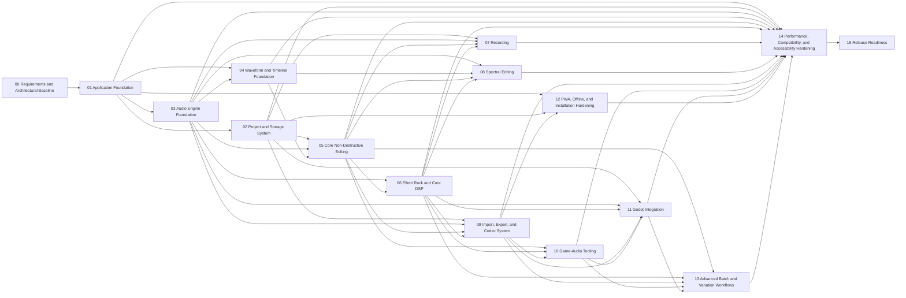

# Phase Dependency Graph

The graph below is normative for readiness. Markdown file order is not execution order.

## Hard Dependencies

- Phase 00: none
- Phase 01: Phase 00
- Phase 02: Phase 01
- Phase 03: Phase 01
- Phase 04: Phase 01, Phase 03
- Phase 05: Phase 02, Phase 03, Phase 04
- Phase 06: Phase 03, Phase 05
- Phase 07: Phase 02, Phase 03, Phase 05, Phase 06
- Phase 08: Phase 03, Phase 04, Phase 05, Phase 06
- Phase 09: Phase 02, Phase 03, Phase 05, Phase 06
- Phase 10: Phase 05, Phase 06, Phase 09
- Phase 11: Phase 02, Phase 03, Phase 06, Phase 09, Phase 10
- Phase 12: Phase 01, Phase 02, Phase 09
- Phase 13: Phase 05, Phase 06, Phase 09, Phase 10, Phase 11
- Phase 14: Phase 01, Phase 02, Phase 03, Phase 04, Phase 05, Phase 06, Phase 07, Phase 08, Phase 09, Phase 10, Phase 11, Phase 12, Phase 13
- Phase 15: Phase 14
